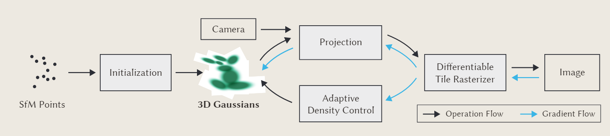
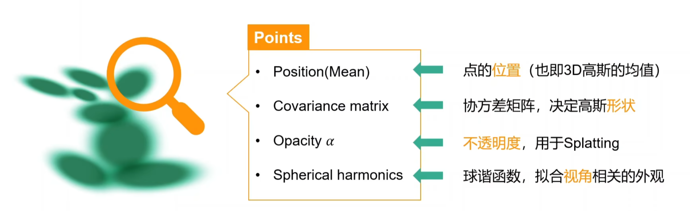
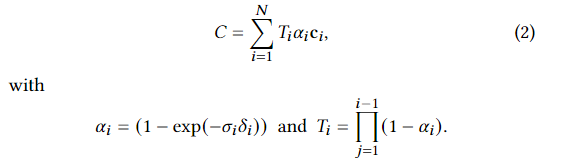

## 论文本体

#### Adaptive Control of Gaussians

一些超参数：

warm-up后启用：指500次迭代后开始，因为一开始用1/4分辨率训练，250次迭代后做一次上采样，500次迭代后做第二次上采样

$\epsilon_{\alpha}$ ：每100次迭代移除α低于该阈值的高斯

$τ_{pos}$： 在view space下average magnitude of view-space position gradients（也就是xyz的梯度比较大的，即模型正在试图移动高斯来拟合）高于该阈值的会被densification（default：0.0002，代码中为percent_dense）

$\phi$ ： 高斯被split后，新的高斯的大小为原来的$\phi$倍（default：1.6）

每3000次迭代将α设置为接近0（将所有的高斯核透明度重置，那些真正有用的高斯核在后续优化中会回到它应有的透明度，不需要的高斯则在后续被剔除），这是为了控制高斯增长的速度

定期删除world space中非常大的高斯，和在view space中占一大块的高斯

## 算法流程



总之先摆一个算法流程在这里，接下来对每一个过程做介绍

#### Initialization



先用SfM方法提取初始点云，从这些稀疏点云中初始化每个点的3DGS表达，其中包括以上属性。

协方差矩阵中R代表椭圆的旋转，S就是三个轴长

## 源码阅读

### render前向传播调用流程

train里调用render，其定义如下

```python
# ./gaussian_renderer/__init__.py
"""
	做一些渲染前的准备
	- 初始化raster_settings
	- 判断是否由python计算3D协方差和SH
	- 调用rasterizer
"""
def render(viewpoint_camera, pc : GaussianModel, 
           pipe, 
           bg_color : torch.Tensor,
           scaling_modifier = 1.0,
           override_color = None)
->
{"render": rendered_image,
            "viewspace_points": screenspace_points,
            "visibility_filter" : radii > 0,
            "radii": radii}
```

在./gaussian_renderer/\_\_init\_\_.py中，调用./submodules/diff_gaussian_rasterization/\_\_init\_\_.py

```python
# ./submodules/diff_gaussian_rasterization/__init__.py
"""
	- 定义了一个cpu深拷贝的工具函数，如果debug的情况下save dump文件方便调试
	- 定义了调用cpp渲染的函数
	def rasterize_gaussians() -> _RasterizeGaussians.apply()
	- 定义了继承自torch.autograd.Function的_RasterizeGaussians，调用cuda前向传播和反向传播
	class _RasterizeGaussians(torch.autograd.Function)
	- 定义了继承自nn.Module的GaussianRasterizer，重载forward，在里面调用rasterize_gaussians()
"""
```

apply是调用的cpp，绑定两者的函数在./submodules/diff_gaussian_rasterization/ext.cpp

```c++
// 前面是python里的函数名，后面是对应的cuda函数
PYBIND11_MODULE(TORCH_EXTENSION_NAME, m) {
  m.def("rasterize_gaussians", &RasterizeGaussiansCUDA);
  m.def("rasterize_gaussians_backward", &RasterizeGaussiansBackwardCUDA);
  m.def("mark_visible", &markVisible);
}
```

上述几个cpp函数的定义在./submodules/diff_gaussian_rasterization/cuda_rasterizer/rasterize_points.cu

```c++
// 这个文件就是用来定义返回值的
RasterizeGaussiansCUDA(*args){
    // 定义一些要返回的cuda数据类型
  torch::Tensor out_color = torch::full({NUM_CHANNELS, H, W}, 0.0, float_opts);
  torch::Tensor radii = torch::full({P}, 0, means3D.options().dtype(torch::kInt32));
  
  torch::Device device(torch::kCUDA);
  torch::TensorOptions options(torch::kByte);
  torch::Tensor geomBuffer = torch::empty({0}, options.device(device));
  torch::Tensor binningBuffer = torch::empty({0}, options.device(device));
  torch::Tensor imgBuffer = torch::empty({0}, options.device(device));
	//……
    //调用CudaRasterizer::Rasterizer::forward
    rendered = CudaRasterizer::Rasterizer::forward(**args)
        
	return std::make_tuple(rendered, out_color, radii, geomBuffer, binningBuffer, imgBuffer)
}  
```

forward定义在./submodules/diff_gaussian_rasterization/cuda_rasterizer/rasterize_impl.cu

```c++
/*
	- 调用了预处理preprocess，计算出每个高斯核的深度depths、2D半径radii、2D下的坐标points_xy_image
	2D协方差的逆矩阵和透明度打包成conic_opacity，触碰的tile tiles_touched
	- 对高斯进行了排序，按照[id(tile), depth(gs)]组成key进行排序
	- 对每个tile调用了渲染接口，每个tile里的每个像素分配一个thread
*/
```

### 反向传播

在./submodules/diff_gaussian_rasterization/\_\_init\_\_.py继承了torch.autograd.Function

在./submodules/diff_gaussian_rasterization/ext.cpp绑定

在./submodules/diff_gaussian_rasterization/cuda_rasterizer/rasterize_points.cu准备返回值

```c++
  torch::Tensor dL_dmeans3D = torch::zeros({P, 3}, means3D.options());
  torch::Tensor dL_dmeans2D = torch::zeros({P, 3}, means3D.options());
  torch::Tensor dL_dcolors = torch::zeros({P, NUM_CHANNELS}, means3D.options());
  torch::Tensor dL_dconic = torch::zeros({P, 2, 2}, means3D.options());
  torch::Tensor dL_dopacity = torch::zeros({P, 1}, means3D.options());
  torch::Tensor dL_dcov3D = torch::zeros({P, 6}, means3D.options());
  torch::Tensor dL_dsh = torch::zeros({P, M, 3}, means3D.options());
  torch::Tensor dL_dscales = torch::zeros({P, 3}, means3D.options());
  torch::Tensor dL_drotations = torch::zeros({P, 4}, means3D.options());
```

## 公式推导

https://zhuanlan.zhihu.com/p/680669616?utm_psn=1736348842016743424

3D协方差矩阵：$\Sigma = RSS^TR^T$

2D协方差矩阵：$\Sigma^‘ = JW\Sigma W^TJ^T$

其中$J$为射影变换的仿射近似雅可比矩阵，W为视图变换

代码中的T不是指NeRF一样的T，而是



## Debug

```c++
 error LNK2001: 无法解析的外部符号 "class std::tuple<int,class at::Tensor,class at::Tensor,class at::Tensor,class at::Tensor,class at::Tensor> __cdecl RasterizeGaussiansCUDA(class at::Tensor const &,class at::Tensor const &,class at::Tensor const &,class at::Tensor const &,class at::Tensor const &,class at::Tensor const &,float,class at::Tensor const &,class at::Tensor const &,class at::Tensor const &,float,float,int,int,class at::Tensor const &,int,class at::Tensor const &,bool,bool)" (?RasterizeGaussiansCUDA@@YA?AV?$tuple@HVTensor@at@@V12@V12@V12@V12@@std@@AEBVTensor@at@@00000M000MMHH0H0_N1@Z)
  已定义且可能匹配的符号上的提示:
    "class std::tuple<int,class at::Tensor,class at::Tensor,class at::Tensor,class at::Tensor,class at::Tensor,class at::Tensor> __cdecl RasterizeGaussiansCUDA(class at::Tensor const &,class at::Tensor const &,class at::Tensor const &,class at::Tensor const &,class at::Tensor const &,class at::Tensor const &,float,class at::Tensor const &,class at::Tensor const &,class at::Tensor const &,float,float,int,int,class at::Tensor const &,int,class at::Tensor const &,bool,bool)" (?RasterizeGaussiansCUDA@@YA?AV?$tuple@HVTensor@at@@V12@V12@V12@V12@V12@@std@@AEBVTensor@at@@00000M000MMHH0H0_N1@Z)
build\lib.win-amd64-3.7\diff_gaussian_rasterization\_C.cp37-win_amd64.pyd : fatal error LNK1120: 1 个无法解析的外部命令
    
     class std::tuple<int,class at::Tensor,class at::Tensor,class at::Tensor,class at::Tensor,class at::Tensor> __cdecl RasterizeGaussiansCUDA(class at::Tensor const &,class at::Tensor const &,class at::Tensor const &,class at::Tensor const &,class at::Tensor const &,class at::Tensor const &,float,class at::Tensor const &,class at::Tensor const &,class at::Tensor const &,float,float,int,int,class at::Tensor const &,int,class at::Tensor const &,bool,bool)
         
	class std::tuple<int,class at::Tensor,class at::Tensor,class at::Tensor,class at::Tensor,class at::Tensor,class at::Tensor> __cdecl RasterizeGaussiansCUDA(class at::Tensor const &,class at::Tensor const &,class at::Tensor const &,class at::Tensor const &,class at::Tensor const &,class at::Tensor const &,float,class at::Tensor const &,class at::Tensor const &,class at::Tensor const &,float,float,int,int,class at::Tensor const &,int,class at::Tensor const &,bool,bool)
```

总之把build删了再install就好了

```cpp
const float MAX_DEPTH = 1000f; // 编译错误
=>
const float MAX_DEPTH = 1000.0f;
```

搜索.cu搜不到的时候可以pip install .中途中断，也可以在设置中搜索scrollback把终端能够留存的行数增加
