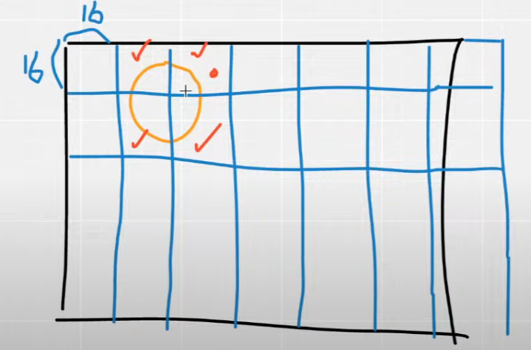
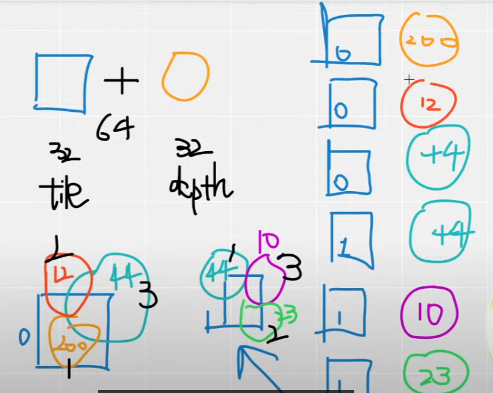

#### 知识点杂记

- 一个3dgs训练结果的网站：gsplat.tech

- 为什么3DGS重建室内场景的时候，墙壁会出现雾状

墙壁通常是白色且没有纹理的，3DGS很难确认深度和几何，所以放了一团雾，引入深度的改进里会好很多

- 对于光照不一致的场景，会出现什么现象

在比较黑的那一块放置一个黑色高斯椭圆，视角移过去突然就变黑了，导致了不一致性，这块椭圆一般叫做floater

### forward

preprocessCUDA：

1、计算3DGS投影出的半径和圆心（这一步是为了确认覆盖了哪些像素，可以不需要太精准，算错了也就带来一些计算量上的提升，因此不是去计算投影后的椭圆，而是把它简化成一个圆，这样就不用存储椭圆的长短轴以及旋转角度）

2、计算该3DGS覆盖了哪些像素

以16*16为一个tile，计算有哪些tile被覆盖

3、计算每一个高斯的前后顺序（forward.cu）

以每个tile为单位，在tile内部计算涉及到的高斯的前后顺序，方便GPU并行

对于每个tile进行编号，然后tile内部涉及的高斯也编号，有关系的tile和高斯组成一个序列，前32位是tile的id，后32位是高斯depth，排序结果如上

4、计算每一个像素的颜色（forward.cu）

一个block分配一个tile，block里的thread分配一个pixel，同一个block共享内存
