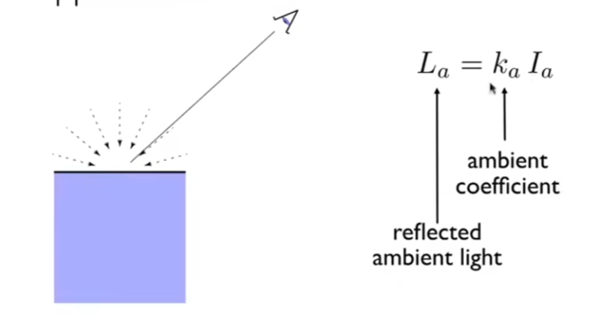

---

title: games101

date: 2023-09-01

categories: 图形学

tags:

 - 图形学

 - games101
---

### Lecture 4

MVP矩阵：

#### **Model Transformation**：

把物体摆好，也就是做顶点从模型空间（局部坐标）到世界空间（世界坐标）的转换

#### **View Transformation**：

规定好摄像机的位置、看的方向以及相机本身的朝向，也就是将观察对象的世界空间转换到观察空间（观察坐标）

[注] 观察坐标也就是在相机能看到的空间里，物体的位置在哪里。

如何做这个变化呢？如果把摄像机移动到世界坐标的原点，看的方向指向-z轴，相机本身向上的方向为y轴，那么观察坐标就等于世界坐标。

但是摄像机是不能动的，因此我们求出了将摄像机变化到世界坐标的矩阵（View Martix）之后，我们将这个矩阵作用在物体的世界坐标上，就可以得到物体的观察坐标了。可以用相对运动理解，我可以不移动相机，而去移动物体，最后效果和移动相机是一样的。

#### **Project Transformatino**

首先定义视椎体：一个六面体，规定了摄像机能够看到的东西。

P矩阵的目的，就是将视椎体变为一个标准的正方体，变化视椎体中所有的xyz坐标，使他们落在这个标准的正方体内。这个正方体中心在原点，xyz的范围为[-1,1]。

这样做的好处是，非常容易判断一个顶点是否在正方体外，给接下来投影做好准备。

- 首先，是视椎体本身就是一个长方形的情况，这种情况下远处和近处的物体经过P矩阵的作用，大小并不会有变化，也就无法呈现“近大远小的效果”，也非常容易实现，将视椎体移动到原点并缩放即可。
- 即P = “缩放矩阵”*“平移矩阵”

- 另一种，就是我们常用的透视投影，我们采用的推导方式是，先将金字塔（但是没顶边）的视椎体挤压成标准长方体，再用正交投影的方式处理，那么如何进行这个挤压呢。

在进行“挤压”之前我们需要定义几点：

**1.对于近裁剪平面的点，其坐标永远不变。**

**2.对于远裁剪平面的点，其z值永远是f。**

**3.对于远裁剪平面的中心点，“挤压”之后仍然是中心点，且不变。**

[注]为什么其他点的z值会变？想象一段往远处无限延伸的铁轨，枕木之间的间隔dz相等，经过透视投影之后，如果z不变，那么枕木之间的dz也不会变，但是生活经验告诉我们，远处枕木间的间隔看上去会比近处的要短

- 我们先**任取**一个空间中的点，从侧面去观察他（要注意，无论是近裁剪面还是远裁剪面上的点，经过这个压缩z值是不变的，但是其他点的z值是会变化的）

我们得到了

因此，任意一个点其实经过了以下变化

因此我们可以推导出P矩阵的部分元素

再利用两个性质，首先

**对于近裁剪平面的点，其坐标永远不变**

**对于远裁剪平面的点，其z值永远是f，并且我们取远平面的中心点，其xy值为0，z值为f**

由此得到两个方程，从而解出第三行。

### Lecture 5、6

但是图形学中并不使用r,l,t,b等等变量，而是要采用Fov（视角张开的角度），aspect（长宽比）

转换关系如下：

#### 视口变化

如何将坐标从一个立方体变化到一个屏幕上（暂时仅讨论xy）

首先要将-1,1的xy轴缩放放width，height，此外还要将将中心移动到屏幕的中心（原来的中心在原点，而屏幕的中心在（width/2,height/2））

#### 光栅化

如何判断一个点在三角形内还是外？

我们先规定在三角形上“行走”的一个方向，一般是逆时针，从而确定P012三个点的顺序。

现在将任意一条边，如P0->P1,和起点与Q的连线P0->Q做叉乘，若后者在前者的逆时针方向，或称为在其左侧，得到的结果就为正，如果Q在三条边的左侧，就说明其在三角形内部。

当然，逆时针规定点的情况下，要求是都在左侧，那么顺时针规定点的情况下，就要求都在右侧，无论如何，若三个叉积的结果都同号，就证明其在三角形内侧。

- 光栅化加速算法1：AABB（*-axis aligned bounding box (轴对齐-边界盒)* ）

就是取P0,P1,P2三个点的x，y的最大最小值，形成一个包围盒，光栅化时只要考虑包围盒内的像素是否在三角形内，包围盒外的像素一定不会在三角形内。

#### 反走样（Anti-Aliasing）

1. 增加分辨率（采样率）
2. 先做模糊再做采样（低通滤波）
3. MSAA（Multi-Sample Anti-Aliasing）

把一个像素分为很多个点，如图四个，分别计算每个点是否在三角形内，根据覆盖率，也就是有几个点在三角形内决定渲染多深的颜色。

4. TAA（Temporal Anti-Aliasing）

也和MSAA一样采用多个采样点，但是是利用上一帧的采样点，然后这一帧利用另一组采样点，这样就能得到同一个像素的多个采样点而不引入额外的消耗。

对于静态场景这样做显然正确，但是动态场景需要算出位置差等，详细参考其他文档。

### Lecture 7

#### Z-buffer

记录当前离屏幕最近（z最小的值）的z值，之后要渲染的像素点先检查z，如果比z小才渲染，并且更新zbuffer，否则直接跳过。

#### shading

先定义：

v：眼睛的方向

n：平面法向量

l：光照方向

以上均为单位向量

着色是局部的，不考虑其他物体的存在，因此阴影是不会通过着色生成的。

#### diffuse(漫反射光)

Kd：漫反射系数

I：光强

I/r^2：离点光源越远，光强越弱

n·l表示，平面与光线是垂直的时候（法向量和光源平行），接受的光强最高，越平行则越低，可以想象地球的夏天，太阳垂直照射在地面上，自然会接受更多的光强。

漫反射是往四面八方反射的，所以自然和观察角度v无关。

#### 高光

根据经验知道，当眼睛所在方向和镜面反射的出射方向一致的时候，可以观察到高光。所以我们的高光强度应该要和R,v夹角有关。

但是R并不好通过l，n，v求出来，于是我们创造了一个半程向量h。

也就是l和v的角平分线，而R和v的夹角越小，h和n的夹角就越小。

那么为什么$n·h$要做一个p的指数呢？

可以发现，如果不做指数，cos的容忍度太高了，高光应该仅在出射方向和眼睛相当接近的时候才出现，但是只用cos，即使达到了45度，高光的强度仍然非常高。

#### 环境光

非常简单

### Lecture 8

#### 着色频率

根据着色的频率，可以分为在三角形上着色，三角形的顶点上着色，以及用顶点法线插值出来的每个像素上着色。

但是也不是说着色频率低就不好，只要三角形够多，那么以每一个三角形进行着色效果也是不错的。

同样的，也不是着色频率越高计算量就越高，当三角形数量超过像素数量的时候，逐三角形着色反而计算量更大。

如何对顶点求法线？利用周围面的法向量做平均

#### 渲染管线（render pipeline）

https://zhuanlan.zhihu.com/p/617766966

### Lecture 9

我们已知三角形三个顶点的属性，我们希望三角形内也能获得平滑的过度，我们需要知道如何计算出三角形内任意一点关于ABC的权重，这样才可以做插值，借用重心的概念，α、β、γ分别表示将此点与三个顶点链接后，形成的三个三角形的面积大小：

我们计算出αβγ后，就可以做插值了，任意一点的属性V为（属性包括纹理、颜色、uv、深度等等）

但是重心不具有投影前后一致的稳定性，也就是说对同一个三角形的三个顶点，在三维空间中求重心和投影后再求重心得到的权重结果是不一样的，所以如果要使用这样的方法，应该在三维空间中就求好权重。

#### 纹理过小

屏幕有一个个像素pix，纹理也是一系列离散的点称为texel

如果一个pixel对应一个texel自然很好，但是不对应的时候会发生一系列问题，第一个就是纹理过小，也就是pix的数量>texel

那么一个pix去寻找纹理中的值的时候，就可能并不正好在texel的中心（想象一个如下的，充满点的正方形组，我们用一个更加密集的正方形组贴在上面，红点都会在哪些位置，就知道为什么会出现在这些地方）

我们可以考虑3个方法

- 最近邻：很好理解，取最近的纹素即可，但是这会导致同一个纹素被多个像素读取，从而产生一种像素化的效果
- 双线性插值

如何做双线性插值呢？其实就是做两趟（3次）插值

第一次求u01,u11两点以及u00,u10两点的插值，得到两个小黑点后，再对这两个小黑点做插值。

- 双三次插值（立方卷积插值）

取周围16个纹素，并且做加权平均，权重公式如下：

#### 纹理过大

会出现近处锯齿，远处摩尔纹的效果。其实可以理解成像素对纹理进行采样，和之前的反走样一样，都是由于采样频率不足，所以采样后我们无法看到纹理原来的样子。

为什么近远处效果不一样？纹理是均匀分布的，可是透视投影下近远处同一个像素却代表了不同的空间大小。远处一个像素点其实覆盖了非常多的纹理。如果只取中心点，自然会有问题。

那么可以像之前一样用MSAA吗？可以的，一个像素点我们不用一个点采样而是用多个（就是在上图的平行四边形中用超级多的蓝点采样再做某种平均），可以一定程度上缓解这个问题。

但是这样的计算代价太高了，并且有很多重复计算，仔细想想我们需要的是什么，其实是覆盖了一个很大片的纹理的情况下，我想知道这片纹理的平均值，那么我可不可以提前计算出任意一片纹理的平均值，使得我想要的时候直接取出来就可以呢？这就是mipmap。

当然，mipmap并不能计算任意一片纹理，它只存储了任意大小的正方形纹理的均值。

可是任意一个像素映射到纹理上大概率就不是一个正方形，这里我们自然要做一个近似。对于任意一个像素，我们计算出它临近的点以及它自己映射到纹理上对应的uv，然后计算出这个点与它临近的点在纹理上的最大距离L，将这个L作为正方形的边长。

那么得到这个L后，可以很自然的算出我应该在第几个mipmap去找我需要的纹理，比如L=4，那就在第D=log2（4）=2张mipmap（从0开始计数）去寻找我需要的纹理。当然，寻找的过程中可能也要用上双线性插值，毕竟pixel也许也不在texel的正中心。

可如果L不是整数怎么办呢？做插值就好了。这样得出来的结果就叫做三线性插值，第三次的不同的mipmap之间的插值。

##### 各向异性过滤

好，那么我们得到了一个像素在纹理上是一个正方形或者近似正方形的时候该如何解决，但是实践中往往并没有这么理想。

于是，我们也可以存储一些仅仅压缩水平或者竖直方向上的纹理贴图：ripmap。

mipmap就是这张图上的对角线。

这种方法叫做各向异性过滤。当然，仍然没能解决覆盖了斜着的长方形的像素的问题。

异性：水平和竖直被压缩的程度不一样，这是一个对“各向”的修饰词。因此mipmap的方法也可以叫各向同性过滤。

游戏中关于各向异性过滤会有2x，4x等等选项，意思就是计算几次被压缩的纹理图。由于只是增加了空间开销，只要显存足够就可以开更高，对计算性能没有影响。

#### 纹理的应用

纹理是一张图，硬件上来说是存储在显卡中的一块区域，它当然不必须要是美术为物体做出来的材质。

##### 环境光贴图

首先，也可以是环境的反射。也就是说可以利用纹理将环境光存储起来，作为一张球的纹理。

注意，环境光并不是指直接光照，点光源等等，我们能看到任何物体，都代表它发出了光，也就是说，环境光是指看到的一切物体。

但是球作为纹理，展开的时候上下的极点会有明显的扭曲现象，改为用box就能很好地解决这个问题。（似乎是天空盒的由来？）

##### 法线贴图

纹理也可以存储任意一个点的凹凸信息，也就是相对高度，这样法线就会重新计算，使得渲染出来的效果像是凹凸不平的。

我们来看一个法线贴图的例子，p点从黑色的线经过法线贴图的作用移动到了黄色的线，法线的方向发生了变化。

实际来说，法线贴图是一个二维图像，法线贴图上任意一点具有一个相对高度h，我们可以建立一个三维坐标系（u,v,h），f（u，v）=h这个函数会构成一个平面。如果h始终为0，也就是没有法线贴图，该平面上任意一点的法线都应该是（0,0,1），而有法线贴图的情况下就是要求该函数在（u，v）处的梯度再转换为法向量。

当然，法线贴图只改变了法线并没有改变几何，所以效果会在一些地方有露馅，对比真正的改变了顶点坐标的方法（位移贴图），比如阴影处就很明显：

##### 总结

纹理可以存储各种各样的信息，不仅仅是颜色。只要我们合理的在shader中解释它即可。

### Lecture 10

#### 几何的隐式表示

是指给定目标符合的公式，但不给出具体是哪些点。

比如一个球体上任意一点符合$x^2+y^2+z^2=1$，这就是一个隐式表示，并没有告诉你xyz分别是多少，但是给一个点我可以判断它是不是球体的一部分。

一般的，我们认为，$f(x,y,z) = 0$ 就是隐式表示。不过隐式表示的缺点是有时候会很难画出来

e.g.

优点自然是可以很容易判断一个点是不是在物体上。

#### 几何的显式表示

直接给定xyz是一种显示表示。

通过参数映射也是一种显示表示。

同样的圆环，显式表示如下，我只需要遍历定义域内所有的uv，就可以得到所有的xyz：

相应的，显式表示就比较难判断某个点是否在此图形上了。

#### constructive solid geometry（构造立体几何法）（implicit）

将基本的几何图形通过布尔运算得到复杂的几何图形

#### SDF(signed distance field) 有向距离场 （implicit）

对于空间中的任意一点，我们定义一个函数f表示其对某个物体的表面的距离，如果f=0，就代表这个点在该物体的表面上，进行渲染即可。

我们可以利用SDF进行边界融合

对于AB两个不同的物体，一个边界在1/3，一个在2/3，我们希望融合后的边界在1/2，只需要将两个SDF求平均即可。

但是下面这张图对SDF做平均就不太对，个人认为不同的SDF如果要做blend那么SDF应该要有一个统一的方向，而不是一个距离。（还是不理解，暂时跳过）

#### Point Cloud(Explicit) 点云

就是给出所有点的xyz，只要足够密集就可以表示出一个模型

#### Polygon Mesh(Explicit)

网格表示，最广泛应用的一种，用多边形来表示模型

用obj文件存储mesh数据，obj中有顶点、法线和纹理的分开表示以及他们的联系（哪几个顶点会连成多边形，这几个顶点的法线和纹理坐标分别是什么）

### Lecture 11

#### 贝塞尔曲线

贝塞尔曲线是一种显式表示表示，给定几个控制点，如下图，规定这条曲线的起点必须在b0，终点必须在b2，且起点的方向是b0->b1,终点的方向是b1->b2

既然是一种显式表示，自然要么直接给出坐标，要么由参数表示，贝塞尔曲线是由参数表示的，假设t=0时点在b0，t=1时点在b2，那么$t=\frac{1}{x}$点所在位置的计算方式是取b0->b1以及b1->b2的$\frac{1}{x}$处的两个点，再在这两个点连成的线段上取$\frac{1}{x}$所在的点，就是$t=\frac{1}{x}$时刻点到达的位置。

延伸到更多的控制点，互相连接形成更多条线段，就是取更多次$\frac{1}{x}$，直到只剩下一个点。也就是不停的线性插值。最后我们可以直接算出表达式。

- 贝塞尔曲线在仿射变换下只需要对控制点坐仿射变换，和对曲线上每一个点做仿射变换得到的曲线是一样的。
- 贝塞尔曲线一定在控制点形成的凸包内，不会超出凸包的范围。

现在喜欢采用分段的贝塞尔曲线，一般采用4个控制点为一段曲线，分别画出很多曲线后再连起来。

4个控制点中有1个起点，1个终点，然后提供剩下2个点作为用户接口来操纵这条曲线（如下图，黑色的点也是控制点，蓝色的点也是控制点，可以拖拽蓝色的点来改变曲线）

#### 网格细化

三角形太少了，需要增加

（略过）

#### 网格简化

三角形太少了，需要减少

（略过）

### Lecture 12

#### 阴影贴图（shadow mapping）

着色器不考虑其他顶点，是如何绘出阴影的呢？

我们知道，如果一个地方没有阴影，那么它应该既被光源看到，又被摄像机看到。

- 可以将相机移动到光源位置，向场景看去，相当于做一次光栅化，记录每个像素的深度缓存，知道哪些点是需要绘制的。

- 再在正常的位置进行一次光栅化，这次我们需要计算要渲染的每个像素到点光源的距离z’（这需要写一些矩阵变换的shader），如果和上一次的深度缓存不一致，说明这个像素在点光源那边是看不到的，则产生阴影。

但是效果往往不好，因为z是一个浮点数，进行空间变换后再对比，很难判断出两个z相等，有时候会增加一个bias，只要两数相差>bias才判定为不相等，但都没有本质上解决问题。

可以看到阴影不是一个完整的切面，而是在边缘上有些凌乱分布，看起来有些“脏”。

### Lecture 13

#### 光线追踪

##### 光线投射

三个基本想法

- 光线直线传播
- 光线之间不会碰撞
- 光源路线可逆，从光源到眼睛等于从眼睛到光源

基本思路：

从摄像机到每一个像素发出一条射线（eye ray），在遇到的第一个物体表面停下，然后计算该点是否被为点光源可见（测试点光源到这点是否有其他物体即可，即链接一条shadow ray），然后计算法线方向，就可以写入像素的值了，这样就代替了光栅化。

##### **Whitted Ray Tracing**

同一个像素计算光源的多次折射、反射， 在每一个折射、反射点上不同的着色结果都加在一个像素上

#### 如何计算光线和平面是否相交

那么在光线投射时，怎么样判定光线是否和某个mesh相交？

先要给出光线和mesh所在平面的数学定义

光线是一条射线：

平面可以由法向量n和平面p'上任意一点定义：

现在，将r(t)和p'连线，如果和法向量垂直，自然在这个平面上。利用这个关系解出t，就可以知道光线什么时候碰到平面了。

知道点在平面上，mesh也在平面上，接下来只要计算点是否在这个mesh中就可以了（参考光栅化）

当然也可以不先解平面交点，再算在不在三角形内，只要给出光线和三角形内任意一点的数学定义，自然可以直接计算：

P0,P1,P2就是三个三角形的顶点，解这样的线性方程组，只要t，b1，b2均存在且非负，则说明光线经过三角形。

#### 加速计算

##### AABB:axis aligned bounding box (轴对齐-边界盒)

肯定不能每产生一条光线就与空间中的所有三角形计算交点，因此我们需要加速计算。

我们可以将物体的边界简化，用一个包围盒去代替，只有光线在包围盒内的时候，才有可能和物体相交。

包围盒通常用一个长方体表示，我们把长方体分解为三个对面的交集，对面是指例如长方体的上方和下方所在平面所组成的一对平面，所以我们现在有三组平面。

我们分别计算光线什么时候进入一组对面，什么时候出一组对面。一组对面可以用例如x=0，x=1的参数表示，联立可以求解各自的t。这也是为什么叫轴对齐。

很显然，当且仅当光线进入了三组对面时，才算是进入了包围盒。

而光线只要出一组对面，就已经出了包围盒。

现在还需要判断t的有效性，大前提是**出去的时间必须大于进入的时间**，否则没有交点，此外

- 当离开时间小于0时，说明包围盒在光线背后，没有交点。

- 当离开时间大于0，但进入时间小于0，说明光线就在box中，有交点。
- 同时大于0时，最正常的情况，有交点。

因此，最终，t的定义域为：

### Lecture 14

#### 空间划分

加速计算的第二个方法，就是做空间的划分。我们可以将空间划分成各种各样的小格子，光线穿过没有物体存在的格子的时候不需要判断交点，而穿过有物体存在的格子的时候需要判断：与这个格子里的所有物体求交点。

##### KD-Tree

- 每次沿着某一个轴做划分，下一次划分就到下一个轴，比如第一次横着切，第一次就竖着切
- 划分的具体位置，并不一定在中间
- 对每个空间只做一次划分，就是一定只有2个子节点
- 实际的物体或者三角形，只存在叶子结点上

具体怎么用呢？想象一条光线穿过了一个平面（先考虑2D），那就是进入了根节点。

- 如果发现穿过了当前节点代表的空间（计算t_exit和t_enter）

  - 若为分支节点，沿着这棵树走下去。

  - 若为叶节点就就计算光线与当前节点里所有物体是否有交点。

KD-Tree有两个比较严重的问题

- 一个三角形可能在多个盒子里
- 建立Kd-Tree并不简单，也就是说很难判断一个三角形到底在不在一个盒子里，想象一个比较大的三角形，一个盒子插在它中间，那么三角形三个顶点都不在盒子里，可是三角形确实在盒子里。

#### 物体划分

##### BVH

为了解决上述两个问题，我们可以不对空间做划分，转而对物体做划分。

这样一个三角形就一定在一个盒子里，且建立一个BVH也很简单。

带来的问题就是包围盒不是对空间的严格划分，会有重叠。

### Lecture 15

https://zhuanlan.zhihu.com/p/393371982

为了引入更真实的光照效果，我们先引出一些物理概念。

能量（功率）（watt）:$φ=\frac {dQ}{dt}$

光通量：功率*发光效率，单位为流明，若取发光效率为1，功率数值上等于光通量。

能流密度：每个单位立体角的光通量（cd）： $I = \frac {dφ}{dw}$

辐照度：单位面积上的光通量（$lux$或$\frac {lm}{m^2}$）（*irradiance*）： $E = \frac {dφ}{dA}$

如果我们的光源是一个点光源，其向四周均匀发射光线，那么距离光源半径为 $r$地方的辐照度为

$E = \frac {φ}{4πr^2}$

立体角定义：球上的面积/半径平方

对于E（*irradiance*）来说，只能计算垂直在平面上的能量，对于不垂直的光照能量要进行分解，其实也就是斜着照平面光的能量要减小的意思

最后引出**辐亮度**radiance的概念

辐亮度：radiance（L）（单位为lm每㎡每立体角，或cd每平方米，或nit） 既和单位面积的能量有关，又和单位立体角的能量有关。

考虑下面这张图，中心有一块面积，辐照度就是这块面积所收到的能量，辐亮度就是考虑某一个立体角提供了多少能量，其对立体角的积分是辐照度。

#### BRDF

双向反射分布函数BRDF：描述了一个单位面积得到的辐照度，要如何辐射到各个立体角方向去（算出各个立体角得到的辐亮度）。

也就是BRDF是一个比例：对于任何一个出射方向算出辐亮度，除以这个单位面积得到的辐照度。（单位是1/sr）

简单来说，就是一个分配的函数，某个立体角方向得到的辐亮度和总辐照度（所有方向的辐亮度的积分等于辐照度）的比例。

那么最后，一个单位面积得到的辐照度，是由四面八方的辐亮度（这就是为什么是对立体角积分，因为我们推导时假设了从一个方向射过来，我们最终要得到四面八方射过来的）乘以对应的立体角得到的。在吸收每一个辐亮度得到一个辐照度后，我们要计算它出射时在某一个立体角方向的辐亮度是多少，就只需要再乘以BRDF方程即可。最后将这些结果做一个积分，就可以得到这个立体角总的辐亮度。

- 为什么要弄一个辐亮度一个辐照度，或者说BRDF为什么不直接从辐亮度转换到辐亮度？

个人理解是辐照度和立体角无关，而辐亮度与立体角有关，经过入射辐亮度->辐照度->出射辐亮度的一个流程，我们就可以会改变这个物理量的方向，可以通过法线与出射方向的角度来操纵这个标量（辐照度）发射后（变为辐亮度）的大小。而控制这个变化的过程就是BRDF。

实际原因：https://www.zhihu.com/question/28476602/answer/41003204

总的来说和测量有关，弄成这样比较好测量BRDF。其实方向也有一定道理，没有方向的辐照度是更好被测量的。

最后我们得到渲染方程：

我们所看见的颜色，由这一点的辐亮度决定，即自己的辐亮度+反射的辐亮度。

### Lecture 16

得到渲染方程后，我们就该解这个方程了

有两个问题：

- 如何解这个积分？
- 方程是递归定义的

我们利用蒙特卡洛积分的方法来解这个积分：

蒙特卡罗的方法求定积分的思路是，随机在[a,b]上取一个点x1，我们用f(x1)*(b-a)来估算曲线下方面积。然后我们重复这个步骤，不断的随机采样，算面积，则其平均值就近似等于真实的积分面积(采样次数越多越接近)。

完全随机采样的时候，pdf（每个点被采样的几率）=1/(b-a)

一般的：

从而我们可以解渲染方程：

渲染方程随机的向半球体反射，所以我们可以取p=1/2pi

从而得到一个递归函数

对于一个像素，我们随机采样任意一个入射角方向射来的辐亮度，如果这个入射方向上有一个光源（所以可以知道最好不要是点光源，不然很难碰到这个光，路径追踪非常难处理点光源的情况），就可以直接获得这个光源的辐亮度，如果这个入射方向有一个物体，就递归的调用shade函数，把这个物体当做一个光源计算直接发射过来多少L。

shade(p, w0)表示从p点向w0方向发射了多少L（辐亮度）

可是，如果到了某一个点就随机发出n条射线（进行n次采样），k次反射后就会变成$n^k$条射线，指数的代价是不可接受的，如果n=1才不会导致指数爆炸，因此我们修改函数

当然，只采样一条噪声太大，我们发现从视点到同一个像素可以有很多条光路，我们只需要多做几次路径追踪

代码如下:

可是我们还没有决定递归出口，这会导致光的无限折射，我们可以考虑一个类似dropout的方法，每次折射都有1-p的概率停止，有p的概率继续，为了保证期望一致，我们将选择继续折射时得到的radiance放大P倍。

#### 其他优化

随机的采样使得效果不是太好，我们不得不增加追踪的光路数量，所以我们可以修改采样的方式，直接在光源上采样

这样就可以代替直接光照的计算了，间接光照仍然用之前的公式

### Lecture 17

#### 漫反射的BRDF

我们假设入射和出射的radiance都是常数且相等，可以算出BRDF=1/pi，再乘上一个漫反射系数来引入RGB颜色

菲涅尔像：

（这个入射角的定义是错的，入射角的定义是入射光和法线的夹角）

可以想象坐在公交上，看自己座位的窗外反射比较弱，可以正常的看到窗外的景色，看前面的窗户通常看到的是车内的人，说明发生了强反射。

可以看到，入射角越大，反射越强

#### 微表面模型

对于一个粗糙的表面，我认为：

- 从远处看：看到的是材质，是粗糙的
- 从近处看：看到的是几何，是凹凸不平的三角面，每一个三角面都是一个镜子能够发生镜面反射

利用微表面模型，我们可以将材质的粗糙程度用法线朝向分布的情况来表示

对于光滑的表面，法线应该较为均匀的朝上，对于粗糙的材质，法线的朝向应该相当不均匀

有了以上概念我们可以定义BRDF

F表示菲涅尔项

G表示自遮挡，入射光从微表面的某一个镜面反射出的光可能被另一个自身的三角面遮挡，当视角和光源任意一个比较平行于微表面的时候就容易发生这种现象

D表示法线的分布

#### 各向同性和各项异性

有一些材质微表面沿某一方向会有特殊性质，如下图由于微表面成明显的方向分布，所以当光照顺着条纹方向则发射光照会更多，而当光照与条纹方向成正交方向时，则由于遮挡反射的光照会更少。

金属上尤其容易出现

数学定义上，就是入射角和出射角相对位置不变的情况下，改变它们的绝对位置会导致BRDF发生改变的，就是各向异性材质

#### BRDF的性质

- 非负，线性：BRDF可拆，可以分块做BRDF再加起来

- 可逆性：交换入射方向和出射方向，BRDF不变

- 能量守恒/衰减：出射后能量不会变多

### Lecture 21

#### 弹簧模型

根据胡克定律：

但是这样弹簧会一直运动下去，因为没有内部的摩擦力，我们对内部摩擦力做出定义

我们知道内部摩擦力是要阻止ab的相对运动，因此我们根据相对速度来定义摩擦

a，b表示位移，上面一点指求导。

f表示弹簧拉伸后，产生的b到a的内部摩擦力

红框就表示他们的相对速度差值再分解到ab方向上，说明两者相对速度越快，这个力越强

最后一项表示力的方向

