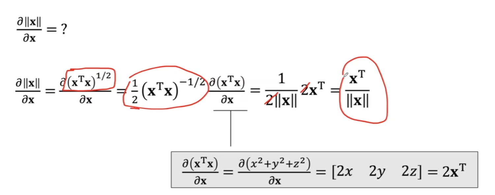
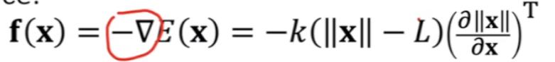
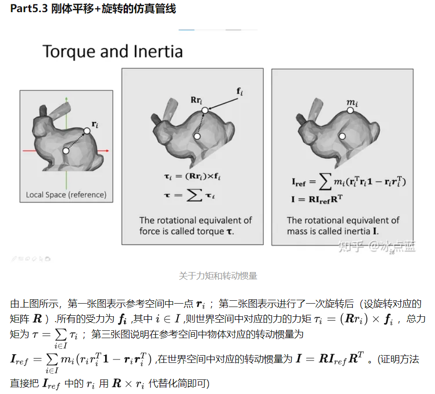

#### Lecture 3

- 向量长度的梯度

其结果等于向量自身的标准化。

想象一个普通的f(x)曲线，求导的值就是一个斜率（切线的方向），而这是一个多维函数，求导的值就是向量长度变化最快的方向，那当然沿着向量原来的方向增长或者减短最快。

[注] **梯度**的本意是一个向量（矢量），表示某一函数在该点处的方向导数沿着该方向取得最大值，即函数在该点处沿着该方向（此梯度的方向）变化最快，变化率最大（为该梯度的模）。

- 弹簧

力是能量的负梯度

- 刚体

