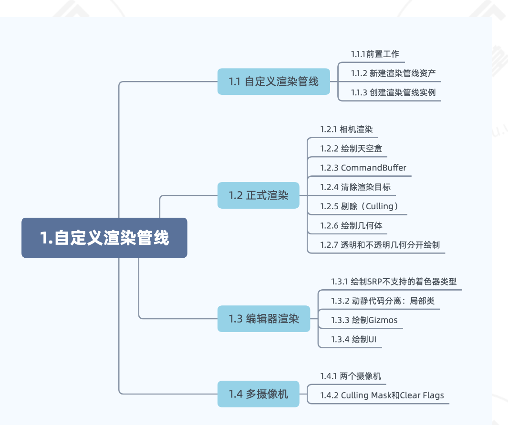

### 1. 自定义渲染管线



#### RenderPipelineAsset类

用来创建管线的类

继承此类实现CreatePipeline，可以创建一个CustomRenderPipeline，在Project Settings中设置为该渲染管线，就可以用自己的自定义管线了。

#### RenderPipeline类

Unity**每一帧**都会调用CustomRenderPipeline实例的Render()方法进行画面渲染，该方法是SRP的入口。

进行渲染时底层接口会调用它并传递两个参数，一个是ScriptableRenderContext对象，一个是Camera[]对象。

ScriptableRenderContext和CommandBuffer是SRP用于渲染的最底层接口。

Camera[]是相机数组，存储了参与这一帧的所有相机对象

#### CameraRenderer类

相机管理类，每一个相机渲染是互相独立的，用这个类去进行每个相机单独的渲染。

在这里**实现render方法**，在RenderPipeline类中实例化一个CameraRenderer循环调用render方法，通过多态完成相机独立渲染（如何进行多态实现方式后面补）。

#### Render方法实现

- Setup()
  - 在提交渲染命令前，要设置相机的VP矩阵以及相机的其他属性，封装在Setup方法中。如调用context.SetupCameraProperties(camera)
- DrawVisibleGeometry()
  - 定义一个DrawVisibleGeometry()方法，在其中用context的接口来发送渲染命令，如context.DrawSkybox(camera)来绘制天空盒。

- Submit()
  - 但是context提交的渲染命令都是缓冲的，我们还需要调用context.submit()正式提交渲染命令。

#### CommandBuffer

某些任务，如绘制天空盒，可以直接由context发出

而另外的命令需要通过单独的命令缓冲区间接发出，用来绘制场景中其他几何图形。

CommandBuffer是一个容器，保存了这些将要执行的渲染命令。

##### buffer.BeginSample方法和buffer.EndSample方法

```
//在Profiler和Frame Debugger中开启对Command buffer的监测
buffer.BeginSample(bufferName);
```

通常放在整个渲染过程的开始和结束，传参命令缓冲区的名字

##### context.ExecuteBuffer(buffer)方法

执行buffer中的渲染命令

执行完后如果想重用这个buffer，需要调用buffer.clear()

##### RenderTarget

Render Target指的是摄像机应该渲染到的地方，这个地方要么是Frame Buffer（也就是最终会输出到屏幕上的buffer），要么是Render Texture（我们自己创建的渲染纹理，这张纹理可以用来做任何事，当然也可以当frame buffer用）。

##### buffer.ClearRenderTarget(bool, bool, rgb)方法

为了保证下一帧绘制的图像正确，我们通常要清除RenderTarget，清除旧的数据。该操作通过调用buffer.ClearRenderTarget方法来完成

该方法有三个参数，前两个参数用来设置是否需要清除深度数据和颜色数据，这里我们都设为true，第三个参数设置清除颜色数据的颜色，我们设置为Color.clear。我们在Setup()中一开始就调用它。

[注意] 特别注意要先设置SetupCameraProperties(camera)再清空渲染目标，否则unity不知道要清除的渲染目标在哪，只能通过draw GL来绘制一个全屏的四边形面片来完成清除RT的任务

#### 剔除

通过camera.TryGetCullingParameters方法得到需要进行剔除检查的物体

通过context.Cull进行正式剔除

### 2.Draw Call

#### DrawCall具体组成，以及SetPass Call

对于我们已经见过的Draw Call，我们再提一次Draw Call的定义为**CPU调用图像编程接口以命令GPU进行渲染操作**。以及，**DrawCall本身只是一条指令，并不怎么耗时。**

真正耗时的是drawcall之前提交数据，以及设置渲染状态。

我们知道在发生一次Draw Call之前，CPU需要做两件事：1，把数据加载到显存，即把网格顶点、法线、纹理等加载到显存中；2，设置渲染状态，包括定义网格使用哪个纹理、哪个材质，还有光源属性等。

那么我们理解了，GPU想要进行一次渲染操作（Draw Call)，粗略看来需要两类信息：1，Mesh顶点；2，材质信息。（实际肯定更复杂）

对于第一类信息，CPU会在Draw Call前提交一次网格数据(顶点、顶点颜色、法线等）。

对于第二类信息，材质信息我们可以把它理解成渲染状态，CPU会在Draw Call前进行一次设置渲染状态。设置渲染状态流程：CPU首先会**判断当前GPU中当前渲染状态是否为需要的渲染状态**，如果是，则不用更改渲染状态，完成设置；如果不是，则设置为新的渲染状态，也叫做**更换渲染状态**，而更换渲染状态也就叫做**SetPass Call**。对于SetPass Call我们必须知道的一点是，**SetPass Call非常耗时！！！**

#### SRP Batcher

https://zhuanlan.zhihu.com/p/594539671

SRP Batcher被打断的判断依据是是否更换了shader，而并非动态批处理那样是否更换了材质。

**SRP Batcher的作用就是尽可能减少耗时的SetPass Call**，也就是说SRP Batcher并不会减少Draw Call次数，而是减少每次Draw Call触发SetPass Call的可能性。而SRP Batcher之所以能够实现的大功臣就是CBUFFER。

SRP Batcher会在主存中将模型的坐标信息、材质信息、主光源阴影参数和非主光源阴影参数分别保存到不同的CBUFFER(常量缓冲区）中，只有CBUFFER发生变化才会重新提交到GPU并保存。

在DrawRenderers开始时，SRP Batcher一次将本次DrawRenderers中所有（支持SRP Batcher）的材质和每个物体的部分信息（如变换矩阵）都提交到了显存中，然后**CPU会在每次发送DrawCall前告诉GPU本次绘制需要使用哪一部分CBuffer**。

【总结：将同一shader的物体的信息装到比较大的cbuffer中，提交一次，然后每次渲染让GPU选择部分cbuffer的信息使用】

#### GPU Instancing

**将多个使用相同Mesh相同Material的Objects放在一次Draw Call中绘制**。其中，**不同Object的材质属性可以不同**。CPU会收集每个物体的Transform信息和Material Properties然后构建成一个数组发送给GPU。GPU根据数组迭代绘制每个实体。
