### 第三章

##### semantic

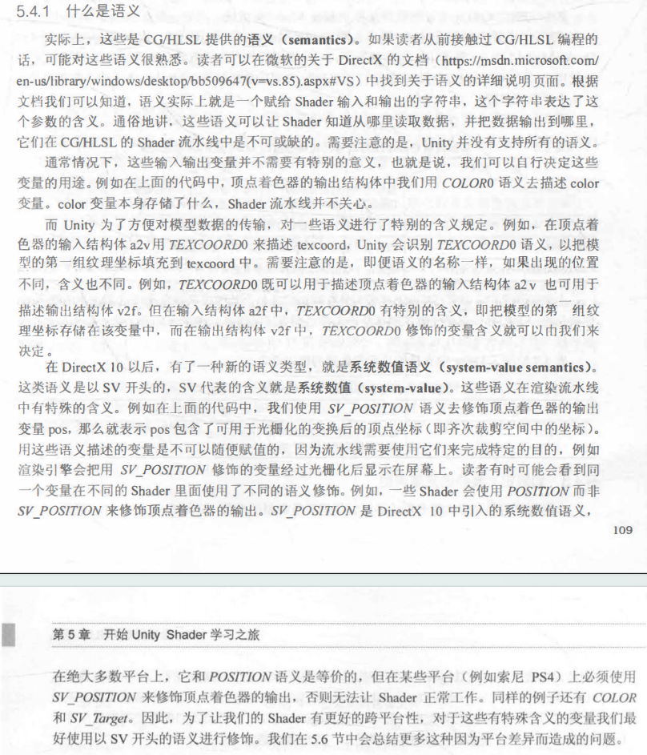

### 第六章

##### phone和Binn-Phone的区别：

在计算高光时是否采用半程向量简化运算

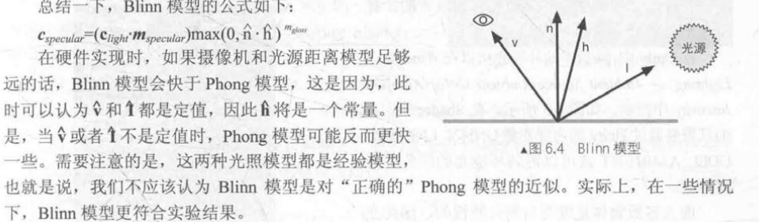

#### 半兰伯特模型

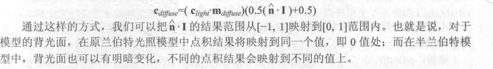

#### 光照模型

漫反射实现的公式为_LightColor0.rgb * albedo * saturate(dot(normal, lightDir))

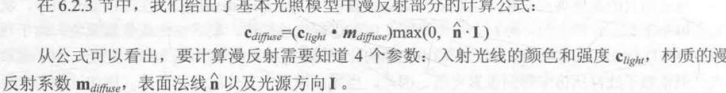

高光中也有对应的高光反射项，前面的练习中都用_specular来控制

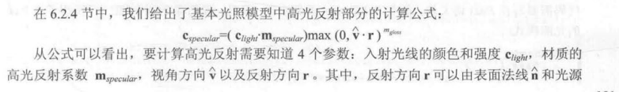

环境光实现时公式为UNITY_LIGHTMODEL_AMBIENT * albedo;

albedo由纹理和物体本身的颜色（_color）控制，unity官网中定义为

albedo := base（diffuse or specular）color

和漫反射共用albedo

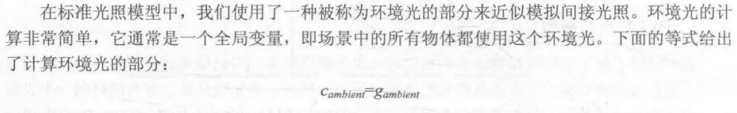

总之：高光最特殊，只看灯光颜色和高光颜色，其他的光照都和自己的颜色（_Color）以及纹理有关，统一用一个albedo（反射率）表示

#### 小结：颜色的乘法和加法

不同rgb值的乘法可以理解为光与物体的交互过程，例如物体的颜色（或纹理）其实是物体对光的吸收率，当然要乘以光的颜色。

不同rgb值的加法是对不同的光照过程的叠加，例如我们把phone模型分解成环境光、漫反射和高光，是三种没有交互的光照过程，就需要叠加。或者是多个光源叠加的时候。

### 第七章

o.uv = TRANSFORM_TEX(v.texcoord,_MainTex);

等价于

o.uv = v.texcoord.xy * _MainTex_ST.xy + _MainTex_ST.zw;

想象把uv坐标分别拉长xy倍，就要更多的纹理才能铺平它，所以纹理会更加密集

#### 凹凸映射（法线贴图）

https://blog.csdn.net/qq_41835314/article/details/126558410

为什么绝对法线坐标（模型空间下的法线贴图）不能进行uv动画？想象一个球体，上方的上凸，右边的右凸，移动两个地方的贴图，会导致右边的上凸，这样是不对的。如果存储的是相对坐标就可以做到。在切线空间中都是相对于切线空间的平面上凸。

#### TBN矩阵

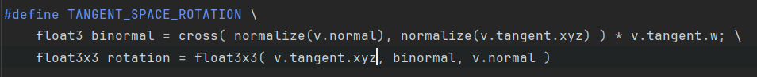

通过宏 #TANGENT_SPACE_ROTATION可以获得TBN矩阵，用来将坐标从模型空间转换至切线空间

可以知道Unity是行主元的，将TBN进行行排布就可以得到TBN矩阵

#### 遮罩纹理

回到101中所讲的话题，纹理就是显存中的一片区域，可以存储任何你想控制的东西。在这本书中用高光遮罩来举例，可以控制模型上每一点在遇到高光的时候要做哪些特殊处理，使得模型不同的地方遇到相同的高光时拥有不一样的表现。

### 第八章

#### 透明度测试

透明度测试是指给定一个透明度阈值，当片元的透明度高于阈值时不渲染，否则就渲染，要么完全显示，要么不显示，不能实现半透明

#### 透明度混合

先渲染不透明物体，然后关闭深度写入，为透明物体排序，先渲染靠后的透明物体，渲染透明物体时blend原像素值和新像素值。

排序透明物体很容易出问题，可能会出现互相遮挡的情况。

##### 透明度混合中启用深度写入

在真正渲染前增加一个pass

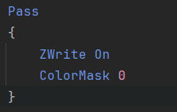

ColorMask设置写掩码，0时不会写入任何颜色，因此该pass只写入深度缓存

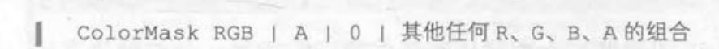

#### 渲染队列

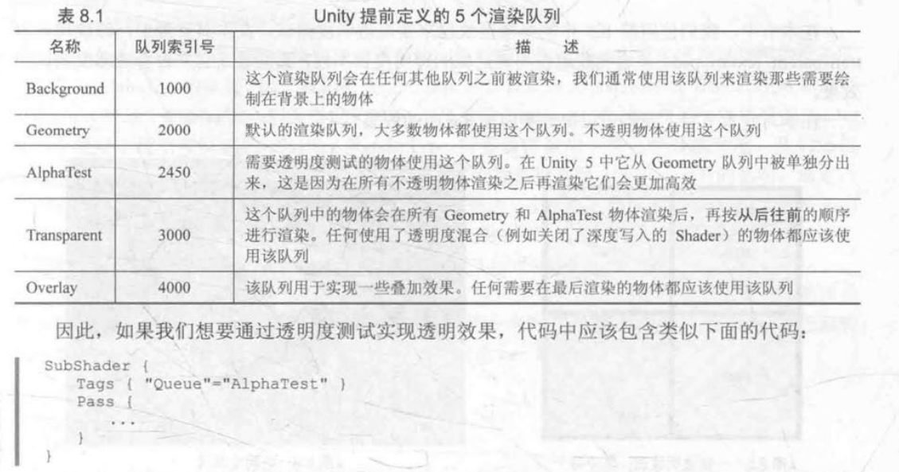

通过标签声明，决定此pass的渲染顺序

#### ShaderLab的混合命令

不仅仅可以混合半透明物体，还可以进行其他混合。

我们首先来看一下混合是如何实现的。当片元着色器产生一个颜任的时候，可以选择与颜色缓存中的颜色进行混合。这样一来，混合就和两个操作数有关:**源颜色(source color)**和**目标颜色(destination color)**。

- **源颜色**，我们用**S**表示，指的是由**片元着色器**产生的颜色值;

- **目标颜色**，我们用**D**表示，指的是从**颜色缓冲**中读取到的颜色值。

- 对它们进行混合后得到的**输出颜色**，我们**O**表示，它会重新写入到颜色缓冲中。

  需要注意的是，当我们谈及混合中的源颜色、目标颜色和输出颜色时，它们都包含了RGBA四个通道的值，而并非仅仅是RGB通道。

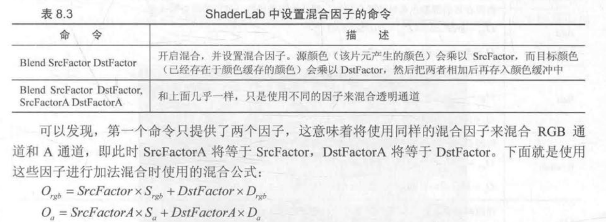

例如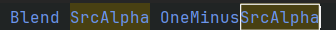

就表示  源颜色*源透明度 + 目标颜色\*（1-源透明度）

### 第九章

#### 前向渲染

##### Base Pass和Additional Pass

base pass用来计算平行光（尽管平行光逐像素），逐顶点的光源和SH光源，不管有几个光源都只执行一次，在一次pass中将所有base pass涉及的光源全部计算。

Addtional Pass用来计算逐像素的光源，根据有几个逐像素光源执行多次，并最后进行Blend One One。

#### 延迟渲染

##### 延迟渲染和Z-Prepass有什么区别？或者说延迟渲染和前向渲染在时间复杂度上的区别究竟是怎么来的？

Z-prepass也是先跑一遍渲染，存下Z-buffer，之后在片元着色中对比z值来决定是否discard

但是Z-prepass仍然是一种前向渲染，仍然是一个双重循环，只是进行了剪枝。即仍然还是对每个模型的n个（可见）片元，根据光源数量m进行n*m次计算

而延迟渲染在计算光照时已经和每个模型有几个片元无关，是在一张G-buffer上计算的，即二重循环变为屏幕的像素数量n和光源数量m，n为常数的情况下，m的增加影响就较小。

那么总结到延迟渲染和前向渲染的根本区别，就在于延迟渲染通过增加一个pass，将该几何体的每个片元的信息映射到一个Gbuffer，一个二维平面中去，最后再进行光照计算。将原来的内循环（每个光源进行着色）放到第二个pass中。第二个pass的外循环是常数像素数量，而不是该模型的片元数量。

#### 阴影相关的宏（Shadow Map）

本书写的不够详细，建议复习shadow map相关内容。

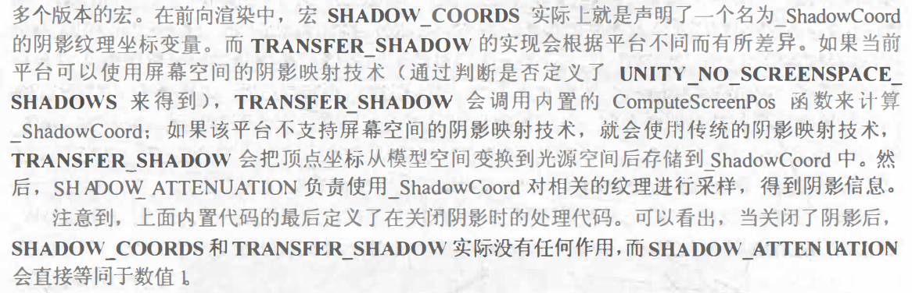

SHADOW_COORDS : 声明纹理坐标（类似uv）

TRANSFER_SHADOW : 计算阴影纹理的采样坐标，存储到SHADOW_COORDS中声明的纹理坐标

SHADOW_ATTENUATION：对光源空间中的纹理进行采样，得到阴影信息

### 第十章

#### 立方体纹理

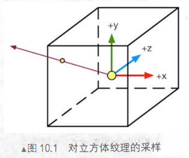

如何对一个立方体纹理进行采样？给出一个方向，从立方体中心出发，与立方体的交点就是采样点。

立方体纹理可以用来做环境映射，把环境所形成的贴图贴在立方体上，然后利用反射光进行采样。反射光就是图中所给出的方向。折射也是同样的道理。

天空盒也是用立方体纹理完成的，把天空贴在盒子上，给出一个视线方向，交点就是看到的天空的一个点。

#### 渲染目标纹理（Reder Target Texture,RTT）和多重渲染目标（Multiple Render Target, MRT）

RTT是指将渲染生成的图像存储到纹理中（当然，不一定要正常的渲染，比如可以只做深度测试等等，G-buffer的各种信息就是这么生成的），MRT就是可以将渲染的图像存储到多个纹理中，比如一次渲染产生了法线、颜色、深度，可以存储到多个不同的渲染目标上。

#### ```GrabPass {“TextureName”}```

在渲染半透明物体的pass前使用，可以将渲染出的屏幕存储到一张纹理中，然后再渲染半透明物体，渲染的时候使用这张纹理来完成折射效果。（当然，要将该pass放在半透明队列中，保证在不透明物体渲染完成后才执行这些pass）

### 第十一章

#### Unity内置时间变量

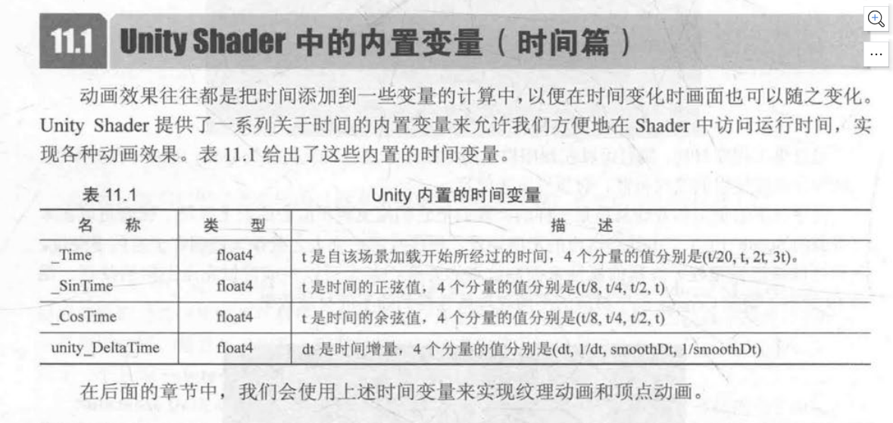

#### 序列帧动画

类似精灵，把动画效果集成在一张纹理上，然后将[0, 1]的uv映射到子区域上，根据时间选择不同的子区域作为纹理

#### 顶点动画

顾名思义，在shader的顶点着色器中根据顶点的位置来完成动画。

#### 广告牌技术

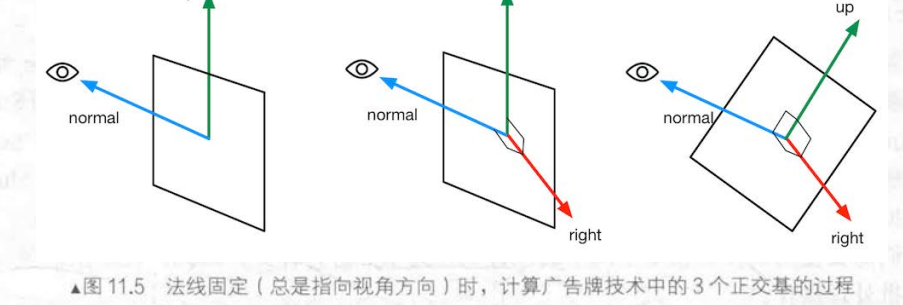

广告牌技术是将某个多边形旋转，使它看起来永远朝向（或尽量朝向）摄像头。

先根据视线方向和向上的方向叉乘出第三个正交基，再旋转法线方向（也就是视线方向）（例如草坪，我们希望它永远向上，所以我们不旋转向上的方向）或者旋转向上的方向（保证法线方向不变，使得永远正对摄像机）（例如粒子效果）来移动对应的线条，使得三条线正交。

在代码实现中：

如果是旋转向上方向，就和上述的流程图一致，先normal x upDir得到第三个正交基，再通过normal x right得到新的UpDir

如果是旋转法线方向，直接将法线方向的y置为0，这样就已经使得法线与向上方向正交，同时保证upDir不变。

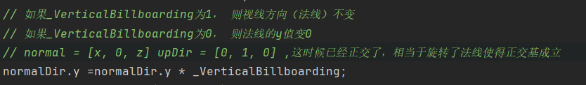

#### 为什么顶点动画要关闭批处理

因为批处理会合并涉及到的模型，从而导致这些模型丢失各自的模型空间，于是如果顶点动画中涉及到在模型空间中进行顶点变换，就会不能正确生效。

### 第十二章

#### 屏幕后处理流程

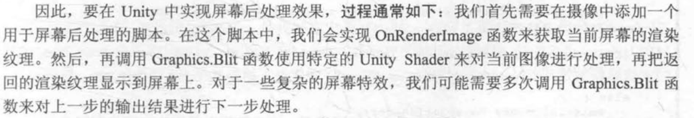

- 摄像机添加后处理脚本
- 脚本中用OnRenderImage函数获得当前屏幕
- 调用Graphics.Blit 使用特定的shader进行后处理
  - 会传给shader src和dest，src就是一张纹理，实际上就是后处理前的渲染好的屏幕

#### 高斯模糊

##### 如何进行迭代的高斯模糊？

在C#脚本中创建RTbuffer，将模糊结果暂存。

````c#
    int rtW = src.width / downSample;
    int rtH = src.height / downSample;
    RenderTexture buffer0 = RenderTexture.GetTemporary(rtW, rtH, 0);
    buffer0.filterMode = FilterMode.Bilinear;
    // 先把原图像放进buffer0
    Graphics.Blit(src, buffer0);
    for (int i = 0; i < iterations; i++)
    {
        material.SetFloat("_BlurSize", 1.0f + i * blurSpread);
        RenderTexture buffer1 = RenderTexture.GetTemporary(rtW, rtH, 0);
        //用第0个pass处理后（水平模糊），将结果存入buffer1,然后存回buffer0，再清空buffer1
        Graphics.Blit(buffer0, buffer1, material, 0);
        RenderTexture.ReleaseTemporary(buffer0);
        buffer0 = buffer1;
        buffer1 = RenderTexture.GetTemporary(rtW, rtH, 0);
        // 竖直模糊后结果存入buffer1
        Graphics.Blit(buffer0, buffer1, material, 1);
        // 存回buffer0
        RenderTexture.ReleaseTemporary(buffer0);
        buffer0 = buffer1;
    }
    Graphics.Blit(buffer0, dest);
````

### 第十三章

- 只获取深度纹理
  - 前向渲染
    - 着色器替换技术：选择那些RenderType = Opaque的物体，判断渲染队列是否小于等于2500，是的话就使用它们投射阴影的pass渲染到深度纹理中。（之所以选用投射阴影的pass，是因为这个pass中正好有使用到深度，详细参考shadowmap）
    - 如果有，直接使用深度缓存
  - 延迟渲染
    - Gbuffer中就有深度纹理

- 同时获取深度纹理和法线纹理
  - 前向渲染：单独使用一个pass，观察空间的发现信息在纹理的R和G通道，深度信息在纹理的B和A通道。
  - 延迟渲染：两者都在Gbuffer中，合并深度纹理和法线纹理即可。

#### 深度纹理的深度值是非线性的，要将其转换回线性空间

以转换回view空间为例，只要知道是如何从view空间到深度缓存的，做一个逆变化即可。

#### 只考虑摄像机移动的运动模糊（通过深度纹理重建世界坐标的方法1：逆VP矩阵）

存储上一帧的VP矩阵和这一帧的VP矩阵

将像素坐标用这一帧的VP逆矩阵重建回世界坐标，再乘以上一帧的VP矩阵得到上一帧该世界坐标对应哪个屏幕坐标，得到两个屏幕坐标的差值来得到速度

由于是使用不同的VP矩阵来得到屏幕坐标差值的，也就是其实只考虑了相机的移动，两帧屏幕坐标的变量只有相机位置的不同。

````c#
// 总的来说 计算出当前像素对应的屏幕坐标和上一帧的屏幕坐标（先转到世界坐标，然后用上一帧的VP矩阵），计算速度
fixed4 frag(v2f i) : SV_Target{
    // 通过采样深度纹理获得该点深度值
    float d = SAMPLE_DEPTH_TEXTURE(_CameraDepthTexture, i.uv_depth);
    #if defined(UNITY_REVERSED_Z)
        d = 1.0 - d;
    #endif
    // 从屏幕坐标映射回NDC 范围为[-1, 1]
    float4 H = float4(i.uv.x * 2 - 1, i.uv.y * 2 - 1, d * 2 - 1, 1);
    // 从NDC回到世界空间
    float4 D = mul(_CurrentViewProjectionInverseMatrix, H);
    float4 worldPos = D / D.w;

    // 当前屏幕空间
    float4 currentPos = H;
    // 上一帧屏幕空间
    float4 previousPos = mul(_PreviousViewProjectionMatrix, worldPos);
    previousPos /= previousPos.w;
    // 计算像素的速度
    float2 velocity = (currentPos.xy - previousPos.xy) / 2.0f;
    float2 uv = i.uv;
    float4 c = tex2D(_MainTex, uv);
    uv += velocity * _BlurSize;
    for (int it = 1; it < 3; it++, uv+= velocity * _BlurSize)
    {
        float4 currentColor = tex2D(_MainTex, uv);
        c += currentColor;
    }
    c /= 3;
    return fixed4(c.rgb, 1.0);
}
````

### 通过深度纹理重建世界坐标的方法2：借用摄像机坐标

某个像素的世界坐标可以表示为：

``float4 worldPos =_WorldSpaceCameraPos + linearDepth * interpolatedRay;``

即相机世界坐标 + 偏移量，其中linearDepth就是从深度纹理中经过转换得到的线性深度，interpolatedRay是一个从相机到目标物体的射线，包括了方向信息和距离信息。由顶点着色器输出并插值得到。

具体计算方法如下，对于任意一个interpolatedRay，可以由下图得到TL、RT、BL、BR经过线性插值得到

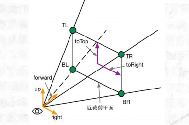

图中向量计算过程如下：

- 先计算toTop，toRight，halfHeight
- 再用这三个向量互相组合来得到TL、TR、BL、BR

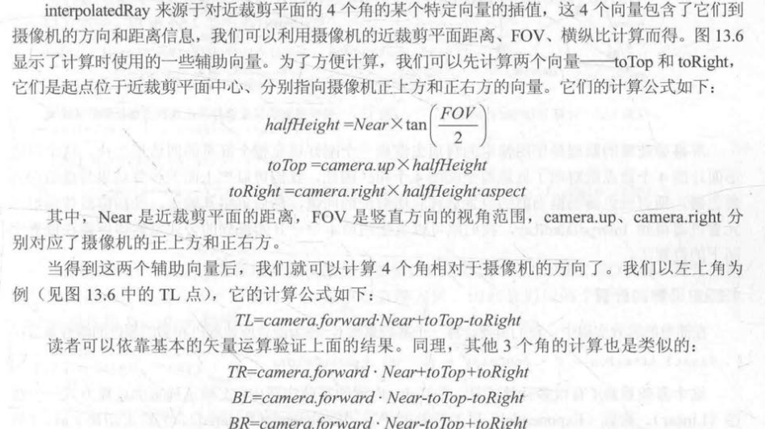

这时候得到的四个向量含有方向和欧氏距离，但是我们得到的线性深度值仅仅代表了z的偏移，而不是相机到某点的绝对距离，因此我们要将z的值转换到欧氏距离，利用相似三角形，以RT为例：

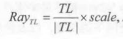

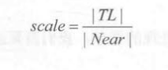

为什么只用计算4个顶点的射线就能插值出中间的任意片元？

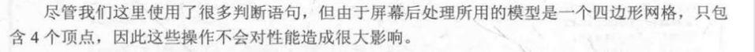

因为本来就只有4个顶点，由unity的光栅化自动进行插值。

### 第十四章

#### 绘制模型轮廓线的5种方法

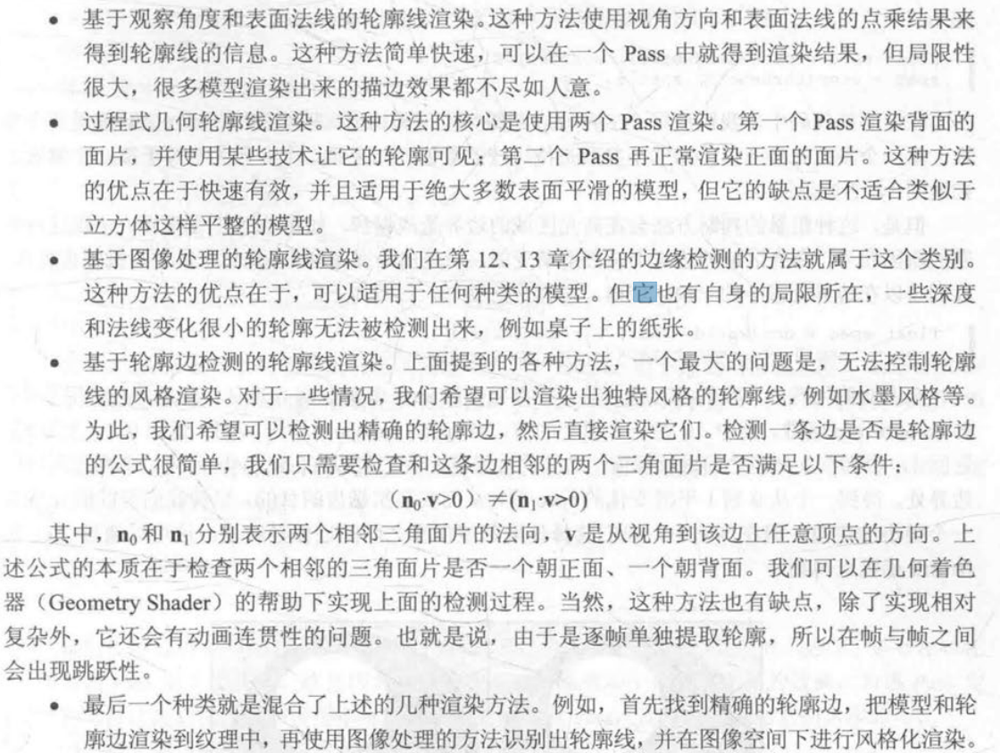

#### 顶点外扩描边

在view空间下，将背面的顶点沿着法线方向外扩，再以轮廓色颜色渲染背面即可获得轮廓线，最后再渲染正面即可获得描边后的图像。

#### 素描风格渲染

根据法线和光线的夹角，分为6个层级，用6张不同的纹理模拟不同光照下的漫反射效果。

### 第十六章

#### 批处理

合并可以合并的顶点数据，整理成更大的VBO（vertex Buffer Object）再调用drawcall发给GPU，来减少drawcall的数量

- 动态批处理：unity自动进行，有很多情况下都会打断动态批处理，比如使用多个pass，网格顶点数量超过指定数目等等。
- 静态批处理：勾选hierarchy上的static即可开启，运行开始时，将需要静态批处理的模型合并到一个新的网格结构中，从此以后这些模型不可以被移动。缺点是合并后的模型要同时存在于内存中，比如合并了一千棵树，那么一千棵树的顶点都要在内存中。
  - 对不同材质的物体用静态批处理，仍然要使用多个drawcall，但是可以减少切换drawcall状态时的性能消耗。

材质不同一般是不可以用批处理的，但是可以通过一些方法让批处理可以使用：

如果纹理完全不同，我们可以合并纹理到一个更大的纹理中，称为图集，再进行批处理

如果纹理只有微小的不同，可以修改合并后的VBO中的数据。

[注] ： 

- 批处理需要将模型变换到世界空间然后合并，如果shader中存在一些基于模型空间下的运算就会出错，需要使用[DisableBatching]强制该模型不会被批处理。
- 一些透明物体要先保证绘制顺序，再看能否被批处理，如果不能满足就优先保证绘制顺序。

#### 减少需要处理的顶点

##### 优化几何体

尽可能减少三角面片的数目

一个正方体，边界上的顶点可能被不同的面共享，从而拥有不同的法线，但是GPU必须是一个顶点对应一条法线的，这时候GPU就会将一个顶点拆分成多个顶点。因此我们还可以移除不必要的硬边和纹理衔接，避免边界平滑和纹理分离。

##### LOD（Level of Detail）

为一个模型创建一个LOD Group，但这个模型在摄像机边缘或离摄像机很远的时候，采用更少面片的模型。

##### 遮挡剔除技术

消除在其他物件后面看不到的物件，避免计算看不到的顶点。

#### 减少需要处理的片元

##### 控制绘制顺序

尽量保证物体从前往后绘制，这样后面的物体通不过深度测试，而避免了渲染。在Unity中，渲染队列<2500（也就是不透明的物体）都是从前往后绘制的，因此我们尽量让物体都在不透明的渲染队列中。

也可以根据实际项目需求规定渲染顺序，比如fps游戏中自己的角色就优先绘制，敌人的角色大概率在掩体后面，所以可以先绘制场景的其他物体。

##### 尽量减少透明物体

从后往前绘制的透明物体，会大量造成overdraw（后面的物体白白渲染了）

##### 减少实时光照的阴影

会带来额外的pass，同时打断动态批处理

#### 节省带宽

##### 减少纹理大小

mipmap，纹理最好是正方形且长宽为2的幂次

##### 利用分辨率缩放

减小分辨率

#### 减少计算复杂度

##### LOD of Shader

同模型的LOD，可以在shader中设置shader的LOD，为不同的情况使用不同的shader

##### 代码方面

尽量使用更低精度的浮点，如fixed/lowp，避免使用float

尽量避免不同精度的转换

尽量减少插值变量，如两个纹理从顶点传到片元，最好存在一个寄存器的xyzw中

尽量少使用基于屏幕空间的后处理，如果一定需要，使用精度低的变量。

高精度的运算使用LUT（参考光照衰减）或者转移到定点着色器

尽量把多个特效合并到一个shdaer，如颜色校正、添加噪声、Bloom等屏幕特效

少使用sin、tan、pow，换成LUT，少使用分支，少使用discard（影响硬件优化）

### 第十八章

#### 次表面散射

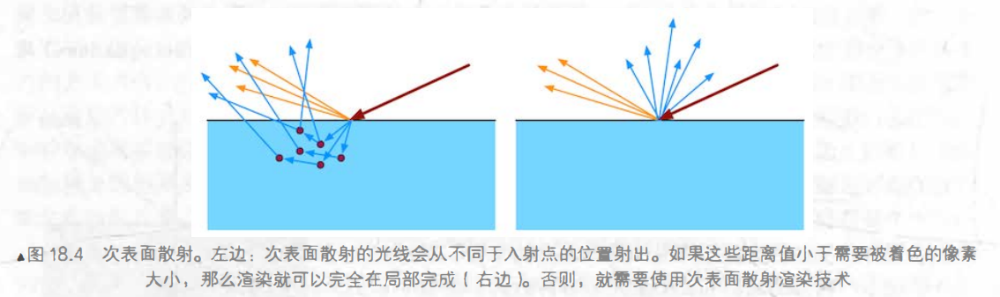

#### 高光反射BRDF——Torrance-Sparrow微面元模型

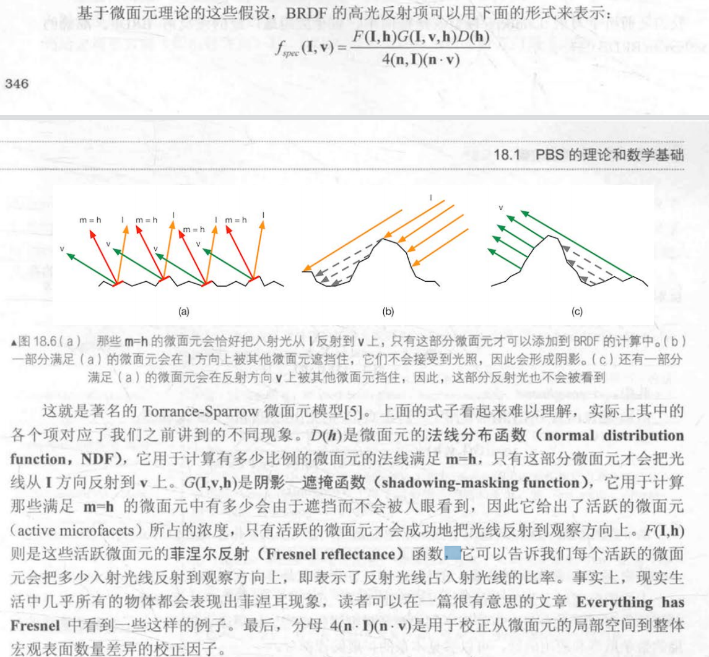

#### 金属工作流和高光反射工作流

金属工作流为默认流程。

金属工作流并非只能模拟高光物质，他们的名称来源于：

- 金属工作流定义了材质表面的金属值：是金属还是非金属

  - Albedo : 物体的整体颜色

  - Metallic : 金属度（越高越像金属）
  - Smoothness ：光滑程度

- 高光反射工作流来源于它指定了表面的高光反射颜色等，在金属工作流中这个颜色需要由漫反射颜色和金属值衍生而来

  - Albedo : 漫反射强度
  - Specular : 高光反射强度
  - Smoothness : 光滑程度

#### 反射探针

回想第十章如何使用Cubemap模拟反射结果。

在场景特定位置对整个场景的环境反射进行采样，结果存储在反射探针中，当游戏中包含反射效果的物体从这些探针附近经过时，Unity会把反射结果传递给这些物体使用的反射纹理。

简单来说，放置反射探针存储周围的环境反射，从而对拥有反射效果的附近物体产生影响。

类型：

- Baked：提前烘焙得到cubemap，不会变化，烘焙时只考虑静态物体
- Realtime：实时更新
- Custom：自动以

#### 伽马校正

人眼感知暗的变化比感知亮的变化更加敏感，所以在8位空间（RGBA的范围为[0, 255]）时，我们采用了更多的空间来存储暗部。

因此在存储照片时，往往进行了一次加码

Lout = Lin^2.2 , 如输入0.5 加码后变为0.5^0.22 = 0.21

这个过程被称为伽马校正

这时，线性的亮度被转为非线性的，但是图形学中很多计算都是线性的，如光照计算等，因此我们需要确保在进行各类计算时转换到线性空间，当渲染完成，要显示到屏幕上时再进行伽马校正。

有些输入本身就在非线性空间，这时候我们要将其转换到线性空间进行计算，如纹理等美术人员直接制作出来的图像，当把输入纹理设置成sRGB时，可以自动完成这一转换。

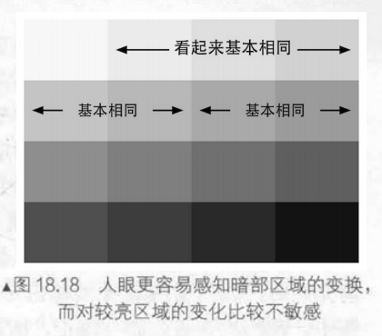

#### HDR

HDR使用32位的颜色空间，这使我们

- 能够抛弃伽马校正，不再需要更多的空间存储暗部信息，而是进行线性存储
- 能够存储超过1的亮部，从而保留亮部细节，在LDR中，白色的墙壁和强烈的阳光是相同的颜色，但HDR中阳光可以超过1，从而使得Bloom的阈值更加正确，在最后将HDR映射回[0, 1]时，也能保留更多的亮部细节，不丢失高亮度区域的颜色值。

缺点在于：

- 渲染速度变慢，需要更大的显存空间
- 无法利用硬件的抗锯齿功能（尽管我们可以在后处理中进行抗锯齿操作）

#### PBR并非是为了更真实的渲染

PBR最大的好处在于：使用一个shader从而能够在各种各样中的环境都正确的显示光照，具有更强的普适性而不用使得同一个材质在不同环境中要编写多个shader。甚至可以用一个shader描绘不同材质的物体，只需要调整特定的参数。
