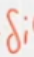
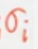
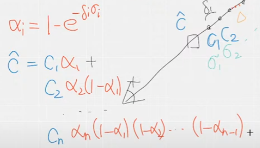

##### dataset

现实图片的数据集可以通过colmap重建出位姿，存储在poses_bounds中

对于模型，blender也可以生成多视角图片

##### 输入的图片

每一张图片都有对应的相机内外参，每一个像素都可以通过矩阵变换得到一个rays，作为训练时input的射线

而每一个像素本身的rgb则可以作为loss

##### 实际的体渲染

论文中的公式（3）

α为不透明度，为步长，为密度，很显然步长越长，密度越高，权重应该越高

举例，其中$\alpha_2是第二个点的不透明度，(1-α_1)表示经过了前面的点还剩下多少“权重”能够到达这里$

$\alpha_2(1-α_1)其实就是透射率T$

总之权重和自身的透明度有关，还和遮挡这一点的其他采样点的透明度有关

#### 精细采样的实现

得到一个从n到f的权重累积函数，最大是1，然后在y轴等距离采样，比较陡峭的地方（weight变化大）的地方就会被比较多的采样