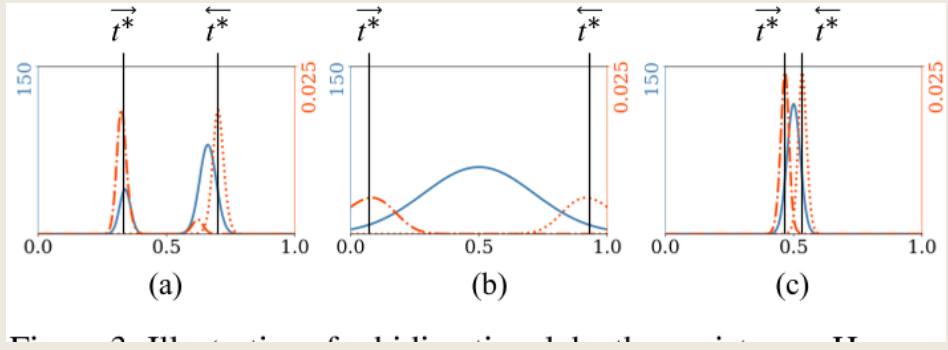
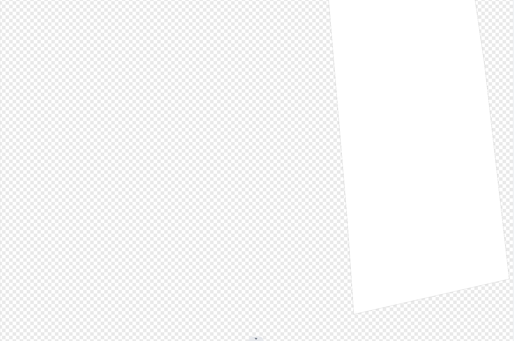

## nerfren（2022 CVPR）

- Category：光照反射
- Project: https://bennyguo.github.io/nerfren/
- Code: https://github.com/bennyguo/nerfren
- Paper: https://arxiv.org/pdf/2111.15234.pdf

### Motivation

原来的nerf：

- 缺乏对反射的建模，对于镜子反射的物体，在体渲染的模型下，相当于在镜子里存在一个虚拟的空间，从而导致错误的深度估计，**同时会将反射的物体建模为半透明的，从而导致雾状的几何**。

  > 其实我觉得这个很符合直觉，体渲染并不是真正的光线追踪，不能做到反射的光线也只能用虚拟的空间来欺骗视觉了

  - 先理解什么是雾状，将其和一般的半透明（如一个泡泡）区分开来，在一块区域中，每个采样点都有一些几何存在，但都是半透明的，看见的就是雾状，而一个泡泡看起来很清晰，是因为它内部是不存在发光的采样点的，而只在表面存在，这个是透明。

  - 在ref-nerf中提到，NeRF倾向于在物体内部使用各向同性发光点来“伪造”镜面反射，而不是由表面点发射的视相关辐射，导致物体具有半透明性或雾状壳。

  
  
  - ↑可视化的density，在正确的物理世界中，镜子应该只在表面有密度，而nerf中是认为镜子有一个半透明的表面，然后在镜子内部的不同深度出现了发光点，从而是雾状的。
    - 这样还会导致一个问题，这样训练出来的nerf，在镜子的交界附近也能看到那个镜子中的虚拟世界，也就是所谓伪影。

  
  
  - 所以问题就回到如何让nerf学习到基于表面的反射，如果用原来的nerf结构，最后的结果应该是：最后的镜子上有很高的density，即认为镜子是不透明物体，同时镜子平面上每个采样点的c来表示镜面反射，通过一些光学模型作为几何先验进行正则化，或者是修改模型等等，这篇文章就在解决这个问题。

### Method

- 将神经辐射场分解为独立的transmitted部分和reflected部分，同时学习一个reflection fraction map $\beta$，最后image由两者通过各自的辐射场渲染，最后相加得到，即

$$
I = I_t+\beta*I_r
$$

- 当然，it is highly under-constrained，如果不更改nerf就简单的将其分解为两个场，其实就是做一个无监督任务，那么会有无穷多种二分类的分解方法最后合成得到正确的视图。常见的有：分解为full场（渲染完整视图）和empty，分解为2个full场，以及两者之间。那么自然就要对训练做出约束了，基于以下三个假设：

  - $\beta$只应该和transmitted有关，因为$\beta$其实表示了物质的材料（我理解是反射率），而不应该和被它反射的物体有关系
  - transmitted的深度图应该是局部平滑的，因为现实中大部分反射体都是光滑平面（疑问：可是这个场也要用来重建其他物体，从case来看就是只盯着镜面重建了，但是case中镜面与其他物体的交界处好像重建的也还行）
  - reflected部分只需要简单的几何，因为大部分情况下我们只能从有限的观察方向看到反射图像。（意思是正常的三维重建我们追求360度全方位重建，但是重建出镜面中反射的物体我们只能看见一部分）

- 自然，三个假设做出三种约束

  - 设计特定的网络结构，分解成两个场，这里的α（reflection fraction map）只和transmitted有关

    - 整个镜面反射r场都和视线无关是一个比较反直觉的设计，有些不能理解。在原来的折射场中保持了方向是为了保留高光。在我看来是完全抛弃了物理假设，也就是图形学中的PBR公式，BRDF项等一系列物理假设，把镜子中的图像认为是藏在镜子中的另一个世界，不同视角带来的差异是因为摄像机在不同位置带来的，而并不是由于反射的光来源于不同位置造成的。比如看一个鼠标，从正面，上面，左边的三视图看到的是不同的鼠标图像，这是视线无关的场，场中某个点就是鼠标的组成部分，不会因为视角变化而导致鼠标本身的样子发生了变化，但鼠标上的高光真的是会因为你视角不一样而发生改变的。

    

  - 应用深度平滑先验

    - p是某像素，q是周围的8个像素，t*是估计深度（通过体渲染时采样点的深度加权求和得到），pq的深度差距越大以及颜色差距越大，都会导致Loss的增大，保证transmitted场的深度局部平滑

  

  - 双向深度一致性约束（bidirectional depth consistency constraint）

    镜面反射场最好描述了一个什么物体？作者的推导逻辑是，因为只有在很少的视角能观测->简单的几何，一种光线只能击中一个表面的几何->应该是一个不透明表面，一个贴了纹理的壳

    > 其实个人感觉故事讲得不好，这个约束在于将表面约束的足够薄，不应该由只能从正面看镜子来导出，其实将镜面反射简化为一张2D纹理是图形学渲染中的常见手段，但是确实不是很物理也不好讲故事，我猜作者是受此启发的，但是故事没太讲好，或者是我没get到，或者说从ref-nerf受启发也很合理，要将发光体约束在表面就要使得物体足够薄]

    - 定义了一个**反向**的深度，也就是从最**远**采样点的深度加权求和得到

    - 定义了一个**正向**的深度，也就是从最**近**采样点的深度加权求和得到

    - 这里比较容易让人产生疑惑，从近到远求和以及从远到近求和结果有什么区别？其实权重不一样，同一个采样点，从近到远求和的权重取决于它之前的点的不透明度，而另一个取决于它之后的点的不透明度，因此如果有两个表面，正向深度就会更偏向于前面的表面，因为后面的表面权重被前面的表面大幅降低了。

    - 来看一下不同的几何下正向深度和反向深度长什么样，横轴是采样点的距离，蓝线的纵轴表示密度，所以a表示遇到了两个表面，b是雾，c则是理想的镜面反射体——一张贴了纹理的固体。那么作者提出的约束就很简单，让两个深度足够近。
    
      

- 另外，对于有挑战性的场景，比如镜子，可以手动的提供mask，来使得场景被更正确的分解。（其实感觉这个是不是有点过分了，破坏了end to end，加入了手工的方法来大幅提升精度，不过某些先语义分割再nerf的方法好像也殊途同归，我训练个专门识别反射体的segment的cnn/transformer作为预输入语义是否有一定效果？就是novelty几乎没有，还会有个臃肿的模型，不过发散的讲，更多种分解场的方法，以及不同对应的预输入？）

  - 具体是，利用提供的mask图作为$\beta$的约束，要在mask区域$\beta$尽可能大，而其他区域尽可能小。

### Limitation

- 这篇文章太注重平面反射的建模了，自然会产生一个问题：对于非平面的镜面反射不能有很好的效果，比如下图的弯曲镜面

- 另一个是没有模拟出菲涅尔效应，这里作者只是提了一下，没有给出failure case，其实个人感觉反射系数$\beta$近似了一种菲涅尔系数，不过没有进行建模和约束，仅靠MLP学习，所以大概率学到的不是物理意义上的菲涅尔。

- 虽然文章没写，但是感觉过于精细的调参也是一个缺点，它要在早期屏蔽view direction以及它自己新增的几何约束，才能出比较好的效果，否则基本就是分解失败

## Ref-Nerf（2021 CVPR）

- Project: https://dorverbin.github.io/refnerf/
- Code: https://github.com/google-research/multinerf
- Paper: https://arxiv.org/pdf/2112.03907.pdf

### motivation

- 以view direction为MLP的输入，不方便进行插值，因为radiance function关于view direction变化太快
- nerf倾向于用在物体内部的各向同性的发光点来伪造镜面反射，导致物体呈现出半透明或者雾状。也因此导致法向量充满噪声，难以使用。

### contribution

- 重新参数化nerf，将view direction替换为出射方向

- 提出一种IPE，使得即使分开建模漫反射和镜面反射时，radiance function在不同的纹理和材质下仍可以平滑插值（还没看mip-Nerf，先TODO，有球谐函数和高斯的知识，也可能和3DGS有共通之处）
- 一种正则化方法，使得体积密度能够集中于表面，从而优化法向量的精确度

### method

- 重新参数化nerf，将view direction替换为出射方向
  - 用一个四个平行光的简单场景为例，黑色的是可见（但是没有光）部分，棋盘格是不可见部分。
  - $\omega_r$表示出射方向，永远指向平行光所以不随着x变动，因此第二行的图中这些光都是平行线，如果我们要预测$\omega_r$不取在这四个平行光所在方向的参数，Directional MLP只需要进行平滑的插值。
  - 下方的$\hat{n}, ρ, c_d$表示ref-Nerf对这三个量进行了建模，将它从镜面反射中分离开来，最明显的变化是使得右边第二列，相比于第一列，让Directional MLP不需要对漫反射进行插值。

- 网络的框架，ρ表示粗糙度，和IDE有关，法向量和视线方向用来算出反射方向$\omega_r$，以及位置$x$通过空间MLP编码后得到的特征向量$b$,还有$n·d$(为了模拟菲涅尔项，以及其他可能的BRDF函数)来计算高光反射的颜色，最后和漫反射颜色一起通过色调映射输出srgb颜色。[色调映射：将颜色从线性空间转换到srgb并且将颜色范围限制到[0,1]]

- 提出一种IPE，使得即使分开建模漫反射和镜面反射时，radiance function在不同的纹理和材质下仍可以平滑插值（还没看mip-Nerf，先TODO，有球谐函数和高斯的知识，也可能和3DGS有共通之处）

- 一种正则化方法，使得体积密度能够集中于表面，从而优化法向量的精确度

  - 针对体密度梯度计算出的法向量充满噪声，不够平滑的问题，提出第一个正则化，就是在MLP输出另外一个法向量，要求这两个法向量足够接近。作者提到：MLP预测的法线更加平滑，这和vanilla NeRF提到的位置编码来自于同一理论，论文Fourier Features Let Networks Learn High Frequency Functions in Low Dimensional Domains中提到MLP的这一特性，以及克服MLP趋向于学习低频特征而不擅长学习高频特征的方法，包括原始NeRF中的位置编码。当然，这里是反过来利用MLP学习低频特征的特性，来预测一个尽可能平滑的法线。

  

  - 第二个问题是针对NeRF总喜欢用一些物体表面后的发光点的问题，提出要让高可见度(也就是$w_i$高)和光线同向的法线受到惩罚，这样物体存在于物体背面又能够发光被我们看见的物体就会减少。通俗的讲，让NeRF倾向于让面对光线的那一部分表面来表达物体的颜色，而不要让物体表面变成半透明，而让里面的物体发光来解释所看到的颜色。

  
