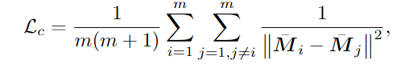

## 直接蒸馏已有特征

为表统一，所有附加在GS上的特征，再通过阿尔法合成得到的特征图统一定义为$F$​

### 如何提取pixel-level的特征？

CLIP的特征是image-level的粗糙特征，但需要的是pixel-level的特征，才能直接对3DGS的渲染图像优化。

- Feature Splatting：

  - 将CLIP特征用SAM mask平均池化，再分配到每个像素上，形成图(d)，直接和$F$做监督
  - 利用DINOv2的像素级特征做辅助

  

- Segment Any 3D Gaussians：

  - 将SAM特征用SAM mask平均池化成一个特征向量，不按像素分配回特征图，而是作为一个query
  - 将该query分别与$F$中所有像素做余弦相似度查询，得到一个可能性图，将可能性图与SAM做监督
  - 举个例子，图像中有一个椅子的mask，使用该mask得到椅子的SAM特征，再依次问$F$​的每一个像素，你是否是一个椅子？然后给出可能性图，和椅子的mask做监督

- LangSplat：

  - 把图片过了SAM之后再送进CLIP得到特征，分配给pixel作为pixel-level的特征

  

### 如何解决速度和内存问题？

- Feature Splatting：直接光栅化高维度特征会导致昂贵的训练时间，深入分析后发现主要瓶颈在内存访问模式，通过设计了cuda kernal解决

- SegAnyGaussian：在最开始就使用MLP对SAM特征进行降维，蒸馏特征时一起训练

  

- LangSplat：开始训练3DGS前，先训练一个MLP构成的编码-解码器，于是用降维的特征蒸馏，再用升维的特征查询

- Feature 3DGS：直接用不需要训练的卷积，GS嵌入低维特征，上采样回高维和CLIP特征做监督

### 如何查询

将CLIP特征蒸馏到每个3DGS后，如何选中需要的高斯？

- Feature Splatting: 将text通过clip text encoder得到词汇的text embeddings，计算与每个GS的相似度
- SegAny3DGS：user选取图片中的第一个点，送给SAM得到对应物体的mask，得到平均池化SAM特征作为Query，依次查询每个高斯

## 利用SAM训练出场景特化的特征

### 怎么利用SAM设计loss完成无监督训练？

现在没有一个直接的目标：即上一个方法的将CLIP或SAM特征蒸馏到高斯上，而是要训练出一个属于自己场景的特征，大体上有两个思路

#### 先得到场景中到底有几类物体，从而转化为分类问题

- Gaussian Grouping：采用视频跟踪模型，将多视角图片视为视频序列，得到不同视角下的mask之间的联系，从而得到一组图片中到底有几类物体
- Group Any Gaussians：
  - 对于任一mask，根据相机内参反投影到相机空间，选取前x%的高斯，认为这些高斯就是这个mask代表的高斯
  - 根据每个mask对应的高斯的交并比，将mask进行分类，从而得到整个场景到底有几类物体

#### 相同mask下的高斯有近似的特征，不同的mask下的高斯具有远离的特征就可以了

- OpenGaussian：

  提出掩码内平滑损失和掩码间对比损失，

  intra-mask smoothing loss：掩码内平滑损失

  

  先阿尔法合成渲染出一张特征图M，然后用SAM得到m个实例的平均池化特征，再以每个实例中的每个像素点和平均特征做一致性损失，即**约束mask内的每个像素具有相同的特征**

  inter-mask contrastive loss：掩码间对比损失：

  

  总之不同instance的特征越接近，损失越大。

## 一些正则项

- Segment Any 3DGS ： Correspondence Loss，让共享更多mask的两个像素拥有相近的特征

- Gaussian Grouping ：3D正则化损失（空间），用P表示一个3DGS的身份编码$e_i$,Q表示该3DGS的最近k个GS的身份编码集合${e_1,e_2...,e_k}$,用KL散度衡量P和Q身份编码的差异，即约束最近的身份编码要尽量相同

  

## 总结

3DGS从出现到流行不到一年，由于显式表示和隐式表示的巨大差异，语义嵌入上并不能简单的从NeRF迁移到3DGS，因此现阶段仍处于解决将语义嵌入GS中遇到的种种问题的一个阶段，还没有到设计各种复杂的模型和机制卷精度的时候，体现在：

- 对于直接蒸馏的方法，大多论文创新点集中在如何解决高维嵌入的内存和速度问题、如何获得pixel-level的特征配合GS的光栅化框架蒸馏的问题，这些是使用蒸馏这一方法天然会遇到的，因此大家的论文看起来有些重复
- 对于无监督的方法，大多论文集中在如何让这个方法跑起来的阶段，转化为分类问题是一个思路，还有其他的吗

也因此，对于种种下游任务专门做设计的论文也还没有出现，比如我们要求具体到GS操纵的需求，而不单单是多视角一致性分割的需求，其实应该是具身智能等任务的一个应用条件。应该思考如何为我们的场景定制一个pipeline，比如以下几点

- 能不能不用相似性查询，如果一个高斯被彻底的分类会不会好一点？因为相似性查询可能会有歧义，人工设定的阈值很难界定，会导致多分割或少分割。
- 设计pipeline时，应充分考虑我们是已经有3DGS建模好的场景的，同一物体GS相邻的先验能不能利用？颜色相近能不能利用？
- 对于细节，可不可以在点云分割领域寻找一些可用的后处理手段？
