## Feature Splatting: Language-Driven Physics-Based Scene Synthesis and Editing

website : https://feature-splatting.github.io

### motivation

这篇工作提出了Feature Splatting，半自动的将静态3D场景动态化，用自然语言来操纵外观和注册材质属性来控制动态交互。通过使用**additional view-invariant features**和视觉模型CLIP、DINOv2、SAM来增强3DGS实现。进一步地扩展到基于物理的动态场景，其中物体的类别和物理参数通过语言模型queries赋予。

**让3DGS携带特征**和**基于物理的动态**都遇到了意想不到的技术挑战：

- feature map的提取：

  高斯在geometry和radiance上有效地共享相同的interpolation kernal（？什么意思），但是从reference camera获得的2D特征图是低分辨率且有噪声的。直接采用来自Decomposing NeRF for Editing via Feature Field Distillation（NeRF的特征蒸馏）方法会导致低质量的结果，以及大量的高频噪声。我们解决这个问题通过提出一个新方法来提取feature map和一个蒸馏它们的步骤。

- 基于物理的动态：

  为了适应volume-dependent physical effects, 提出in-fill现存的静态高斯的方法，以及在显著变形下如何将3DGS进行转换的方法，这些方法比以往表现的更好。

这个场景建模和合成pipeline，feature splatting，包含了丰富的语义以致于可以使用自然语言来编辑，包括分解静态场景（成每个组件），并联系每个组件通过material properties和基于物理的动态。

贡献如下：

- 提出feature splatting，增强静态场景，使其富有语义和余元驱动的物理真实movement
- 一种基于MPM的物理引擎，适用于基于高斯的表示，一种新颖的方法来融合来自多个基础视觉2D模型的特征以进行准确的分解
- 一个演示，来正面feature splatting是一个杰出的editing tool

### Related work

- Scene Editing with Distilled Feature Fields：许多工作提出NeRF的编辑方式，现存的工作都主要关注与如何操纵外观。例如

  - Distiled Feature Fields（DFF）通过zero-shot open-text分割进行外观编辑，其中使用知识蒸馏将特征从2D基础视觉模型中嵌入。渲染过程中，DFF通过将语言查询与蒸馏特征关联起来分割受影响的体积，从而分解场景。然后，可以对分割出的对象执行外观编辑，例如颜色更改或移除。
  - NeRFShop:提出了一个允许用户输入以对NeRF进行几何修改的交互式流程
  - Instruct-NeRF2NeRF : 提出不在渲染过程中进行修改，而是使用现成的2D编辑方法来修改用于训练NeRF的图像
  - ClimateNeRF : 与本文关系最密切，提出在渲染过程中注入物理模拟以模拟不同的天气效果。然而，由于隐式场景表示的固有局限性，ClimateNeRF只能支持在神经渲染中修改光线行进过程，从而限制其仅能模拟天气效果中的光线反射、折射和衍射。相比之下，我们的方法使用显式表示来支持以对象为中心的物理模拟，具有更广泛的潜在应用。

- Concurrent Work: 列举一些3D场景理解的文章。然后提到

  在物理仿真最相关的工作：PhysGaussian，表示同样使用了MPM，但不包括语义，并且PhysGaussian手动选择和分配高斯的物理属性。同时在处理高斯旋转时方式也有所不同。

  在分割最相关的工作：Feature3DGS，fuse (2D reference features ) using (priors from multiple foundation models).我们将特征蒸馏视为整个pipeline中的一个组件，用系统优化的技术将训练技术提高30%

### method

三个关键组件：

- 一个将丰富的semantic feature从vision-language models蒸馏到3DGS的方法
- 一个将场景通过open-text queries分解成key constituents的方法
- 作为物理真实动态场景合成的一部分，一种通过语言确定材料属性的方法

#### 3.1 Differentiable Feature Splatting

##### Feature Splatting

对每个GS添加一个额外的vector$f_i∈R^d$，与视角方向无关。

然后用volume rendering渲染特征图

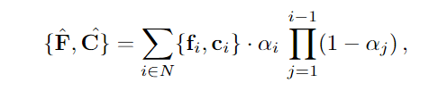

##### Syatems Considerations

直接光栅化高维度特征会导致昂贵的训练时间，深入分析后发现主要瓶颈在内存访问模式，通过设计了cuda kernal解决

##### Improving Reference Feature Quality Using Part-Priors

Feature Splatting生成的特征取决于参考特征，但直接使用CLIP作为参考特征会导致质量降低，因为CLIP的特征比较粗糙，如下图

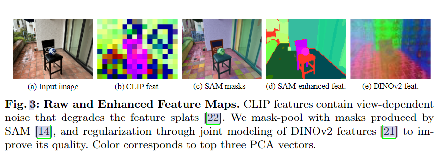

与基于NeRF的方法相比，在NeRF上这一问题并不显著，NeRF的隐式连续表示起到了正则化的效果。但3DGS没有这样的正则化，容易过拟合于粗糙reference feature map的噪声。

本文提出了一个改进GS Feature map质量的方法，通过使用DINOv2和SAM的object priors。

考虑一个输入图像，首先用SAM生成一个part-level masks集合${M}$, 对于一个给定的二值掩码M和粗糙的CLIP feature map $F_c$,本文使用一个Masked Average Pooling（MAP）来聚合一个single feature vector

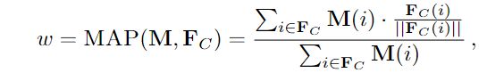

其中i是$F_c$​中的一个像素坐标，然后将w分配给分割部分内的所有像素，如果一个像素属于多个部分，则该像素特征通过平均所有相关部分的特征来获得，这样就得到了上图的(d) SAM-enhanced feat

> 公式是将特征图$F_c$过一个分割掩码mask，比如说椅子就只剩下椅子那部分的feature map，然后将椅子对应像素的所有特征向量作平均池化，再重分配给椅子上对应的所有像素

为了进一步降低过拟合的可能性，本文提出了一个shallow MLP，有两个output，并以3DGS的rendered features$\hat{F}$ 作为中间特征（不是输入么？），两个output分别为预测的$\hat{F}_{CLIP}, \hat{F}_{DINOv2}$，用真实的CLIP以及DINOv2的输出做监督，pipeline如下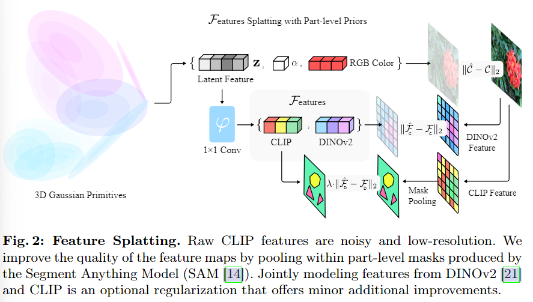

首先是Feature splatting渲染出一个feature map，每个像素上有一个d维的Latent Feature，通过一层MLP输出预测的$\hat{F}_{CLIP}, \hat{F}_{DINOv2}$，用真实的CLIP以及DINOv2的输出做监督，其中$F_c$的监督权重更高，反向传播让3DGS能够通过render合成一个修正过的CLIP features map。

> 换种方式解释，目的是为了让每个gs上有一个语义属性，因此需要render出一个feature map和gt feature map做监督，直接用CLIP生成的feature map监督效果不好，两个优化，第一个是用mask修正clip gt，第二个是用DINOv2作为正则在监督时加入。

#### 3.2 Language-guided Scene Decomposition

那么要怎么使用每个高斯上的feature，让它完成场景理解任务呢。

我们识别3DGS，通过查询其CLIP feature更接近正查询而非负查询（？）

具体来说，给定一个词汇作为正样本（比如bulldozer），用一个通用的词汇作为负样本（比如object，thing），使用frozen CLIP text encoder来获得以上词汇的text embeddings，遵循CLIP的标准实现，计算rasterized CLIP feature of every Gaussian（应该是每个高斯的CLIP feature，那rasterized这个前缀是不是有些误导性）和text embeddings的余弦相似度，选择那些相似度大于0.6作为前景object。在附录中包含了使用负文本查询的分割结果。

通过上述方式就选中了需要编辑或者进行仿真的高斯。

一些简单的编辑操作就容易实现了：

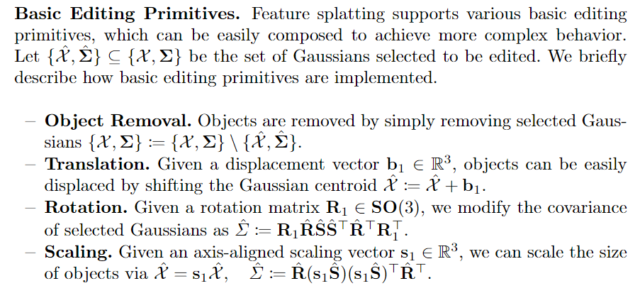

#### 3.3 Language-Driven Physics Synthesis

feature splatting可以自动选择用于模拟的物理属性、估计碰撞表面、预测重力方向。核心方法在于使用Taichi扩展的MPM

##### Decoupling Objects for Simulation

对于常见的刚体创建了一组词汇（e.g. wood, ceramic, steel）,可以随用户的可选输入扩展。

给定一个selected multi-part object（比如一个插有花的花瓶），再执行一次CLIP相似度查询选择对象内与这些材料更接近的粒子。

在模拟过程中，这些被选定的粒子被认为是刚性的。

##### Language-grounded Collision Surface Estimation

预定义一组规范查询（包括常见的平面物体，比如floor和tabletop），将这组查询输入到上述的场景分解pipeline中，获取这些物体的高斯表示，并用RANSAC来估计这些平面的几何形状，在物理模拟时作为碰撞表面。

重力方向是被估计为“floor”的平面几何的法向量。

##### Taichi MPM for gaussians

可以直接将高斯中心μ视为点云使用MPM，但质量不佳，有两个问题：

- 缺乏内部支撑，物体在与碰撞表面接触的时候回塌陷
- 当物体发生变形时，出现不期望的伪影

本文的方法超越了简单的基于点的物理模拟，利用了特定于高斯的信息，如各向同性的不透明度和高斯协方差，在变形过程中进行体积保持和协方差修改，以解决上述两个挑战。

解决方案：

- Implicit Volume Preservation ： 在从少量真实世界图像中模拟物理现象时，体积保持是一个未解决的挑战。

  例如，没有体积保持，模拟一个排球撞击地面时会在碰撞时塌陷。因此，我们提出了一种使用高斯的不透明度和协方差的隐式体积保持技术。具体来说，我们首先使用协方差和不透明度信息按照PhysGaussian的方法在表面高斯的圆盘上采样点以增加表面点的密度。通过增加表面点的密度，我们随后填充从对象中心到表面的透明支撑粒子。填充粒子的透明性旨在确保在T = 0时的渲染质量一致，从而实现从静态场景到动态场景的平滑连续过渡。

- Estimating Rotation : 当物体发生变形的时候，需要校正协方差矩阵的旋转分量，否则可能会产生伪影。PhysGaussian也注意到了这个问题，尝试使用MPM的变形梯度F来更新高斯的协方差。然而变形梯度主要捕捉局部变化，当弹性物体发生大变形的时候，这种方法就会失效。因此我们提出用法线来估算弹性物体的旋转矩阵。

  3DGS难以在稀疏重建时估计法线，因此本文采用了一种基于神经网络的方法。

  具体来说，对于每个要模拟的高斯，我们找到其两个最近的邻居。这三个高斯的中心形成一个平面，我们使用该平面法线的旋转作为整个物体动态的代理。与从变形估算的旋转相比，我们的方法在物体发生大变形时产生的伪影更少。

#### Experiments

dataset : deep blending, Mip-NeRF360, custom dataset

## Segment Any 3D Gaussians

https://jumpat.github.io/SAGA

### motivation

过去的方法：

- 使用2D模型中提取2D特征，提升到3D空间中，用3D特征的相似性判断两个点是否属于同一对象：速度较快，但分割粒度粗，因为缺乏解析嵌入特征的机制（e.g. 分割解码层）

> related word中提到：仅仅依靠欧几里得距离或余弦距离时无法充分利用嵌入在高维视觉特征中的信息，因此此类方法的分割质量是有限的。

- (segment anything nerf)直接将细粒度的2D分割结果投影到3Dmask grid上：产生精确的结果，但是由于多次执行基础模型和体渲染，导致过大时间开销

3DGS绕过对广泛且空的空间的处理，提供丰富的显式信息，成为分割任务的理想选择

SAGA避免了推理期间多次前向传递 2D 分割模型的时间消耗。蒸馏是通过基于 SAM [23] 自动提取的掩码来训练高斯的 3D 特征实现的。在推理过程中，根据输入提示生成一组查询，然后通过高效的特征匹配检索预期的高斯。支持点、涂鸦和掩码在内的各种提示类型。

### method

#### SAM

提供一个输入图片$I$和提示（可以是point，涂鸦或者mask）$P$，得到一个掩码$M$
$$
M = SAM(I,P)
$$

#### Overall pipeline

##### 训练阶段：

给定一个预训练完成的3DGS model $G$，输入图片$I$

对于一组图片，使用SAM得到一组2D特征图$F^{SAM}_I∈R^{C^{SAM}×H×W}$，和一组不同粒度的掩码$M^{SAM}_I$

在每个高斯上训练一个低维特征$f_g∈R^C$，通过SAM-guidance loss做监督。

> 没太看懂的correspondence loss的定义
>
> To further enhance the feature compactness, we derive point-wise correspondences from extracted masks and distills them into the features (i.e., the correspondence loss).

##### 推理阶段：

从给定的提示$P$中生成一组查询$Q$，用$Q$​通过特征匹配来检索3DGS，此后用3DGS提供的类似点云的丰富显式先验来做后处理

#### Training Features for Gaussians

##### SAM-guidance Loss

先将SAM的特征通过MLP $φ$降维到和高斯相同
$$
F'_I=φ(F^{SAM}_I)
$$
对于每一个mask，做一个maked平均池化，比如一个pikachu的mask，将皮卡丘上所有像素点的特征平均池化成一个特征向量(论文中称为Query)$T^M∈R^C$，现在$T^M$就代表pikachu

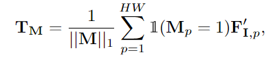

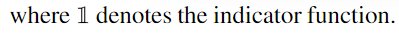

代码对应如下：

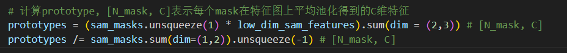

然后将render出的特征图和$T^M$做点积，相当于使用$T_M$在feature map上做查询，询问哪些像素点是pikachu？如果是，该像素上的feature点乘$T^M$就会得到较高的值（余弦相似度高），从而得到分割图$P_M$，再通过Sigmoid归一化成概率图

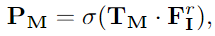

将查询到的分割图和真实的分割图做二值交叉熵进行训练

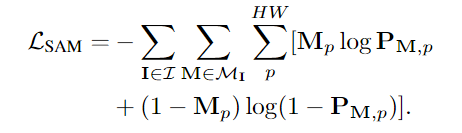

##### Correspondence Loss

一张图片上的两个像素$p1, p2$，可能属于多个mask，将多个mask定义为集合$M^{p1}, M{p2}$,显然如果两个mask交并比高，则他们应该有更相似的特征：

交并比定义为：

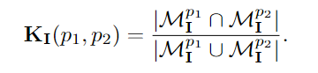

两个像素代表的特征的相似度为：

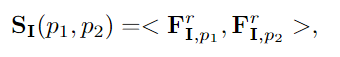

最终构成一个loss，交并比越高时，约束相似度足够大（Loss是回传给特征的，因此是约束$S$）

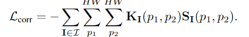

### Inference

##### SAM-based Prompt

可以直接使用SAM低维特征做查询。

先将prompts给SAM生成一个精确的2D分割掩码$M_v^{ref}$

在这个掩码上做平均池化得到一个查询$Q^{mask}$[注: 查询应该是一个C维特征向量]

用$Q^{mask}$分割2D渲染特征图$F^r_v$得到2D分割掩码$M_v^{temp}$

如果$M_v^{ref}$和$M_v^{temp}$的交集占据了$M_v^{ref}$超过90%的空间，$Q^{mask}$就作为正式的查询。

否则，使用K-means算法来从低维特征中提取另一组查询$Q^{kmans}_v$

使用这个策略是因为分割目标可能包含许多components，不能简单的使用masked平均池化来捕获

---

获得查询$Q^{SAM}_v=Q^{mask}_v\quad or\quad   Q^{kmeans}_v$后，用点乘计算每个高斯点的特征$f_g$和查询$Q$的相似度，如果查询分数大于自适应阈值（所有分数的均值和标准差之和）就认为是所要的点

## OpenGaussian: Towards Point-Level 3D Gaussian-based Open Vocabulary Understanding

### motivation

首先举出现存特征GS的管线：
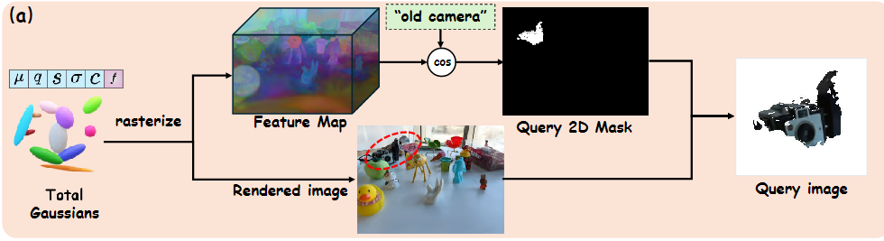

提出两个问题

- 对被遮挡的物体无法识别，失去了3DGS本身固有的能力
- 不是point-level的语义理解，对具身智能任务失效

因此提出了一个拥有3D point-level open-vocabulary understanding的模型

那么如果想要实现点级别的查询，一般可以通过以下流程，查询每个点的相似度：
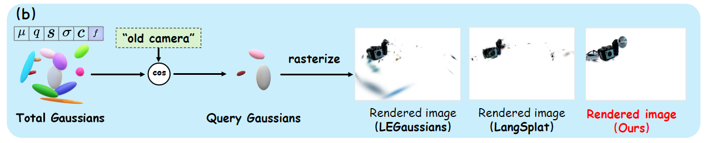

> 当然，个人觉得并不一定要用语言，池化特征也挺好用的

但是其他模型效果不好，归结为以下原因：

- 因为512维特征嵌入困难（内存和速度限制），所以采用了降维或量化（指LEGaussians ，这里的量化是压缩的意思），这损害了特征的精度
- **2D-3D对应关系不准确**：alpha混合渲染技术基于不透明度权重累积3D点的值以渲染2D像素，这阻碍了2D与3D之间的一对一对应关系的建立。因此，在2D和3D解释之间出现了性能不匹配的情况。

为了解决上述挑战，提出了以下方法，在point level上学习具有区别性和一致性特征的方法，既能在对象之间也能在对象内部保持一致性。本文的方法将高维无损的CLIP特征和3D高斯点关联起来，实现了开放词汇的3D场景理解。

- 使用提出的掩码内平滑损失和掩码间对比损失来训练在3D点级别上既有区别性又有3D一致性的实例特征，利用来自SAM [23]的布尔掩码而无需跨帧关联；
- 引入两级粗到细的码本来离散化实例特征，从而生成离散的3D实例簇；
- 提出基于IoU和特征距离的实例级2D-3D关联方法，将多个视角的CLIP特征关联到每个3D实例。

### Related work

LEGaussians [15] 为每个高斯引入了不确定性和语义特征属性，以呈现具有相应不确定性的语义图。该渲染图与从地面真实图像中提取的量化的CLIP和DINO密集特征进行了比较。LangSplat [14] 使用场景语言自动编码器来学习特定场景潜在空间上的语言特征，证明识别渲染特征图像中对象之间的清晰边界。Feature3DGS[16]提出了一种并行N维高斯光栅化器来提取高维特征，用于基于视图的任务，如编辑和分割。为了实现跨视图的 2D 掩码一致性，Gaussian Grouping [17] 执行开放世界 3D 对象的同时重建和分割，由从 SAM 和 3D 空间一致性约束获得的 2D 掩码预测指导。与这些工作类似，我们利用 3DGS 的实时渲染和显式表示能力。**然而，虽然这些方法主要关注像素级开放词汇理解(即，将2D特征提升到视图一致的分割)，但我们的方法发散，因为我们的目标是增强3DGS，并具有3D点级开放词汇理解的能力。**

### Method

#### 3.1 3D Consistency-Preserving Instance Feature Learning

提出掩码内平滑损失和掩码间对比损失，

intra-mask smoothing loss：掩码内平滑损失

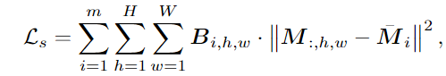

先阿尔法合成渲染出一张特征图M，然后用SAM得到m个实例的平均池化特征，再以每个实例中的每个像素点和平均特征做一致性损失

inter-mask contrastive loss：掩码间对比损失：

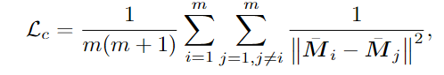

总之不同instance的特征越接近，损失越大。

> 只使用mask进行训练，这个训练出的6维特征并不属于SAM或是CLIP，看起来是一种无监督训练，用SAM的mask指导同一个mask内的GS具有相同的特征，用掩码间对比损失让不同特征足够远，实际上做了一个聚类

#### 3.2 Two-Level Codebook for Discretization

直观来看，学习到的实例特征非常适合进行交互式3D对象分割。例如，通**过点击渲染特征图中的一个像素，我们可以检索具有相似特征的高斯点来识别所选对象**。然而，这种方法的实际实现存在以下挑战：

- 设置一个通用的阈值来选择相似特征是困难的；
- 由于特征图是通过alpha混合渲染的，这会累积权重，因此同一对象的高斯点不可避免地会表现出不同的特征，而不同对象的高斯点可能会共享相似的特征。

为了增强实例特征的区分度并改进下游任务的交互性，我们旨在确保同一实例的高斯点**具有相同的（不仅仅是相似的）特征**，通过离散化来实现这一点。受之前关于3DGS压缩的工作[46, 47]的启发，我们提出采用代码本离散化来解决这一挑战。如图3(b)所示，离散化之前的点特征表现出噪声。

具体method略，总之连续的实例特征 F 转换为压缩特征和索引$\{C,I\}$

#### 3.3 Instance-Level 2D-3D Association without Depth Test

通过上述流程已经将不同instance的高斯分类好了，现在的问题是怎么进行开放词汇查询，具体到本文也就是将高维特征与对应的高斯instance匹配上，以往的论文有两个方法：

- 将CLIP或SAM的2D特征蒸馏到3DGS上，需要额外的网络、训练和编码器解码器，还有压缩特征带来的模糊原始语义的问题
- 做2D-3D的匹配，将2D图像特征映射到3D点，需要深度信息进行遮挡测试

本文提出了一种简单而高效的实例级别的3D-2D关联方法，保留高维、无损的语言特征，同时避免了基于深度的遮挡测试的需求。

具体步骤：

- 将单个高斯instance渲染出一个单instance map$M_i$
- 计算当前视图下，所有SAM掩码$B_j$和$M_i$的交并比，直观上理解交并比最高的那个SAM掩码就是对应的物体（然后用SAM掩码取出池化特征？），但是由于遮挡的存在，一个“SAM掩码”可能与从多个3D实例渲染的“单实例地图”相交，这就是前述像素到点关联方法需要深度进行遮挡测试的原因。
- 因此，用3.2的伪真值特征填充$B_j$，让它从二值mask变为特征填充mask$P_j∈R^{6×H×W}$，通过下式计算距离：

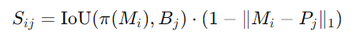

> 就是既用上二值mask的交并比，又用上mask下特征的L1距离的意思，注意到M和P都是本文无监督分类训练出来的特征而并非CLIP特征

最终，与得分最高的掩码的CLIP图像特征关联到3D实例的高斯点，并考虑多视角特征的整合。（大概就是用SAM掩码取出池化特征，对应到该高斯instance上了）

### Experiments

实验效果当然很好，首先是文本查询

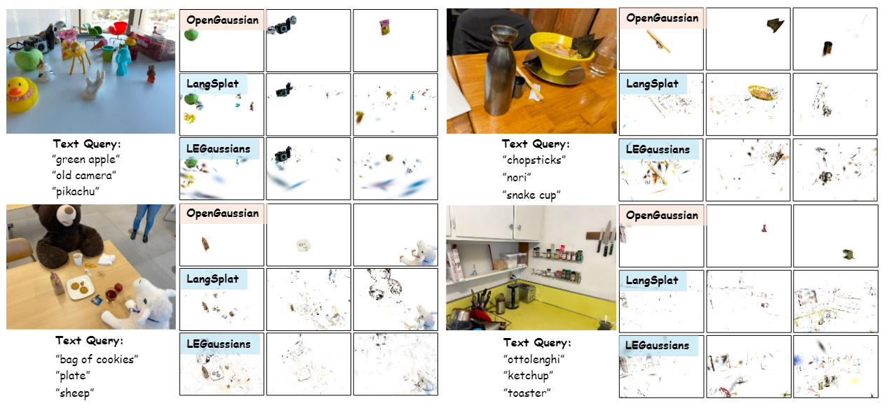

和SAGA一样的鼠标点击查询

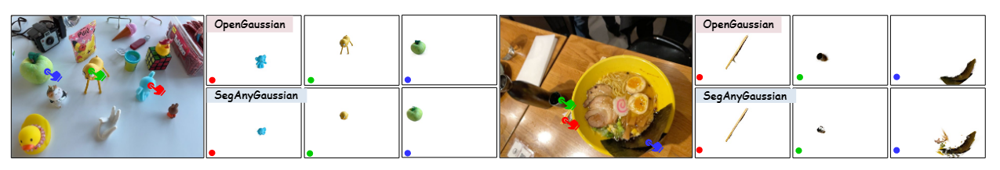

### 个人总结

这篇文章给出了一个分割的新思路，既然直接蒸馏有各种各样的问题，那么干脆不在高斯上进行监督训练，而是通过SAM的掩码将高斯先进行无监督训练出一个独特的特征，再离散化成各个高斯实例（每个包含一个高斯簇），最后为了支持文本查询将高斯instance对应到CLIP特征，如果只需要分割可以免去这一步

这里可以引出一些思路，虽然并不打算放弃蒸馏的做法，但是可以在特征降维后先对低维特征做处理，训练出一个编码解码器能够像本文那样让相同特征近，不同特征远，再进行蒸馏，即可以不使用CLIP的原始特征，而是逐场景的新特征。

另外本文指出之前文章不足之处的切入点也很准确，例如方法主要关注像素级开放词汇理解(即，将2D特征提升到视图一致的分割)，但我们的方法发散，因为我们的目标是增强3DGS，并具有3D点级开放词汇理解的能力。写作时值得再读一遍。

## Gaussian Grouping: Segment and Edit Anything in 3D Scenes

### motivation

比较早的文章，所以没有指出现有常见方法的不足，在提NeRF等早期方法

方法overview大概如下：

- 为每个高斯增加身份编码，其实就是一种低维特征
- 训练完身份编码后，通过MLP对身份编码进行分类
- 用交叉熵进行监督以外，加入了KNN进行正则，出于空间上相近的3DGS在身份编码上也相近的先验

### method

#### 3.2.1 Anything Mask Input and Consistency

- 首先使用SAM为多视角图片生成MASK，为每个2D mask生成唯一id
- 现在需要将不同视角中，代表相同身份的mask关联起来，具体方法如下：
  - 采用一个预训练的0样本跟踪器来传播和关联mask，同时提供3D场景中身份编码的总数量

#### 3.2.2 3D Gaussian Rendering and Grouping

16维身份编码$e^i$,α合成

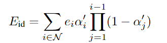

用degree为0的球谐表示，因为身份和视角无关。

##### Grouping Loss

关于如何训练身份编码，作者设计了2个loss

1、**2D身份损失**：通过alpha合成出$E_i$后，通过一个线性层$f$恢复特征维度到$K+1$,再经过softmax进行分类，再使用交叉熵损失$L_{2d}$进行训练，真值来自之前进行跟踪分类得到的$K$个物体分类

2、**3D正则化损失**：用P表示一个3DGS的身份编码$e_i$,Q表示该3DGS的最近k个GS的身份编码集合${e_1,e_2...,e_k}$,用KL散度衡量P和Q身份编码的差异，即约束最近的身份编码要尽量相同

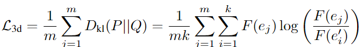

最后的训练Loss：

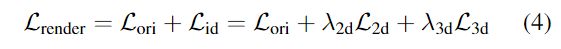

> 难得一见的边训练图像边训练特征

来看一遍管线图

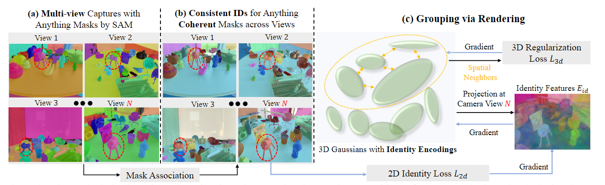

（a）部分是用SAM生成mask，这时还没有将多视图联系起来，所以同一物体在不同区域拥有不同颜色

（b）通过视频跟踪模型得到具有一致性的mask，此时有$K$个身份consistent ID

（c）身份编码阿尔法合成出$E_i$, 过一层MLP再softmax分类到$K+1$类中的一类,通过2D损失与(b)作为真值训练，3D损失利用空间KNN来保证相邻的高斯身份编码接近。

#### 3.3. Local Gaussian Editing

那么关于如何选中对应的高斯，即输入一个ID i，然后将3DGS的身份编码过MLP+softmax，如果是i则选中。

关于开放词汇查询，本文将prompt输入grouding DINO，得到2D图像中的掩码，再根据这个掩码选中本文SAM的掩码，得到需要的ID i

- 3D对象移除：删除编辑目标的3D高斯
- 3D场景重组：交换两个高斯组之间的3D位置
- 3D对象修复：除相关的3D高斯，然后添加少量新的高斯，并在渲染过程中由LAMA[41]的2D修补结果进行监督。
- 3D对象着色或风格迁移：仅仅调整SH参数

### Experiments

2D、3D损失的消融实验

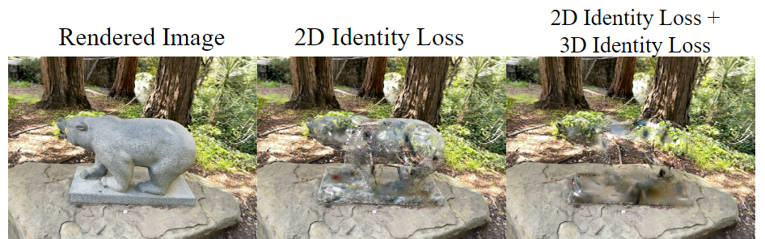

## Gaga: Group Any Gaussians via 3D-aware Memory Bank

和上一篇文章一脉相承，采用了同样的身份编码的预设

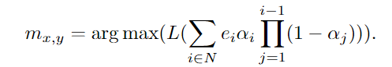

本篇的见解在于：[9, 26] (CoSeg和Group Gaussian)假设相邻的输入视图是相似的，并应用视频目标跟踪器来关联不同视图中的不一致2D掩码。然而，这一假设可能并不适用于所有3D场景，尤其是当输入视图**稀疏**时。Gaga受到了多视图掩码关联任务和视频中物体跟踪任务之间根本性差异的启发：3D信息的整合。为了可靠地生成跨不同视图一致的掩码，我们提出了一种方法，利用3D信息而不依赖于对输入图像的任何假设。我们的关键见解是，**不同视图中属于同一实例的掩码应对应于3D空间中的同一高斯组**。因此，这些高斯应被组合在一起并分配一个相同的组ID。

> 意思大概是：
>
> 之前的方法通过假设多视角图像具有连续性，通过视频跟踪的方法来将不同视角下同一物体的掩码联系起来，这不是在所有情况下都适用的，比如相机移动的过程中有遮挡、或者是无法视为连续序列的稀疏视角下
>
> 但是这里还没开始具体讲本文将用什么方法来代替它

首先要将2D mask和对应的3DGS相关联，具体来讲：

- 选取一帧输入位姿，可知道该位姿下的m个mask，再将3DGS在该位姿下投影到2D空间，可以知道哪些3DGS分布在对应的mask上，这些3DGS可以视为mask在3D空间中的表示，可以为不同视角下mask的关联提供指导。

首先要提的是，mask通常表示前景对象的形状，但是这样的选中方式会选中部分被遮挡的背景高斯，为了解决这个问题选中最靠近相机帧前x%的3DGS，x根据场景进行微调

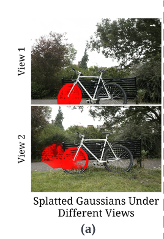

如上图，是某个视角下选中了车轮的所有高斯，但是在另一个视角下可以看出车轮后面的高斯也被选中了。

此外，如果直接在整张图片下，基于mask选中高斯分布会不准确的表示大区域mask的形状，无法关联不同相机姿态下的mask，所以将图像氛围32x32的patch，每个patch内计算最靠近相机的x%的3DGS，作为mask m对应的高斯分布，记为G（m），如图所示：

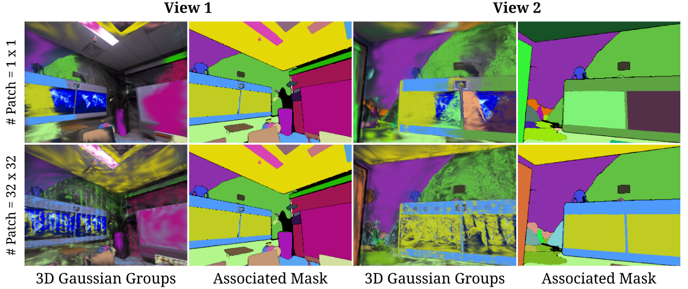

> 其实没太理解为什么切分为patch后再选中会更准确，可以看view1（第一二列）第一张图最左边，黄接蓝的窗户是不对的，整个窗户都应该是同色，而patch后的可以做到

现在已经找到了每一个mask对应的3DGS，要做的就是将不同视角下的mask联系起来，这里通过计算不同mask对应3DGS的相交程度来判断，先建立一个数据结构memory bank，里面存储了N组高斯，表示为$G_i,i∈\{1, 2, 3,...,N\}$,对于一个mask对应的高斯$G(m)$，通过以下公式计算overlap，如果超过某一阈值就认为它属于第i组高斯，把掩码m认为属于第i组

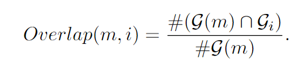

否则就在memory bank中新建一组高斯

#### 3.3 3D Segmentation Rendering and Downstream Application.

这个地方有点神奇，理论上通过上述步骤已经将所有高斯分好组了，memory bank里的N组高斯就是N个物体，但是这篇文章不忘初心，认为上述过程其实和Gaussian Grouping一样得到了$K$个身份，每个掩码m都有所属的身份，重新用Gaussian Grouping的训练流程对3DGS进行身份编码的训练。

> 可以认为是通过上述过程选中的3D高斯还是不够准确，但是不同视角下的2D掩码已经得到统一了，可以认为是一个比视频跟踪得到的身份id更加准确的真值，因此用他们进行无监督的训练得到身份编码，再根据身份编码进行分组更加准确
>
> 也就是，上述过程的3D还是不好，但是2D足够好了，不如用2D作为监督，让3D进行无监督训练来自行分类

总之，这份工作主要是代替了Gaussian Grouping中视频跟踪获得mask的方法，也就是完成了“将不同视角下的mask对应起来，得到一组统一的身份分类$K$”的过程。因此实验部分大部分 follow Gaussian Grouping。

## Language Embedded 3D Gaussians for Open-Vocabulary Scene Understanding

2024 cvpr https://buaavrcg.github.io/LEGaussians/

### motivation

关于语义嵌入带来的内存和速度问题，本文提出的解决方案

- 采用特征量化方法
- 降低语义特征的空间频率，解决了多视角图像带来的语义模糊问题（由学习到的不确定性值引导）

### method

#### 3.2. Dense Language Feature Extraction

原始的CLIP模型是对象级的，要进行语义蒸馏就需要用pixel-level的CLIP特征，LERF使用多尺度密集CLIP特征来解决这一问题，本文采用类似3DOVS的分层随机裁剪技术来提取CLIP特征。

本文还提取了DINO的特征作为补充。最后将密集CLIP特征和DINO特征连接起来，形成混合语言特征图。即：

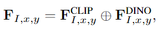

#### 3.3. Quantization of Language Features

TODO：看不懂了以后再说

总之也是一种降维，但是不是把256->16,而是将连续空间转换为N个d维向量表示，即离散化来降低维度

## LangSplat: 3D Language Gaussian Splatting

2024 CVPR Highlight

https://langsplat.github.io/

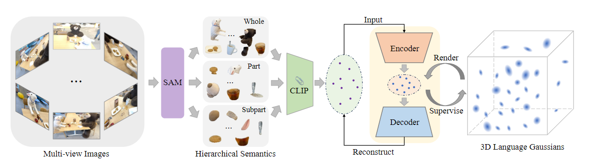

简单过一遍管线：

先将图片过SAM得到M个mask，mask盖住原始图像，提取每个mask对应物体的CLIP特征，再训练一个编码-解码器，将CLIP特征通过Encoder降维给GS训练，GS阿尔法合成出特征升维来进行查询。

关于motivation

- 使用SAM：因为CLIP提取的是图像级语义，这里需要像素级语义
- 使用编码解码器：内存、速度

# Feature 3DGS: Supercharging 3D Gaussian Splatting to Enable Distilled Feature Fields

2024 CVPR Highlight

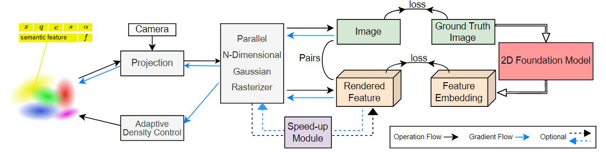

很常见的方法，这里高斯嵌入低维向量，通过卷积上采样回高维

pix-level特征采用Lseg而不是CLIP原始特征，还尝试了SAM特征

## CLIP-GS: CLIP-INFORMED GAUSSIAN SPLATTING FOR REAL-TIME AND VIEW-CONSISTENT3D SEMANTIC UNDERSTANDING

ECCV格式，还没中

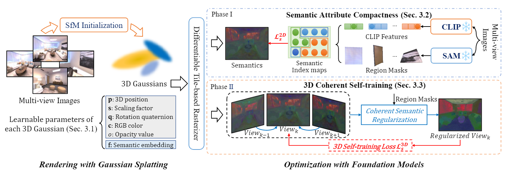

Phase I还是比较常见的，将CLIP特征通过SAM得到池化特征用以训练，

Phase II是将不同视角下的CLIP特征进行统一，通过视频跟踪模型标记SAM掩码的一致性，然后通过多数原则来选择相同物体的不同视角CLIP特征中最具有代表性的。

warm-up时用Phase I，之后用Phase II

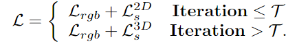

