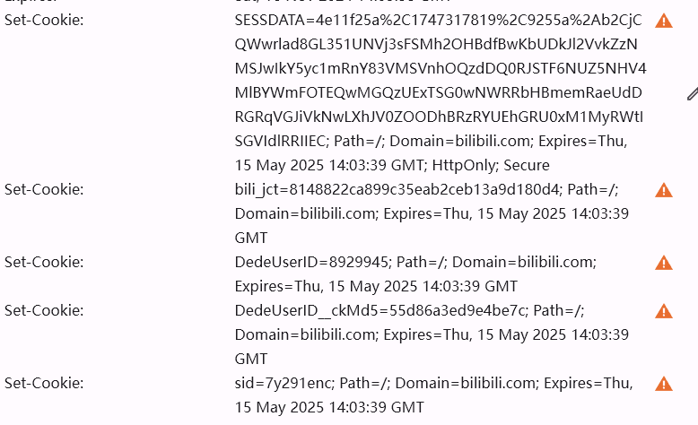
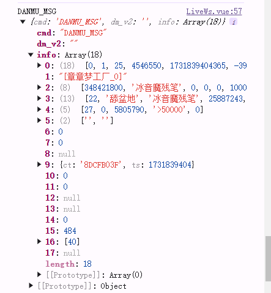
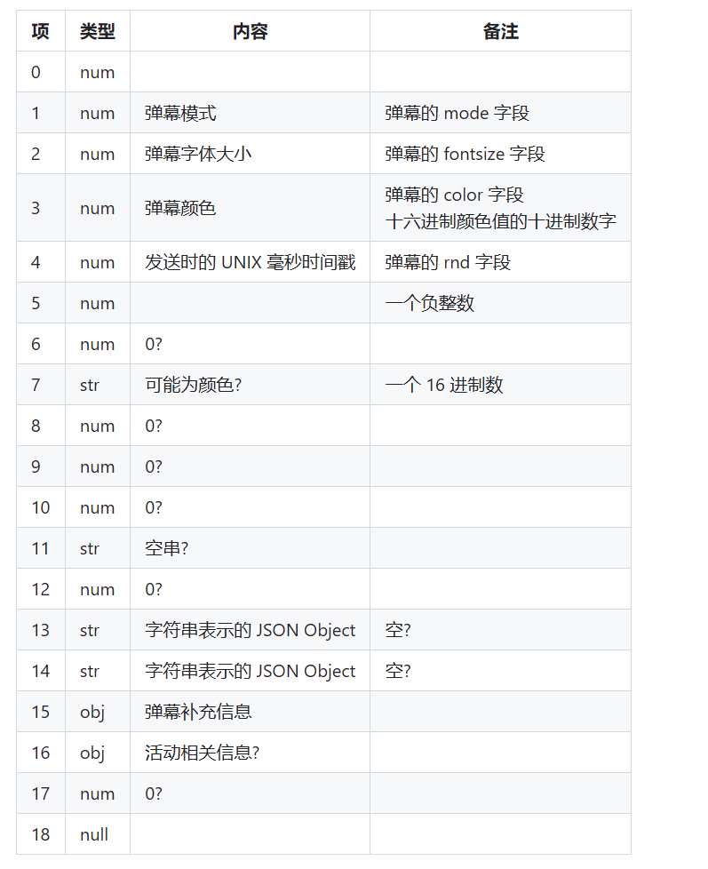
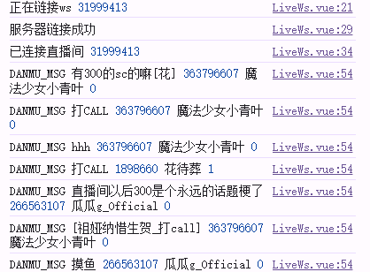
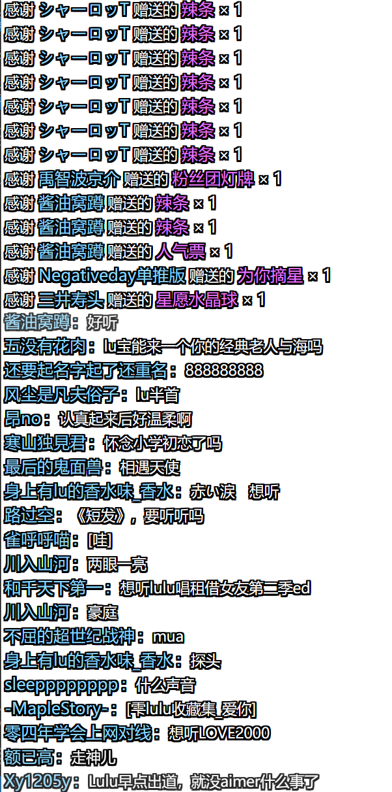
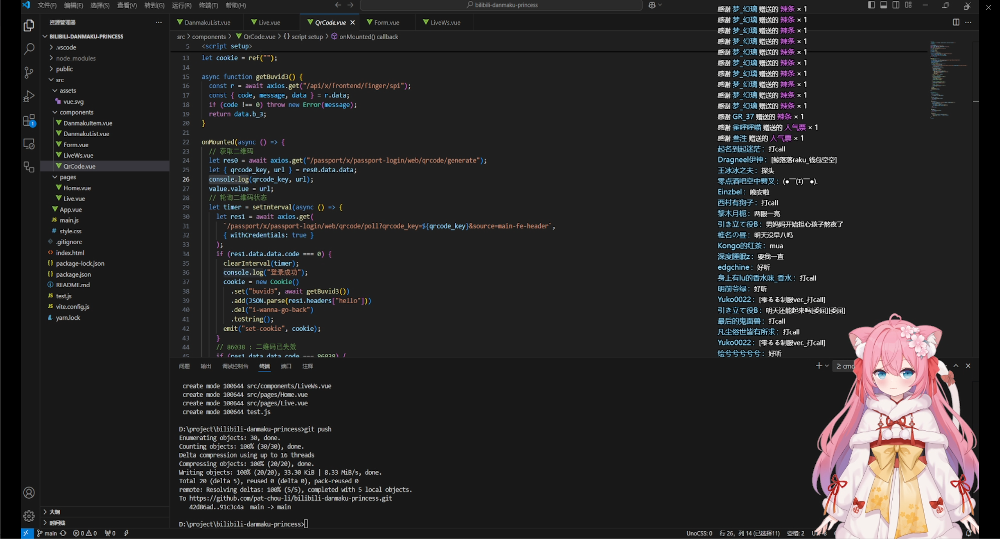

总之先找到所有bilibili 直播相关api

https://github.com/SocialSisterYi/bilibili-API-collect/tree/master

### QR Code

https://github.com/simon300000/bilibili-live-ws/issues/404

发现获取弹幕需要传cookie，每次都F12从b站拿当然不是程序员的风格啦，写一个扫码登录获取cookie的小应用吧。

要求cookie里至少携带buvid，以及登录时服务器返回的set-cookie里要求的值。

#### 申请二维码

根据api：

> https://passport.bilibili.com/x/passport-login/web/qrcode/generate

方法get，返回一个url和qrcode_key(查了一下，应该是一个绑定了时间戳、一些用户信息等等的hash，来唯一的标识一个二维码)

电脑上打开这个url看看，发现是一个登录界面（而且因为电脑上有登录状态，会出现一个手机扫完码之后的是否确认登录界面），猜测是需要手机打开这个界面就算完成扫码登陆，那么就需要将url转为二维码了。

需要一个vue3中能用的url-> QR Code组件，让手机能够扫返回的url，直接偷一个！

https://github.com/scopewu/qrcode.vue/blob/main/README-zh_cn.md

写好代码，配好跨域，惨遭403

```vue
<template>
  <qrcode-vue :value="url" :size="size" level="H" />
</template>

<script setup>
import QrcodeVue from "qrcode.vue";
import { ref, onMounted } from "vue";
import axios from "axios";
let url = ref("");
onMounted(async () => {
  let res = await axios.get("/api/x/passport-login/web/qrcode/generate");
  console.log(res);
});
</script>
```

查了查发现是bilibili的请求要求设置header，于是改一改vite的代理配置

```json
import { defineConfig } from "vite";
import vue from "@vitejs/plugin-vue";

// https://vite.dev/config/
export default defineConfig({
  plugins: [vue()],
  server: {
    proxy: {
      "/api": {
        target: "https://passport.bilibili.com",
        changeOrigin: true,
        rewrite: (path) => path.replace(/^\/api/, ""),
        headers: {
          Origin: "https://www.bilibili.com",
          Referer: "https://www.bilibili.com/",
        },
      },
    },
  },
});
```

顺利拿到二维码！

#### 轮询二维码

简单写个控制台轮询，用户体验什么的自己用就先不整了

```javascript
  let timer = setInterval(async () => {
    let res = await axios.get(
      `/api/x/passport-login/web/qrcode/poll?qrcode_key=${qrcode_key}`
    );
    console.log(res);
    if (res.data.data.code === 0) {
      clearInterval(timer);
      console.log("登录成功");
    }
    // 86038 : 二维码已失效
    if (res.data.data.code === 86038) {
      clearInterval(timer);
      console.log("二维码已失效");
      // 刷新页面来刷新二维码
      window.location.reload();
    }
    // 86090 : 扫描成功，未确认
    if (res.data.data.code === 86090) {
      console.log("扫描成功，未确认");
    }
    // 86101 : 未扫码
    if (res.data.data.code === 86101) {
      console.log("未扫码");
    }
  }, 1000);
```

#### 获得cookie

按文档中的格式要求，将cookie重整成string

```javascript
class Cookie {
  cookie = new Map();

  constructor(cookies) {
    if (cookies) this.add(cookies);
  }

  set(name, value) {
    this.cookie.set(name, value);
    return this;
  }

  add(cookies) {
    cookies.forEach((str) => {
      const [nv] = str.split(";");
      const [name, ...values] = nv.split("=");
      this.cookie.set(name, values.join("="));
    });
    return this;
  }

  del(name) {
    this.cookie.delete(name);
    return this;
  }

  toString() {
    return Array.from(this.cookie.entries())
      .map(([name, value]) => `${name}=${value}`)
      .join("; ");
  }
}
```

这里出现了个比较严重的问题，虽然返回的请求里有set-cookies，但是报错This attempt to set a cookie via Set-Cookie header was blocked because its Domain attribute was invalid with regards to the current host url.



主要是set-cookie里有一个domain=bilibili.com字段，导致set-cookie在本地不生效

通过设置proxy里的cookieDomainRewrite解决

```json
        cookieDomainRewrite: {
          "*": "",
        },
```

最起码客户端能通过set-cookie自动设置cookie了，但是……

结果还是没法在代码里拿到set-cookie，脑袋都大了，查了一些文档，觉得还是set-cookie默认无法被客户端读取（至少在某些设置下）更靠谱，不然httponly的cookie也随便读了，那这时候应该要上服务器了，用vite做个代理

```json
        configure: (proxy) => {
          proxy.on("proxyRes", (proxyRes) => {
            let setCookieHeaders = proxyRes.headers["set-cookie"];
            console.log(setCookieHeaders);
            if (setCookieHeaders) {
              proxyRes.headers["hello"] = JSON.stringify(setCookieHeaders);
            }
          });
        },
```

TODO：以后如果要部署的话，自己写个反向代理服务器吧，开发模式的feature越来越多了

千辛万苦，终于拿到cookie了，把它放在form里准备获得弹幕吧

emit props组件传值就省略吧

### WebSocket

首先要通过query将QR code获得的cookie设置到浏览器的cookie里，然后通过withCredentials发送cookie。

```javascript
let cookieMap = metaOptions.cookie.split("; ").reduce((acc, cur) => {
  const [key, value] = cur.split("=");
  acc[key.trim()] = value;
  return acc;
}, {});

for (let item in cookieMap) {
  document.cookie = `${item}=${cookieMap[item]};`;
}
```

> 这里有一个潜在的问题，sessdata这个cookie是httponly的，我们手动设置的并不是，不知道会不会出问题。如果会的话应该又需要代理服务器来发送cookie了

然后就是调用两个api获得房间号（当然这个本来就有）、主播uid、websocket链接地址，房间token（信息流认证秘钥）

接下来就是链接websocket了，用别人封装好的

https://github.com/simon300000/bilibili-live-ws

文档不是很齐全，还是要参考b站的api

https://github.com/lovelyyoshino/Bilibili-Live-API/blob/master/API.WebSocket.md

用DANMU_MSG的消息为例，分析一下发过来的包

再附加一个不完全接口文档：https://github.com/SocialSisterYi/bilibili-API-collect/blob/e5fbfed42807605115c6a9b96447f6328ca263c5/docs/live/message_stream.md





总之我们想要的信息有：message，uid（用来判断是不是房管、主播，要调样式颜色），uname，分析以上包得到以下代码

```javascript
  live.on(
    "DANMU_MSG",
    ({ info: [, message, [uid, uname, isOwner]], dm_v2 }) => {
      console.log("DANMU_MSG", message, uid, uname, isOwner, dm_v2);
    }
  );
```



基本完成！接下来就是写样式啦

### 滚动列表（应该算一种简易虚拟列表）

先观察弹幕姬需要什么功能

- 平滑滚动的弹幕，弹幕从底部开始出现，超过容器高度的弹幕隐藏并删除
- 平滑滚动的gift，弹幕从顶部出现，从下面插入，相同的滚动方式只不过出现的位置不一样

首先我们抽象一个一条弹幕的组件，即弹幕item，它应该持有以下信息

```javascript
defineProps({
  type: {
    type: String,
    default: "message",
  },
  showFace: Boolean, // 留来扩展显示头像
  face: String,
  uid: Number,
  uname: String,
  message: String,
  isAnchor: Boolean,
  isOwner: Boolean,
  giftName: String,
  num: Number,
  hidden: Boolean, // 用来标记这个弹幕是否应该消失，放在参数里是留来扩展禁止block用户弹幕的功能，目前用不上传参
});
```

它应该是一个渲染组件，不应该造成任何副作用，对于弹幕item的显示、隐藏和删除，放到itemList组件去做

首先目标效果是：40%的上半用来放礼物，下面的60%用来放弹幕

#### 不可见弹幕判定和删除

核心思想就是获得item是否超过了itemList的顶部，可以利用到getBoudingClientRect，以及vue3中的模版引用，注意:ref中的el是模版实例，再通过$el访问这个组件实例的根dom

然后由于这个函数执行的时候还可能还有挂载，用一下可选链判定，这里还是采用轮询的方式，每100秒从头（也就是最顶部的弹幕）遍历数组，标记并删除不可见弹幕

```javascript
onMounted(() => {
  const topOfList = danmakuListRef.value.getBoundingClientRect().top;
  const removeInvisibleDanmaku = () => {
    const i = danmakuList.value.findIndex((item) => {
      const { top = topOfList } =
        item.el?.$el?.getBoundingClientRect().top ?? {};
      if (top < topOfList) item.hidden = true;
      return top > topOfList;
    });
    const danmakuInterval = setInterval(removeInvisibleDanmaku, 100);
    onBeforeUnmount(() => clearInterval(danmakuInterval));
  };
});

// 在template中，使用:ref来给List添加模版引用
<div class="danmaku-list absolute" ref="giftListref">
  <danmaku-item
    v-for="item in danmakuList"
    :key="item.key"
    v-bind="item.props"
    :hidden="item.hidden"
    :ref="(el) => (item.el = el)"
  />
</div>
```

#### 滚动实现

先理清要做的东西

- 需要一个danmakuList以v-for给danmakuItem组件传递数据，控制渲染，因此我们需要拥有对danmakuList的操作能力，即addDanmaku和定期的隐藏且删除不需要的弹幕
- 要完成自动滚动，且一开始的弹幕处于下方

addDanmaku很简单，我们向弹幕queue中添加一项，同时传入danmakuItem所需要的props即可，另外附加key，el，hidden用户控制弹幕显示和滚动。为什么不直接向List添加而是使用一个queue下面会讲述

```javascript
const addDanmaku = (danmaku) => {
  danmakuQueue.push({
    props: danmaku,
    key: uuid(),
    el: null,
    hidden: false,
  });
};
```

对于从底部出现的弹幕，我们需要先用一个占位div占住所有空间，overflow设为hidden避免出现滚动条，同时我们在代码中手动的将弹幕滚到最下方，先实现一下滚动到最下方的代码：

```javascript
  // 滚动到最底部，显示最新弹幕
  const scrollList = () => {
    const el = unref(props.isGiftList ? giftListRef : danmakuListRef);
    if (el) el.scrollTop = el.scrollHeight;
  };
```

当然，我们需要在dom更新之后再滚动到最下方，因此会用到nextTick。

我们用danmakuList来控制渲染，但并不想直接将弹幕丢进List，而是使用一个队列进行缓冲，不然在弹幕量极多的时候会频繁渲染，用户会看不清且影响性能。

```javascript
// 弹幕队列，用来管理请求回来但是未渲染的弹幕，避免频繁渲染
const danmakuQueue = [];
const handleDanmakuQueue = () => {
  let sleep = 200;
  const { length } = danmakuQueue;
  if (length > 0) {
    sleep = Math.min(sleep, 1000 / length);
    danmakuList.value.push(danmakuQueue.shift());
    nextTick(scrollList);
  }
  setTimeout(handleDanmakuQueue, sleep);
};
handleDanmakuQueue();
```

然后自定义样式，把弹幕以外的（礼物、sc）的websocket通信补上就好啦，最终效果大概是：



复制导进obs！


