## html

### html语义化标签

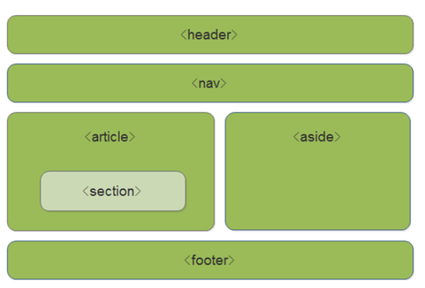

- Header：介绍性内容，一般是标题，也可能是Logo，搜索框等
- nav：导航，表示菜单、目录、索引等
- article：表示一块相对独立的内容，比如整篇博文，整个评论区
- section：一个小节，比如博文中的每一章节
- aside：与主要内容没什么关系的元素，一般表现为侧边栏，比如广告就会放到侧边
- footer：其最近的祖先[分段内容](https://developer.mozilla.org/zh-CN/docs/Web/HTML/Content_categories#分段内容)的页脚或[分段根](https://developer.mozilla.org/zh-CN/docs/Web/HTML/Element/Heading_Elements#标注章节内容)元素。`<footer>` 通常包含有关该部分**作者、版权数据**或相关文档链接的信息。
  - 就是页面根元素或者是某个article，section的页脚，一般会包含版权所有、作者等等

### src和herf

src用来指向外部资源，img，video，audio，script等等，加载的时候会阻塞渲染，并等到加载、编译、执行完毕。

css用来建立文档和引用资源之间的联系，如css和a，不会暂停其他资源的下载

### script标签的defer和async属性

下载都会下载

不加任何标签，html解析立刻阻塞，等待下载和执行

defer是推迟，等html解析完再执行script

async是异步，下载后再执行，会阻塞解析

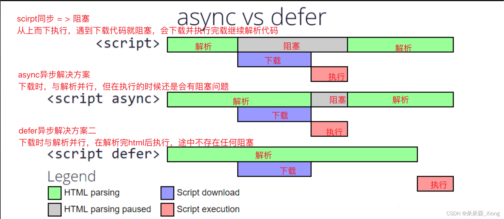

### meta

元标签，用来描述HTML文本本身，如charset编码类型，description页面描述

viewport服务于移动端，可以设定是否允许缩放，页面初始宽高等(一般用数值/device-width(device-height))

还可以开启CSP， <meta http-equiv="Content-Security-Policy">

## javascript

### 原型

先记好以下几个概念

- 构造函数可以通过prototype访问原型
- 对象可以通过\__proto__访问原型
- 原型通过constructor访问构造函数

如下图：


要注意的是，

- 原型也是一个对象，因此Person.prototype也具有\_\_proto\_\_属性，指向的是Object.prototype，而不是Object，因为\_\_proto\_\_要指向原型对象而不是一个构造函数。

- 那么拿出一个对象，就可以用\_\_proto\_\_访问原型对象，然后再用\_\_proto\_\_访问原型对象的原型对象……，一直这样下去，直到Object.prototype.\_\_proto\_\_为null（即Object的原型对象是最后一个原型对象，它不再有原型）
- 函数也是一个对象，所以函数不仅有prototype，也有\_\_proto\_\_,它指向Function.prototype，那么就有一个特殊的函数，Function本身，它的prototype和\_\_proto\_\_指向同一个地址

Q3 ： new一个对象的时候，发生了什么？

- 先创建一个对象obj
- 将obj的原型指向构造函数的原型
- 将构造函数的this指向该对象，执行构造函数
- 返回

怎么实现基于原型的继承？

子类的__proto__设为父类的**实例**，如果设为父类的原型就跳过了父类本身，没法访问到父类的属性和方法

原型继承方法的缺陷？

- 子类所有实例共享一个父类实例作为原型，如果修改了父类上的属性，则所有子类都会受到影响
- 无法调用父类的构造函数，因为在创建子类的时候就已经实例化了父类。

### 拷贝

浅拷贝：仅复制基本类型，对于引用类型复制其地址

- 直接赋值
- 使用扩展运算符

深拷贝：递归的复制所有层级，对于基本类型和引用类型都会创建完全独立的样本

- JSON.parse(JSON.stringify(obj))
  - 对于函数、undefined和symbol都无法正确处理，函数、symbol、undefined在stringify时会被忽略，undefined会忽略，正则、日期会被转为字符串，反序列化后变成了字符串而丢失了对象属性

个人理解：深拷贝一个很重要的特点是，拷贝后的副本和原来的对象之间是没有任何引用关系的

### 箭头函数

- 没有this，如果在里面用this，用的就是外层的this

  ```javascript
  function foo() {
    setTimeout(() => {
      console.log('id:', this.id);
    }, 100);
  }
  
  // ES5
  // 箭头函数里面根本没有自己的 this，而是引用外层的 this
  function foo() {
    var _this = this;
  
    setTimeout(function () {
      console.log('id:', _this.id);
    }, 100);
  }
  ```

- 没有arguments，想读参数只能用rest去拿，如果你用arguments，那就是在访问外层的arguments
- 不能用new，不能当做构造函数（即没有[[constructor]]特性），也没有原型，更没有super

### Promise

本身是一个构造函数，传入一个executor，如果异步操作成功就调用resolve(value)，promise的状态变为Fulfilled，于是进入后续的.then(value)，异步操作失败就调用reject(error)，状态变为rejected，就调用.catch(error)

- 还要注意，new Primise传入的(resolve, rejuct) => {}这个函数是**立即执行**，也就是同步的，并不会放进事件循环。

```javascript
const promise = new Promise((resolve,reject) => {
  if (/* 异步操作成功 */){
    resolve(value);
  } else {
    reject(error);
  }
})

promise.then(function(value) {
  // success
}, function(error) {
  // failure
});
```

可以将Promise装进一个可迭代对象（如数组），就可以调用一些Promise方法

- Promise.all(iterable)，这个函数会产生一个特殊的promise对象pALL，要iterable里所有的promise都进入fulfilled状态，才会成功，并且.then(value)里的value是一个数组，即所有promise成功后的value.

#### then方法里的回调函数应该返回什么，链式调用的新promise到底是什么？

promise在状态变为resolve时，会执行给then传递的第一个callback，那么这个callback的返回值其实就是.then()的返回值，但由于必须要返回一个promise进行链式调用，所以如果这个callback没有返回promise，而是返回一个普通值，就会被包装成一个已经fullfied的promise，来保证能够进行链式调用。

```javascript
const asyncTask = () => new Promise((resolve) => {
    setTimeout(() => resolve('Task Complete'), 1000);
});

asyncTask()
  .then(result => {
      console.log(result);  // 输出 'Task Complete'
      return 'New Value';   // 返回普通值
  })
  .then(result => {
      console.log(result);  // 输出 'New Value'
  });
```

在这个例子中，第二个 `.then()` 的回调函数返回了一个普通值 `'New Value'`，但 JavaScript 会自动将其包装为一个 `Promise.resolve('New Value')`，使得链式调用继续进行。

这里也可以学习到promise.prototype上的两个方法，用来构造一个成功的promise或失败的promise

- Promise.resolve(value)
- Promise.reject(reason)

自然，.then和.catch的回调可以接收到value或reason

#### 一些输出题

```javascript
Promise.resolve(1)
  .then(2)
  .then(Promise.resolve(3))
  .then(console.log)
```

输出1，.then方法里接受两个参数（onFullfiled,onRjected），如果不传函数就直接忽略这个.then，因此1直接传递到了最后一个.then，onFullfiled会自动接受promise resolve的参数

```
Promise.resolve(1)
  .then(res => {
    console.log(res);
    return 2;
  })
  .catch(err => {
    return 3;
  })
  .then(res => {
    console.log(res);
  });
```

同样的，catch的条件没有触发（即对应的promise进入resolve），也是相当于跳过

### Generator

用function与函数名之间的*来声明一个generator

每次调用.next(),都会执行到遇到yield为止，并将yiled表达式右边的表达式执行，得到其返回结果作为value。

```javascript
var fetch = require("node-fetch");

function* gen() {
  var r1 = yield fetch("https://api.github.com/users/github");
  var r2 = yield fetch("https://api.github.com/users/github/followers");
  var r3 = yield fetch("https://api.github.com/users/github/repos");
}

// 利用递归封装一个多个异步任务执行函数
function run(gen) {
  var g = gen();

  function next(data) {
    var result = g.next(data);

    if (result.done) return;

    // 执行 g.next()，yield 返回的是一个 Promise 对象。
    // 给这个 Promise 对象添加 then 方法，当异步操作成功时执行 then 中的 onFullfilled 函数，
    // onFullfilled 函数中又去执行 g.next，从而让 Generator 继续执行，然后再返回一个 Promise，
    // 再在成功时执行 g.next，然后再返回……
    result.value
      .then(function(data) {
        return data.json();
      })
      .then(function(data) {
        next(data);
      });
  }

  next();
}

// 执行多个异步任务
run(gen);
```

### Async await

async声明异步函数后才能使用await，async函数一定返回一个promise

- await一般跟在promise前，如果该promise resolve，接收promise的value，即resolve(value)的value，也相当于then(res)的res，如果跟在普通表达式（而不是promise）前，则立即执行（相当于new Promise），后面的内容变为.then()的内容，还是会阻塞一下先去执行同步的代码，再回来执行await下方的代码（但是await右边的代码立即执行）
- 如果promise reject，会发出error，一般需要用try catch去接收。

### 事件循环、宏任务、微任务

什么是事件循环？按以下顺序说：

1. 主线程每次执行时，先看看要执行的是同步任务，还是异步的 API
2. 同步任务就继续执行，一直执行完
3. 遇到异步 API 就将它交给对应的异步线程（定时器触发线程、HTTP触发线程），自己继续执行同步任务
4. 异步线程执行异步 API，执行完后，将异步回调事件放入任务队列里
5. 主线程手上的同步任务干完后就来任务队列看看有没有任务
6. 主线程发现任务队列有任务，就取出里面的任务执行
7. 主线程不断循环上述流程

https://www.bilibili.com/video/BV1pz421a7Sw/?spm_id_from=333.788&vd_source=ce71a2f1e1066c1a06a275c367f0b4af

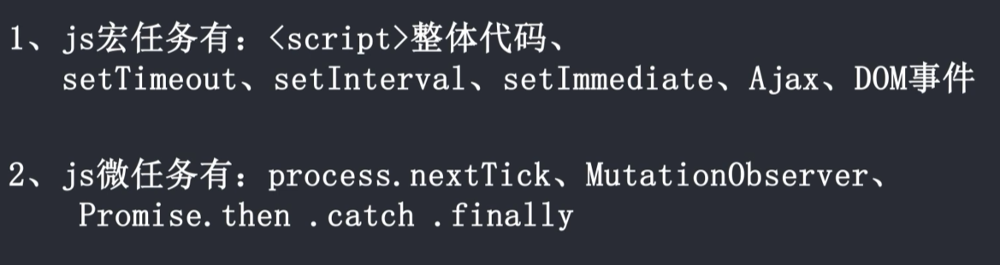

首先不要将宏任务和微任务看作同等级别的概念，实际上应该是一个宏任务具有一个微任务队列，平常所说的任务队列里实际上只包含宏任务，用下图表示：

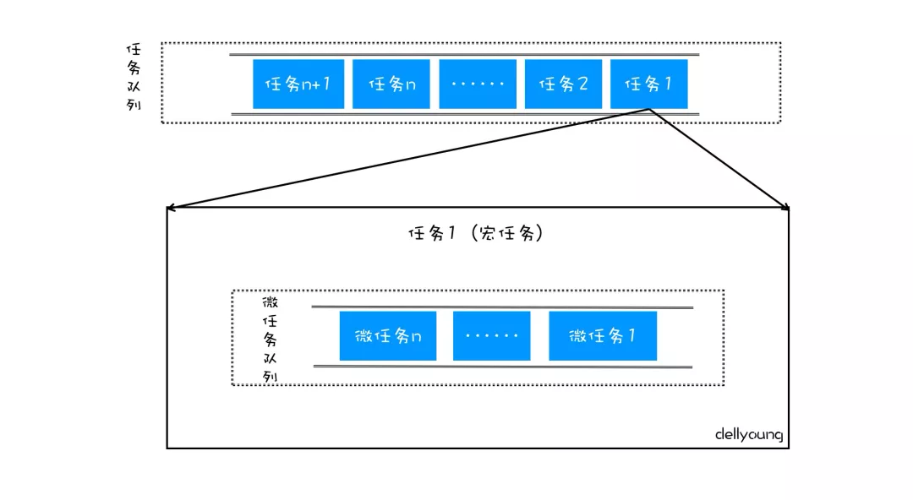

因此，可以这么理解，每次宏任务都会产生一堆微任务（以及为任务队列增加一些之后要执行的宏任务），然后要先把属于自己的微任务解决了，才能继续执行下一个宏任务。（当然，微任务产生的新的微任务也要在这轮宏任务中执行掉，才能去下一个宏任务）

具体来说：

- 任务队列中的任务都是宏观任务
- 每个宏观任务都有一个自己的微任务队列
- 微任务在当前宏任务中的 JavaScript 快执行完成时，也就在 V8 引擎准备退出全局执行上下文并清空调用栈的时候，V8 引擎会检查全局执行上下文中的微任务队列，然后按照顺序执行队列中的微任务。
- V8 引擎一直循环执行微任务队列中的任务，直到队列为空才算执行结束。也就是说在执行微任务过程中产生的新的微任务并不会推迟到下个宏任务中执行，而是在当前的宏任务中继续执行。

**macro-task 宏任务** 大概包括：

- script(整体代码)
- setTimeout
- setInterval
- setImmediate(Node 环境)
- I/O，事件队列
- UI render
- 用户交互（点击、输入）

**micro-task 微任务** 大概包括:

- process.nextTick(Node 环境)
- Promise.[ then/catch/finally ]
- Async/Await(实际就是 promise)
- queueMicrotask：专门用于创建微任务的 API
- MutationObserver(html5 新特性)
- requestAnimationFrame(有争议，处于渲染阶段，不在微任务队列，也不在宏任务队列)
- Object.observe(已废弃)

这里需要提一下setTimeout等函数，它们本身是同步代码，执行后它们的回调函数被放入一个**延迟任务队列**，一次宏任务执行结束后，检测延迟任务队列有没有**到期**的任务，有的话就将这些回调函数从延迟任务队列放进宏任务队列。（以上就是定时器触发线程做的事）

### WeakSet WeakMap

很少问，记住两个点

- WeakSet的值，WeakMap的键都是弱引用，也就是不会阻止他们引用的对象被垃圾回收，所以谁也不知道WeakSet和WeakMap里面的值是不是已经被垃圾回收了，也就不提供**迭代方法**，不能进行迭代，不提供size属性，不会内存泄漏。
- 场景：储存DOM节点，当这些节点从文档中被移除时，不用担心内存泄漏的问题。

### Proxy 和 Reflect

也问的比较少，总之是用来包装一些操作的，有点像HOC，它可以获取一个对象，修改他们的get方法，set方法等等，获得增加一些成员函数，来增强这个对象的功能，比如一个增强后的数组：

```javascript
function enhancedArray(arr) {
  return new Proxy(arr, {
    get(target, property, receiver) {
      const range = getRange(property);
      const indices = range ? range : getIndices(property);
      const values = indices.map(function (index) {
        const key = index < 0 ? String(target.length + index) : index;
        return Reflect.get(target, key, receiver);
      });
      return values.length === 1 ? values[0] : values;
    },
  });

  function getRange(str) {
    var [start, end] = str.split(":").map(Number);
    if (typeof end === "undefined") return false;

    let range = [];
    for (let i = start; i < end; i++) {
      range = range.concat(i);
    }
    return range;
  }

  function getIndices(str) {
    return str.split(",").map(Number);
  }
}
```

这样就支持负索引等：

```javascript
const arr = enhancedArray([1, 2, 3, 4, 5]);

console.log(arr[-1]); //=> 5
console.log(arr[[2, 4]]); //=> [ 3, 5 ]
console.log(arr[[2, -2, 1]]); //=> [ 3, 4, 2 ]
console.log(arr["2:4"]); //=> [ 3, 4]
console.log(arr["-2:3"]); //=> [ 4, 5, 1, 2, 3 ]

```

### let const var

- let const采用块级作用域，var采用函数作用域或全局作用域
- var存在变量提升，响应的let const是暂时性死区，访问会报错
- var在全局作用域下声明会挂载到全局对象上

### 执行上下文

分为全局、函数、eval，执行到对应的代码时会创建执行上下文，包含三个对象

- 变量对象：存储了上下文中定义的 **变量** 和 **函数声明**。全局作用域中是window，函数作用域中除了变量和函数声明外，还包含了函数形参。
- 作用域链：从**当前执行上下文开始的变量对象**开始的链表结构，以**全局上下文的变量对象**结束，可以查找这之间的所有变量对象。所以作用域链的每个结点就是变量对象
- this:
  - 对象调用的函数，指向对象
  - 直接调用的函数，指向全局对象
  - 构造函数中，指向被构造的对象
  - 箭头函数，直接看定义时的外层，箭头函数没有this

### this指向

先搞明白一个问题，obj里面直接调用this的话指向哪里？

```javascript
var a = 10;
var obj = {
  a: 20,
  b: this.a,
}
console.log(obj.b)
// 10
```

其实this并不指向obj的，而是指向全局的a，对象的声明不生成新的this指向。

所以对象里声明的箭头函数的this也是指向全局上下文的

```javascript
var x = 3;
var y = 4;
var obj = {
    x: 1,
    y: 6,
    getX: function() {
        var x = 5;
        return function() {
            return this.x;
        }();
    },
    getY: function() {
        var y = 7;
        return this.y;
    }
}
console.log(obj.getX()) // 3
console.log(obj.getY()) // 6
```

立即执行函数（匿名函数）里的this也指向全局

```javascript
function foo(something){
    this.a = something
}

var obj1 = {}

var bar = foo.bind(obj1);
bar(2);
console.log(obj1.a); // 2

var baz = new bar(3);
console.log(obj1.a); // 2
console.log(baz.a); // 3
```

new函数也会改变this指向，即使之前用bind显式绑定，

this绑定的优先级：new绑定 > 显式绑定 > 隐式绑定 > 默认绑定。

### call， apply， bind

第一个参数都是this指向的对象，第二个参数，apply是以数组形式传形参，其他则是依次传入各个参数

### 事件捕获，事件冒泡

element.addEventListener(event, function, useCapture)

自动就会触发事件冒泡，如果要触发事件捕获要让useCapture为true

e.stopPropagation会阻止捕获和冒泡

捕获是指从根元素起到触发事件的元素，如果都启用，顺序是捕获->目标->冒泡

### 判断元素进入可视区域

方法1：

dom.getBoudingClientRect可以获得某个元素到当前视口的距离，top表示元素顶部到视口顶部的距离，bottom表示元素底部到视口顶部的距离。

window.innerHTMLHeight可以得到viewport的高度，当bottom > 0（元素底部碰到视窗顶部，即将出去了）且top<=window.innerHTMLHeight(刚从视口下方出现，到视口上方的距离正好等于视口高度)的时候就是可视的

方法2：

用document.documentElement获取HTML，访问scrollTop属性得到滚动条滚了多少，再用dom.offsetTop得到对应dom元素距离文档顶部的距离，如果滚动距离+window.innerHeight的距离>dom.offsetTop，就说明出现了

### 防抖节流

防抖的应用场景：搜索框，文档自动保存，表单验证（正确的用户名，未完整填写等）

节流的应用场景：滚动事件，视频进度条（1s更新一次）等

### 手写柯里化

```javascript
function curry(fn, arr) {
  arr = arr || []; // 初始化arr
  let targetLength = fn.length;
  return function (...args) {
    let newArr = arr.concat(args); // 避免副作用，直接使用arr拼接的话会导致这个柯里化出来的函数只能用一次，第二次arr里会本来就有东西
    if (newArr.length >= targetLength) {
      return fn.apply(this, newArr);
    } else {
      return curry.call(this, fn, newArr);
    }
  };
}

```

### Object和Map的区别

1、Object的key只能是字符串或symbol，map的key比较自由

2、Object的key是无序的，map的key按插入顺序排序（所以都是可以用xx.keys()来获得一个key数组的，当然也有xx.entrys,xx.values）

### 垃圾回收

标记清除（mark and sweep）。

大部分浏览器以此方式进行垃圾回收，当变量进入执行环境（函数中声明变量,执行时）的时候，垃圾回收器将其标记为“进入环境”，当变量离开环境的时候（函数执行结束）将其标记为“离开环境”，在离开环境之后还有的变量则是需要被删除的变量。标记方式不定，可以是某个特殊位的反转或维护一个列表等。

垃圾收集器给内存中的所有变量都加上标记，然后去掉环境中的变量以及被环境中的变量引用的变量的标记。在此之后再被加上的标记的变量即为需要回收的变量，因为环境中的变量已经无法访问到这些变量。

## CSS

### 继承属性

文字类的都会继承

`color`：文本颜色

`font-family`：字体系列

`font-size`：字体大小

`font-style`：字体样式（如斜体）

`font-weight`：字体粗细

`text-align`：文本对齐方式

光标也会

`cursor`：鼠标指针样式

还有控制显示的

`visibility`：元素的可见性（`visible`、`hidden`）

`opacity`：透明度

### 文本换行和省略

white-space：控制换行和空白怎么处理，有以下属性

1. normal：默认值，文本自动换行，连续的空白符会被合并成一个空格。
2. nowrap：强制文本不换行，不考虑容器宽度，连续的空白符会被合并成一个空格。
3. pre：保留源代码中的换行和空白符，不自动换行。
4. pre-wrap：保留源代码中的换行和空白符，但允许文本自动换行。
5. pre-line：合并连续的空白符，但保留源代码中的换行符，允许文本自动换行。

text-overflow 属性用于定义文本溢出时的处理方式。它有以下几个可选值：

1. clip：直接裁剪文本，不显示溢出部分。
2. ellipsis：在溢出部分显示省略号。
3. string：用户自定义溢出部分要变成什么字符串。

要让text-overflow生效，首先要让overflow：hidden，不然溢出的文字还是visible是无效的

### 一些不常用的选择器、以及伪类、伪元素

https://www.yuque.com/cuggz/feplus/kmp9etgov1sgbm6u

相邻选择器，子选择器，通用兄弟选择器，猫头鹰选择器，属性选择器

属性选择器可以关注一下：

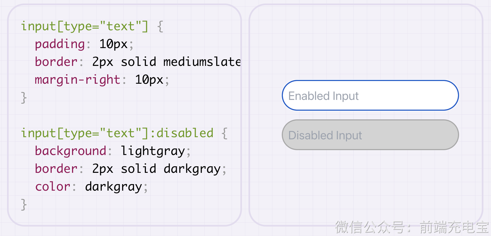

#### 伪元素

选择某个元素的特定部分

- ::before , ::after 在元素前、后配合content添加内容
- ::first-letter首字母，::first-line首行

#### 伪类

选择某个元素的状态

hover，first-child等，不会产生新的元素，而是选择已有元素的某种状态

### 规则

主要记一下@media @keyframe @import

https://www.yuque.com/cuggz/feplus/bugqzvsw42ekiy84

### 选择器优先级

- 10000：!important；
- 01000：内联样式；
- 00100：ID 选择器；
- 00010：类选择器、伪类选择器、属性选择器；
- 00001：元素选择器、伪元素选择器；
- 00000：通配选择器(*)、后代选择器、兄弟选择器；（容易误解，可以不记这行）

即使超过10个也不会覆盖掉左边的优先级，例如

```css
div{
    color : red;
}

#id {
    color : green;
}

.class1.class2.class3.class4.class5.class6.class7.class8.class9.class10.class11 {
    color : blue;
}
```

还是id生效

### inline和inline-block

https://juejin.cn/post/6941206439624966152#heading-40

**block**

- **占满一行**，默认继承父元素的宽度；多个块元素将从上到下进行排列；
- 设置 width/height 将会生效；
- 设置 padding 和 margin 将会生效；

**inline**

- **不会占满一行**，宽度随着内容而变化；多个 inline 元素将按照从左到右的顺序在一行里排列显示，如果一行显示不下，则自动换行；
- 设置 width/height 将不会生效；
- 设置竖直方向上的 padding 和 margin 将不会生效；

**inline-block**

- 是行内块元素，**不单独占满一行**，可以看成是能够在一行里进行左右排列的块元素；
- 设置 width/height 将会生效；
- 设置 padding 和 margin 将会生效；

### 盒模型

标准盒模型box-sizing : content-box

设置的width和height是内容的width和height，实际尺寸=width+border+padding

IE盒模型 box-sizing : border-box

设置的width和height是实际尺寸的width和height，内容宽高=width-padding-border

> 注意注意，以上公式都不会涉及`margin`, mdn中有这一句话：
>
> 外边距不计入盒子的实际大小——当然，它影响盒子在页面上所占的总空间，但只影响盒子外的空间。盒子的面积止于边框，不会延伸到外边距中。
>
> 其实还是挺符合直觉的，外边距并不是盒子的一部分，而是描述了一种布局。也可以解释margin合并的问题，上下两个外边距100px融合了，你就说符不符合你所声明的100px外边距的需求吧。

### BFC和IFC

#### BFC

BFC ： 块格式上下文，一个独立的渲染区域，只有块级box参与，BFC规定了内部的块级如何布局（从上到下排列），并且BFC区域和外部区域毫不相干

- 与外部区域毫不相干，
  - 意味着可以避免margin塌陷（例如，上下两个div的margin都是100px，就会合并margin，若是将其中一个div变为BFC，则会出现200px的间距）
  - 意味着也会与浮动元素不相交，这样可以保证浮动元素不叠在BFC上，也可以利用这点完成自适应双栏布局，浮动元素固定大小放左边，BFC放右边，块元素会自动填满一栏
- BFC计算父元素高度时，会计算浮动元素的高度，因此可以避免浮动带来的父元素塌陷

##### 创建方式

- 根元素：html

- 非溢出的可见元素：overflow 不为 visible

- 设置浮动：float 属性不为 none

- 设置定位：position 为 absolute 或 fixed

- 除了block以外，被display定义为块级元素：display: inline-block/table-cell/table-caption/flex/inline-flex/grid/inline-grid

#### IFC

如果一个块仅仅包含行内元素，就会产生一个IFC，或者设置块为inline，inline-block也会产生IFC

inline-block的块可以设置为text-align : center来达成水平居中

### Z-INDEX

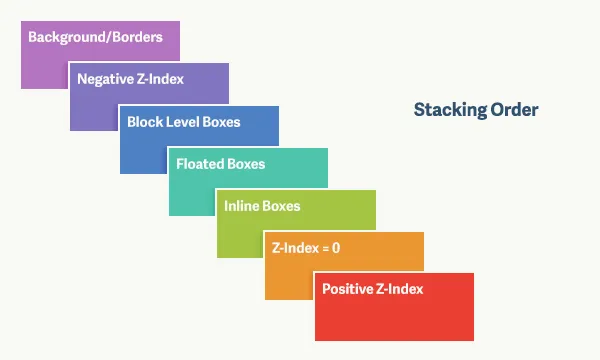

背景->负z-index->块元素->浮动元素->行内元素->正z-index

### 清除浮动

利用CSS的clear属性：它能保证一个元素不出现在浮动元素的旁边，即：

**`clear: left;`**：禁止元素在其左侧浮动元素旁边显示，元素将位于其左侧浮动元素的下方。

**`clear: right;`**：禁止元素在其右侧浮动元素旁边显示，元素将位于其右侧浮动元素的下方。

**`clear: both;`**：禁止元素在其左右两侧的浮动元素旁边显示，元素将位于所有浮动元素的下方。

**`clear: none;`**：默认值，允许元素在浮动元素旁边显示。

于是我们在浮动的父元素后增加一个after伪元素，使用clear保证它只能出现在浮动元素下方，又由于它是块元素，所以父容器的高度就被撑起来了。

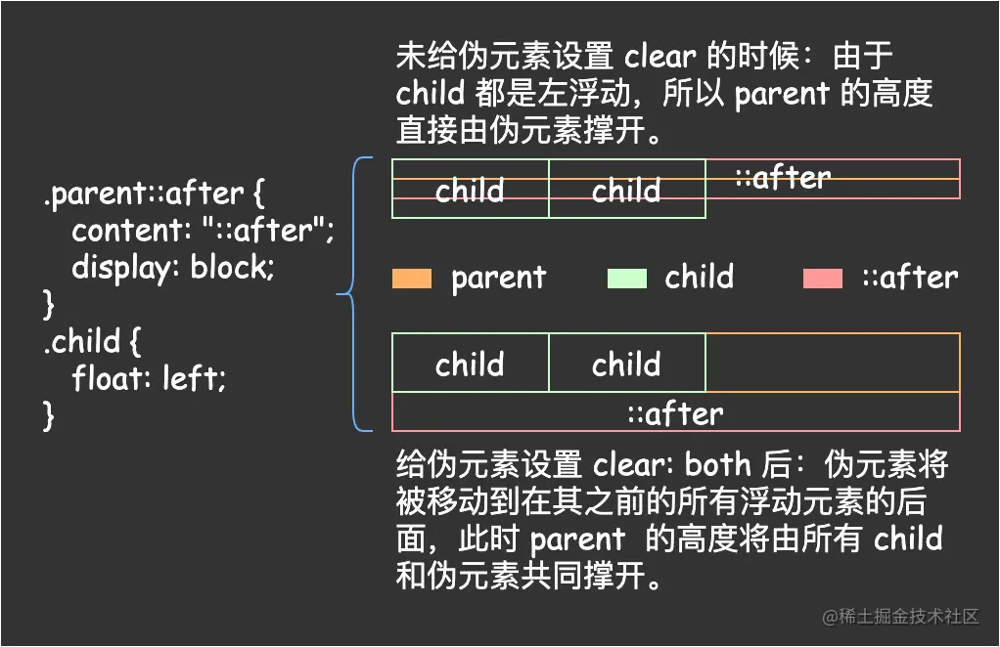

### flex : 1

#### flex

#### flex-grow

flex-grow 属性定义子元素的放大比例，默认值为0，即如果存在剩余空间，也不放大。

如果所有子元素的 flex-grow 属性都为 1，如果存在剩余空间，则它们将等分剩余空间。 如果一个子元素的 flex-grow 属性为 2，其他子元素为1，则它占据的剩余空间将比其他项多一倍

#### [#](https://jonny-wei.github.io/blog/base/css/css-layout.html#flex-shrink)flex-shrink

flex-shrink 属性定义了子元素的缩小比例，默认为1，即如果空间不足，子元素将缩小。

如果所有子元素的 flex-shrink 属性都为1，当空间不足时，都将等比例缩小。 如果一个子元素的 flex-shrink 属性为0，其他项目都为1，则空间不足时，前者不缩小。 负值对该属性无效。

#### [#](https://jonny-wei.github.io/blog/base/css/css-layout.html#flex-basis)flex-basis

flex-basis 属性定义了在分配多余空间之前，项目占据的主轴空间（main size）。 浏览器根据这个属性，计算主轴是否有多余空间。它的默认值为 auto，即子元素的本来大小。 如果设置成像 width 或 height 属性一样的值，则子元素将占据固定空间。

> 如果是auto：就是元素本身宽度
>
> 如果设置了flex-basis：width属性将被忽略

flex 属性是 flex-grow，flex-shrink 和 flex-basis 的缩写

flex: 0 1 auto 默认值取上面三个属性的默认值

注意

该属性有以下快捷设置:

- flex: 0 1 auto (默认值)
- flex: auto (1 1 auto)
- flex: none (0 0 auto)
- flex: 1 (1 1 0%)[取非负数字]
- flex: 0% (1 1 0%)[取百分比]
- flex: 24px (1 1 24px)[取长度]

建议优先使用这个属性，而不是单独写三个分离的属性，因为浏览器会推算相关值

flex 1 : 1 1 0，元素会自动放大，自动缩小，同时width属性将被忽略，宽度由flex计算决定，flex auto只有flex-basis不同，会保留宽度计算剩余空间

### em、rem

em：相对于父元素的font-size的倍数

rem：相对于根元素的font-size 的倍数

### transform

```css
transform : translte(50%, 50%)
```

这里的50%是相对于自身的，而设定absolute等属性的相对是相对于父亲

### 样式隔离

- BEM：命名规范，block_element_modify，比如一个按钮，里面有一个icon，然后有几种不同的状态（危险、安全），就命名成button___icon---primary
- CSS Module：将css模块化，通过import.css的方式使用css，对于局部，也就是该组件下的css类名映射成哈希，从而避免样式污染

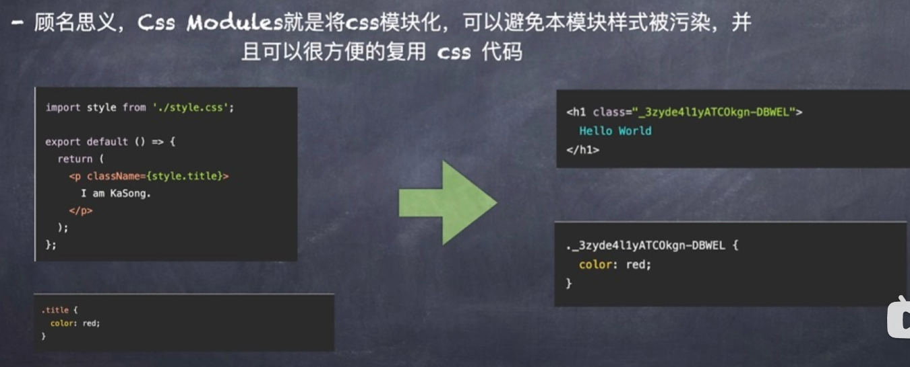

- vue scoped：为组件标签增加一个属性，然后为css选择器增加属性选择器来选择元素

## Vue

### v-if vs. v-show

`v-if` 是“真实的”按条件渲染，因为它确保了在切换时，条件区块内的事件监听器和子组件都会被销毁与重建。

`v-if` 也是**惰性**的：如果在初次渲染时条件值为 false，则不会做任何事。条件区块只有当条件首次变为 true 时才被渲染。

相比之下，`v-show` 简单许多，元素无论初始条件如何，始终会被渲染，只有 CSS `display` 属性会被切换。

总的来说，`v-if` 有更高的切换开销，而 `v-show` 有更高的初始渲染开销。因此，如果需要频繁切换，则使用 `v-show` 较好；如果在运行时绑定条件很少改变，则 `v-if` 会更合适。

### v-if 和 v-for

不推荐一起用，v-if优先于v-for，这会导致v-if无法获得v-for绑定的数据，推荐写法是用多些一个外层template绑定v-for，或者将v-for依赖的数组改为计算属性，filter出需要渲染的元素。

### 生命周期

- setup：组件创建时

- onBeforeMount: 在组件被挂载之前被调用

- onMounted: 在组件挂载完成后执行

- onBeforeUpdate: 在组件即将因为响应式状态变更而更新其 DOM 树之前调用。

- onUpdate : 在组件因为响应式状态变更而更新其 DOM 树之后调用。

  > 和nextTick的区别？如果要在某个特定dom更新后获得状态使用nextTick，因为nextTick可以写在这个dom更新后，而onUpadte会监听所有dom的更新并执行回调。

- onBeforeUnmount  : 在组件实例被卸载之前调用
- onUnmounted : 在组件实例被卸载之后调用。可以在这个钩子中手动清理一些副作用，例如计时器、DOM 事件监听器或者与服务器的连接。

不常用的

- onRenderTracked() ： 当组件渲染过程中追踪到响应式依赖时调用
- onRenderTriggered ： 当响应式依赖的变更触发了组件渲染时调用

more： 官方文档https://cn.vuejs.org/api/composition-api-lifecycle

### vue的响应式原理

what：

响应式指的是在vue3里，一个由ref或者reactive创建的对象，具有响应式，即他的更新，会通知所有依赖它的对象（比如vue中的虚拟dom，或者watch显式监听），同步的完成更新。

hot：

那么响应式是如何完成的呢，以vue3的reactive为例，主要是依靠proxy，返回一个重写了getter和setter的对象代理，在getter中完成依赖收集，将所有依赖这个属性的副作用作为订阅者放到一个Set中，在setter的时候就通知并执行这些副作用。

### 双向绑定原理

- 数据如何影响视图：响应式原理
- 视图如何影响数据：监听dom事件，addEventListener

### 虚拟dom、diff算法

TODO（目前就先理解成这样吧）

虚拟dom就是一个javascript对象，用来描述一个dom节点。

diff算法就是比较新老vdom的不同，只更新那些需要更新的节点。vue2采用双端diff算法，vue3采用快速diff算法。

### vue2和vue3的区别

- 响应式原理的区别
  - 对于对象（即vue3中的reactive）：vue2在实现响应式的时候，使用的是defineProperty，对于深层的对象属性需要迭代的去定义每层的getter和setter，也不能使用原生api来增加或者删除属性，在初始化的时候带来额外代价，而vue3直接使用proxy创建对象代理，从而拦截所有的属性变化。
  - 对于普通数据类型，vue3的ref采用以下伪代码，返回了一个对象，value是真实值，重写了该对象的getter和setter

```javascript
// 伪代码，不是真正的实现
const myRef = {
  _value: 0,
  get value() {
    track()
    return this._value
  },
  set value(newValue) {
    this._value = newValue
    trigger()
  }
}
```

> 简单来说，vue3的reactive使用proxy，ref返回一个对象，value是值，重写该对象的getter和setter
>
> vue2使用的是defineProperty

- diff算法的区别

- 新增了组合式api，便于同一块逻辑的代码整合
- 新增了Fragement，使得同一组件中不仅仅可以拥有一个root了
- 生命周期的区别，create删除，变为setup
- vue3中v-if的优先级高于v-for

### 路由模式

由于vue应用一般是SPA的，也就是单页面的，如果直接改变url进行路由跳转就会导致浏览器请求对应的html，所以需要用一些方法去修改url、加载组件但不重新加载页面。

- hash模式，在url的#后面写路径，在js中通过onHashChange切换组件显示来更换路由
- history模式，通过js的pushState来修改url但不重新加载页面（需要后端配置，不然会重新加载页面，但找不到对应的路径，从而导致404）

### slot

组件传值是比较常见的事情，但是如果想向组件中传递一个模版的话，就需要用到slot了。

对于默认slot，在子组件中用slot规定插槽出口，父组件中就直接往子组件的标签内写插槽内容。

对于具名slot，子组件的slot标签上写name，父组件用v-slot标记哪些是属于这个name的slot

#### 作用域插槽

作用域插槽也很好理解，插槽实际上是向子组件传递template，然后在子组件中使用这个template显示一块内容，那经常会有需要子组件的状态的情况，但是插槽的template又是在父组件中定义的，作用域插槽可以理解成一种子组件给父组件传值的一种方式，子组件中规定哪些属性需要暴露，父组件就可以引用这些属性。


## 项目

### websocket及相关知识点

- http的短轮询：设置一个定时器，每隔一定时间请求服务器获得状态
- http的长轮询：客户端发送请求后，服务端将请求挂起，直到有状态变动后将请求发回去，客户端有一个超时时间，如果超过了就再发送一个请求

Websocket的特点

- 全双工通信
- 可以发送文本或二进制
- 较少的控制开销，头部占用的字节较少，只有2(+4)~10(+4)字节，服务端发送的是2~10，客户端+4
- 没有跨域问题

1.虚拟列表（实现原理，列表元素状态改变如何解决，不定高度滚动，多行滚动，scroll监听缺陷，节流两种实现方法，intersectionobserver参数问题）

### 虚拟列表性能优化

- 对于不可变的list，可以使用markRaw来标记其不成为响应式对象

## 浏览器和计算机网络

### 总之先来个头部总览

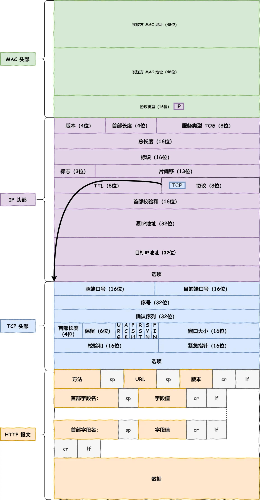

### 输入URL到显示页面发生了什么

- 输入URL，先解析一下是不是一个合法的URL，如果不是的话就转到搜索引擎。
- 随后进入缓存判断的阶段，浏览器会判断要请求的资源在不在本地缓存里，在而且没有过期就直接使用，否则向服务器发起新的请求
- 对URL进行DNS解析，先判断本地（浏览器、路由器）有没有这个ip地址的dns缓存，没有的话就递归地去问本地DNS服务器，如果本地DNS服务器也没有缓存，本地DNS服务器就会迭代地依次去问**根（就它不可能返回ip地址，而是只会返回顶级域名服务器的地址，另外两个，顶级可能有ip缓存，权威就是最后的结果）、顶级、权威**域名服务器。
- 拿到IP地址之后呢，要建立TCP链接，这里就经过了三次握手，然后通过HTTP协议请求对应页面的HTML
- 客户端拿到HTML后进行解析，开始页面渲染，先根据HTML和CSS构建DOM树和CSSOM树，如果遇到script标签就停止解析并加载执行，如果有async标签就下载后停止解析执行，defer标签就下载js但不阻塞解析，等到解析完成后再执行js脚本，到此页面就显示出来了

### 网络模型各层数据名

TCP / IP 四层模型

- 网络接口层：帧（frame）
- IP层：包（packet）
- 传输层：段（segment）
- 应用层：报文（message）

### MSS、MTU

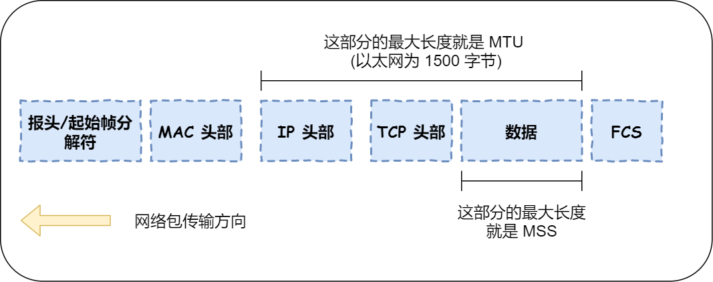

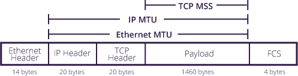

MSS：最大报文段长度，一个IP数据包去掉IP头部（20字节）和TCP头部（20字节）后的最大长度，所以一般是1460字节

MTU：一个IP数据包的最大长度，一般是1500字节

### 路由器和交换机

交换机是二层设备，有一个交换表，记录了每个mac地址应该从哪个端口转发出去，交换机除了转发什么也不做，也不会改变包的任何内容，不改变mac地址，因此**交换机的每个端口并没有自己的mac地址**。

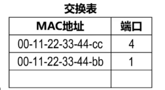

路由器是三层设备，持有ARP表，记录了IP地址和MAC地址的映射，路由器的每个端口都有自己的mac地址和ip地址，转发时会更改包的源和目的mac

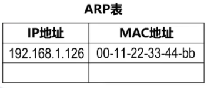

### GET请求能带body吗？

可以。理论上任何请求都可以携带body。只是RFC规范上来讲，get的语义并不需要他携带body。

### HTTP版本

#### 1.1

- **持久链接**：不用每次发资源都重新进行TCP三次握手
- 增加了**强缓存（1.0：expires 1.1 max-age）、协商缓存（1.0 : last modified, if-modified-since 1.1 ： Etag,if-none-match）**
- 增加了**管道机制**，可以不用等待上一次请求发完就可以发送新请求，但是返回顺序仍然固定，存在队头阻塞问题
- 请求方法增加了：PUT、HEAD、OPTIONS、DELETE、PATCH

#### 2.0

- **二进制分帧层**，每个帧有一个**流标识符**，让对方接收到帧之后把帧拼起来，变成原来的请求和响应，帧可以分为头信息帧和数据帧，其实就是http报文的头部和实体。

- **多路复用**：有了帧的概念，就可以同时发送多个请求和响应，不用按顺序依次发送和返回，因为每个请求和响应都被分解成多个二进制帧。

- 引入了**头信息压缩**，一方面，头信息使用 Head compress（Hpack算法，包含静态表、动态表和huffman编码） 压缩后再发送，具体来说，一个字段会被压缩成以下信息

  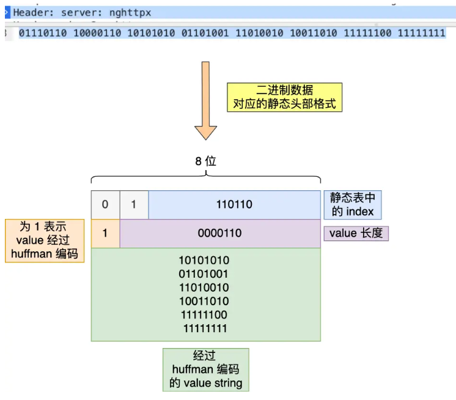

  首先是index为多少，静态表从0~61代表了不同的字段name，接下来的值就是在解释字段的value是什么，比如sever：nghttpx，index为54，内容为nghttpx，就被压缩成以上信息

  动态表也是一模一样的，只不过是index从62开始，并且在客户端和服务端收发信息的过程中动态的维护与更新

- 资源主动推送

HTTP2.0的四个概念

- Connection 连接:1 个 TCP 连接，包含 1 个或者多个 stream。所有通信都在一个 TCP 连接上完成，此连接可以承载任意数量的双向数据流。

- Stream 数据流：一个双向通信的数据流，一个stream对应一个请求，就是说一个stream里有很多头信息帧和数据帧，他们都属于同一个请求，用**stream id来标识不同的请求**，使得服务器能够组装这些请求。每个数据流都有一个**唯一的标识符**和可选的**优先级**信息，用于承载双向消息。**客户端发起的stream具有奇数id，服务端发起的stream具有偶数id**。

> 一个stream对应一个请求，但有可能有2个message，也就是该请求的请求报文和响应报文
>
> 不同stream的message可以无序，但相同stream的必须严格有序

- Message 消息：对应 HTTP/1.1 中的请求 request 或者响应 response，包含 1 条或者多条 Frame。

- Frame 数据帧：最小通信单位，以二进制压缩格式存放内容。来自不同数据流的帧可以交错发送，然后再根据每个帧头的数据流标识符重新组装。

##### HTTP2.0为什么还有队头阻塞？

这是因为HTTP2.0的传输层协议仍然是TCP，如果某个stream发生丢包，那么按TCP协议的要求是要重传这个包的，从而阻塞了建立在该TCP链接下的所有stream。

而HTTP3.0用UDP重新实现了可靠传输，对于丢包只阻塞对应的stream

#### 3.0

实现了基于UDP的QUIC协议

> QUIC协议实现了拥塞窗口、流量控制，保证了不依靠TCP的可靠传输

- 无队头阻塞：某个stream丢包只阻塞对应的stream
- 更快的链接：合并了TCP和TLS

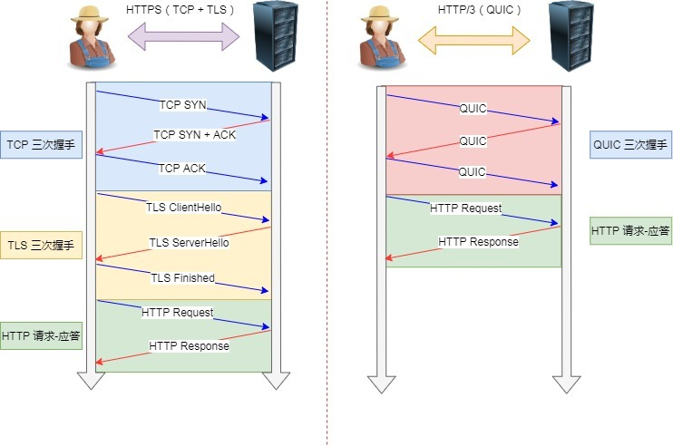

- 链接迁移：原来是TCP（源端口、目的端口）+ip层（源ip、目的ip）来标记双方，现在用**链接ID**标记双方，

### 优化HTTP（避免发送请求、减少请求次数、信息压缩）

- 如何避免发送请求：缓存机制
- 如何尽量少的发送请求：合并小资源（精灵图），缓存重定向，base64编码
- 如何信息压缩：
  - 头部信息压缩（http2.0）
  - 无损压缩（文本文件、代码文件）：请求头中有`Accept-Encoding: gzip, deflate, br`字段，可以用zip
  - 有损压缩（音视频、图片）：图片可以采用webp进行压缩，音视频可以利用帧之间的关系，用增量数据来表达后续的帧，H265等。

### xss（跨站脚本攻击）

xss是指黑客往HTML文件或DOM中注入恶意脚本，从而在用户浏览时发起攻击。

- 存储型xss：将恶意脚本通过漏洞提交到网站的数据库中，浏览时返回到HTML解析执行
- 反射型xss：用户打开包含恶意代码的url，服务端将恶意代码从URL中取出，拼接到HTML执行
- dom型xss：和前两者的区别是和服务端无关，黑客通过各种方法劫持前端页面，修改dom节点，伪造用户请求，恶意代码不会经过服务端

#### 危害

- 窃取隐私：比如调用JavaScript代码偷走cookie（可以通过httpOnly来防）
- 修改dom，比如可以造一个假的登录界面，把请求发给黑客的服务器来窃取账号密码，或者监听用户行为

#### 防御

- 前端对容易造成恶意代码的字符转义，如左右括号

- 使用 CSP ，CSP 的本质是建立一个白名单，告诉浏览器哪些外部资源可以加载和执行，从而防止恶意代码的注入攻击。

> 1. 通常有两种方式来开启 CSP，一种是设置 HTTP 首部中的 Content-Security-Policy，一种是设置 meta 标签的方式 <meta http-equiv="Content-Security-Policy">

- 对一些敏感信息进行保护，比如 cookie 使用 http-only，使得脚本无法获取。也可以使用验证码，避免脚本伪装成用户执行一些操作。

### CSRF（跨站请求伪造）

跨站请求伪造

在网站A保存了登录状态，此时访问恶意网站B，恶意网站B就可以拿着A的登录状态，比如token来伪造一些请求。

#### 防御

策略总的来说就是验证到底是不是A发的请求，或者允不允许其他网站用A的token发请求，可以直接检查http头的origin，或者用CSRF token（只有A知道），或者设置cookie只能被samesite使用

- 验证来源站点，检测HTTP请求头里的Referer和Origin属性
- 在浏览器向服务器请求HTML的时候，返还一个CSRFtoken，这个token就只有A站点才知道了，每次请求都必须带上这个token。
- 设置cookie的Samasite，限制第三方发送的cookie
  - Strict，完全禁止第三方cookie，跨站点请求永不携带token
  - lax（默认设置）：get请求除外
  - none：不使用samesite

> 跨站，就是指顶级域名以及顶级域名+1相同
>
> 比如a.taobeo.com和b.taobao.com就不跨站了

### script标签的defer和async属性

下载都会下载

不加任何标签，html解析立刻阻塞，等待下载和执行

defer是推迟，等html解析完再执行script

async是异步，下载后再执行，会阻塞解析


### 同源策略

如果两个URL有相同的协议、域名和端口相同，就属于同源。

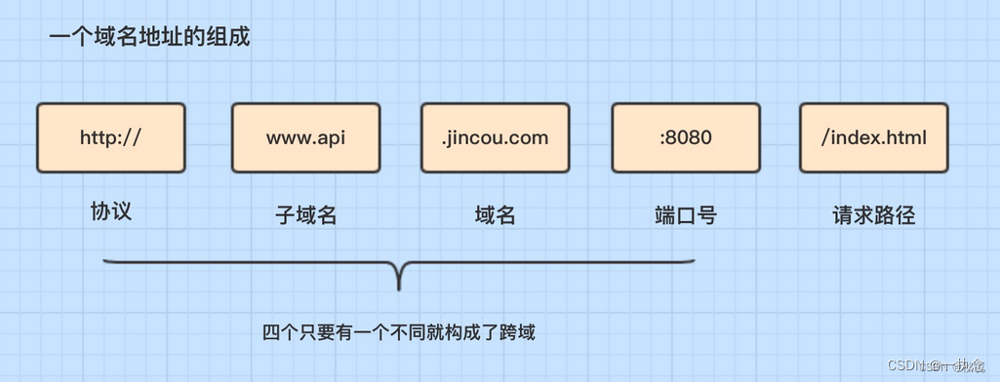

解决跨域：

### cors

#### 简单请求

对于简单请求，浏览器会在请求头中增加origin字段，服务器根据origin来配置是否同意来自该origin的跨域请求，如果同意，response会增加以下信息：

```json
Access-Control-Allow-Origin: http://api.bob.com  // 和Orign一致
Access-Control-Allow-Credentials: true   // 表示是否允许发送Cookie
Access-Control-Expose-Headers: FooBar   // 指定返回其他字段的值
Content-Type: text/html; charset=utf-8   // 表示文档类型
```

因此只需要后端设置**Access-Control-Allow-Origin**

- 请求方法是以下三种方法之一：
  - HEAD
  - GET
  - POST
- HTTP的头信息不超出以下几种字段：
  - Accept
  - Accept-Language
  - Content-Language
  - Last-Event-ID
  - Content-Type：只限于三个值 application/x-www-form-urlencoded、multipart/form-data、text/plain

（其他都是非简单请求）

#### 预检请求

对于预检请求，会在发送请求前先使用一次方法为option请求（和get、post同级），询问来自origin的请求是否可以跨域，头信息中还有以下信息：

```json
// 客户端发送的option请求的头信息
Access-Control-Request-Method： // 该字段是必须的，用来列出浏览器的CORS请求会用到哪些HTTP方法。
Access-Control-Request-Headers： // 该字段是一个逗号分隔的字符串，指定浏览器CORS请求会额外发送的头信息字段。
```

服务器在收到浏览器的预检请求之后，会根据头信息的三个字段来进行判断，如果返回的头信息在中有Access-Control-Allow-Origin这个字段就是允许跨域请求，如果没有，就是不同意这个预检请求，就会报错。

服务器返回的信息头如下，会增加一个option特有的max-age，表示这个预检请求多久有效，要在这期间把该option请求对应的预检请求发出去：

```javascript
Access-Control-Allow-Origin: http://api.bob.com  // 允许跨域的源地址
Access-Control-Allow-Methods: GET, POST, PUT // 服务器支持的所有跨域请求的方法
Access-Control-Allow-Headers: X-Custom-Header  // 服务器支持的所有头信息字段
Access-Control-Allow-Credentials: true   // 表示是否允许发送Cookie
Access-Control-Max-Age: 1728000  // 用来指定本次预检请求的有效期，单位为秒
```

因此客户端需要设置以下字段

Access-Control-Allow-Origin: http://api.bob.com  // 允许跨域的源地址
Access-Control-Allow-Methods: GET, POST, PUT // 服务器支持的所有跨域请求的方法
Access-Control-Allow-Headers: X-Custom-Header  // 服务器支持的所有头信息字段

### 配置代理

跨域是浏览器的保护机制，如果用node来执行请求就不会受到这个限制了，所以可以配置代理来绕过跨域问题，现代脚手架一般都支持这个功能，以vite为例，只需要如下配置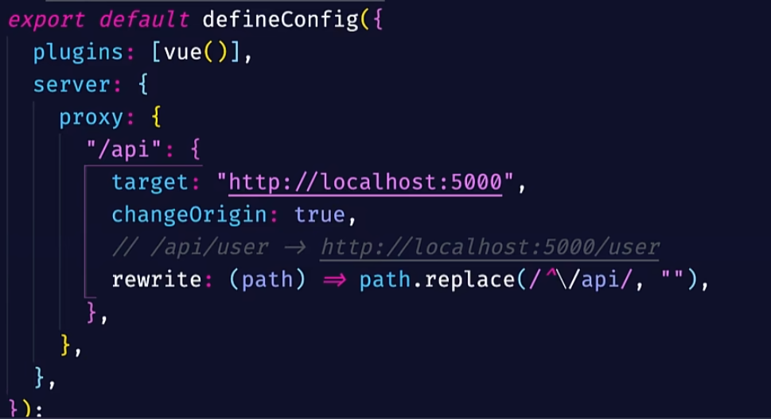

### 浏览器渲染流程

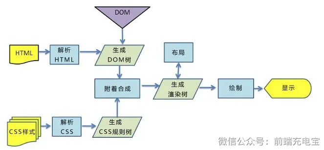

- 首先解析收到的文档，根据文档定义构建一棵 **DOM 树**，DOM 树是由 DOM 元素及属性节点组成的。（将start标签入栈、文本标签直接生成文本节点，end标签就出栈，类似括号匹配）
- 然后对 CSS 进行解析，生成 **CSSOM 规则树**。
- 根据 DOM 树和 CSSOM 规则树构建**渲染树**。渲染树的节点被称为渲染对象，渲染对象是一个包含有颜色和大小等属性的矩形，渲染对象和 DOM 元素相对应，但这种对应关系不是一对一的，**不可见的 DOM 元素不会被插入渲染树**。还有一些 DOM元素对应几个可见对象，它们一般是一些具有复杂结构的元素，无法用一个矩形来描述。
- 当渲染对象被创建并添加到树中，它们并没有位置和大小，所以当浏览器生成渲染树以后，就会根据渲染树来进行布局（也可以叫做回流）。这一阶段浏览器要做的事情是要弄清楚各个节点在页面中的确切位置和大小。通常这一行为也被称为“自动重排”。
- 布局阶段结束后是绘制阶段，遍历渲染树并调用渲染对象的 paint 方法将它们的内容显示在屏幕上，绘制使用 UI 基础组件。

#### 构建渲染树的具体过程

> gpt回答

DOM 树和 CSSOM 树合并成渲染树的过程主要涉及以下步骤：

1. **遍历 DOM 树**：浏览器会从 DOM 树的根节点开始，逐步遍历所有节点。
2. **匹配 CSS 样式**：在遍历每个 DOM 节点时，浏览器会根据 CSSOM 树为每个节点查找相应的样式规则，并应用到该节点上。
3. **过滤不可见节点**：渲染树只包含可见的元素。像设置了 `display: none` 的节点会被过滤掉，不会出现在渲染树中。
   - 需要注意的是，`visibility: hidden` 和 `opacity: 0` 的元素仍然会保留在渲染树中，因为它们在布局中仍占用空间。
4. **创建渲染树节点**：对于每个可见的 DOM 节点，浏览器会创建一个相应的渲染树节点，并将它们按照视觉顺序组织在渲染树中。渲染树节点会包含每个元素的样式、大小、位置等信息，用于后续的布局和绘制。
5. **层级结构与继承样式**：渲染树会继承 DOM 树的层级结构，但会忽略不影响渲染的标签（如 `<head>` 和 `<script>` 等）。CSS 样式的继承也会体现在渲染树中，确保样式的层级与父子关系。

### 重排（回流）与重绘

除了浏览器初次渲染外，添加与删除元素，改变元素几何、获取元素偏移量（scollTop等因为要计算这些属性必须通过重排）的事件会触发重排。

- 添加或者删除可见的DOM元素
- 元素位置改变
- 元素尺寸改变
- 元素内容改变（例: 一个文本被另一个不同尺寸的图片替代）
- 页面渲染初始化（无法避免）
- 浏览器窗口尺寸改变

改变外观的事件会触发重绘，包括

- background属性(background, background-color, background-image, background-position,background-repeat, background-size)
- outline属性(outline, outline-color, outline-style)
- box-shadow属性
- border属性(border-style, border-radius)
- visibility

### 进程与线程

最新的 Chrome 浏览器包括：

- 1 个浏览器主进程：主要负责界面显示、用户交互、子进程管理，同时提供存储等功能。
- 1 个 GPU 进程：绘制
- 1 个网络进程：网络资源加载
- 多个渲染进程：将 HTML、CSS 和 JavaScript 转换为用户可以与之交互的网页，排版引擎 Blink 和 JavaScript 引擎 V8 都是运行在该进程中。每个Tab都有一个渲染进程。
- 多个插件进程

#### 渲染进程的子线程

- JS引擎线程：单线程
- GUI渲染线程：参考渲染器渲染流程以及重绘重排
- 事件触发线程：当触发事件，例如ajax请求，setTimeOut到期，该线程将事件添加到任务队列队尾
- 定时器触发线程：用来给SetTimeOut等函数计时
- 异步http请求线程：

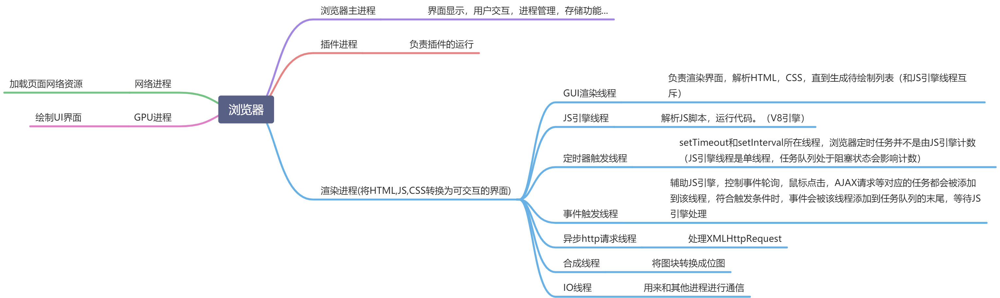

### 浏览器缓存机制

浏览器在请求资源时，会先检查缓存，优先检查强缓存，

- 先看一看catch-control中的**max-age**，看一下上一次返回200的时间和本次请求的时间差，如果没有超过max-age就直接命中缓存
- 如果没有max-age就看现在的时间有没有超过**expires**，expires是一个绝对时间，由初次请求时的服务器返回，因此如果客户端时间和服务器时间不一样可能会导致各种各样的问题。

如果强缓存没有命中（或者catch-control中设置了no-catch），就尝试使用协商缓存

- 服务器在第一次请求时返回Etag（根据资源内容计算的值，如果资源变更etag就会变更），客户端在if-none-match中填充这个etag发给服务器，如果匹配服务器返回304，表示缓存命中
- 如果etag不存在，说明用的是Last-modified，服务器第一次返回一个修改时间Last-modified，下次请求的时候在请求头添加If-modified-since字段，如果修改时间一致说明资源没有更改，缓存命中，返回304

强缓存和协商缓存的区别和联系

- 强缓存不需要和服务器进行交互
- 都是使用本地资源，协商缓存只是服务器告诉客户端你的缓存有没有失效，返回304，如果不命中，将资源返回给客户端

记一下关键词

强缓存：cath-control.max-age > expires

协商缓存： [Etag, if-none-match] > [last modified, if-modified-since]

cath-control.no-catch : 不进行强缓存

cath-control.no-store : 不进行任何缓存

### LocalStorage SessionStorage Cookie

只有SessionStorage无法在同域名的不同页面下共享，而且SessionStorage只要把页面关闭就清除了，而localStorage可以持久化保存，这也是为什么用localStorage做token的持久化

其他都仅受同源策略的限制

LocalStorage不会在每次http请求都附上cookie，节省流量，而且localStorage可以有5M的存储，比Cookie的4KB更大

Cookie可以设置过期时间，可以设置httponly来禁止客户端脚本获取cookie，localStroage没有这个功能。

#### Cookie的属性

- domain：设定域名，同时该域名下的子路径都可以访问
- path：设定域名下的子路径，同时该子路径下的二级路径都可以访问
- secure：仅允许HTTPS请求
- expires / max-age : 设置cookie过期时间
- httponly：不允许JavaScript获得cookie
- samesite：跨站请求不允许被发送

### TCP和UDP

#### TCP

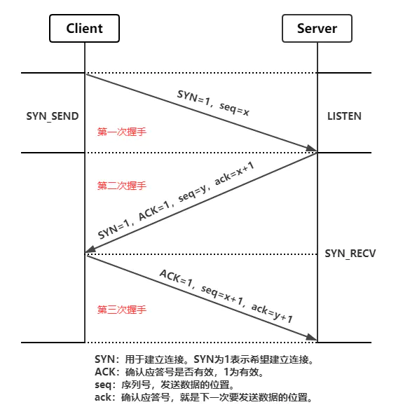

#### 三次握手

客户端第一次发起请求，将SYN=1，seq=x，向服务端请求建立TCP链接

服务端接收到请求后，发送SYN=1，ACK=1，ack=x+1（希望收到的报文序号），seq=y的报文，告诉客户端允许链接

客户端最后发出ACK=1，seq=x+1，ack=y+1的报文进行确认，这时候客户端已经认为建立起了链接，通常也会将第一次请求要发的数据附在报文中发过去

#### 为什么握三次

不握两次：要防止是之前重复发送或者延迟的报文发送到服务器，直接建立起链接，因此还要客户端再确认一次，同时，三次握手也让服务端的序列号得到了确认，从而保证了双方的初始序列号和ack能够对应，两次握手的话就只有客户端的序列号得到确认

不握四次：三次握手就已经知道客户端确实想建立链接，通信也是正常的，再多也是浪费

#### 四次挥手

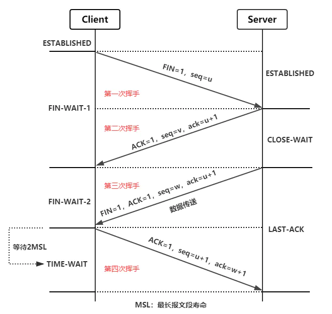

记住不管是服务端还是客户端，第一次发请求都带着FIN=1

只要之前有接受到对方的报文，ACK=1

ack表示想要接受的报文id

#### UDP

- 无连接、不可靠、面向报文、支持单播、多播和广播
- 只有8个字节，包括源、目的端口、整个数据报文长度和校验和

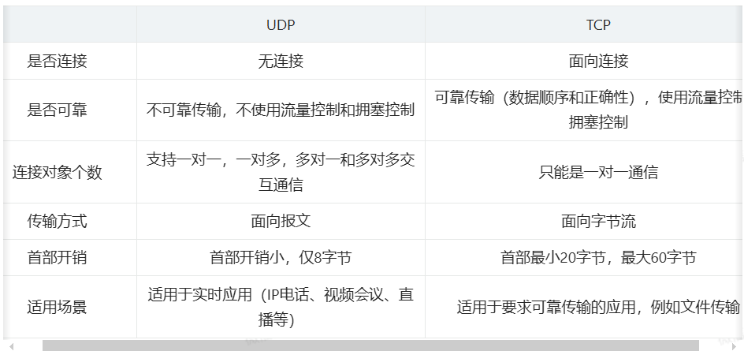

不可靠是指：不保证消息交付（无确认、重传、超时），不保证顺序（无编号），无拥塞控制

### TCP和UDP应用场景

tcp：最常见的http / https、以及需要保证数据可靠交付的文件传输ftp

udp：对于包总量较少的（DNS），视频、音频、广播

### 首部长度、包长度

只有TCP有首部长度：TCP首部中有**选项**，如果启用会超过20字节，而UDP永远只有8字节

只有UDP有包长度：TCP可以通过ip数据包-ip头部-TCP头部来计算包长度，其实UDP也可以但是去掉就不是4的整数倍了、也可能是历史遗留问题

### 四次挥手为什么需要TIME_WAIT,为什么是2MSL（无论问哪个一起说）

MSL：最大报文生存时间，如果一个数据包在网络中的时间超过MSL就会被丢弃

为什么需要TIME_WAIT：

- 保证服务器（被动关闭方）正常关闭，如果第四次挥手客户端直接关闭链接，那么这个ACK丢失的情况下，服务器可能无法正常关闭链接（服务器会超时重传FIN，此时客户端已经关闭，只能发送RST来关闭服务端链接，不是正常关闭）

为什么是2MSL：

- 不同的两次链接中，序列号可能相同，那么新的链接可能就把上一次链接的包当做有效的信息，如果等待了2MSL，上一次链接的所有数据包就都被丢弃。

### TCP超时重传

自发送数据开始算起，经过RTO的时间没收到ack的话，就会重传，RTO理论上最好略大于RTT（报文往返一次的时间），实际上是用一个公式根据一段时间内的RTT计算的平滑RTT时间

#### 快速重传

连续收到三个ack就直接重传

### 拥塞控制

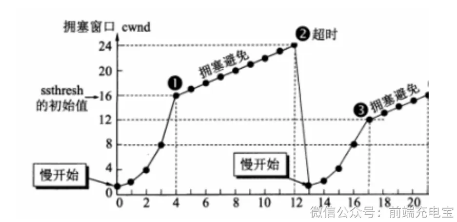

- 慢启动：发送方每收到一个ACK，拥塞窗口cwnd就会+1，一轮下来就是翻倍
- 拥塞避免：到达规定的sshresh后，一轮下来cwnd窗口才+1，于是变成线性增长
- 拥塞发生：遇到重传时，sshresh减少为原来**cwnd**的0.5倍（不是sshresh的0.5倍要注意），cwnd归1
- 快恢复：一般和快重传一起用，能接到n个ack说明网络还行，没必要cwnd归1，而是设置为降低后的sshresh+n，n代表接收到的重复ack，也就是变成原来的0.5倍+n。

### 状态码

https://jonny-wei.github.io/blog/base/browser/http-status.html#_5xx-%E6%9C%8D%E5%8A%A1%E5%99%A8%E9%94%99%E8%AF%AF%E7%8A%B6%E6%80%81%E7%A0%81-server-error

1xx 信息性状态码

2xx 成功状态码

常见的：200，请求成功；204 请求成功但无返回，一般用于put的返回状态码

3xx ：重定向状态码

常见的：301 被请求的资源已经**永远**移动到新位置，服务器会返回新地址，一般是可以缓存的，相应的302是临时重定向，除非指定强缓存一般是不缓存的。

304 ： 协商缓存命中

4xx 客户端错误：

- 400，请求写错了，服务器解析不了

- 401，Unauthorized，未授权

- 403，服务器拒绝了，可能是访问权限的问题

- 404 服务器没找到

5xx 服务器错误：

- 500 Internal Server Error

  服务器遇到了一个未曾预料的状况，导致了它无法完成对请求的处理。一般来说，这个问题都会在服务器端的源代码出现错误时出现。

- 502 Bad Gateway

  作为网关或者代理工作的服务器尝试执行请求时，从上游服务器接收到无效的响应。

- 503 Service Unavailable

  由于临时的服务器维护或者过载，服务器当前无法处理请求。这个状况是临时的，并且将在一段时间以后恢复

- 504 Gateway Timeout

  作为网关或者代理工作的服务器尝试执行请求时，未能及时从上游服务器（URI标识出的服务器，例如HTTP、FTP、LDAP）或者辅助服务器（例如DNS）收到响应。

### SSL/TLS

对称加密：双方使用共同的公钥，客户端将信息加密后发给服务端，服务端用相同的私钥公密（公钥需要明文传输给客户端，公钥被劫持了那么加密都失效了）

非对称加密：公钥公开，私钥由服务器保存，所有人持有公钥，这个公钥一般是服务器返还给客户端一个公钥证书，浏览器用CA提供的公钥解开公钥证书得到的。

会话秘钥建立过程：

- 客户端向服务器发送请求，生成一个随机数1（第一次握手）
- 服务器返还公钥证书，生成一个随机数2，同时服务端返回一个携带公钥的数字证书（第二次握手）
- 客户端确认证书安全后，得到了服务端发送的公钥，用得到的公钥加密一个随机数3，获得了预主密钥，发送给服务器（第三次握手）
- 服务器用私钥解密得到预主密钥
- 现在双方都持有随机数1 随机数2 预主密钥，计算得到一个会话秘钥，从此使用对称加密通话
- 服务器返回一个最后的信息，表示以后都用会话秘钥加密，同时把之前对话的所有内容产生的数据做一个摘要，给客户端校验（第四次握手）

> 只有随机数3是公钥加密的，其实按这个流程来看生成随机数1的时候客户端还没有公钥，随机数2是服务端持有私钥，但是私钥加密公钥解密是为了认证身份，而这个过程已经被CA做了，所以随机数2也不需要私钥加密。

#### 为什么采用对称密钥作为会话秘钥？

因为对称密钥加密解密算法的性能更好，效率更高

## 计算机组成原理和操作系统

### 中断（外中断）和异常（内中断）

- 外中断：CPU指令之外的时间，例如IO终端，时钟中断
- 内中断：CPU指令，如非法操作码、除零、地址越界、trap指令等等

### 内核态和用户态

CPU有一个寄存器叫PSW（程序状态字寄存器），标记了当前的状态

内核态：可以执行特权指令，通过修改PSW变为用户态

用户态：不能执行特权指令，通过中断进入内核态（比如trap）

### IEEE 754

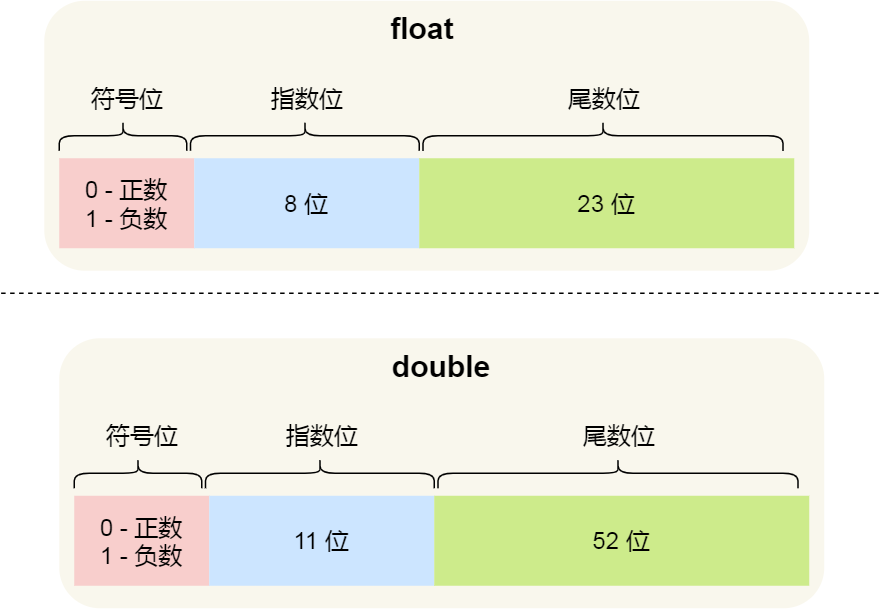

几个注意点

- 指数位是无符号整数，增加一个固定的偏移量来表示左移还是右移
- 尾数位实际上有23+1,52+1位，因为要将1移动到小数点左侧后开始转换，所以固定隐去这个1

相应的，0.1+0.2===0.3 是false的原因：

根据IEEE754标准，尾数位只能有52+1位，0.1、0.2、0.3转换成二进制数是无限循环的小数，无法被正确存储

### 内存分段、分页

#### 分段

内存分段是连续存储管理，把虚拟地址分为段号和段内偏移，将一整块连续的虚拟地址映射到连续的物理地址上，容易产生**外部碎片**。

段表存储虚拟段映射的物理段（的基地址），还有段的范围和特权等级

#### 分页

内存分页是不连续的，将虚拟内存分为很多页，物理地址也分为很多页，虚拟地址就是页号和页内偏移，通过页表访问对应的页，加上偏移计算出实际物理地址。不会有外部碎片，因为一个程序可以不连续存储，但是有**内部碎片**，即一个程序的最后一部分通常占不满一整页。

##### TLB

一个cache，缓存了最近最常用的页表项

##### 多级页表

将虚拟地址分为一级页号、二级页号、等等，最后是偏移量

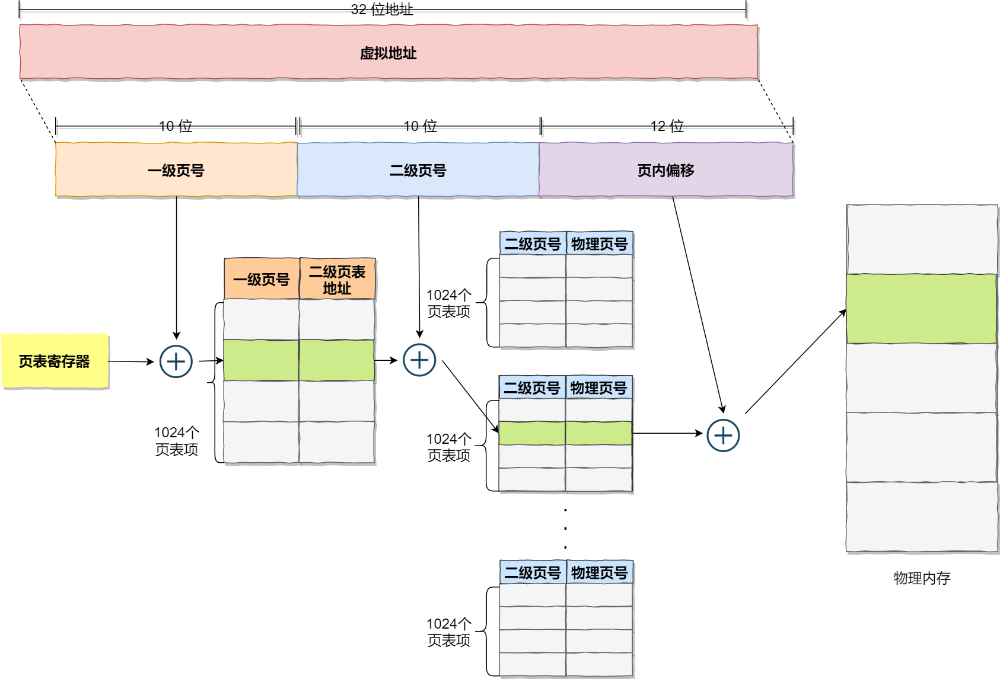

多级页表的好处：可以节省内存空间，单级页表要把整块页表一直存储在内存中，多级页表可以只存一级页表，需要时把二级页表从外存中调度进来。根据程序的空间局部性原理，一般只会频繁的访问其中几个二级页表项，通常不会频繁的发生内存与外存的IO。

### 段页式

先把程序按逻辑分段（代码段、数据段等），再将段按固定的块大小分页，于是虚拟地址是

段号+段内页号+页内偏移

### 线程与进程

- 进程是**资源分配**（内存分配、打开文件表）的基本单位，线程是CPU调度的单位
- 同进程的线程之间切换快，但是线程之间切换慢，因为线程共享地址空间、打开文件表，只需要切换线程寄存器、程序计数器（PC）等少量信息，而进程切换要切换完整的进程上下文 ，比如内存管理信息，文件信息等

### 进程通信

- 管道：半双工，发送方以字符流形式将数据写入管道，接收方从管道接收数据，数据读取结束后立刻销毁
- 消息传递：发送方将消息改在到接收方的消息缓冲队列中，这需要在内核态执行，接收方需要的时候再取出来，比起管道不需要双方都online，且可以双工通信
- 共享存储：指定一块区域，两个进程都可以访问，就可以在这个区域上交换信息

- 信号量和PV操作：P操作，信号量-1，如果<0该进程阻塞，V操作，信号量+1.
  - 于是如果一个信号量初始化为1，则是互斥信号量，只有一个进程能使用，进程释放资源时执行V操作，才能让另一个进程使用（互斥：一个进程先P后V）
  - 相应的，一个进程P，另一个进程V，就可以达成同步功能，经典的比如生产-消费者问题，规定空盒子数量和非空盒子数量，生产者先P空盒子（如果<0表示没有空盒子，等待消费者），然后V非空盒子（生产出东西给消费者用）

### 死锁

先说四个必要条件

- 互斥：资源不能共同拥有

- 不剥夺：在进程主动释放资源前，不可以强行剥夺资源

- 请求与保持：进程A拥有了资源1，但是还想申请资源2，申请资源2的时候并不释放资源1，这时候进程A如果申请不到资源2就不动了

- 环路等待：存在一个进程等待队列｛P1，P2，···，Pn｝，其中P1等待P2占有的资源，P2等待P3占有的资源，P等待P1占有的资源，形成一个进程等待环路。

  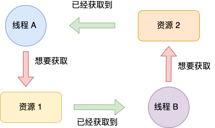


预防死锁

- 破坏必要条件
  - 互斥：打印机的spooling技术
  - 不剥夺：优先级高的进程优先享有资源
  - 请求与保持：采用静态分配，一个进程运行前就给他所有需要的资源
  - 环路等待：顺序资源分配法，将资源编号，进程只能依次请求资源，请求完编号大的资源后就不能请求小的资源
- 银行家算法：每次分配资源前先检查这次分配会不会进入不安全状态，也就是是否存在一个安全序列（把剩余资源分配->一个进程完成释放资源->再分配->再一个进程释放资源，直到所有进程完成，则存在一个安全序列），如果出现剩余资源不满足任何一个进程完成的情况，就是不安全的状态，不执行这次资源分配

## 模块化

### Commonjs

node的规范

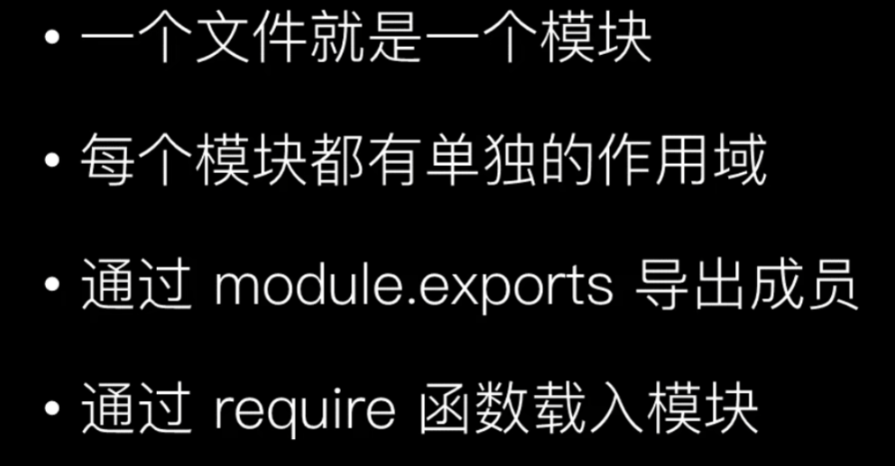

### ES Module

通过`<script type="module"></script>`来声明一个块属于es module

- 自动采用严格模式
- 每个ESM有自己的私有作用域
- ESM通过cors请求外部的js模块
- ESM会延迟执行脚本，相当于每个esmoule一定是defer属性

#### 导出的包

- 在需要导出的变量名前添加export关键字，或者在模块的最后统一导出，`export {name, age}`
- 可以添加默认导出，export default name，表示别的模块直接import就是在引入name

#### 关于导入

- 一般的导入只能写在顶部，动态导入函数可以写在js代码中

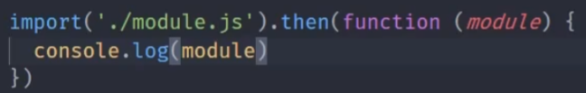

import返回一个promise，res是导入的模块

### commonJS和ESM的区别

- 语法上：ESM采用import，export；commonJS采用requir(), module.export

- 加载时间不一样：

  - ESM静态解析，所有模块加载完成后才执行代码，因此支持tree-shaking；

  - CJS在执行到require语句的时候才加载模块

## webpack

webpack的各项配置

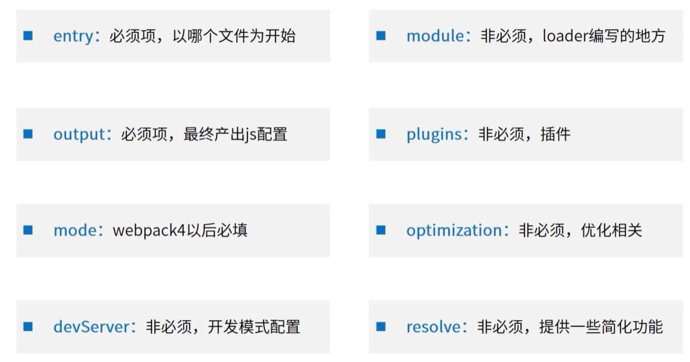

### output

path：输出路径

publicPath：发布到线上后静态资源的存放路径

### mode

- development：仅编辑ESM语法
- production：会进行tree-shaking、压缩代码
- none：不开启任何默认的optimization属性

不同的模式会调整optimization里不同的属性，同时调整process.env.NODE_ENV的值，此外production模式会进行代码压缩、混淆和tree-shaking

### loader

webpak自身只认识js文件，如果在js代码中引入了css、less等其他文件，就需要loader来帮助webpack。

所有的文件必须在被该文件对应的所有loader依次处理完后，导出一段JavaScript代码

在module中填写loader，来定义对某些文件的处理方案，例如：

```javascript
module.exports = {
  module: {
    rules: [
      {
        test: /\.js$/,   // 处理 .js 文件
        use: 'babel-loader', // 使用 babel-loader 来转换 ES6 代码
      },
      {
        test: /\.css$/,  // 处理 .css 文件
        use: ['style-loader', 'css-loader'], // 先通过 css-loader 处理 CSS，再通过 style-loader 注入到页面中
      },
    ],
  },
};

```

常见的loader有：

`babel-loader`：将 ES6+ 的 JavaScript 转换为浏览器兼容的 ES5。

`css-loader`：允许你 `import` CSS 文件并处理其中的 `@import` 和 `url()`。

`style-loader`：将 CSS 以 `<style>` 标签的形式注入到页面中。

`url-loader`: 将小于limit的文件包装成DataURL，比如image base64 xxxx，大于limit的文件调用file-loader处理（修改文件名，处理文件路径），这样可以减小请求次数

#### 原理

loader本质是一个方法，接受对应的文件内容，做各种处理，然后再返回

### plugin

webpack会暴露一系列生命周期hooks，可以在相应的生命周期挂载函数来处理

最常见的插件就是eslint了，不过一般会写在.eslintrc.js里而不是放进wenpack.config.js

其他常见的：

- minimizer

- html-webpack-plugin: 生成html，将js和css引入，最小化html 

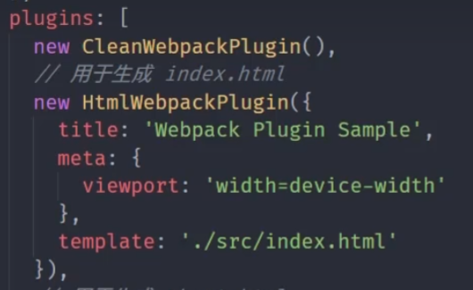

### resolve

配置寻找模块的规则，比如别名alias，modules寻找模块的根目录

### devtool、sourcemap

经过打包、编译等过程后，源代码和输出代码并不相同，并且通常难以调试，sourcemap是一个映射，存储了前后的变量名，进而方便代码被调试

通过

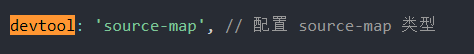

配置

### module、chunk、bundle

module就是我们所写出来的模块，通常就是代表一个文件（js、css、html等），除了js文件外每个module都有一个对应的loader

chunk是webpack经过分析依赖构成的中间产物，webpack根据代码拆分的策略将module打包成chunk，通常包含多了module

bundle就是最终打包的输出文件，可以被浏览器执行。

## Vite

### vite webpack的区别

启动开发服务器很快的原因：vite将模块分为**源码**和**依赖**

- 依赖也就是不怎么变动的部分，对于这部分vite会使用esbuild进行预构建，预构建主要有两个功能，主要是将所有导入都变为ESM（vite的开发服务器将所有代码视为原生ES模块，因此必须进行转换），第二是将依赖合并，比如lodash依赖了六百多个内置模块，导入会发送600多个HTTP请求，vite的预构建将这些模块合并成一个，就只需要一个http请求了

- 对于源码，vite采用的是按需加载，只在浏览器请求源码的时候按需提供，而不需要分析完所有依赖打包成一整个bundle之后再运行

热更新很快的原因：

- 因为vite在ESM上执行，vite可以更精确的找到已编辑的模块与其他模块的边界，从而更小的进行热替换
- vite还会使用浏览器的缓存机制，对于依赖进行强缓存，对于源码进行协商缓存，从而加速页面的重新加载

## git

### 撤销修改

还没add，还在工作区（直接改本地文件）：git checkout --filename（这个操作相当于从本地git中pull下来，所以某个文件被删了也能这样恢复）

已经add了，在暂存区，想撤销add：git reset `<file>`

> 也同样可以使用git checkout HEAD^ 这样会add和本地磁盘文件的修改一起被撤销

已经commit了，要撤销，使用git reset [soft| mixed(default) | hard] HEAD~1

hard就是工作区（本地）+暂存区+commit一起撤销

mixed就是只撤销commit+暂存区

soft就是只撤销commit

HEAD~1表示回到上一个版本，也可以用git log查询一下commit记录，然后用commit id来控制撤回到哪个版本

在公共分支撤销提交可以使用git revert，相当于做了一次与目标commit完全相反的commit

### 分支管理

- 创建新分支：git branch
- 切换分支：git checkout
- 删除分支：git branch -D
- 合并其他分支到当前分支：git merge

## 移动端

### 1px问题

有些设备的dpr不是1，而是2以上，就是指1个逻辑像素（CSS规定）超过1个物理像素，有的时候设计稿会给出1个物理像素的要求（比如给了两倍高清的设计稿，然后在两倍分辨率的设计稿上画了1px的边框），这时候理论要写0.5px，但是CSS是不支持0.5px像素的

#### 动态 Viewport + REM 适配方式

通过设定initial-scale为1/dpr，可以把viewport扩大dpr倍，此时直接写1px即可

## 一些杂项

### canvas svg的区别

SVG是一个矢量图形，是由XML定义的，canvas的话是由JavaScript绘制的，一般是一个位图。

svg既然是矢量图形，那就有一个缩放不失真的特性，canvas是一个位图，放大的时候容易出现锯齿。

在事件交互上，svg里每个dom都可以支持获取并用dom操作去做交互，canvas的话基本只能使用canvas专用的js api

echart的最佳实践里提了一些经验：

svg的占用内存更低，如果在移动端上使用的话最好用svg

如果数据量（>1k）和交互较多的时候，选择canvas会性能更好

## 算法

### 二分

记住

- l <= r
- l = mid+1, r = mid - 1

### 翻转链表

```c++
    ListNode* reverseList(ListNode* head) {
        if (head == nullptr || head->next == nullptr) return head;
        ListNode* last = reverseList(head->next);
        head->next->next = head;
        head->next = nullptr;
        return last;
    }
```

几个关键点：

- reverseList的返回值是新链表的头结点
- 递归中间层是1->2<-3<-4的形式
- 递归出口：空链表（返回空），单个元素的链表（无法翻转，返回本身）

链表基本可以递归：

https://leetcode.cn/problems/swap-nodes-in-pairs/description/

### 快排

背个版吧

要先从右边往左找，最后交换左边和i，记得判断条件>=

```cpp
#include <algorithm>
#include <vector>
#include <list>
#include <utility>
#include <iostream>
#include <queue>
using namespace std;

int N;
vector<int> v(100005);

void quickSort(int l, int r) {
	if (l >= r) return;
	int mid = (l + r) / 2;
	swap(v[l], v[mid]);
	int target = v[l];

	int i = l, j = r;
	while (i < j) {
		while(i < j && v[j] >= target) j--;
		while (i < j && v[i] <= target) i++;
		if (i < j) swap(v[i], v[j]);
	}
	swap(v[i], v[l]);
	quickSort(l, i - 1);
	quickSort(i + 1, r);
}
int main() {
	cin >> N;
	for (int i = 0; i < N; i++) {
		cin >> v[i];
	}
	quickSort(0, N - 1);
	for (int i = 0; i < N; i++) {
		cout << v[i] << ' ';
	}
}
```
