## 小需求

### 续播时增加从头播放能力

在播放器自动定位至xx秒时，提供一个”从头播放“按钮，触发seek：0事件

### 弹幕举报面板更新
播放页负责写iframe，播放器端监听message事件，判断来源和action，给出回调（toast，屏蔽弹幕等）

```typescript
// iframe文档: https://info.bilibili.co/pages/viewpage.action?pageId=996237971
import { IHttpDmReportRecall, IHttpDmReport, IHttpDmReportSubmitRecall } from '@jsc/http';
import { genElement, showElem, hideElem } from '@jsc/utils';

type DmReportConfig = {
    ppx: string;
    hide?: (fromShow?: boolean) => void;
    submit?: (res: IHttpDmReportSubmitRecall) => void;
    domEle?: HTMLElement;
} & IHttpDmReport;

interface IDomObject {
    wrap: HTMLElement;
    iframe: HTMLIFrameElement;
}

export class ReportV2 {
    private template: IDomObject;
    private config: DmReportConfig;

    static reported: string[] = []; // 已经举报的弹幕id
    public domEle: HTMLElement;
    boundMessageHandler: (e: MessageEvent<IHttpDmReportRecall>) => void;

    get wrap() {
        return this.template.wrap;
    }

    constructor(
        private container: HTMLElement,
        config: DmReportConfig,
    ) {
        this.config = config;
        this.container.appendChild(genElement(this.createTpl()));

        this.template = {
            wrap: <HTMLElement>this.container.querySelector(`.${this.config.ppx}-report-wrap`),
            iframe: <HTMLIFrameElement>this.container.querySelector(`.${this.config.ppx}-report-iframe`),
        };
        this.domEle = config.domEle;

        this.boundMessageHandler = this.messageHandler.bind(this);
    }

    private createTpl() {
        const ppx = this.config.ppx;
        const reportCfgParams: IHttpDmReport = {
            aid: this.config.aid,
            cid: this.config.cid,
            dmcontent: this.config.dmcontent,
            dmid: this.config.dmid,
            from_spmid: this.config.from_spmid,
            scene: this.config.scene,
        };
        const reportCfgParamsJSON = encodeURIComponent(JSON.stringify(reportCfgParams));

        return `<div class="${ppx}-report-wrap">
                <iframe class="${ppx}-report-iframe ${this.config.scene === 'normal' && `${ppx}-report-iframe-shadow`}"
                src="https://www.bilibili.com/york/danmakureport/?report_cfg=${reportCfgParamsJSON}"
                width="308"
                height="388"
                frameborder="0"
                ></iframe>
            </div>`;
    }

    messageHandler(e: MessageEvent<IHttpDmReportRecall>) {
        if (e.origin.indexOf('www.bilibili.com') === -1 || this.template.iframe.contentWindow !== e.source) {
            return;
        }

        const recall = e.data;
        if (recall.action === 'close') {
            this.hide();
            this.destroyIframe();
        } else if (recall.action === 'submit') {
            this.hide();
            this.destroyIframe();
            console.log('ReportV2: submit recall', recall);
            this.config.submit?.(recall);
        } else {
            console.warn('ReportV2: Unknown action', (recall as any).action);
        }
    }

    hide() {
        window.removeEventListener('message', this.boundMessageHandler);
        hideElem(this.template.wrap);
        this.config.hide?.();
        return this;
    }

    show() {
        window.addEventListener('message', this.boundMessageHandler);
        showElem(this.template.wrap);
        return this;
    }

    destroyIframe() {
        if (this.template.iframe) {
            this.template.iframe.remove();
            this.template.iframe = null;
        }
        this.template.wrap.remove();
        this.template = null;
    }

    dispose() {
        ReportV2.reported = [];
    }
}

```

- pre环境支持按秒显示：格式化内核传出的currentTime
- 弹幕hover问题排查：

### **弹幕hover问题排查**

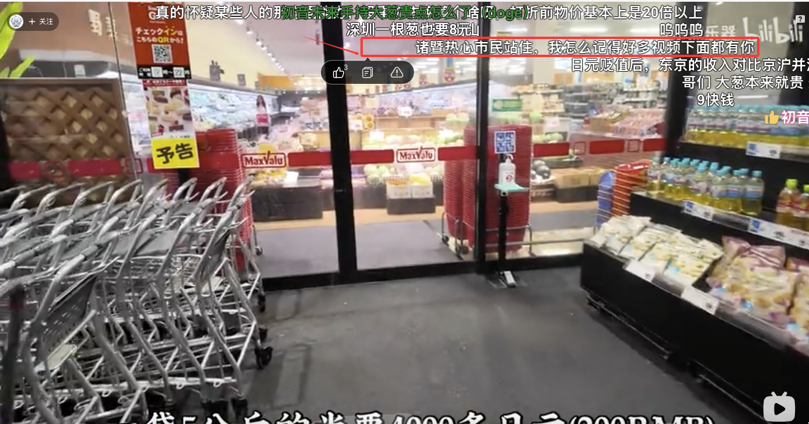

问题：弹幕可以hover的位置和弹幕实际位置偏差了约40~60px

原因：hover事件通过鼠标位置和danmaku-x内部提供的弹幕(x, y)坐标来触发, 主要问题出在danmaku-x提供的(x，y)并不准确上。

性能考虑，实际上xy是通过计算得到的，而并非通过DOM方法，通过初始化时规定速度和时间来计算位置。但是在赋值css属性（来规定动画和弹幕初始位置）的时候，出现了一些魔法数字，+50， -10等导致了实际位置的偏移，但记录的x并没有记录这些变更。

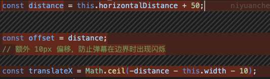

修改后偏移控制在5px以内，仍有误差，排查下来可能有以下原因：

- 弹幕宽度也是计算的，和实际尺寸有差距
- 弹幕位置通过时间\*速度得到，但是内存中记录的时间，和实际的时间约有2帧偏差，导致了0.016s\*speed的偏差（实际开始动画的时间和理论开始动画的时间不一致）

### **主站（\*.bilibili.com）和游戏页（\*.biligame.com）跨域，导致的登录态问题**

#### 表现:

从主站进入biligame时，内联的播放器无法获取到登录态，检查network接口发现cookie没有被携带。

从biligame登录时，内联的播放器可以获取到登录态。

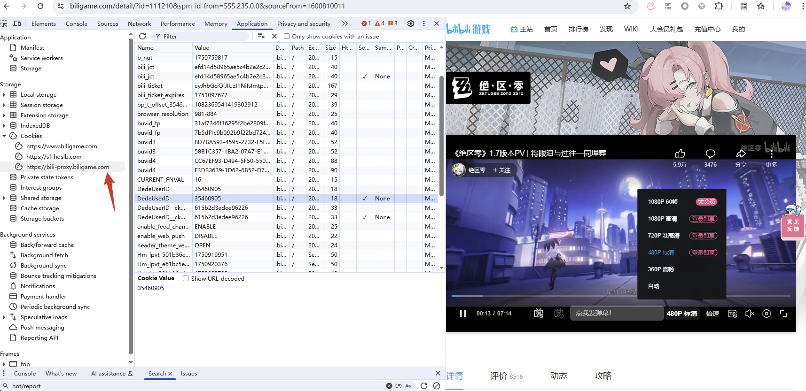

#### 定位：

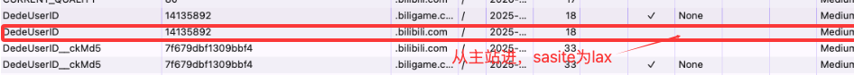

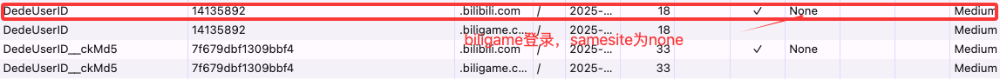

单从前端来看，是因为请求域名（请求登录态接口）在*.bilibili.com，而当前位于*.biligame.com，并且cookie中Domain为*.bilibili.com的DedeUserID没有配置samesite=none，导致不能自动携带cookie。

#### 解决

目前暂时的解决方案是：服务端短期修改set-cookie为samesite=none

日后：可能需要播放器侧根据不同域名请求不同接口，需要服务端配合修改，待产品提单。

### 弹幕压号部分场景失效


弹幕压号由插件DmDelivery显示，仅community helper安装了该插件，因此仅UGC场景生效。

## 大需求

### 高能进度条性能优化

时间 | 2025.7.07~？

#### 逻辑梳理

###### **数据结构**

zebraPath：表示已播放区域，维护有序无重叠区间集合zebraAreas来实现（维护代价O(n)）

clipRect：也是已播放区域，但是由[zebraStart, zebraEnd]两个变量维护，现在正在播放的区间

line：当前播放时间上会画一条竖线，实时获取currentTime实现

###### **更新时间**

timeupdate(约0.25s一次, 播放器事件触发):

​                ● abnormalUpadate（相比上次跳转>1.5s || 回退）：触发区间插入和合并，重绘zebraPath和clipRect，n+1

​                ● nomralUpdate：只重绘clipRect

以上操作均会重绘line，即每0.25s获取当前currentTime并更新line svg

seek:

​                ● 等同abnormalUpdate：触发区间插入和合并，重绘zebraPath和clipRect，n+1

##### **其他细节**

​                ● 维护有序区间可修改为二分插入，但是n通常过小（用户每次seek+1），理论上无明显优化

​                ● svg dom节点较少（fillRect+playRect+line），且有独立图层，每次timeUpdate或seek都会触发svg内部的重排重绘，但是每次的代价较低?

​                ● PLAYER_HEARTBEAT的时候，会将有序区间存储进 db，约15s一次，也会执行区间合并后再加入

##### **性能表现**

以下实验均以5s周期，seek10次，再静置70s

[关闭高能进度条 vs 开启高能进度条](https://fe-perfcat.bilibili.co/utils/shorten/TYtDVA)

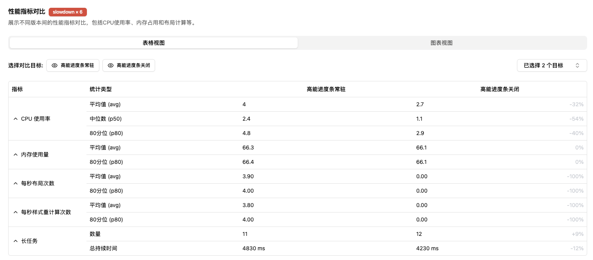

timeUpdate中，其实不止有高能进度条的绘制事件，还有别的导致重排重绘的事件，如果考虑这件事，实际上只优化高能进度条并不能减少重绘重排次数，以开启进度条为例（但这里去除了小电视）：

[关闭高能进度条 vs 开启高能进度条 (均不关闭进度条)](https://fe-perfcat.bilibili.co/utils/shorten/eMHK7w)

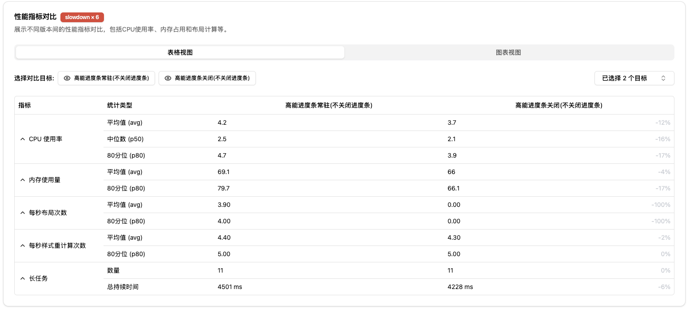

此外也用time timeEnd收集了维护区间算法的性能表现，n = 10, cpu throttle = 6的前提下

![img](data:image/png;base64,iVBORw0KGgoAAAANSUhEUgAAATsAAAAnCAYAAABwv++TAAAAAXNSR0IArs4c6QAAFRZJREFUeF7t3QOQJUkTB/Da72xbe7Zt27Zt27btu92zbcZZe7Zt21/8KqImanof+s3NLGY7IyZm5r1GVVbVP/+Z1Z3Zo2fPnv+GSioNVBqoNNCNNfDuu++GHq2C3bDDDhtV8ssvv7SkmmGGGSb8+uuvLZ3T7GBt+e2338I///zT7ND4vTb8+eef4a+//ip1fDqoR48e4d9/K5vQktKqgysNDEAa6BDYnX/++eGjjz4KBx54YN2u/O9//wsjjDBC+OOPP+Ixo446arjwwgvD7rvvHt54442284AO8BlttNHCRRddFF5++eWG6unTp0+46qqr2o657LLLwltvvRUOOOCAsOKKK4aJJ5647bshhxwyTDLJJGGrrbZq++zqq68OZ555Znj//ffDTDPNFIYeeuj4M9ZYY4XRRx89tuP2228PV1xxRds5+nLttdeGyy+/vN29u2IcBx988DDEEEN0yCgMP/zw4aeffur0Zo000kjh+++/r3lduqG7r776Ko5jLvSqP53dpmY60l5SbLP2MHbffvttp+uouuCAr4FSYLfmmmuGZZZZpg20hhpqqPDjjz/WnMRHH310eOWVV8LCCy8c9t5773ZsCDsiOUP64IMPwuabbx4mnXTSCEL33ntvTa0NNthg4e+//w4vvvhiuO222+IxQKFnz57htNNOC/vss08ErymnnLLtfKxviimmCEsssURfYKf9QBDYuoa23XTTTREEX3rppUAxucw333xh//33D/p33333dcnI6sOCCy4Y2/Lpp5/G9pVhwtp/0kknBf2l29NPPz32JYmx23jjjcOII44Yx4TBIGOPPXbo1atXu7489NBD4dBDD42fOc/YDDfccFFPDzzwQDjmmGPid9p40EEHhbnmmiv+7b7bbbddePPNNwOwYQinnXba+N0XX3wRtt566zhnyPTTTx+23377MNFEE4VbbrklnHrqqX3pc955543XMBa77LJL2/eNdDTNNNOEI488MgIaefXVV8OOO+4Y28NA6z/54YcfomF1b3LCCSeE6aabrl0bllpqqdLeQpdMhuqina6BUmAHMGacccZ488022yz+Pu+882o25p577omWE9jtsMMOYY011oh/F2WcccYJjz76aFwcBNiZ9NiZhXHuuee2LfTxxhsvXHDBBWGLLbaIYJQE6G2zzTZhnnnmiQv4tddea3cbzBIjA3aTTz55OPnkkyPTII899lh45pln4t+rrLJK0B4gQbjFd911V19txkoXX3zxduDZWSMCTLFTev3555/jIn388cfjZ80E49SvvfbaKx6vL6uuumoEF/o3ZsDT5/vuu2946qmn4iX9f/HFF0e9f/jhh/Gzjz/+OHz55ZfxegATg99zzz3D6quvHlZbbbWwySabxM823XTTeG3jwkAxNM8++2z4+uuv274DhgzUwQcfHO+pbWOMMUa49NJLIxPEos2XY489tl0XGbHrrrsuYObmBxAljXSEYQIv13U/LHOyySaLhsk9GSrAbm7Skzm1wgorRBA/5ZRToudx3HHHxfsIibzwwgvN1F59P5BpoBTYpT4ltgZU3nnnnbaujj/++NE1Peecc9o+S2BnobG2ubC8XJ8rr7wyWtwc7NZee+244C02YGkRmqQYzpZbbtnuOgnsWPSddtqpjTkAORP4wQcfbAM7C8gEP+OMM+Jnn3/+eVysBMMhn332WfwNJLbddtu+htIiWWSRRSIDvf766+sONUa26KKLxgULiMoIdsHlXmmllSKY7rbbbnEhJkZd7xoJPBKb46ZjML17944/jAjwpk8GpBbYMS5vv/12X2N04403BmECLIiL7296BSr6jzlhWkW55JJLYjyXcSL6xmAut9xykXUZL4bG+N1///19gd1+++0XjROwA54J7BrpiJ7MgbXWWit88803DVU+22yzhSOOOCIC4BNPPBH7xFspzq9m43bIIYdE/Y4yyijh+eefD1NNNVVkjcaOwbAudt1119h3DPe5556rqa9m96m+7xwNlAa7WWedNU4Qg2ZgDWqSWWaZJbCsWFkOjCYphkG4mkAEo+Ia3X333XGSJUnMzqQFTNxFbhA3houx7rrrRqudSwI7wOI8TIJwf8TdxPYSs0vnpZgdpgEUgDEwmHDCCSPL4RI+8sgjkeEUxSLXb24dUKq3YQHc6evOO+8Mxx9/fKmRAhAYnQWrzRYL5pW74LUulBauhbrYYotFtsLlx5oPO+ywtlO4jPXALvXjk08+CYAm9f3EE0+MAKzf2DNgxe7oS98YPePmfAyKEfAdcMTosD9inIUXllxyyb7Grwh2jnM8oDzqqKPagV0jHdGbecBgGcv33nsv9vfpp5/uS21c6OWXX76N/bofoNIPjPCaa66JfWgm5gvwFlqZf/75o3ED6PR11llnhbPPPjuMOeaYcQ6Y0zPPPHME/kr6jwZKgR3LxNXhcnDjDOZ3333X1mJxppFHHrkN2Hyx8sorR9dnww03jIsPQGAB4jXcHi4l4EwbFDnYpQsn0LAIN9poo740lIMdlpZca66WCVsEOxPu1ltvjdf5/fffozUHplwb7E4bxx133Ng+YJvL3HPPHd0j/bGIuGL1WBvgBQ4AQQysjAA4LrpgPoDBei3K5I7WuwYAwR4sduDEVcRAbdpwu5PUAjuxLLoC/HPMMUcEI0H9xHiNYdrcSTFNzNh40iNwoAffrbPOOhEg6GS99dYL66+/flzsjnENxyy77LLtNjGKzM4xxowxBdSulTO7RjraY489wpxzzhk9AW0yTtxk4JNLAlPtT8bWPDUfuK/A3Bww9wBxIwF2PJqbb745usDGHcNmLLA+39sUMTbCCJX0Xw2UAjuuJrcPWIllsZr5DhuraKLkEwvTEMcRCwGEJG1Q+NsiSCzRoiyCnfMtdAzB4rJwTPZccrCziZJidtoDLHKwA8ja757cL/EozMMi9Rs75bpirxhk0QJb5Ky+WJpzME1MttVHWOoNtwVqg8EPtik+ZVMBADV65AVIAQasWWiBLhkj7lnaaHDPWmBXbAvAwA7pXb+4sRgb4McgDz/88LgRQu/mgXhacvcBnXO0XR9sKgB8+jZfAHgzZkevQMoY2MXXHv2yKcIoNdKRfmt7iikyqhgVg/H666/HrgpjMFQmfa0whWOAk34DXPdvBnba5XieCxYO7BgMc2322WePTBn70x/MNN/l779Lf9C7eymwyx89MMkBCYubxCTDjFjFJGJDic2lz0x2i4ElBUjYHZfWjmwCuw022CBOUtfjFt1www0RXDC7IuDlYMdttFlBTDzB8hzs9MFkx85cF4hqIwAzYT22wf3B9ixwLlQSTAcgajvmwGUHlnSRu+LpeOwBG7YrXYyF1ZtidDH11FNHloBFY2h2OlPMTswNWyCJPfg77agCGu30W9vyeGhZsNM/12A4hA7EtLAS/SD0LXCPOfrbY0KJPXLbhAWMVZK0Swt0XQ9TLBqr3I0FQLnBZOSI3VxssZGOMEk/2o6pC0eIIae4XHq0STzPWNYzUtqM9ZWJr2FujcAu9dXcBv7ikDbDOvtRnEEPtjrW41Jgl1/aAhcXyQfMYJo83JQkrJiJnDYgfJ6DnQC3uFra1Ehgx3q7Dtcsp/4s/gILLNAWB0qLD8CJ1ZjkiQGZsEVml9qVYnbAjtVPu4pYKGtsYWIiidlxX8UCi49zJLe2CCru05GYnfAA4MCcuJUWUgIW18xdcO3MY1FcdsyajuiDnm30JINEt4DcYycMhutyc7FHOrNZgLkJrAMWBigxHIuegbAxY8MobVBgX3TmHOBvR1XMCnOymYHJuY/zsGHjDRCJWCTj4lqMkucvuX7Fh9SLbmwjHfEgsCaxSu68HWQxsqWXXjoyTfOKwaA7Lisxv9IjSNiZOazvCy20UDtGWG9pNQM7wGaTLO1Qm6M8AvHYSvq9BloGO3EoCynf8WKx/WBlxG6oBcjK5wwwPe+F2Zmc+TUsSK5iLaaUq8XiTM/ZJWbnUQgsMj3AbBdPsN+Or0cjcveJK4z5AQfMzgK1iLTZ3/ohZsd1Ah4mJ7ewVrsApQlsIWOLSQAB8LjjjjtaCkgDjPSIj40QCy89AJuDHdBKj824J9akvemxGgvbQkxS6zEaLjiXL99UAgJAIjE5bBpbp096x+TSM2/GD3BizL7jQgMS7cVg0mM82sAl1ObEpuzqAsRcsLYUT02fAzvAAGSTNNJRGi/H2r2nB+yefmptDIjx+p7RTSzSuWUf+UkPwddzYxl8GxT0Y765T7P53e8hYNC5438COxYdswE04mDYGBFH4v4kl0Ysw8KxMGw2WMRFYe3L7FxiZNwVksAOEysK9wVzAbbaIW4CgAECdw3zAHZAg+Xnvlqo3GEbMSYlFmhBp4dPa00Lu7Kul3Yp/+vUAbrcwVq7wc2uzXVzXvFNhkbnuR/33oZTevSmeLxHKIxbrVfy7NDagU0PDKdz6dR5QhS+70xppCNGwVxy37LCE5hgggniHLFJ1Jnt5T6LWZcNZ5Rtc3Vc6xpoGeyAAUudrLRnpgCQXak8kG5CpgUA5Lg8jgMuZd4KKNMVmwq2/Wstbvf0k096ixqbdH8T2yQs7pIJ5Osb0ADmZd65rd6bLTNa1TGVBvqvBloGu/7b3OrulQYqDVQa6JgGKrDrmN6qsyoNVBoYyDRQgd1ANmBVcysNVBromAYqsOuY3qqzKg1UGhjINFCB3UA2YFVzKw1UGuiYBiqw65jeqrMqDVQaGMg0UArsvMZUSaWBSgOVBgZmDXgut+UaFANzh6u2VxqoNDBoaqAUsxs0VVP1utJApYHupIEK7LrTaFZ9qTRQaaCuBgZ6sGu1lGKuCa95yb5RfK+zqC3v08oCkmd68XK8l8c769W3ao5WGqg00LUaKA12qi3ZqAAO3iv1t3ddAQYg8F6sl+LzPGGyjaTU3Hk3vLPqvDzleL8qpZjaAcC85O8FcPnj5JGrJ7KYeOE9T2Ag95r251lDOmOompUJbHSPRqUU/8t1ixlqyvTTe8UyfkiE2mqC06rkYRkNV8e0qoGWwE5CSjnHMBzpgWTDleZGDrRa7AgoSqfkt6IkKY2O9EvqROQVnPpVKUUKkhlDbjWsUFop2WQBnxRPtQTQSdcjhZFEBhajY/3Uq7LW6kA4vqtKKTa6bqOyhuo0yFYjqQNjJvdgyhbdqPygNOxSZaUECdI/SQ2VWHC9ezYreaiYjnmXiySrXVXasiNjWJ0z4GqgFNhhMQq5FF1A/xdThmN3JrU0TxaZ7+Vmk31ECiGplLBCef4Bp8y4junqUoqp7XKtpcJB8u9pQ0rZLtGifGkpi4oFK3cfkSFFvjzHpzTz+ikHnMWWElN2dKi7qpRio+s2K2toq16qezqRsksyzFQTo1H5Qfdk2OS/UzTJPJBxWs6/RvdsVvJQbkFjJudeEinXq1BCR2fdoHVeKbCjEkWLVQuTUonI5mrhP/nkk/F/SSflmUsJNDEArpM8afKLEdl1Z5hhhphjjtsq7qXOgnRKCey6spSifHsy58pbh9HlmXG1C/DKZabWgn5JCZWeMVSPQF47C5hYcOl/QJ7q3/puQCql2Kj8YKOyhqlqWSqzmEopyiosqWYr5QflPKRrY12mlGJagsWSh8DOT7PyksUlDKBlDWakGFxpu/SH0ZMV2jzF7s1hxlgaMCGLCkS7FxiWBrvkCkloSQCDIjzYUPo/WX1uYgKWpC7pzrmyqQZoAj9pyLnBXV1KUWxNER/FY6QuN6mLgqEBYYtMLYSctcrQvPPOO7erx6AWQ61iyh1Jy95VpRTLXrdY6Stl95UlGLsD/IBOCUxMr1n5QSwNKMljiN3VqrVbr25sGpdiyUNAJxuxcREvljJeyvxkYOstTX2Q6l/7ucEMlvgmN1vi1ZSaX59kRhZrlki2mCa+ey39Qa83pcFOARjuScrfn8Ai/z+BXYq/ieOpQ6G4jqy1qi7JaqzugIlk0yO5N11dSjFtpJSx1tiH4wCfQDuR4lvcCcATICIVOrCz+PKatgNSKcWyJRprAY806Vi3WF3K7ixOKwt0s/KDQE5c1ninouPFTMiNwK5WyUPVujBtRY+k0meUlKrMq6jVWsLATs0QXkOq5asmhw0mRjuBoXoayXMZ9KCg+/e4NNhhdqw9q04Ehh9++OG2lOUYU17j1KSSyhtoFNNcAxPgoM6nWgmApKtLKaahFFuTkj2BdD7EADyvpsVNxVJTCcic6RU/wxxa3XXM791VpRTLXrcW8Cj8DOSEIYA8Zq4+h4I2uTQqP2jTwSZWquqVn1cP7MqUPEwGKBUsb7RUgZkYsgpl6kCYuzJSY/vmLKOmBkaqF6FoDwAtk6W6+0NE9+lhabBLLkRiNorZkPx/kycxJyDGRQWCakTkqdNtEihBBxwUN7Gr2dWlFNOQ2XUVR8yrnqXvPIIidiOOk4tYE7fWwkhiodZzYwekUorNSjTm/cnLGub9B+zqYghh2F1XqrH4faPyg+raYmXN6sa6ZtmSh441lja67Br/F7BL57q3eW6szVvAXkn30UApsBPAFdDPRXEXTEeBkiR9+vTpa1dSZSuAmLMelluBHiX2kvSrUoqqXnFVau2ecqltTuRgh7VY5NwlbmsZsOtIzK6rSik2u26jsoY2pVQaM/76BFgYNIbLJky98oMeVxGqUJcEo7KZw/UUMyX17um7RiUPuZzCBqrJCYHYRMgrntVbls2Ynd14XohNJoaK0TPfzYdKuo8GSoEdV05191xU5gJu3IIkQM2jALm7B+xsQORgZ9Fgdqksn/P7VSnF3r17R3cFoyyKuI5+JbDzfBl2KpgtiJ2/QdGI2Q1opRQblR9sVNbQpoJxIcYP6zXmpFH5QTE+xpCYC4oa2UhIVeDq3ZPhbFTyUE1a7mcS88pjUWLBjaQZ2GHodunTvPVcoF3oSrqXBkqBnZ0p8bpcasWxfC+2Z9JyMQjA8BBxHv/wGRG4NrEUh+7qUoqp7b169YqPHYg3FsXjNDnYWbSeFzPxizt+jcDuv0yRriql2NHresPE2BVLOzYrP+h+xhTANdstbUVfdnn9aE8zkGvlugxaam8rpShbuUd1bP/VQCmw60gTscEywpp2NLDfailF7cEMgGxeoDu1U1lIizM9cmBR2UgpPjjteIyHa9aZC7mMvqpjKg1UGuiYBroM7DrWnOqsSgOVBioNdI0GKrDrGr1WV600UGlgANMAsPs/clPdfNael3oAAAAASUVORK5CYII=)

##### **埋点设计**

```
export interface IPBPTrack {
    updateClipRectCount: number; // 更新clipRect的次数
    updateZebraPathCount: number; // 更新zebraPath的次数
    updateLineCount: number; // 更新line的次数
    zebraAreasLength: number; // zebraAreas的长度
    isOpenPin?: boolean; // 是否打开高能进度条常驻
    isOpened?: boolean; // 是否打开高能进度条
}
```

##### **总结**

数据结构和算法上，有一定优化空间，可从O(n)优化至O(logn)但是实际表现应该不会有明显优化。

重排和重绘上，需要同其他timeUpdate的视图更新同步优化。

埋点已写好但还未灰度发布。

#### **性能优化**

根据上述探讨，主要应该对timeUpdate进行节流，综合用户体验，短视频中如果进度条绘制频率低，较容易被感知，因此应该少节流；而长视频进度条绘制频率低不易被感知，可以多节流，因此暂时采用以下节流公式：

​                ● 视频时长[0, 1min) : 维持原有方案(0.25s 绘制一次)

​                ● 视频时长[1min, 30min] : 固定为每0.5s绘制一次

​                ● 视频时长[30min, +无穷大] : 通过累积阈值节流，进度条每移动0.03%，绘制一次

​                ○ 30min的视频，每经过30min × 0.03% × 60 = 0.54s 绘制1次

​                ○ 120min的视频，每经过120min × 0.03% × 60 = 2.16s 绘制1次

 

此外，发现小电视图标每次移动都调用两次clientWidth计算位置，导致了额外的重排（但是performance面板体现为svg root重排+document重排，只统计为1次，样式重计算次数则额外统计2次） 

**对于2h的视频，50次seek，每次seek至30s后，静置5s，运行perfcat得到结果：**

原始进度条：https://fe-perfcat.bilibili.co/utils/shorten/36DC_X

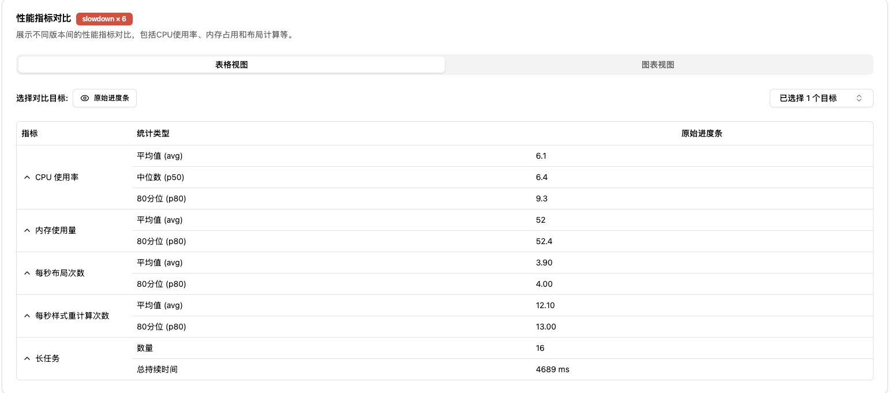

限频+cache：https://fe-perfcat.bilibili.co/utils/shorten/2ZbRDo

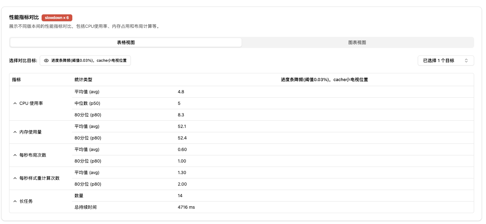

主要指标变动：

平均cpu利用率：6.1 -> 4.8 （21%↓）

每秒布局次数：3.9 -> 0.6 （85%↓）

另外尝试做了限制db存储的实验，对性能几乎无影响：

限频+cache+限制db存储：https://fe-perfcat.bilibili.co/utils/shorten/N4oqoO

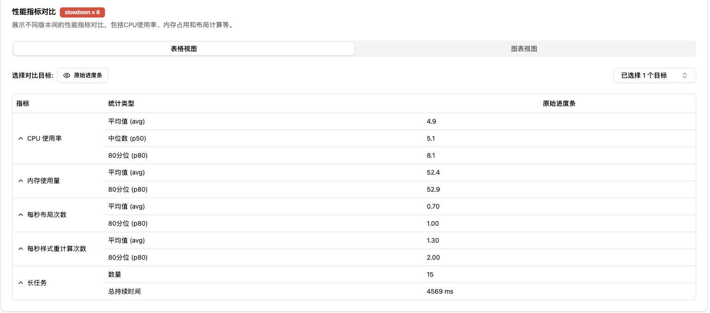

平均cpu利用率为4.9，可以认为是4.8的浮动范围内。

### 弹幕webgl canvas性能调研

用pixijs实现初版滚动弹幕，在cpu throttle*6的情况下，动画非常不流畅，每次拉弹幕都会卡一下

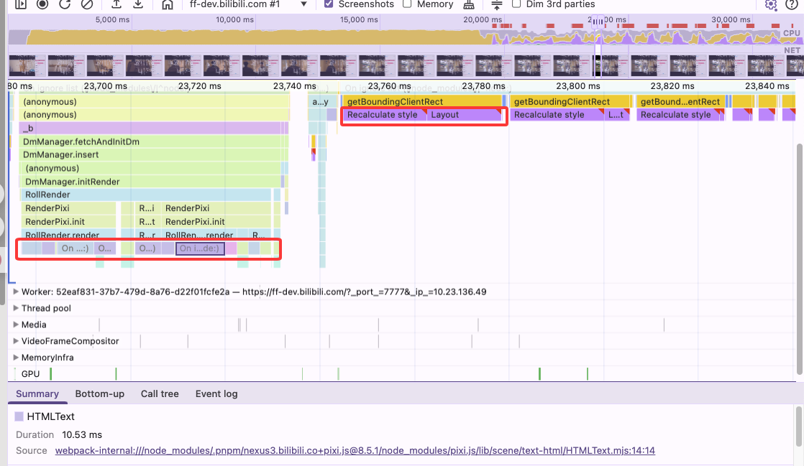

通过跑performance面板，发现两个主要开销

使用HTMLText显示文本的情况下

- 构造函数开销：对象池部分解决（还有部分来自设置纹理样式等开销，不同对象不一样）
- 纹理创建开销
  - HTMLText在渲染时需要创建纹理，在创建纹理的过程需要计算整行字体的宽高以生成纹理，这里调用了measureHtmlText，其中执行了getBoundingClientRect，造成了频率极高的强制重排
  - HTMLText以整行文字作为纹理，并且没有缓存机制，每个实例创建一个纹理，造成了重复的创建开销。

为了解决上述问题，切换了BitmapText，有以下特性：

- 创建纹理时，字体大小通过离线计算而非getBoundingClientRect得到，避免重绘重排开销
- 会创建动态图集进行纹理缓存，即
  - 每需要渲染一个新的字体，就在已有的纹理上移动一格uv-offset，然后绘制并存储，若一张图集满了则创建新纹理，有一次绘制开销。
  - 若是绘制已有字体，则切换纹理至对应图集，仅gpu纹理切换开销。

> 此外理论上也可以预打一些图集，例如收集高频字体先打几张静态图集，更高频的放在前几张以求更高的cache命中率，减少gpu纹理切换的开销

缺点：

- 非htmltext，导致已有功能（例如字体阴影）不通用，带来较高迁移成本


性能变化：

cpu满载->35%浮动，基本消除所有重绘重排，但内存消耗有所提升（纹理存储?）

线上：https://fe-perfcat.bilibili.co/utils/shorten/gPu9AN?runner=Runtime

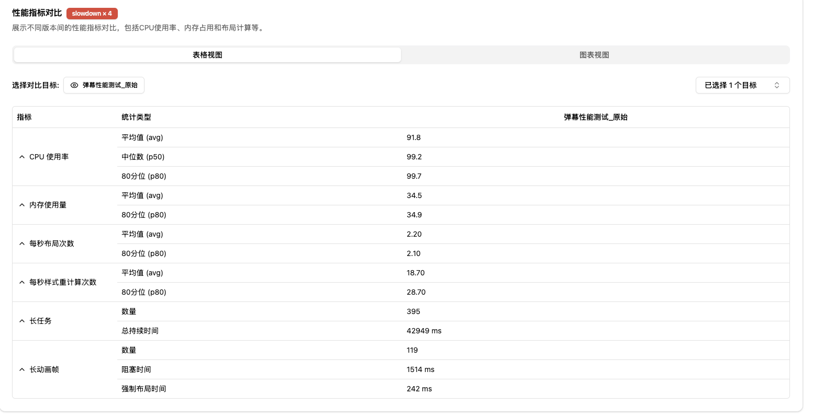

webgl改造后：https://fe-perfcat.bilibili.co/utils/shorten/08JiOL?runner=Runtime

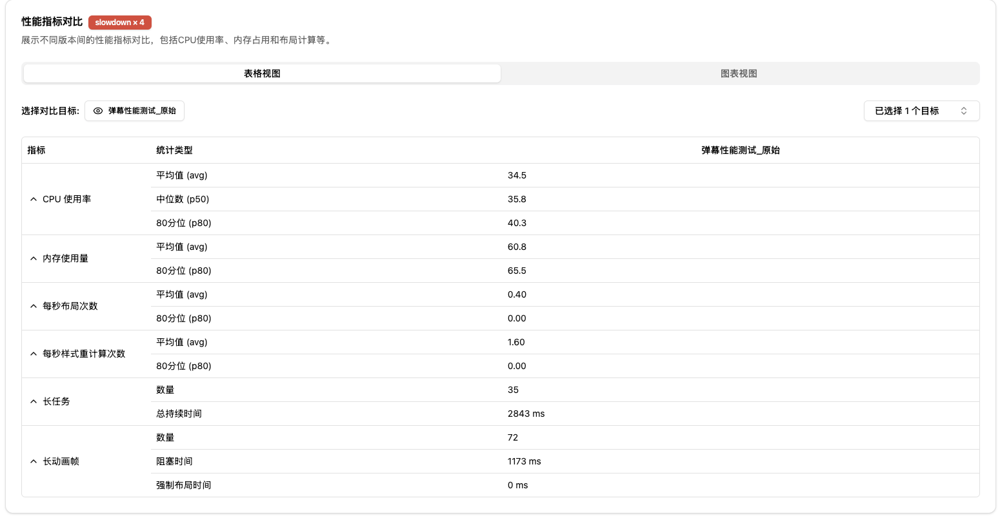

源码部分：

HTMLText

```typescript
// 渲染阶段生成纹理
private async _buildTexturePromise(options: HTMLTextOptions)
    {
        const { text, style, resolution, textureStyle } = options as {
            text: string,
            style: HTMLTextStyle,
            resolution: number,
            textureStyle?: TextureStyle,
        };

        const htmlTextData = BigPool.get(HTMLTextRenderData);
        const fontFamilies = extractFontFamilies(text, style);
        const fontCSS = await getFontCss(
            fontFamilies,
            style,
            HTMLTextStyle.defaultTextStyle as {fontWeight: string, fontStyle: string}
        );
        const measured = measureHtmlText(text, style, fontCSS, htmlTextData);

        const width = Math.ceil(Math.ceil((Math.max(1, measured.width) + (style.padding * 2))) * resolution);
        const height = Math.ceil(Math.ceil((Math.max(1, measured.height) + (style.padding * 2))) * resolution);

        const image = htmlTextData.image;

        // this off set will ensure we don't get any UV bleeding!
        const uvSafeOffset = 2;

        image.width = (width | 0) + uvSafeOffset;
        image.height = (height | 0) + uvSafeOffset;

        const svgURL = getSVGUrl(text, style, resolution, fontCSS, htmlTextData);

        await loadSVGImage(image, svgURL, isSafari() && fontFamilies.length > 0);

        const resource: HTMLImageElement | HTMLCanvasElement = image;
        let canvasAndContext: CanvasAndContext;

        if (this._createCanvas)
        {
            // silly webGPU workaround..
            canvasAndContext = getTemporaryCanvasFromImage(image, resolution);
        }

        const texture = getPo2TextureFromSource(canvasAndContext ? canvasAndContext.canvas : resource,
            image.width - uvSafeOffset,
            image.height - uvSafeOffset,
            resolution
        );

        if (textureStyle) texture.source.style = textureStyle;

        if (this._createCanvas)
        {
            this._renderer.texture.initSource(texture.source);
            CanvasPool.returnCanvasAndContext(canvasAndContext);
        }

        BigPool.return(htmlTextData as PoolItem);

        return texture;
    }

// 测量文字宽高
export function measureHtmlText(
    text: string,
    style: HTMLTextStyle,
    fontStyleCSS?: string,
    htmlTextRenderData?: HTMLTextRenderData
): Size
{
    htmlTextRenderData ||= tempHTMLTextRenderData || (tempHTMLTextRenderData = new HTMLTextRenderData());

    const { domElement, styleElement, svgRoot } = htmlTextRenderData;

    domElement.innerHTML = `<style>${style.cssStyle};</style><div style='padding:0'>${text}</div>`;

    domElement.setAttribute('style', 'transform-origin: top left; display: inline-block');

    if (fontStyleCSS)
    {
        styleElement.textContent = fontStyleCSS;
    }

    // Measure the contents using the shadow DOM
    document.body.appendChild(svgRoot);

    const contentBounds = domElement.getBoundingClientRect();

    svgRoot.remove();

    // padding is included in the CSS calculation, so we need to remove it here
    const doublePadding = style.padding * 2;

    return {
        width: contentBounds.width - doublePadding,
        height: contentBounds.height - doublePadding,
    };
}
```

BitmapText

```typescript
   public ensureCharacters(chars: string): void
    {
        const charList = CanvasTextMetrics.graphemeSegmenter(chars)
            .filter((char) => !this._currentChars.includes(char))
            .filter((char, index, self) => self.indexOf(char) === index);
        // filter returns..

        if (!charList.length) return;

        this._currentChars = [...this._currentChars, ...charList];

        let pageData;

        if (this._currentPageIndex === -1)
        {
            pageData = this._nextPage();
        }
        else
        {
            pageData = this.pages[this._currentPageIndex];
        }

        let { canvas, context } = pageData.canvasAndContext;
        let textureSource = pageData.texture.source;

        const style = this._style;

				// uv-offset
        let currentX = this._currentX;
        let currentY = this._currentY;
        let currentMaxCharHeight = this._currentMaxCharHeight;

        const fontScale = this.baseRenderedFontSize / this.baseMeasurementFontSize;
        const padding = this._padding * fontScale;

        let skipTexture = false;

        const maxTextureWidth = canvas.width / this.resolution;
        const maxTextureHeight = canvas.height / this.resolution;

        for (let i = 0; i < charList.length; i++)
        {
            const char = charList[i];

            const metrics = CanvasTextMetrics.measureText(char, style, canvas, false);

            // override the line height.. we want this to be the glyps height
            // not the user specified one.
            metrics.lineHeight = metrics.height;

            const width = metrics.width * fontScale;
            // This is ugly - but italics are given more space so they don't overlap
            const textureGlyphWidth = Math.ceil((style.fontStyle === 'italic' ? 2 : 1) * width);

            const height = (metrics.height) * fontScale;

            const paddedWidth = textureGlyphWidth + (padding * 2);
            const paddedHeight = height + (padding * 2);

            skipTexture = false;
            // don't let empty characters count towards the maxCharHeight
            if (char !== '\n' && char !== '\r' && char !== '\t' && char !== ' ')
            {
                skipTexture = true;
                currentMaxCharHeight = Math.ceil(Math.max(paddedHeight, currentMaxCharHeight));
            }

           // 计算uv-offset，先尝试向右写，超宽度就向下写
            if (currentX + paddedWidth > maxTextureWidth)
            {
                currentY += currentMaxCharHeight;

                // reset the line x and height..
                currentMaxCharHeight = paddedHeight;
                currentX = 0;

              // 纹理页面被填满，创建新纹理
                if (currentY + currentMaxCharHeight > maxTextureHeight)
                {
                    textureSource.update();

                    const pageData = this._nextPage();

                    canvas = pageData.canvasAndContext.canvas;
                    context = pageData.canvasAndContext.context;
                    textureSource = pageData.texture.source;

                    currentX = 0;
                    currentY = 0;
                    currentMaxCharHeight = 0;
                }
            }

            const xAdvance = (width / fontScale)
                - (style.dropShadow?.distance ?? 0)
                - (style._stroke?.width ?? 0);

            // This is in coord space of the measurements.. not the texture
            this.chars[char] = {
                id: char.codePointAt(0),
                xOffset: -this._padding,
                yOffset: -this._padding,
                xAdvance,
                kerning: {},
            };

            if (skipTexture)
            {
                this._drawGlyph(
                    context,
                    metrics,
                    currentX + padding,
                    currentY + padding,
                    fontScale,
                    style,
                );

                const px = textureSource.width * fontScale;
                const py = textureSource.height * fontScale;

                const frame = new Rectangle(
                    ((currentX) / px) * textureSource.width,
                    ((currentY) / py) * textureSource.height,
                    ((paddedWidth) / px) * textureSource.width,
                    ((paddedHeight) / py) * textureSource.height,
                );

                this.chars[char].texture = new Texture({
                    source: textureSource,
                    frame,
                });

                currentX += Math.ceil(paddedWidth);
            }
        }

        textureSource.update();

        this._currentX = currentX;
        this._currentY = currentY;
        this._currentMaxCharHeight = currentMaxCharHeight;

        // now apply kerning..
        this._skipKerning && this._applyKerning(charList, context);
    }
```

### 播放器agent日志（开发中）

当前用户反馈较多，日志下载分析等流程繁琐，使用AI实现该任务分析处理简单客诉可以提高效率，主要以RAG执行具体任务

#### 7.14 week1

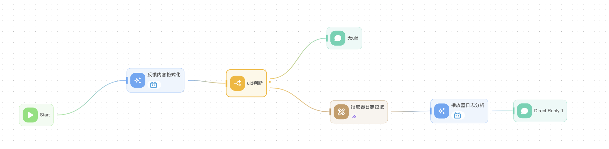

##### 现状

用户反馈问题 -> 格式化问题 & 提取问题重点 & 提取用户MID（LLM） -> 日志提取 （MCP）-> LLM -> 输出日志理解

虽然流程跑通了，但是问题有很多，目前主要是LLM部分使用的是b站自研，输入日志后完全无法理解日志内容（预期是虽然没有知识库，但是要能根据变量名猜测一下），需要一个外部llm的api-key。

##### 可改进点

用户反馈问题 -> 格式化问题 & 提取问题重点 & 提取用户MID（LLM） → **prompt工程（优化用户问题描述）** → 日志提取（MCP） -> **对日志进行一定解析** → LLM (with **RAG**) -> 输出日志理解

接下来尝试优先级

1. 先更换LLM
2. 根据表现，尝试制作知识库完成RAG
3. prompt工程，日志解析后再输入等（例如先分割出哪一部分是内核，哪一部分是播放器，哪些是用户信息，浏览器信息...理论上给出更格式化的数据LLM的解析效果会更好）

#### 7.21 week2

一期目标：

目标：能够理解日志内容

- 能够梳理清楚现有公司Copliot平台、MCP平台具备什么能力？

- 梳理缺乏的知识库内容+补充埋点，将知识库内容补齐

- 模型能够正确理解日志内容，输出用户的设备信息、浏览器信息、稿件信息等

---

**公司Copilot平台提供了目前制作agent需要的常见能力**

● 大模型基座能力：内部自研 or 需要api-key的外部模型

● 流程控制能力：提供workflow，状态管理

● RAG能力：

​	○ 数据：可以自己输入知识库，包括本地文档、表格，info页面、腾讯文档等。

​	○ chuking：支持部分自定义（重叠长度&分块长度），但也有推荐行为，暂不清楚底层实现

● MCP能力：支持将云函数部署在公司平台，但是似乎不对公司其他平台有任何数据交互，例如若需要日志\埋点数据，需要自行编写爬虫函数。

---

**TODO LIST：**

● RAG相关

方案1：人工制作以下文档

​                ○ 播放器基础知识

​                ○ 日志相关的模块文档

​                ○ 问题分析和解决方案（少部分demo）

方案2：

​                ○ 根据日志动态拉gitlab代码or干脆直接把代码做成知识库（log涉及65个文件，仅log.e涉及23个文件）

​                ○ 但是用外部模型有合规性风险

● 接口相关

​                ○ 目前拉取mid的方法需要登录fawkes平台，拿到cookie验证，cookie每天刷新很不方便（模拟扫码登录 or 联系fawkes平台？）

​                ○ 之后有可能需要垃埋点日志

● prompt相关：根据效果慢慢调，另外如果需要可以指定一个指定的输出schema

● 日志拆分