# 简记

## 常用命令

Link to test danmaku

```powershell
pnpm link @bilibili-player/danmaku-x --dir /Users/satori/Project/danmaku-x/packages/danmaku-x-core
pnpm unlink @bilibili-player/danmaku-x --dir /Users/satori/Project/danmaku-x/packages/danmaku-x-core
```

## 测试账号

>bilitest2323
>
>bilipoi233

### 有趣但是不急的TODO LIST

弹幕hover定位问题可能的修复方案：https://www.cnblogs.com/coco1s/p/17630048.html

## 流程整理

整个大框架是

初始化store -> 出画 -> install插件

> /**
>  * @file 仅供项目内使用。使用 PREFIX_NAME 命名
>  *
>  * @desc 以下事件提供触发顺序保证
>  *      - PLAYER_GRAPH_FLATTEN
>  *      - PLAYER_STORAGE_BUILD
>  *      - PLAYER_STATE_CREATE
>  *      - PLAYER_STATE_CREATED
>  *      - PLAYER_STORE_MOUNT
>  *      - PLAYER_STORE_MOUNTED
>  *
>  *      - Player_Navigate
>  *      - Player_Committed
>  *      - Player_Prepared
>
>  * - Player_Initialized
>  * - Player_Connected
>  * - Player_Connect_Returned_Promise (链接播放器后返回的 Promise)
>      *
>  * - Player_Dispose
>  * - Player_Disconnect
>      */

### 初始化store

#### 内部事件

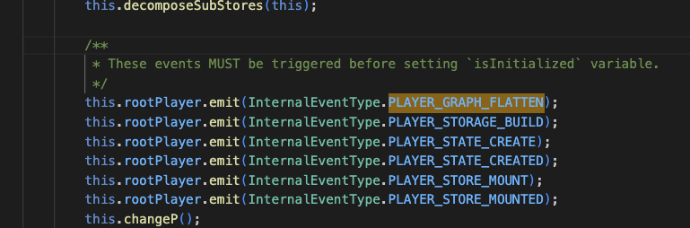

- **new root store**：先new一个root store，这个store会管理一些全局状态（ding、pageHidden等），同时也是所有其他sotore的容器，root store持有一个substore，里面包含了所有其他store
- **new substore**：这里就进行了其他store的初始化（但是生命周期函数还只是on上去，并没有被触发）
- **flatten in root store**：将substore flatten到rootStore，这步叫做decomposeSubStore,例如有一个store叫做Astore，decomposeSubStore的功能就是rootstore.substore.Astore -> rootstore.Astore
  - 这里触发了第一个生命周期函数PLAYER_GRAPH_FLATTEN
- **flatten in all store**：通过on（PLAYER_GRAPH_FLATTEN）所有store也执行decomposeSubStore，从而使任意store互相持有对方的readonly实例（不持有rootstore，但rootstore持有其他store的实例）
  - 当emit了PLAYER_GRAPH_FLATTEN后，所有store同步地执行flatten，结束时候，emit第二个生命周期函数，所有store执行响应功能...直到结束所有的InternalEventType
  - changeP就是触发第一个[public]生命周期函数Player_Navigate

#### public事件

- 内部事件的最后一个触发了第一个public事件 Player_Navigate的emit

##### Player_Committed、Player_Prepared、Player_Initialized的emit

- [public]声明周期的触发就不是依次emit同步执行了，而是通过计算属性和reaction推进，举例，什么时候emit Player_Committed呢？

  root store中声明一个计算属性，可以看见，这个计算属性首先要求上一个生命周期的计算属性已经为true（由此保证生命周期顺序，然后就是要求本周期所需要做的事情准备就绪），这里也可以看出为什么不能像内部事件一样依次emit，因为**public的生命周期的推进需要一些http请求完成，例如用户config**

  ```typescript
      get isPrepared(): boolean {
          /**
           * pgc播放页耗时优化需求, 跨season时不会传入aid cid,而是通过seasonid 请求playurl
           * ogv 场景下, 如果没有 cid, 需要等待playurl结束获取,并赋值给configstore以后才算准备就绪
           */
  
          const isPrepared = this.isCommitted && this.configStore.state.isCompleteIdEnded;
  
          if (this.rootPlayer.hasFeature('outSideReload')) {
              return isPrepared && this.mpdStore.cidSettled;
          }
          return isPrepared;
      }
  ```

  当上一public周期完成 && 所需要的http数据请求完成，计算属性就会改变，此时event atom里的监听器就会触发，来emit生命周期事件

  ```typescript
  // event.atom.ts 
  ...
          this.dc.committed = reaction(
              () => this.rootStore.isCommitted,
              (done) => {
                  if (done) {
                      this.rootPlayer.emit(EventType.Player_Committed, new CustomEvent(EventType.Player_Committed));
                  }
              },
              { fireImmediately: true },
          );
  ```

##### Player_Connected的emit

在Player_Initialized emit之后，会将connectDeferred（一种再封装的promise）resolve掉，然后emitPlayer_Connected

```typescript
            await this.connectDeferred.promise;
            this.isInitialized = true;
            this.emit(EventType.Player_Connected, new CustomEvent(EventType.Player_Connected));
            runInAction(() => (this.connectDetails.finished = true));
```

### 初始化插件

根据代码，知道在this.rootStore.isLoadEnded后才会开始尝试install插件，即

- 生命周期上，要求：Player_Prepared之后
- 下发数据上，要求首帧加载完成（或首帧加载失败）

```typescript
// helper.atom.ts
/**
     * 插件初始化逻辑
     */
    private buildHelper(kind: HelperKind) {
        if (this.dc[kind]) {
            this.log.e(`E:Helper(${kind}) is repeatedly initialized`);
            if (DEBUG) {
                throw new Error(`Helper(${kind}) is repeatedly initialized`);
            }
        }

        /**
         * Modules that `BasePlugin` required MUST be ready before install plugin.
         */
        this.dc[kind] = when(
            () => this.isReOk && this.rootStore.isLoadEnded && this.helperState[kind],
            () => {
                const H = this.helpers.get(kind);

                if (H) {
                    new H(this.rootStore).install();
                } else {
                    this.log.w(`Helper(${kind}) not found`);
                    if (DEBUG) {
                        throw new Error(`Helper(${kind}) not found`);
                    }
                }
            },
        );
    }

// root.store.ts
    /**
     * 首帧加载已结束 (成功或超时)
     */
    @computed
    get isLoadEnded(): boolean {
        return this.isPrepared && (this.uiStore.state.isLoaded || this.uiStore.state.isLoadTimeout);
    }
```

发版

## 文档

https://info.bilibili.co/pages/viewpage.action?pageId=9841170

## 弹幕

gitlab：https://git.bilibili.co/npm/danmaku-x

文档：https://neo-pages.bilibili.com/npm/danmaku-x/

## 发版

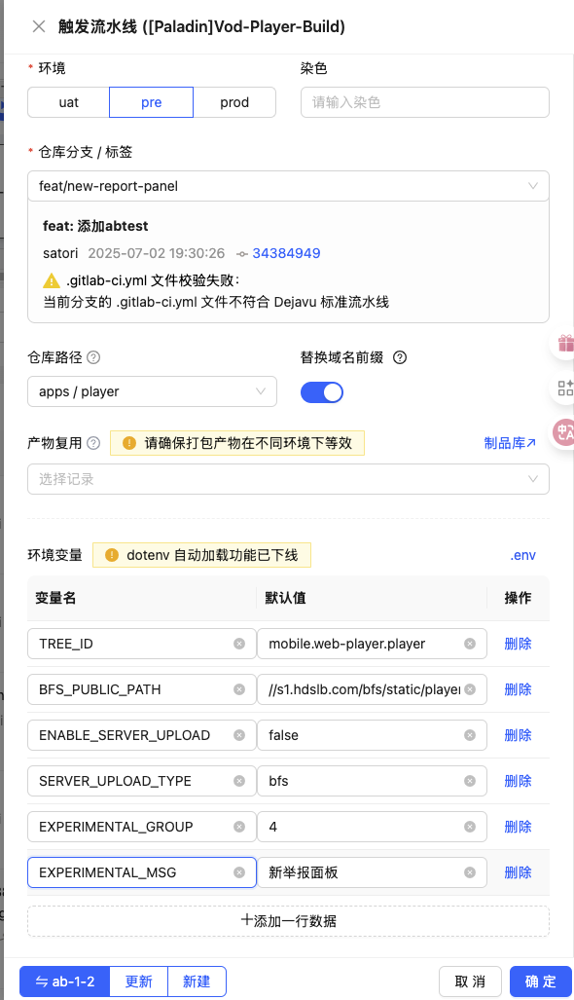

实验组如果没特殊需求不用加，删掉即可

记得点替换域名前缀

## prompt

### 基础知识生成

现在你拥有了每个模块的具体知识，我还需要为agent增加一些基础知识，我目前能够想到的有：
播放器的生命周期
pgc、ugc等概念解释
aid、cid等概念解释
请你告诉我还有什么可能需要告诉agent的吗

### 分模块

我现在正在制作一个播放器日志分析助手agent，播放器日志来源于代码中的log.i, log,w, log.e

现在，我需要你根据代码制作一份agent的RAG，但你不需要一次性全部生成，请根据我的思路按步骤来
请注意，工作目录位于apps/，同时源码以.ts结尾，请你在调用检索工具的时候先规定范围;此外，检索结果通常>100条，请你选择能够返回200条以上结果的检索工具

1. 我需要你分别检索所有的log.i, log,w, log.e，注意不要用正则表达式一次性检索四个内容，否则你会一次性检索太多内容
2. 根据你检索到的日志相关的代码，先将这些代码分模块，例如：生命周期模块，播放器内核模块...，请你按照尽量相同的粒度划分每个模块，考虑到我之后可能需要你分别输出每个模块的RAG文档
3. 对于每个模块，请你简要介绍该模块的功能，划分它的理由，我并不需要你在这一步输出详细的模块RAG文档。

请你生成相应的模块化结果

## 4.23

### 码率（bitrate）

数据速率，视频每秒包含的数据量、信息量

### 容器格式

容器是一个“包装盒”，用于将 **视频流、音频流、字幕、元数据** 等打包在一起，并协调它们的同步播放。

举例：mp4、avi、rmvb

### 编码格式

编码是 **压缩和解压** 视频/音频数据的技术，直接影响画质、音质和文件大小。

举例：H.264

分为帧内压缩和帧间压缩

帧内压缩：对视频的某一帧进行压缩，例如可以选择尽量保留亮度信息，压缩颜色信息的JPEG

帧间压缩：

将视频分为I帧、P帧、B帧

其中I帧即关键帧，一般为压缩过的单帧，而P帧指参考前一帧（I-Frame或P-Frame）预测出的帧，预测方法可以是记录帧间变化的位置，搜索运动部分等，B帧则是参考前后帧，压缩率更高

### GOP（Group of Picture）

GOP包含一组连续的视频帧，其中包含 **1 个关键帧（I-Frame）** 和若干 **预测帧（P-Frame/B-Frame）**。

也可以理解为，下一次出现I-frame需要经过多少GOP，GOP越高，压缩率越高（此时若码率不变，视频质量也会更高）

### 码率控制（Rate Control）

#### **CBR（Constant Bitrate，恒定比特率）**

整个视频统一使用固定码率，虽然可能导致信息浪费，但是可以降低编码压力，适合带宽受限场景

##### **特点**

- **固定码率**：整个视频的码率基本不变（如 4000 kbps）。
- **文件大小可预测**：适合带宽受限的场景（如直播、视频会议）。
- **画质波动**：简单场景可能浪费码率，复杂场景可能画质下降。

#### **VBR（Variable Bitrate，可变比特率）**

设定一个目标码率，对于简单场景使用低码率，复杂场景使用高码率，但是文件大小不可预测

不过可以选择1-pass和2-pass，如果是2-pass可以确定每一帧的码率，第一个pass确定复杂度，第二个pass用来压缩，让文件大小稳定一些

##### **特点**

- **动态码率**：根据画面复杂度分配码率（简单场景省码率，复杂场景提高码率）。
- **画质更稳定**：相比 CBR，相同码率下画质更好。
- **文件大小不可预测**：可能在某些片段超出预期码率。

#### **CRF（Constant Rate Factor，恒定质量因子）**

不规定码率（CBR有固定码率，VBR有目标码率），而是给定一个画质目标，因此最终压缩结果的码率不可控制，但是能直观的规定大致需要什么画质。

##### **特点**

- ##### 固定画质通过CRF 值（如 18~28）控制画质，码率动态变化。

  - **CRF 值越小，画质越高，文件越大**（如 CRF=18 接近无损）。
  - **CRF 值越大，压缩率越高，画质越低**（如 CRF=28 适合网络传输）。

- **文件大小不可预测**：适合存储，不适合流媒体。

## 4.25

完成task0，mdn

- UGC: up主生产的视频

- PGC：官方生产的视频
- PUGV：专业个人生产的视频

代码问题：

注意交互和内存泄漏（事件绑定，闭包检查）

播放器

- aid、bvid：一个系列的视频有可能是相同的
- cid：一个视频唯一标识
- buvid：设备上的标识符，关联用户行为

安装：

**proxyMan**

**lightproxy**

**docker desktop**

## 4.27

TODO LIST:

- 配置tslink
- 影视飓风、番剧、课堂 获取他们的xid，在demo页播放起来


pnpm-workspace 仓库下的不同项目

- apps
  - bridge
  - **core：播放器的媒体核心**
  - **player：播放器的业务逻辑**
    - UI、业务控制
- assets：静态资源
- helpers：webpack配置、父类、工具类
- packages：和播放器有关的组件或项目
- types：类型定义


Namespace:

Helper：根据不同的场景可能需要不同的播放器，因此建立了不同的helper来根据业务场景进行返回，每个helper里会安装不同插件

create 创建了一个root.player.ts的实例，创建之后需要执行connect来做一些初始化工作


connect：

负责创建UI以及状态中心

attachTemplate：创建了UI，基础的播放器容器

rootstore: 状态中心，有很多子store

所有store初始化结束后，请求播放资源，当出画（即确认所有资源都没问题，并且拉到视频流，成功播放）之后，install所有helper中的插件


状态管理工具：mobx

## 4.28

TODO LIST:

了解一个插件的工作流程

项目规范：https://doc.weixin.qq.com/doc/w3_AAgAJwbjAAkmuoI0lRGR7GpkGlrLD?scode=ANYAEAdoABE32wOcRrAAgAJwbjAAk

### 代码阅读

shortcut.ts

## 4.29

在b站调试的方法：

打开lightproxy，设置为系统代理

在apps/players 目录下

```shell
npm run start
```

（dev下是npm run https）

## 4.30

base.plugin.ts

每个插件有一个类似生命周期的逻辑

install的时候，会挂着一个dc，dp变量，作用类似removeEventListner(id)中的id，在销毁的时候使用。

dc是指disconnect时调用，dp是dispose时调用

```typescript
    install() {
        super.install();
        this.dc.history = reaction(
            // ...
        );

        this.dc.tHisotry = reaction(
            // ...
    }
```

此外还有一些钩子函数（有些是生命周期事件，例如dispose，disconnect，但是有些只是普通的钩子函数），订阅rootplayer上的事件来触发，可以看到Player_Dispose的时候就会调用dp函数

```typescript
    attachEvents() {
        this.rootPlayer
            .on(EventType.Player_Dispose, () => (this.dp = clearMobXDisposer(this.dp)))
            .once(EventType.Player_Disconnect, () => (this.dc = clearMobXDisposer(this.dc)));

        if (this.rootStore.isLoadEnded && this.userStore.info) {
            this.onLoaded(this.userStore.info);
        } else {
            this.rootPlayer.on(InternalEventType.PLAYER_LOADED, (info) => this.onLoaded(info));
        }

        this.rootPlayer
            .on(EventType.Player_Access_Changed, () => this.onQuickLogin())
            .on(InternalEventType.PLAYER_UNLOAD, () => this.onUnload())
            .on(EventType.Player_Dispose, () => this.onDispose())
            .once(EventType.Player_Disconnect, () => this.onDisconnect());
    }

    /**
     * 视频和用户信息都已经就绪
     *  - 只有首次会触发（若后续用户信息有变更，不会触发）
     */
    protected onLoaded(info: IUserInfo) {}

    /**
     * 用户快速登录成功，无刷新登录的回调
     *  - 只有无刷新登录会触发
     *  - 非用户动作不会触发，比如：首次进入页面，播放器主动获取用户登录状态，不会触发
     *  - 此时不保证视频已就绪（通常情况下，视频已就绪）
     */
    protected onQuickLogin() {}

    /**
     * 剧集卸载之前
     *  - 当前的播放信息仍然可以获得
     *  - 直接关闭浏览器时仍然可以触发
     */
    protected onUnload() {}

    /**
     * 剧集卸载中
     *  - 没有当前的播放信息
     *  - 通常用于清理当前的剧集数据
     */
    protected onDispose() {}

    /**
     * 销毁播放器之前
     */
    protected onDisconnect() {}
```

atom、store都有类似的hooks

```typescript
// base.store.ts

    constructor(rootStore: RootStore) {
        super(rootStore);
        this.rootPlayer
            .once(InternalEventType.PLAYER_GRAPH_FLATTEN, () => this.onGraphFlatten())
            .once(InternalEventType.PLAYER_STORAGE_BUILD, () => this.onStorageBuild())
            .once(InternalEventType.PLAYER_STATE_CREATE, () => this.onStateCreate())
            .once(InternalEventType.PLAYER_STATE_CREATED, () => this.onStateCreated())
            .once(InternalEventType.PLAYER_STORE_MOUNT, () => this.onMount())
            .once(InternalEventType.PLAYER_STORE_MOUNTED, () => this.onMounted());

        this.rootPlayer
            .on(EventType.Player_Navigate, () => this.onNavigate())
            .on(EventType.Player_Committed, () => this.onCommitted())
            .on(EventType.Player_Prepared, () => this.onPrepared());
    }
```

## 5.6

提测流程：发包到pre环境给测试

## 5.7

#### fix/close-dmSetting-change-Video-no-disabled

发现是dmEnable修改的

F5的时候是正常的，所以现在先观察F5进入和切换视频进入时，disable的触发顺序

刷新时：

remove : dmEnable（null, 0, false） 

set : sendStatus (5)

set : dmSwitcher (false, 0, 5) -> 直接触发setDisable

set : dmSwitcher (false, 0, 5) -> 触发setStatus,函数里触发setDisable

> 在install之前，就触发了onload，甚至完成了fetchDmView，将state set为0
>
> 然后正常install组件
>
> install (dmEnable, dmSwitcher)

切换视频时：

remove： dmEnable (null ,null ,false)

set : dmSwitcher (false, 0, 5) -> 直接触发setDisable

set : dmSwitcher (false, 0, 5) -> 触发setStatus,函数里触发setDisable

**remove： dmEnable (null ,0 ,false)**

> 切换视频时，触发了dispose，state被设置为null，但这时候不触发监听，

正常关闭弹幕：

set : dmSwitcher (false, 0, 5) -> 直接触发setDisable

set : dmSwitcher (false, 0, 5) -> 触发setStatus,函数里触发setDisable

## 5.9

想看DanmakuStore.state.state是怎么变化的，来确定state的功能是不是“该稿件允许弹幕”而不是“用户设置” 等等，但是没有搜到setState,或者是相关的网络请求

- 猜测: 其实开放了接口给业务方，业务方可以任意的修改我们的store，但是api下没找到

## 5.12

发现了是在onLoaded的时候发起了fetchDmView的请求，更新了state，现在理一下触发顺序

什么时候install插件，触发dmSwitch、dmEnable？至少是isLoadEnded后

```typescript
this.isReOk && this.rootStore.isLoadEnded && this.helperState[kind],
```

什么时候onLoaded，修改state，触发dmEnable？(注意，触发了onloaded也不是立刻修改，而是发送请求)：为isLoadEnded后 && 请求用户数据完成

```typescript
        if (rootStore.isLoadEnded && rootStore.userStore?.info) {
            this.onLoaded(rootStore.userStore.info);
        } else {
            this.rootPlayer.on(InternalEventType.PLAYER_LOADED, (info) => this.onLoaded(info));
        }
```

其中，PLAYER_LOADED的触发条件为

```typescript
// userStore
protected onMount() {
        super.onMount();
        this.dc.infoChanged = reaction(
            () => this.info,
            (info) => {
                if (info) {
                    this.dp.isLoadEnded && this.dp.isLoadEnded();
                    this.dp.isLoadEnded = when(
                        () => this.rootStore.isLoadEnded,
                        () => this.rootPlayer.emit(InternalEventType.PLAYER_LOADED, info),
                    );
                }
            },
        );
    }
```

## 5.14

##### drm流程

入栈

其他方法

-> mpdstore.fetchPlayUrl

-> httpstore.fetchPlayUrl

-> httpsore.getReqDRMType : 获得**一个**（这里应该要做出变化，这个函数里其实判定了哪些drm方案是可用的）最终打算使用的drm并返回

出栈

httpsore.getReqDRMType

-> httpstore.fetchPlayUrl：从上一个函数获得返回值drmTechType后，将该值assign进http参数，进行http请求

-> mpdstore.fetchPlayUrl：http请求成功后，返回的body里会有该playurl的drmTechType(不一定和上一步传的是同一个)，把这个body set进mpdStore，以后get mpdStore.drmTechType时，就是得到这个playurl的body里的drmTechType

入栈

mpdstore.fetchPlayUrl

-> c: setbody后，触发该函数

-> attachExternal

-> attachSourceProxy : 这里根据drmTechType（请求返回的）执行不同的attachSource策略，失败时fallback

-> ...

## 5.19

falback时：检测请求和返回是否一致，一致时ban掉这个之上的，不一致时ban掉两个之上的

使用typescript，制作一个数据结构，支持以下功能：

- 该数据结构能够存储一些变量，并且设定它们的优先级；（并非动态加入变量，而是静态表）

- 支持一个“禁用”函数，传入一个变量，会将所有优先级低于该变量的，以及该变量本身，加入禁用数组

##### 播放器drm策略梳理

**overview**

 **DRM（Digital Rights Management，数字版权管理）**指通过加密和权限控制来保护数字内容版权，例如，通过widevine加密的媒体流，会在用户试图截屏或者录制视频的时候变为黑屏：

https://www.bilibili.com/bangumi/play/ss47325


目前，b站支持两种drm类型，分为widevine和clearkey。

**drm启用逻辑**

以请求playurl的函数为入口，按以下流程进行

- 请求前，检测浏览器支持的drm类型：检出一系列的[customKey](https://developer.mozilla.org/en-US/docs/Web/API/Navigator/requestMediaKeySystemAccess), 并将customKey映射到drm类型
- 获得drm类型后，选择优先级最高的drm类型为参数向服务端发送请求，服务端会返回一个新的drm类型，在片方支持请求的drm类型时保持一致，不支持时优先返回其他drm类型，最后返回清流。
- 端侧根据服务端返回的drm类型进行解密并播放被加密的视频，或直接使用清流播放。

**drm降级逻辑**

当视频解密发生错误时，优先保证用户的播放体验，因此会执行drm降级策略。

目前，drm的优先级为widevine > clearkey > 清流，当优先级高的失败时，会按优先级依次尝试其他drm，最后使用清流。

代码上：

在http-playrul.ts中，定义了drm类型以及其优先级，提供优先级类型约束，customKey to drm映射字典等静态变量。

在http.store.ts中，管理在http请求过程中drm降级相关的状态，包括曾失败drm类型的set，本次请求所使用的drm类型等。

在mpd.store.ts中，提供解密失败时，fallback方法的入口。

**可能的Q&A**

1. 为什么某个drm类型失败，调用banDrmTechType禁用时，要同时禁用所有优先级更高的？

   端侧探测的drm和服务器返回的drm可能不一致，服务器返回较低级的drm且失败时，更高优先级的drm要么已经尝试过，要么服务器不支持，因此禁用所有更高优先级的drm，防止端侧多次重复尝试优先级较高的drm。

## 5.27

todo ： instanced Geometry

时序图

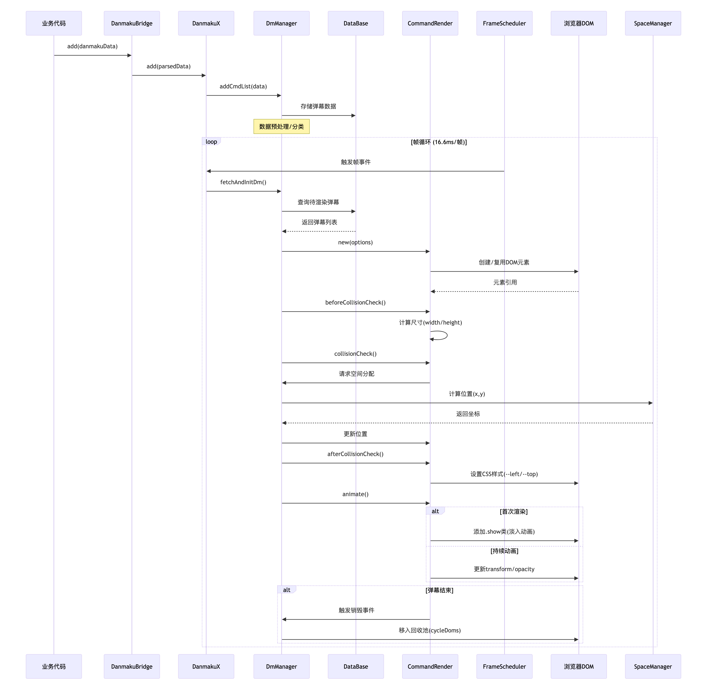

## 6.3

性能优化实践：

- HTMLText（静态图集开销、引用计数纹理、渲染时必定调用的getBoudingRect导致重排开销）
- BitmapText（构造函数开销->对象池，getSize开销->离线宽高计算） 

黑神话 BV12PceewEyY

当前：

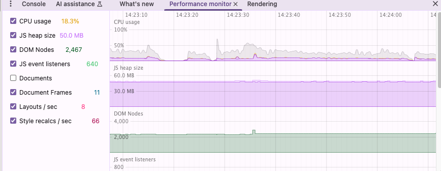

webgl实现：

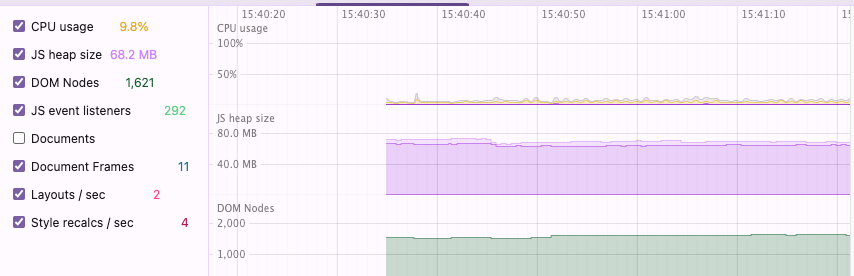

cpu占用率由20%~30%浮动 下降到 5% 浮动

静置时重排重绘数量下降至0。

其他指标出现下降，有待优化。

### 描边

原始弹幕


现有：


修改后：


### perfcat

原始：

https://fe-perfcat.bilibili.co/utils/shorten/gPu9AN

webgl

https://fe-perfcat.bilibili.co/utils/shorten/08JiOL

### 分析

webgl中有long task，导致了渲染阻塞

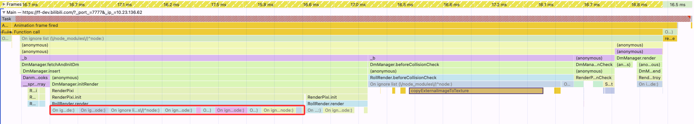

## 6.4

写一个插件，播放器水平垂直居中container，里面再装个iframe

约定回调，比如屏蔽弹幕

样式和插件放这↓

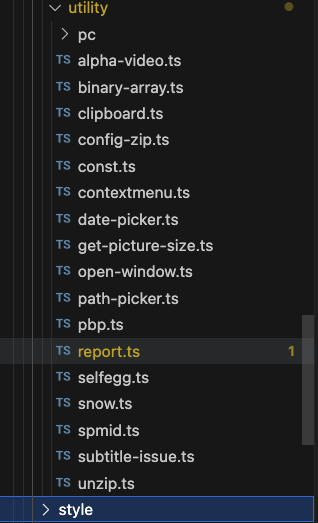

## 6.6

获得弹幕信息-> this.reportPanel.update(dm, this.localStore.get().dmSend.dmChecked, cid);

屏幕弹幕的方法 -> dmReportBlock (现在是否屏蔽的勾选也不在播放器那边了，直接根据res来回调dmReportBlock)

## 6.10

pixi.js可以看到纹理集，可以在这里截图绘制一些ppt

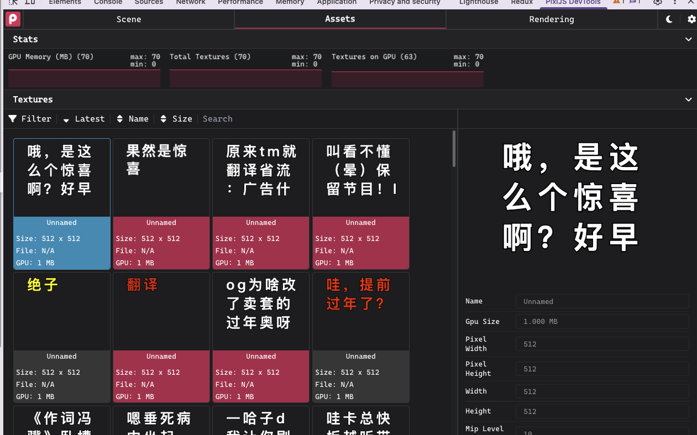

>
>
>QWERTYUIOPASDFGHJKLZXCVBNM:：aqwertyuiopadsfghjkl;zxcvbnm,.[]\=-1234567890，。`+-!@##$%&^*(){}|！@#￥？?/<>《》“”"一乙二十丁厂七卜人入八九几儿了力乃刀又三于干亏士工土才寸下大丈与万上小口巾山千乞川亿个勺久凡及夕丸么广亡门义之尸弓己已子卫也女飞刃习叉马乡丰王井开夫天无元专云扎艺木五支厅不太犬区历尤友匹车巨牙屯比互切瓦止少日中冈贝内水见午牛手毛气升长仁什片仆化仇币仍仅斤爪反介父从今凶分乏公仓月氏勿欠风丹匀乌凤勾文六方火为斗忆订计户认心尺引丑巴孔队办以允予劝双书幻玉刊示末未击打巧正扑扒功扔去甘世古节本术可丙左厉右石布龙平灭轧东卡北占业旧帅归且旦目叶甲申叮电号田由史只央兄叼叫另叨叹四生失禾丘付仗代仙们仪白仔他斥瓜乎丛令用甩印乐句匆册犯外处冬鸟务包饥主市立闪兰半汁汇头汉宁穴它讨写让礼训必议讯记永司尼民出辽奶奴加召皮边发孕圣对台矛纠母幼丝式刑动扛寺吉扣考托老执巩圾扩扫地扬场耳共芒亚芝朽朴机权过臣再协西压厌在有百存而页匠夸夺灰达列死成夹轨邪划迈毕至此贞师尘尖劣光当早吐吓虫曲团同吊吃因吸吗屿帆岁回岂刚则肉网年朱先丢舌竹迁乔伟传乒乓休伍伏优伐延件任伤价份华仰仿伙伪自血向似后行舟全会杀合兆企众爷伞创肌朵杂危旬旨负各名多争色壮冲冰庄庆亦刘齐交次衣产决充妄闭问闯羊并关米灯州汗污江池汤忙兴宇守宅字安讲军许论农讽设访寻那迅尽导异孙阵阳收阶阴防奸如妇好她妈戏羽观欢买红纤级约纪驰巡寿弄麦形进戒吞远违运扶抚坛技坏扰拒找批扯址走抄坝贡攻赤折抓扮抢孝均抛投坟抗坑坊抖护壳志扭块声把报却劫芽花芹芬苍芳严芦劳克苏杆杠杜材村杏极李杨求更束豆两丽医辰励否还歼来连步坚旱盯呈时吴助县里呆园旷围呀吨足邮男困吵串员听吩吹呜吧吼别岗帐财针钉告我乱利秃秀私每兵估体何但伸作伯伶佣低你住位伴身皂佛近彻役返余希坐谷妥含邻岔肝肚肠龟免狂犹角删条卵岛迎饭饮系言冻状亩况床库疗应冷这序辛弃冶忘闲间闷判灶灿弟汪沙汽沃泛沟没沈沉怀忧快完宋宏牢究穷灾良证启评补初社识诉诊词译君灵即层尿尾迟局改张忌际陆阿陈阻附妙妖妨努忍劲鸡驱纯纱纳纲驳纵纷纸纹纺驴纽奉玩环武青责现表规抹拢拔拣担坦押抽拐拖拍者顶拆拥抵拘势抱垃拉拦拌幸招坡披拨择抬其取苦若茂苹苗英范直茄茎茅林枝杯柜析板松枪构杰述枕丧或画卧事刺枣雨卖矿码厕奔奇奋态欧垄妻轰顷转斩轮软到非叔肯齿些虎虏肾贤尚旺具果味昆国昌畅明易昂典固忠咐呼鸣咏呢岸岩帖罗帜岭凯败贩购图钓制知垂牧物乖刮秆和季委佳侍供使例版侄侦侧凭侨佩货依的迫质欣征往爬彼径所舍金命斧爸采受乳贪念贫肤肺肢肿胀朋股肥服胁周昏鱼兔狐忽狗备饰饱饲变京享店夜庙府底剂郊废净盲放刻育闸闹郑券卷单炒炊炕炎炉沫浅法泄河沾泪油泊沿泡注泻泳泥沸波泼泽治怖性怕怜怪学宝宗定宜审宙官空帘实试郎诗肩房诚衬衫视话诞询该详建肃录隶居届刷屈弦承孟孤陕降限妹姑姐姓始驾参艰线练组细驶织终驻驼绍经贯奏春帮珍玻毒型挂封持项垮挎城挠政赴赵挡挺括拴拾挑指垫挣挤拼挖按挥挪某甚革荐巷带草茧茶荒茫荡荣故胡南药标枯柄栋相查柏柳柱柿栏树要咸威歪研砖厘厚砌砍面耐耍牵残殃轻鸦皆背战点临览竖省削尝是盼眨哄显哑冒映星昨畏趴胃贵界虹虾蚁思蚂虽品咽骂哗咱响哈咬咳哪炭峡罚贱贴骨钞钟钢钥钩卸缸拜看矩怎牲选适秒香种秋科重复竿段便俩贷顺修保促侮俭俗俘信皇泉鬼侵追俊盾待律很须叙剑逃食盆胆胜胞胖脉勉狭狮独狡狱狠贸怨急饶蚀饺饼弯将奖哀亭亮度迹庭疮疯疫疤姿亲音帝施闻阀阁差养美姜叛送类迷前首逆总炼炸炮烂剃洁洪洒浇浊洞测洗活派洽染济洋洲浑浓津恒恢恰恼恨举觉宣室宫宪突穿窃客冠语扁袄祖神祝误诱说诵垦退既屋昼费陡眉孩除险院娃姥姨姻娇怒架贺盈勇怠柔垒绑绒结绕骄绘给络骆绝绞统耕耗艳泰珠班素蚕顽盏匪捞栽捕振载赶起盐捎捏埋捉捆捐损都哲逝捡换挽热恐壶挨耻耽恭莲莫荷获晋恶真框桂档桐株桥桃格校核样根索哥速逗栗配翅辱唇夏础破原套逐烈殊顾轿较顿毙致柴桌虑监紧党晒眠晓鸭晃晌晕蚊哨哭恩唤啊唉罢峰圆贼贿钱钳钻铁铃铅缺氧特牺造乘敌秤租积秧秩称秘透笔笑笋债借值倚倾倒倘俱倡候俯倍倦健臭射躬息徒徐舰舱般航途拿爹爱颂翁脆脂胸胳脏胶脑狸狼逢留皱饿恋桨浆衰高席准座脊症病疾疼疲效离唐资凉站剖竞部旁旅畜阅羞瓶拳粉料益兼烤烘烦烧烛烟递涛浙涝酒涉消浩海涂浴浮流润浪浸涨烫涌悟悄悔悦害宽家宵宴宾窄容宰案请朗诸读扇袜袖袍被祥课谁调冤谅谈谊剥恳展剧屑弱陵陶陷陪娱娘通能难预桑绢绣验继球理捧堵描域掩捷排掉堆推掀授教掏掠培接控探据掘职基著勒黄萌萝菌菜萄菊萍菠营械梦梢梅检梳梯桶救副票戚爽聋袭盛雪辅辆虚雀堂常匙晨睁眯眼悬野啦晚啄距跃略蛇累唱患唯崖崭崇圈铜铲银甜梨犁移笨笼笛符第敏做袋悠偿偶偷您售停偏假得衔盘船斜盒鸽悉欲彩领脚脖脸脱象够猜猪猎猫猛馅馆凑减毫麻痒痕廊康庸鹿盗章竟商族旋望率着盖粘粗粒断剪兽清添淋淹渠渐混渔淘液淡深婆梁渗情惜惭悼惧惕惊惨惯寇寄宿窑密谋谎祸谜逮敢屠弹随蛋隆隐婚婶颈绩绪续骑绳维绵绸绿琴斑替款堪搭塔越趁趋超提堤博揭喜插揪搜煮援裁搁搂搅握揉斯期欺联散惹葬葛董葡敬葱落朝辜葵棒棋植森椅椒棵棍棉棚棕惠惑逼厨厦硬确雁殖裂雄暂雅辈悲紫辉敞赏掌晴暑最量喷晶喇遇喊景践跌跑遗蛙蛛蜓喝喂喘喉幅帽赌赔黑铸铺链销锁锄锅锈锋锐短智毯鹅剩稍程稀税筐等筑策筛筒答筋筝傲傅牌堡集焦傍储奥街惩御循艇舒番释禽腊脾腔鲁猾猴然馋装蛮就痛童阔善羡普粪尊道曾焰港湖渣湿温渴滑湾渡游滋溉愤慌惰愧愉慨割寒富窜窝窗遍裕裤裙谢谣谦属屡强粥疏隔隙絮嫂登缎缓编骗缘瑞魂肆摄摸填搏塌鼓摆携搬摇搞塘摊蒜勤鹊蓝墓幕蓬蓄蒙蒸献禁楚想槐榆楼概赖酬感碍碑碎碰碗碌雷零雾雹输督龄鉴睛睡睬鄙愚暖盟歇暗照跨跳跪路跟遣蛾蜂嗓置罪罩错锡锣锤锦键锯矮辞稠愁筹签简毁舅鼠催傻像躲微愈遥腰腥腹腾腿触解酱痰廉新韵意粮数煎塑慈煤煌满漠源滤滥滔溪溜滚滨粱滩慎誉塞谨福群殿辟障嫌嫁叠缝缠静碧璃墙撇嘉摧截誓境摘摔聚蔽慕暮蔑模榴榜榨歌遭酷酿酸磁愿需弊裳颗嗽蜻蜡蝇蜘赚锹锻舞稳算箩管僚鼻魄貌膜膊膀鲜疑馒裹敲豪膏遮腐瘦辣竭端旗精歉熄熔漆漂漫滴演漏慢寨赛察蜜谱嫩翠熊凳骡缩慧撕撒趣趟撑播撞撤增聪鞋蕉蔬横槽樱橡飘醋醉震霉瞒题暴瞎影踢踏踩踪蝶蝴嘱墨镇靠稻黎稿稼箱箭篇僵躺僻德艘膝膛熟摩颜毅糊遵潜潮懂额慰劈操燕薯薪薄颠橘整融醒餐嘴蹄器赠默镜赞篮邀衡膨雕磨凝辨辩糖糕燃澡激懒壁避缴戴擦鞠藏霜霞瞧蹈螺穗繁辫赢糟糠燥臂翼骤鞭覆蹦镰翻鹰警攀蹲颤瓣爆疆壤耀躁嚼嚷籍魔灌蠢霸露囊罐

## 6.11

kv-load.py添加功能 参考dash-fawkes

 shouldUploadErrorLog

## 6.20

report面板：

- 联调

- 添加abtest功能，参考

  >​    // 
  >
  >​    // private hitAbtest() {
  >
  >​    //     return window['webAbTest']?.login_dialog_version === 'V_PLAYER_SUBTITLE';
  >
  >​    // }

- 合branch

弹幕hover问题，尝试：
>https://developer.chrome.com/docs/css-ui/anchor-positioning-api?hl=zh-cn
>
>https://www.cnblogs.com/coco1s/p/17630048.html

## 6.24

第一次

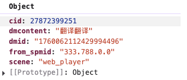

第二次

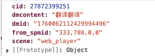

## 6.25

打开举报面板、提交举报、举报结果都埋点记录一下

## 6.26

cookie跨域不发送的问题：bilibiligame下引用了播放器的iframe，默认请求user的接口的domain是bilibili.com，导致cookie不会自动携带

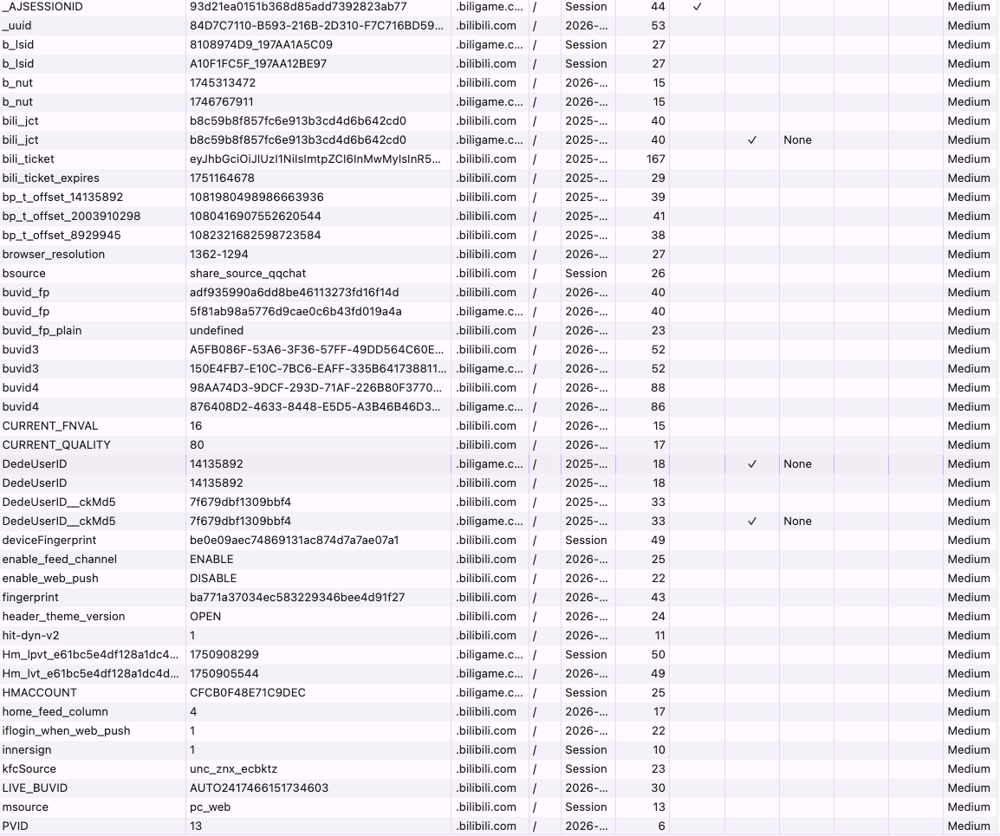

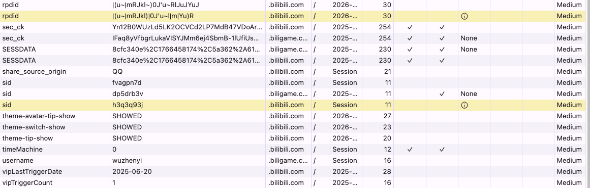

游戏中心登录：

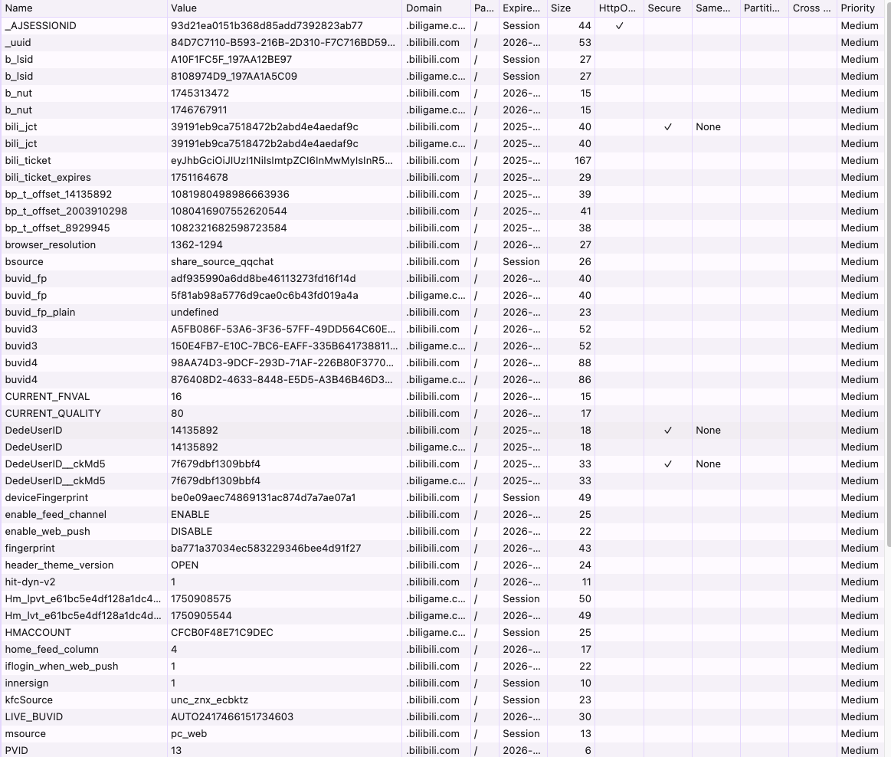

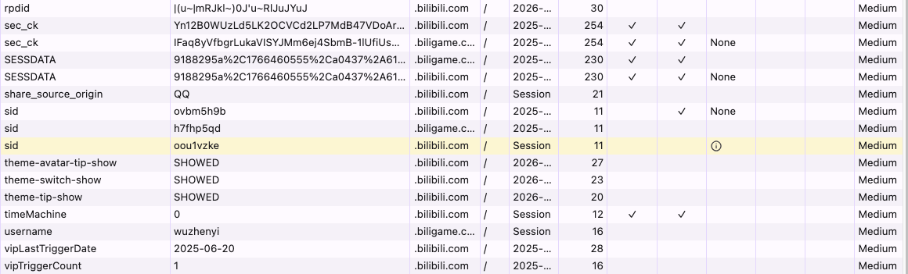

## 6.27

tapd：https://www.tapd.cn/tapd_fe/43363994/story/detail/1143363994004635673

todo list：

高能进度条性能优化

代码位于：pbp.ts，主要排查

- svg绘制是否有问题
- timeupdate是否太频繁

可以用perfcat跑俩遍

- 开启（关闭）高能进度条并常驻
- 跑30秒

- seek两次（seek的时候会画一个白色竖条）

## 7.7

等需求出来后再看是否要做业务需求，先整技术需求：
1、高能进度条的使用情况增加埋点、性能摸排及问题分析
2、弹幕引擎二分插入的必要性，量少的情况理论上不需要worker增加负担
3、弹幕引擎直播场景下的性能优化，分析直播场景下弹幕引擎目前存在的性能问题

## 7.9

### 高能进度条

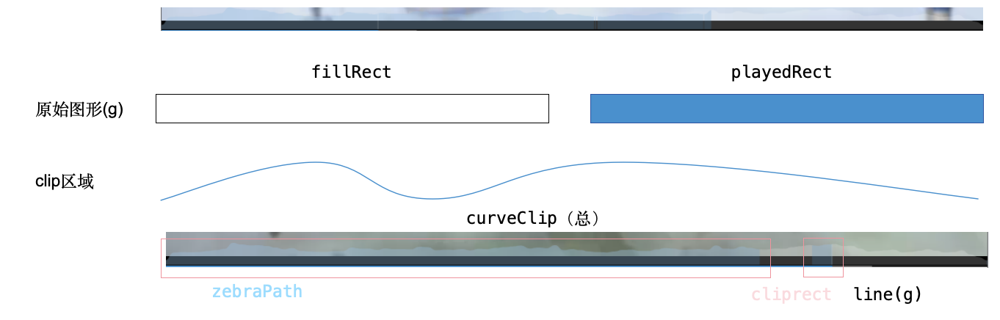

zebraPath：表示已播放区域，维护有序无重叠区间集合zebraAreas来实现（维护代价O(n)）

clipRect：也是已播放区域，但是由[zebraStart, zebraEnd]两个变量维护，现在正在播放的区间

line：当前播放时间上会画一条竖线，实时获取currentTime实现

更新时间：

timeupdate(约0.25s一次, 播放器事件触发):

- abnormalUpadate（相比上次跳转>1.5s || 回退）：触发区间插入和合并，重绘zebraPath和clipRect，n+1
- nomralUpdate：只更新clipRect

以上操作均会重绘line，即每0.25s获取当前currentTime并更新line svg

seek:

- 等同abnormalUpdate：触发区间插入和合并，重绘zebraPath和clipRect，n+1

其他细节:

- 维护有序区间可修改为二分插入，但是n通常过小（用户每次seek+1），理论上无明显优化
- svg dom节点较少（fillRect+playRect+line），且有独立图层，每次timeUpdate或seek都会触发svg内部的重排重绘，但是每次的代价较低
- PLAYER_HEARTBEAT的时候，会将有序区间存储进db，约15s一次，也会执行区间合并后再加入

埋点收集：

```typescript
export interface IPBPTrack {
    updateClipRectCount: number; // 更新clipRect的次数
    updateZebraPathCount: number; // 更新zebraPath的次数
    updateLineCount: number; // 更新line的次数
    zebraAreasLength: number; // zebraAreas的长度
    isOpenPin?: boolean; // 是否打开高能进度条常驻
    isOpened?: boolean; // 是否打开高能进度条
}
```

性能表现：

5s周期，seek10次，再静置70s

[关闭高能进度条 vs 开启高能进度条](https://fe-perfcat.bilibili.co/utils#local/N4IgTgrgdgLglgWwKYCUkGcQC4Dap0wCGMEmWIAZhADYVzXVIAmIANCAG6HURLaiRYiPllABjAA4QsMAPZFq-EIQ4BzbABZ2EgEwBWbDoB0ARm16ADIaNaQEgOwGsAZiMA2bQA4rWDUc-aAJw+9kaBQU4mxh52gYGGxjrsCIQAHoZ6RjoAvuyS0jAAFmBIhCyiymrYnpnO2vrVeuY+NdqOjTZeLZlNsS1uphHV9kHxWJ6enSAp6eOBprkg+VjUhACeshAwSirqWBaDdg37zdgHZnbt+4cS3mc3wfdJsU4HzxJx93XTafcai8sCGtGDsqtcLrpXqdwW1Xjc7jC+k8htd3p9rt8Zl8AVIsOgxGA4BJthVdtgTP56nCRnZLPcApdIkZercfGifH4aR8nKEGR8xiZXM8sVgTH43ItCqUJKC9m4Bt9Idg3LVoSr3LDlQMIQj5VMPj43KFbNzlaFwrExvZQhcRdaFuwAFIAZQAohwkLAADJwAiepBgMg4HT2AKBNwaAC67C9602MHQAAIAPSJ9BIMSy7CuC1K3zQk1XE0Ik2PLAswJOCtjXoivSLZ0wYFIRMlMTcMRJ1PpzOksGuPnHE10-OMzRdcdI0em8ujbC137lxYAEQA8gBZRMAOVkTAw2BwgsCIxMp7ckcW1FkUFURHQAGslGJNrByRcmBAwMQ4NfNJ5nBY7DUL6JJ4CAUCEMg2AgPAyCroSqhwFAbAwcIZy5KAEFQeQV43nej7sLBIgaGK7Afl+8C-qKgQkRh4GQSIIC4behAPihRGGM4ni2OR35UXEdFYYxa7rgAwteMCejAXqyGUzDsWhWA6BowSCQx0HMfhCnYfoFjvp+fHIS4lZqdhIAAGKiQACtpIi6Z4pmMZprEEah2EaDoFgWrxlFGWKJiORpsksIRikaM4ejOIFOHXixbGhe5Gh6DSPk-n5JmsJh6kxXhLm2fOJj2N8qVURo1rRUxsVaQlIjJRoPEGb5hjyhVznxW5IhuHpKWNWl1TODkmX0WZbWuRxWBuDUPUUX1Lhda1VV5TV2D2DobjPCVRl6IEC25e1432CRDUzVRKrZBe2g8IhUBkMAix7vihLErNICABtZgC-AYA2-GAGV6gCG5oAHHqAN5ZIDZHRBDEKQ0FULQ9CMCFnDcLwSiCON4i4nIChZkpRhcscBy5iOFIQlc0QTtjuZlqWkRCnOoo5ski4AQ6Szo8UpTlKAZLjJkELHNxlK0i0fh8lcNTwt0DwS1Twy054oTCounjzDteS4qsGxbFjgFHFCgtnJqJx2Ai2sGvrLxm-yZsiucOLSECIJ9nsJt49CJtXCbxtBD4JuVhb6La9btt4gSRIkpzYIUrjcIxBII4HFyVwUoqCIUhWbLMiikwx+i8y2CKJjzPYkrSljeq8046qKiO6q5lcZdk-XU56tnFehFy6L2AMMR2l3iwuu6Uk+n6UABkGzjyqwUSntGICxhrCYpmmGZa1SFtxwbHve17fu65bhv5w2TaMK2GYdl2S+9uHTur4bsdb2Ot+e1OPu7-7DOzAF7Aiduu77rgR5NFPCYc8l5FpsQqM+aAJIohkV6qVHQAEgIgQPFlMyRF4JwGuvlfYu04pjUUjoGisCTp+U8Ag3B1UOqGCiDETaK0opDSEtBES4lYCD2CvJZaSlPIMNQU5MB+CdKeWmoZbM9UKqWRslwnQMiHKMOypVPagi7L2ECAyOhopgELTKNgwh5D5EjQEdggCFhipwNIbw4a-ClHGK6r0DR-kKFLSoS4bw9jzHzksUwnKeDjETG8h4rAx4nH7UUs4OItDAnKXrAY6xviuHhQniADReg5F8KCjYhJiTiGiKwJ3T+6SfGUPGnoHhOSmouHHudRYEgrpIVuvdDAIdnpUTel9P6gBnRUALepINzrsAoKsGAkkR5MBQFA4Qy5iCEBQW0n6ANAZYGWBjbgTxSk6CVttTueh1pHnYB9OZQNFmsxKDo64SsTAWHCs4ACHl7BilaLMv6hzARHxEAcCwHzgGCj0KeCw21gFqM7ns9p8yjnSHVvGe4HyEFrQ0J4KIqT6p-JVLYfZTyFmAmaSSc4JF9BqKNErewFhPBGmeGi0FUpCAyjyW4a5dzSnAoOQsue8Zz49k0EYUxzhrSdzKoEZSbhgi9HJYcxszYT7tmoJ2Re7KXCcv0NcgaEUaIRRMAyEVCzv47geuScJNINVYH7h6b0IF-SBkMKGRlnSulgpkPIFZGI9KCjlrC-lgq9CopBd021RQTnlAOErQIJhkqKuhYKFUVrfrepec2KFHyLA6ALhMCYp5lLKuAZG6Nas4ya2uJ8vSHqSU-L0hYI0grM02sxU9bFphwxFVVXEXS9ULTku9ZS6lnc6XBrJV6m1LKthsuXtcOINEaLbRVG4Qq3hPVzO9WK4+bYz4yqHfjOIKkkrhm2VOy5FasBat-mQABu6jWD1NSPc1c0YjjQsHRA1Sz7WKFRDColUR6rcvHuPGId7jns3pNxX5XELn6A0JO-VILnm4ntm8zlJa4idyDaYsq8pVrCvAxi7N8841Ae5TUZFA0iqOEjRBu2WL7him2R6kiaiPWUb0KhplWB20rVpdy7tRHmU5oXt2IdOY4jANMZ3EMEwvJgYY-Olsi6pWDt7LxoNXVuXrVDN4Y87G90bh-jq0UGgE2qZPSa4eo9NAyN3fezGebtNwqJRGcKAnKwzutT6tmpyA2RWcEdce-lx7hRM5B15ZtW2Vow5Cw2AXbWPVDlCwhwbtnwqJYECKwnRMOaYzS7a-Lwy7v7Vxi+-ne1YHExKpd3Heza1C-uzTR7HlRptXp6SZ7DPlm2lwi5Hzb1oZ9Q+yLYpKyrQjAguWXVlKqaWU5-1-hLBrUKuEhLhVkrDd87GvNnzlKVgLqWzuxLTyrXm+CzjWH+WlNSceeLRLUlfva1WiLS2Bskt0sS7iRpCqqZS9aKICX7Ogqy9J7MYQ1EgYucAtzmzg2qYK5J6VxWftxAewD2lG76WqfK3-MUfzdNumNXVgzF6KM+YKJ167vWVKEOJXCpWhDccyFG-SOFibVVeXhdp+jDmY0O1K3l5YELc1s9nYFkj1a40RjVec8K8K5bXNR1VttJdUuNoy5LvtnHvshby2D0+Unl0ld3Ujw94SmfVcNej09WOyBnekfGtrDHTMOveZ5eU9UaFFToyipLoKRt+vpJYSwE6fl0b0tynbeI-NLYuZuw7IHlJTW+N+3bmGltOo+XRpK61uIWDuWogP4XiRxqJVxD18oGcWfqudhjL27kIMRapr7GuOXQr0iqfl9zU+Eaq6K15hX1eQ98DBzywDtqJrhU3vXhztfkkZ2jge+nhkNZx-LjrZn3mCrpWT08-4EFJQp7639ZzUnJUOggnPJKLihZZ28innPsUU8zzWhNHru3OFTf5ENu6Xv1-S8XhzVfO-c4c6ryVEOcvK485qabjarI667HqG6T5mom4kpcImI3pDTR52rz7yqXIDSmIhgXJcQDQtoXY-rOb+Ck78pE4fKOAIJR54F2xB7vL5pqp0bbSRSWCCjhLv6u5BZc7d56RHRF4TARQqSp4Z6kZLYN5k4RJA6lJ3LPbS6vbl7cSV6K7V7kw9alLTokTJQ6Yt4LK-5FYAHGBxDJQqGXJqFEo9oMYj5aYS4Gq1ZDxT7Y4Rqz5W6PrvIh4FyRQhhKqTTcQu5ZoFBU5nI04Jp2KqLyh26X7UFn57aAHM6QZCE0GqKODEp0adwTC3Lqp5YpYhE4ZDaz6f4AHf767aEd55Fa7qagGHpngQET6Y62GHp0YJLm6IGUHIHW5ZDAL56p6C7-jEpy5IGb4EEprhjaYAR3IqR-YZ7UHd6+6VgIIJor44FD7oYx7BY0EFqhhFQhiJoR43KCH855qVheTbIRjBCELhJBpSFUorRl7vbyHzxK5+D6FqLhjKQ8KUag5t7g5K68ZGhyZxDjzrJuYu7D6lEHqj6WHtbWH1Z2F64+HNFOGmD37WjEECrKZ0ZpFAFu5b4BovqTRwogZuHAIfYwlQa5bonsEX4OExG7HvLBC0odGOBHZIZH7pHS6ZGhjZGha5Gyr5FzrvFq7-5cklEgEgmaIZqz4QnG7kh1EuKWCtaNGW7oz47vIRTyghgH5Jr1QfbEaU7u7b7jyBohgeQA4wKaFhYTHxqRT2607KadrGYmkc6RErHXLbIATeCp4qTAIPJIFX5QoFzhTbKeRe5lRsnnHUplokrab5GHKck8a-bbKXLWjEpr6uFvHiofGKG8ZxlBmJlubJkmnmFAKsGHLik1GcSEm86wlxpKxL4eTeCeRkK4Gkm+E6kBoD59YakoZqFhGLbcnlnn4knRF85XY0ERhuJKzulCbfLQk2oZHJERgfKZYKFf67qFH8krqCkabI4VFimQHVHQHNTfDjRdSymgC9GKmcquGM5-ERgSGSF2n4FjbcTHizGJrOmIqamLGB7dkwZ-J8E0RcFBr1mngB59lx5eSCok737TrPFyF3mDlZ7XY1AgaKpGlublomkzmTRzmRkca3Hpm-brQIJ8b8qODr4mkrmfH4UyKnEFwhg0aI7AkVZblWE7k2F7lKSkXH4KkoEfL+IkqvYfJA5EpokDnamYmEH5LdZlT-JC5dms4RGx49lhaxEwY77KRJT376CPZnGz4YXhnzk5GLnFGz7kWKGKX5lMV5bFlsVrQHmKRErHmwUVl5rdb-LhjxaFSbakSOV9EPlwpjpBqOAkUbLjFfn5qkp6KunHjwoNnoq2ogUrGp5jmEJKzRXhhjk7FDkwaTpConFBrJThnvmMYsmqJwqvEmnRm9h6FRURTIpJR1VJIGomWd5VWhg1XbJ1V56FmaoMWbminMVVGsXnpkDRIb5nmIaXK5XhKJrHhqob5+Eub95lSoVcTyasFEnhEUlLFc6X7KUJrEpCVGj25eQ2WmHJbFWYURkLm4VLnGW8l-5K5mU9XlF9WWUsWQnDW0pcKukIEnlNHLJwmzEqgGkJ4JpFTBAUHylNliW4brZXJdF-I9FNHEnB7hhcT6FuY0QTqAkfnxUwanjHjrL3anEWkgYZXwU0HBAeTBAjqlrHXxYhlmg0SIWFUVVQ4DaChrRk5ErabY35Z3U6Gyo5js0DSTTEWXICF5lPVvgvUMZWVDWGAcXs5cUtF6QwqJEDSlJeRqLEpzXNmEEpoEkeSpJxZTmmndnyXLE7VUkwZFRywjH1rBCzGm0ZFkIXKeFXWsqmXLn81FECmz7mUy0OZy0NYhhXqKSO0-XeVnnfITCrSp6HH6BPbeXzX+BxYYF6lrRlqFUn5YZTVtVco0YbHAUOnfk1ADRiihjabKSfLCVsFwXX7WgbJdRCpbbyYM0TQlXM03Ge2d6ZDLZHZBrxaJKnWgpNUAF+D5qp4Fx8GHQxWgoB1dUG4DXvUK2m2OFka-ne56n1QMqbWiX9FWaWBuZrQdEkprXlnI2KX2kKVW2ZXErrQ0keo8X7VyzP4sm0qOCTSKWs1REFE+2rma7+1S0inn1L0Y6DUh1AouItYOWnncVx2kGhhihGiV0j1ak+Ue48qUYRSe76ALFm2s542rSEqlrbTjyOBRBz1am4012p5uWQUbbRKL2Xbk2coAR6KlXxYqjrZMkl7v2BppXd0DqKH3EjrBriMi5FS8OxVj2yqiN8Y+5ihcRSP0VCmMWB2grB0XqqqjXcVa20pwY07JRAJlmOZ63cQpU-Lhilpqr0172X0W3bX2O7VunToRLBokWqK11S4XETSTrfLjwe3CM3WhayNrlANqO9WgNaNkDTbNYwMW6xXr15qeSeQqSToumuX+7J3mNH0DQyK4k0IqQhWENhrjw-kA5M1JrF0KXfn6Bl5lqTTKOEL4MsPX7x2HRFQal4N4rN4GoznAKJrGkGo-0T16THjsNlTuGmIpkLp8l3F40TMJpTNFQzOS2RPPWL0xPZh9NK1456PWgsHq3-gKbrS63Q0BHU3cQIkWOyWn573xW32sMfJdTIM9ZkL2XaZz0+Ohkf0xbf2GV+2hP-0PXrllHS3RNvUSnGS2XYRRANG-WQ1OXOFuORT+Ic2i5oMfkYP+HxZBokQoYUORQlPQbxpa34tHSq2KoNVNE0MJoKao3U0RRubXJk3tPrSBEkqu0TDqH6Dt2PY7LDPtY-0tXhTPECbQq12t6pnzOKGisDQeQSsJpSvdUbMQvj7gMr0uC7ONnIuoGuE77wofKk6HTnP9GWAeQ4EY3rael7OflyUPMOlPPX5ii24GmL5eZ3KgMZF-Nf1BPZZAsq4gte0RMbmbOVGavQtxPQPwGJN116sJoyICoBW06DYIIB44stkjrhnuXeCFS8053B7eD+NrRp754Q1JNklxolpdQqjH2WA8s4ZstxpBoFyTpkKyIp7p7oXFUeRG2L2jPd54n0l-Knj1SzMSayud5jMCoGGe5juFUL0atG4lnatr3K0A31Nn1tF1t0qmMYnmulrTFkJ1XrHfMX0bWcVbXklXvBzW0lp76f0-KTrPFNY6Usk75Hgj3eo-2KVhOANlbAMFkRsrtsVV3NYRmR1wMtHOpcSGmWZLV3IqtmPQ2rRbKBrcrrIhhUMfmX3flpaIr4obrxrSPxt0vraOD36IaCp8VJ1em7VuPJ43JyweTrL8t779tCMBtDqiMorRZcR3Yg5kXBud68arTXJpq02fL4NLsmnbNru6MwfAaRR7WbHHGWp72Zup1KNeZqF+leR3P9n67X2W3OP3ur5D0zEEqRRQOhYZGftTX+ugu3Uyv3UhuAdqsgMgdQHy2+ClrNYylQd-VjWJ76EXIlX+SkfoMp01CTSJrcRMHJSTQkvVuChWYmKJp-JIr8o1PLHfkA6XLWZf1bI0nNspMD5P2eRcHwaL0+sCPJflWAs8d43-g0TWiRRbYVuj0ifj0tfhJBkddTaqNhvqtydQurtwqkcwn-UC5e5g1-HrJTT7v3nU71Sc1XJuHcreEXvm2Os31md31costRYh7HgvrO3v2njMugO-ve2ucC3hMecjdefbnL3QulKwsiD8awPBfcXKSf3kPjr-cfMZsxcTbXeTqCoRgNdelmmfJlQ1A8vaZLdcS5ccHmmuqHQ2OBH05lc0FVmHRNN15PH4M+vcr-NccUXuM1DRJxmpJ0ftb-tQ7hh0G092KxbDfgsvf9WRurue6KcA0XJWMeobY0SwpkJmu+WHRQUqofLU2Ge-0wmPMHfPPdH41UXqcI1TfTnv3k9+sGXXVGXAv3e+2Pd5ayehbycffNb2VBdIszfOXyhteWYuFn2g-mNE7DHWjhUeo4cEOkvxppVUZUXBpJT-po-tOkHG2TrqXT2E1ddanelLb5KxfaZRAn0-L8u+veCU9yuxm-Ijr1R3JesTvt4APWBhenc0RlSFQaNAmefAdjdvd89gm6sO9KkATHhHT-jJFi6gMHsPk-KEX7FN5prrtUG7e3vK+3tJ827HWloARvYR4Rhv2+Pyh6858G891G9Bsm-l+K82oW+vXN9sXW-QPfVxvoNjWTR0GChraCYAnu-Q0UbjwHanbcrZ0LalOfLl3rpk4950ZbSSBOlgXFUT9Y-yZCY1n7zaY+kMCXLfrqH2nTIcfWH9E9rn2nYwYkohCY8LSiaZuZS+aZDAca1KRwZcBJzRdkBwsqy1xup-VviJXb6cprQ0SJ0khRQyBNNOYPQevTmDQCdSCCvK+lWwP5KV72TeVaE+Uo6p4uIPLVfqGQc45ct+wTHfkASZ5CCj+QBK3iRGawR1L+2LaOsj2VQvpS0NfBPtixi53JymaqYRHqlZaOU8OJHCMlOhVBlt+8zDQQSsRTzhdfSCJR9nj05SrZVoSjRFDT15oZE0+tKGCiMya69g+6LzLiDYzUIc0CBU7XruaQuTNoOaQvTnsKUb489QOvnaLALw3rxZLkYXCjKYh1ocDzG9KATD8lDCKYVM9jS9na2n52tZ+fg1jj8ldoukyEEUGQcqAxqeREaQBW7i5zmZucQm5vSgRo29TycChLiKrj93t4hcYGgRaqnWSxYodzWz7aFFchIhnNbBcPP3NNm5oel4UeiEwXFRLrxpEe46L5uUK6geRfBCaYIGLg2IRlw8-LVIioXQEAFeMZwowVjxQbIcVBfw+FhGEBGN0sh6jLZjQN876Bv25ZBgTxRIhKwjQNGBEtMUl7U5KOzqQXPFnTaNDJ+zQp1ir3abJQXyqifFsAmIba8iqa-AfOsmmEK5DegbZQT11ZEOY1BQdWESHU+rzCEmcpStvsxVq19mB3DWtvCn2G9EYupOC1nFjpSvYUuweE4uU0RL20wKEfatkGj4KPlLA0OBnE8L+QWtsOXUWOiSgUyfCn6pKH4bKiqo1A1UpiCMANDd7Cc9+SuO0Z0MdFisXRBqLkZox5EXpGRhQ67OCPCEi5uI7hc9psKl6Q8bk2yIqIKlpGFsBB17IzkSRcY55uGRhY0TKQu70jaykopzu5135jCHuAHSYQ3yoHciT+cIvkeNBkQIso6f3cjGcPHQAp82Fwgfh7gLQhgnU8LAVEqJoJYFbk92E7McUVpItyOLWf8K6xTxlRuiTwtIbnjhTIYlU7A-piyTqrrYNhP9XjBJzRoBDaUwaReiCN+z7jCUiaI8dsihFRNl2PnEOvCmDFKkPulYDlszVSRrQsR2+F8ldxGIFxKwXXdakSN1YtDdWbQvarR2OrnIGC-4PoRNAZGFiFB3HcsWyLdHFigCfomYQGI+qfdOIjY6DpuwVaqJSk840GgWxW7+F-wymKSnm0GaDi8aUPQqAqi4I39YJjlEAZnVpQddBUWyTQbYJca1lHcDuUpE6L96hCrR22RriyJjL6F3ULzcvJVkarsiZJr4kfutFVTgF1mz3HIeCWwmGBHxmnMahckgEgYpmi+cMuP33q+ULGBKUPmoi8z8DHGN7VoS40Tyi4xBR7eklGPs5GDrGRYiYahNLGm8UJnIqYZCxrGQMw6OkSDjoLnwwc1U7XN0iBjAHkSoa-Rd1AaTdoAliJ9EkjslBeHjwVOaqcKGVE1Fx4xQ7pbaJciLSQ9XB9dKFDfyMJrFMiA2T4XXjg42jmucGFrNSMRLBBeap40gXm2PqEU+WWkrnjpOoERTAxBk29gwPDSUibKqedZNsijFdizkXrDxo-WpETiRKDjPbqZxn4Mc1EEjBBLW0FCmNQhQmb4UhOc7G8gp+-R6pWKZFgM8hkU6RIF1inJN3kYAxNgwU8Lco7G0o8xqaKYKCp6oHbZDsmPy5eNNi7hLAuQ1SkrArhNbX4rSRWzcNM+-E+9tNgJSQ9+UCrCIe1lCHtSiZDGQdvoXGqD00WUXLQspN7CiMj6XzVwoBhvHhsm+vPNih5ifEwZvArVFUMNL0RoU5pMotkkh2dIeQuo23f3mmN7IkijpIglSBaW+SHRRiIuOCeKPSYAtpJIUv+mhICmhTnp4Uzmb52jb1ijydvIUQmyoxv4qOlrGREjK041BBu1fRtPWk7Ff8A+TqT3r2KNDKN46ZUhKtRIYJnZtoO9aAZSTvrOoHZdyQUHLxEmFVxJ2ma0VJO362jfslI-8CigqY7pXRD090RnOhyFTLyaQtmaN1yH3iL0JEJMRu1gFJQAc01aqfIJFke96yeAroh12lnJinJss4QYdxQZ9seWH3Ott4x15r9Ayfk26ehJ-z0ze5mEmrHpJhbSJbeX02uSk3xo1lm0BPDQsDOf7xlPCGpZRjqytl2DxmIeRJPFmUZxyPZqYuPEH2h7Q8Ds2TejiIMgGzs2uFrXoT23Hm+SuonUmTBnNUQFoIoLTE8bPLlRwYgFPAkgdePGnZCqx-o6abUUslIjZsyRPEjvWuRrovxWbP8m4X-DJSpRrQpoSBPlkuT72aQ2OuELHI0Zu2dnD9r-O1lpyzegUyduMKUGGztJCCrCUguzB2N6xF-QUfGyRGDDSC-jRCic2fl-UwexrXrG5gJaNpcpP-QhPJi2xJRVEfxQOfl2eGCobK9kj8VKRfmHd4UaC3RZ2lhn8sJ5f81OYoMFq-ZhMZAwhElA1F5y2FZY5ng4ozpjoXFvosKXeN3L5DDFdrVBSHmwL-I0ORg-vhRJbInMJgpo9aEeNHkyyhBJnJxgrOMVHjbcuudZKdkukft8MpcqeQbL1n5zp5+ueea9MrlkBwO8w7QUIqv4oEEUymHAm2SOKOyYuotC6RYNYxkyT5cPVNsGn-Sndk5Wi+NGnUOxnC3sRhJ4Ug2QzhhJ0PyHmrTLpGyDGF-8+cN+W5SbYVsh+ZZSoLGY6Kji+opWGXO566TeFooIJW32jpTUTsVFf7FIySXrSsS4tGRJsk2TxFHJB0tJeQrvqU1Dqs2U0b6SSX2cjsEefyRwpKVuLgpc8vxa9xNkNYal40eApbOEXX810NUvGUhVabRLxsVZCPNL1ILFMDhoVPak7jSoHEvI1I0ZfmhOJlQ6qO9IfhHPqnmZLkIaEiXg2fYXCfWV3SKAOyiHM9CeiKXSJ4WBHgKxOeJCMV7mTSnLJpsVeTmvh5k8VniXfUtOGUTFPLcVXhYTFl3oL30olE-B1lPzIVgSXGtUpDI3V0VuoNZcghEVgBGH3ToVj0sFvApelW8LkcBAUYiytmoK5yx4H5F0vGobDnlhBN1GXQZVvpP+hqr2fSuVL2i82xrXpWRxRnGSyCvvM4ZTQqFGLVeuAtLhazULKQEUWfVAeyWFYCqlCZDWiR-3gxJD2F6ch4nEN-FIY-efoosovKDGGS9Gm6FbM2imq18cF+tEDPfQ8x1oJaM-EhSJVAl7SzVaai1X8hExAzmS48+0Y5yKWQqeS+s9dYfzhWW9F5xaOAgsNXnCjN2AQsWVPXWhV06pVkj3K+hKFTx1kQxJRcdVDC74d6HLWFDStRn-gPloNHAoaOdnJFgiq2U8HNm-m-MS1LNctbJhWrw19qIYWte4ogW-F4B1wtDrKoQVtqLlHauaWNRwzFtiU4SA2vgMqHP9X++SYYnoq+XGr9u6S55vU3i49CTsnyb1h+xXXNy8sDqksU6rukViuFbqvdR6pcTi5FhPqsam63vl515QazXef0RUjOyv6G3P5MGs9nVtb8NGMPt2m2WfqC+R7IBOYJQaGi98odf1Y4HNEgbLFbGncVBvwrXki+kPRCgNPFU2aGV+SSaCL3Q118FkCq2acErE0nNd8i-B7FZgNXXrt8XkHBrPXarwbCRRq4kTRt+XPMQ8t+NxHRgE6qyNZ-ja7hCo5FQqy+PGjCTuuP4Irsc2TZFTFPqW6DGlLY8GikUBklCn+6UtEXEIArtdS1SLU+RVPKZronecdV+uxJTUopABq2d9GLhxUsqF8AE2YsfXYb94LNPyVdZEJ1kcpocRxU4g3nWwIaYVSG85KtjRmIUPNMIrDT5uuWNLLxR4eRQRnpKaq0pD5HiezXtnKsa50a3uakucmmrzOvyAWREj5nhkMtvK9cRxvLV-twFT0vjcbLenY4+JyKz6RVrikA0wB7wtAnJppwNbbthXEDEzTArVMSV3-DxlRTAridyhSMkAZYLdSA5HAAEtjtjLvryLpqOYi6ZOksUFLc5i25hQAuhQ1UneSKJFI5s3V2KOdXucGYXjHXtZW1XmxeZos7UiiV8MfKeKQWiqATERMo+FD7moyNTPxMW+5tRsOkJb2mQlMAXHOSn4sQV+SzAizsB1LahBKg0HRNO4ULyLlRxOAhbKPUJtWeBCsvGrxnwybfK+hLpvfhj5-qcdAfIDBUwJoN4hexOlGcq1RIAUCmg2UqdTtV5Y8SpSsI7kDTEkfswVcKdZUhqNpU17a+bTbfv14x57CEBe60Adv8UQMq5QFKXQDTob4tjiuAtQourb6izTEmyTdI9gl6a6Xtbg51nGhiyNpLARKISebqAKgqyc2etdTlo3WlLil3qCpfJ0d1CaV5sO76fKnvyTclqK1flOaNR3diuUJ9HJWogmBPqBUPKcGXXj9xXryOcOTeTDilmk1E9euuqg+sHrRJwtpPVjfNvY3kzrNYhGmp32uRkIwFfOlSQYziDlDL5oByvRzIh3VLa9OG7igBFV0CdEk6-NaVqrWRu1cBVXM-uOuAmTqTV06ihYiUBkvlicwxPMbIKz1JLONrCvLWUsX2Fb1Bi8lfcisEXeq0Vf3cvNd1WwFo2J3u6nJTtPYi5NsSi75ACkExyxLBNZGlQuyqm21g0qNIAUjQzEFxa+U2VyqQ0sVrKbFyEmvHtRVCejk5x87ruAYZmcETDDoswzJ1YPyrF51cpVfxwp3AZjJVjO1SGsfLrYb8EzQlMt2e0pL+9pI7PHi3hSAy8qjBRXSsuVC2rstLCmeZYdhVGzvOAShrE7zgJ1LuDDSlWvZOKHT1VaaVG+aFoDSC5rkaXcXCxyjX2svZ3WFNJsSv0gHtNMWT+rovDJJsaj4Es7G5s5ZxLpBYGuI-odZ22Kup1jCzAggumFp8Gg04o+QVwydohDouhw4guK2IGnterN7HxhAx4De8IWp2Yvlr4JjyGsXKjXFp13va76G2QrjxQAqUK-tATG7kDru7z6t1wBMHWker1kBHs9RfCb9xVpjlps9+cLlRTGnCGzkpopFILjPklHT5yKfozZzHIVTtNtjFDDY0abaVs11+T3OpOgUyIIk47QYxNCsXYV7VABqA6Zo36HUi9VPCk6kipOms4F0IqvVq3pUuHEyXTUzWk3C1dytVIGGGmHy5bT0zjpC+LZcaT2IU4MyjOtlgJtWWaEjusufdxuYPbrUj8KhA5cQtDjQSIfxpYX919yzZuIQZVSQfu3ziMMCSGR8kQva2HD-IxraekESiDmHqGKal5s8P5QF1LV-6+MoRQk7V8NdG48eXQZz0HKV8daRE2ftcVMGiBnyWxk1qUzIcxdlS9I5Do2OoKE866WyRNSwM3bqcqei0pgchMiniDYp0g-3PjJxDRCf2AaHKd-12qGDSR147PtVMfH1TVSzUwkkPXr615c-EwrjLc2u1JJ4JrNqAcA2LL8aT6o8BEbjIjEeKt+lGQ2KFRG099SjZZTAKWzqSuW2y4vmQz0NHFrFIxww7nr9mA56mvuXnU2ZUnJT-dGtEdrzSTMaC0zYmrLsTmizCJR2MR7w+k0TQ8phMFmSyftO10-LxTLrDWi8zrYFMTaDxrLTPsSO5bCBbxpfYvMRIJJY23Z49V1iF7VTYsQlNFqadwWC4MdcOOiUHtS5fMCxtJP4t5n621MwqL69bATLDkepDNgqRtC0vWi0Y9zWsnPbJh53h49qO9Gk3hUL481+LaTXafPRWOYa1j84PicgZVrx1M6rmBGvkl3otyLmh0cQuCK+TT7CDsW0UxcbLOq8-SPfLojkvp4xGeVjxhU73Ot0urmTbZlM2QCUxZJdTom7itRiG07H78ys-C-4G4bzL-V7hIuqRfKn5T3ScsVJCnhs7abwoAE0WgBMeKEmsTUKM7OFAuk71SC3yJnWbsg2W7RGrXHvPie+R+9ZjshrrSc32r2G1TFcpy7JafONKMR3xPgk4s3QDq5Yo4pVOMwW3EKiDxnEI7RuvyO01ofKiqRtlA30K1+2fJhaMcVM2o7LobW3fxouUuWXEzikTTwZVokUX2xtZ0s6dMEgz-IQG6bKfqhkqbQKx2Lwh6n0AM5Oan64lPTjBpc1ryE19Q-e2Sn0btaICpTInIYX7nSTIrX7ABKtaQ9TcUZhC-WvRog3e8sBJk7ePgPtmJo4++gUZKTZ8qJsKDSMe1YR7dFvctNYlXpa13nHgLRl9ltxKlma1TNtIyfcQXoPPHRhyphfS2aWvg7EbQqBJM7vQsJsXyJKKleEg5ocWzruZ3Fk8QqPQoQiymoI+4PaqVgpo8-SwQobFa4kcCFDJAYaMnRwCd2T5Y2pYuDMGHaTyVTuGsTm6w2lJyRpDYbYJQJE8ZcB2q18a1C8mMLwhMQv7umI6ms1wS5Xf2MeK19iNhNvvbfJTF3tDuncC9XbTTTFtZq77H+f9ZstW6Qd9l+G7uouXs21ra+nI5VpVrE44c2BW7DhhKNOzPcymCs43STWJ9DhF44ye5RlJSVP1b8l9XRnxReFDN-ieIVnLfSt7Yq9neU-reEuDFcMsajZHsqc0EmB7mloe7bfOUyW-Gjt7m0baBzOy45x49q17koX54c84SYs-1cDsD7nKA+YiSL3UKEpLLf17i7Bbmt81zbNu11azbqtBIJc2prg02Kzu4HS0LTWeiNbG2lHQ1h1Dq6APpRrnzrQ46HNxMLVCyv5wAqPSjkCsP1QDpDLozOvBnfJUmcmgM8TNPuTzDztJmkqqX7sY0LhsxnB4iRHL4PJ7U06e8hhcPQSQN-2EPEYOxuVgQHzabKnQO3u1GA7yM0s2w-Anp8sFxrOqnpryXjzmdpjBs-BeSHNn3jLNz41q3xYJJsjz9wXgNjl5qIbKZ4D2-bxlF2Yjb0SQ0p5uSVDjiG92JqcqnGafqExJbJDoM2Lbq2OqJ2JWcZOWU+TY7vd5qvYoJZSbTEeVMA5ecqruPConj-m7At8U1Wp7Gpme0qoI2kNiK66SwWmeV1YVoTCGLyv7eCM73QjS2RFOLik1d8fzdqmm+CvPu2WE7i1m+zI+hYEyuEgXVFbkYBp4kqVyG1Wq1JybP965VdUxC1kmyTmGRxFLvgkUlucO8u+adp3VB6yj64gTwgVKaMbpIYnBgoHK3cmRufZy1By1RBlYkK24hLMZuhus42L+c4b7Mu21q0od17YBTivvJWHm0XScz39q69NXvxjoVSNzwC8Tbe2k3s8GzgIa+OvLSal1tBqfXTct3A6r7idw50VvCeVPpSXqxRz6S6HTELWHlQtH5YsbDTb8CeOtJOakEi9H6W5+-J+opGaW9Rz7fGkjPAmeT5xGt+RZFAmdEmTDALni7GS6FHghcz7LZ78MZe05mXPLfRw+fYO2sTt0ugxu3ZIqXjsbDOdrpZget4ve9aTwZyTe4cZjGCczpNh4wLg2q9bHJem46ujOIWVjPC6e5C5KRdmM7cOyLO7rqGYUGWX9wu1BPCt-JxOQt9h3Hk-R-Y9Ep2GRGq5otDPJWSaDRQv3UokTFxHjGqqZNfbmDdb9L1x+y+zaLcj9yGWzozxHvQ5Y3EneN4vV5cO7+XKNv7iOlS2UM5YLPVh9N2V0nSbMUzbWhsZecGX5X6YihZ+i5S8rrrPFG1cMYt1s7inIL0pw5eTsGuCRJSNCya432A1VsgusQYTRqNOz0myeBVGtyzfxsOt-6QDM7ni7y8vX6PH-ptkI09YHrqJdWx+bduZSA5tLmPYU6wd92xWzwqilnL9uJvzbJe9Anon6wfoKBoT8h+E7c1KqsOvNxMXVASnBPPbuTfauFErpFoJsW9pXiQYVcUKzpK0tVHYmQaPDo7sgkR3HeBe+OUjrZntxC-YElJytg7ns-KjLThpDsodmyci7W7gUMd-6FfqFZoLwii8a6eprSiTYKGaqsxe16xfheLjjq-u2LAyS2xcXMHZay3XoUCro14soBuDGy-rVifErAnVi-eakvi7M3KCsal5FocqdNiIvKO+pdk2gGP6BGFccdr2kTq2HU6qD-3PMkeNLXhUOTOq8jeaugXLxxm7q9ffViDXxKkpDDvw9O33kqSe12INQokT5nLT81mnioxet+8GnWHqSs2wIYOdK09T5HtouzEPKU8J+aZK-s8PiCOJVq1gUOyCeDzwn9t+WHPKBoSJU9BInO+lbofSvekcr9XR3OJEyHjhh3UQlOfXZoclM8nnx+u23O+UIB-0sCcw7ge5ZXD2t4dySIRH60q0G6-Ivs+03UPznnV5I6Qsp3PPikOMhtdqeRZyRKikTKAaNrIumChKIDG+KkU2nSVHlUYodCkNcs32kDlL03lGITA00mdW8ilcyd-YoDHp5IvVuPcavivs15niOmmxVdzRMxpN6D-xFzmIHyxtz6sfCexzInX1j-j7g4am2APGlo05TVWyXivDQDnubK7Jek588rtJCnLzBN-O4jgP4YVq640re4LLBhH-q4hcbfsI6hbb5nc3ancnazotklesncVuqp9chErCbh7+Q6VUlQHB83nNPfi2JPV7ELyRcv7ZuESPFvzbwURvFvUbuxdm3Iz31lmcj8GxI5UmluG28e43yE8w9hPEbyPjr84TAHOirkvKV7Psa0f9clM8aApgT6ltE+g7PD-jOUcI3V0CKC30922+B-x3O3T3aR45fttBJ2ftUJ+wRMiwjlOt2HHU69c0ce9taodfDYMS6MS--xUWbwM6PlA6faWrppvRIWMbFpMTb1yz4b+CKJttRTjzPQ56B9HnXAYyxfm0XnF9azbtXnv6QT79259dLXxH3b6QO+bmxbSo8icX3x8jdPg-N+8fpRS6LK3pniD+N4vq7Upj8LF5hEiAUn2Y7Z9xzyV7Q8ufVver+3Qa9SRVOFHqflJrrhREBDgPKT6RYB4rrr8hmlnSQz5an6cWKnrrIDQo97eutOAhhrITvPOoJu7WmaqbmNmE+RHgy-ug5Bmnfv-qW6vGPfQt+aaLiTSeKkjgHWMeAWXaqsNvm+7T+DVgpZywVZPfjl+zLigqiy3zingoo36qN6XCu-n3Kq8KhNZxrOAZNGyTWyHrlZLeDNoz4X2a3ga5GgXCBbI1O3PlCgQyDbgTQvqpVBO5g8ycgTSUMjBFT6Xe3-P+SIY+GKSi3YcAVbJTiukCfpUSBSrpaN+dGn7io0tWgFrWmXdhg5FemASV4HKDeIWiwoTTAQFWGgfC+Q040PEsZmESnsmYJ+9vvJaC88clNjjuibOYbFuHvLygUGZBGpSfmhPt8pvOFnhKY-mbtN7xnYFekh5xGKHkU7R+tXtfbdu4LmzZSBLiBrZc+prikxGEzinQRkENPKoG5+AEJ3yscb2De46BdRoRqCSsXJfrReVfil5To2nv+hXI1UqS4Zi-jCoHAeERgzx8MwjsIG6+EBvlLSmeolTpD+1-qsEaKA2BsGJmIQfJxiCkTrgLxk11h9ykEvvv16nYLPG66FS7Aa9ocOJPk6SbIpVN1BRAJuksGLOojvT6MGENkz7M2ZTvH6yOVQYeTGuMLo7yzeO9PEQRGNgsOahqVUmHLU0OSqS6HC5LDWT4ozxK9jMqcrpHxgU1fP4zygieJsjq2FKkLgem1zNV4LI9nEUFnubjsm4kostsQwEiWwWIEV8qjoyHG0WHBcIZu09scEO+m+mDRgUfbH-7xOgHluhGgXjjSTJWvVvpYlmhlpkGgWfKn1glCQaJzSfB-zjr4X+Uflf5shqgrf6hBIITSCHkA7hCFz8r-B4wGECPDIiC+MipgRSajdsCZF+sXnfwEyffiS5uYjrhxL4ik3MVK8ouiurapMJ1sECDKPlgs6FKdIdG44CYnk6aaGg-re7D+GcmiJ8BaeAlKT+0lkj7k4AoTxRqoiqBxzLSCwfQKiydVGQhpYPltoEmefVjv4KhE3twElhAVIsrWYcPhPod+WoZH5Hmuof8HiBBofJw4C0gXh5mhbDKqjYC-iDzRZcx3nQTdSyaEeSAOUtnjTv6ubhToqQYArFb-iubnQHIaCDhQph8oxKtiMhk3MgKthEfq4FR+smNmzfEoPqw41e2wQAojo54ZSK-EV4WQFx+RztCz8hEQS2yDM-nk-QM4yqGK69iXen+SgBDwQNa66caA475s7ppsTdBZ1Mup1mIgdq5dhGHi+EVBd9n2HVB3noOGt++KHE4WkjDhOEwoqqElxqUOIXCYXSFDF-Q8UXaDUYcSkorwJgUHbCLrwBr8unwYEHHDkrRagZpqHHhsVLuK-YsKPvg2MVXgQ5JuAkVsqgYDbDyGHByFqjzZhHRLiSWsgGFNBXBk7ryih04MpXwgR6ToNbgRhaDeb9Yq0ozoFBfjP9pPGTnqIFIR+oSz53+ELlAyHknNj56u6KqDNRl6OBM4oDOqkSxwcsndHUJKKPeOFq1s6kgjz6OjweVLkYXfMlIscTElepkuBjGQQmEQ9CdghCl3NZYrBt4TUDQ43WE6YoiIkXe5hAGUaW5qht3kEGxUvIUj6yRH4Z15b6CYlgJIcJUWw6qRNnHyjLMHroEZOuQduZ61heup1oaKi1GqjU2KUTBbahHYct6WRZQUnaoRCfuhGHk6dlhEeU9TCuJ7C1yCpAF2doeQQOyeVCXy0e35FrSvmSbIKzuU2mq37nIcHPTxHYhokEL7ULwnB5HsWfKZEMuPFGs70m9lCoS5RiYY9F5UPfAnj-E6Ycp58hFUbP4q0LLBpQbIJiLN6pBwtgtSQyTdm3JXBVbvKE1ue-vez3OaaAJww4iGBlob8M1iNEWRpvt2HWRhoRU52RikJRGyBdQSiwkCHesOLNo2fj6paOCZGui3GzFttHw8e+JV4rSF6gnrgB67pchpc1oAP4pU-aqr6ZOONtS4PWD2NyqDRfKgy5wYj5MQEG0PgYKpyxg2ArEHO5crb532ttC4YBUdKNeTl0BFG1E2uHwWOgfBiAlpG4hTwfv4OiOloaRi4aNBloQaCEQz5jRoLurFsGFyi1i9Ah5E-7-GANEPyaBfxFlx20x3i7wa2axOpTOhugRVIZml8u1yBe2mr2LVSEMmizMskzu+jgUvvFNiYUtXLryf0m-JGFyM+XIdgSeP4heY3hRhj2KVqpcb9GExq7FrFyRM3tgI9Y+ojP5t6CQShgfMCRFrQAW2-mN41hSMYdzh49osVL828ZEI7gaWRD8HmRiEXjHIRQIVh6I2LWMaF2UZLC7pIi7Qb7xay9XvMoThbbHWSFQjOGoY9BcaJpQiSe7MBiNM2mtwwRGfuOGqDC-6vizhIoNAPg08h4VNaOxaURso7CuAq1TAez+qyGWRMQgKgnGLLITw1xRwfYSVR+PMWiIcf-Byw3OqkRZgdOlFqlrmxnUQPHGWrhDRz08ibJBQZa9XIC6X+o0bPFWR5Ae57hOS8VwiLOtQUO7Uigyghj4oUVmpZf+FzK97oEpSGkK8ok5jdYd61UuEJrEAzqYEVcRgtay4YMUWaqq00zq6SxYBnLS7r8bJHlYleVVPiTYMoYKYiRmACSQnKJ5dKoll+GifD5kJU-prHCygMfXpEhDjtu4SsKkcrr4OScf4xDBYEr3EcB-cVwHtM2+t8iKs-BEhi1mX7E7F-BJCeNFgu7sdPaUJLiAgxkxQ7g7KZccKHuxKozMfCG6i+ISVRsq+zjF66BSkevxnYUysKZrukfHgwIYcVpn4cJhmrN5l6fpItweMv1lNYEJMsfigvMaXEdCQ+eUStr1JH-ORjgJyFiYkCum7F5DdE1NP6QxY7voB5ya09I8TMecMU4mhRAfvv5A4UWIdTXIFfjDzU+xJj3bDR+Wo2blxpCShHBJFCXwJhJpoc-424VGDMGGknyMYHCKMiirpQ8-MvXJKKdsqZolCVHJzRf2U4rYz9SmBF6yoUW4SHZ9s8HPtFbKb8bIKrJXftg4AyiZMcRPhl9omEjoYKfWRkqHSStZdJ2blnb9JMfPJjxYFGLPaTuHzJ1QqGf-mgmQeXUT6QykAJMywBCy-D4k9WdPtPHOxASa7FnKOyYvF14VCQOGHJbDK+gF46imeAscE4UxpHyfsp3bzutpp3w0YpaJkRpMcvt647uCDNXwj6JIcLHOEgMoqxrO-qvyiJoc2r4mfx22hrb5mqsqQFQpmyX8I6pQqHqkvuhiRmF2+SKQ1Fqe5ifB5MCqqhDH9egkolSpMF6lv5VhfcYjGuJ4EUhzDsdKIFrSy3dvBHFBnYXSlduE0Yyl32QGFqZ2UmEWykYEpKP9jPxi-OcnRcuTCYgEhIHnixPqRIZrQfcbMc265J1bHbQnGOAgLI8oQbkXxkEStvchLJiwUCnBpBcUOgtUHgk+TlMmkpol1qzaRnKtpmYl47VW5qX9FI+Dicin16+KP1I0QxkpzQwRDUaLLKhOAv7pN4BKZwHrmNBPlQL8BTHqI3Ip-g2mapaySqYGpeoYElux5CUylZhB0A5FYRL5KSgTMIYVXRFQ5Hqo5WYAVPV6Qp0MqkJG2vyA6IXhLyVA7YcCUtdLWM9DgqlZUCRIs6PEjdIVwapVKbxHkmhPMsxbozxG9GGpGckOpMMr6CyEGJ2ya158hDft0mVkJEFNTYCdQkMxihGllRxUSPKOFzPOkyaBEgWAuNlSFSYyfbgdpyyQLKNp7YesniOXafjGGJrPmekxp2EAmQ0JBHjfjpqCqGqH-EQrDn57y2ojE5C4sBizHouhxJTpO8h+Kx59mpbrTxTBr8gCp202yuUyApcRsCknh3foAqQCf2KlrxJCYShmQKFmQlyMEZqdhlGJYQXhmjpkWJMbH05GIXjmaJGoexYMGxGLiTcy6S4mrp55DMRCR9yCfTXMlKX-of4vwRslHp9KXKr64sws8JUJKfr7E+kOEXVSFSW7JX4yZh7FPRnBLrlzFI0Evlch4oSRAd5pcn6oRkfomdHMRy8hmnfyls3vsiRGZKyRxmmZCzAJSdCgAaq4bC+yjBiqoM4v8jGMGwmVF2+bmdan6mN+DB4d6dmH142uAshize82GrKFE21bhkFEpzlHKIa0wxEvj1RPzEMYuO+6UzaHpLseGlBJp6VGnqJVCT7F6mQMbChNK-iG5QJix3oRTiMYyfzaOucJkWh1C0vGsQiYyXt66uEB2BqS2MtjLCb7+VdMtFcsvBAE4Z6cEXukgpefPoR5sKVCmxlxeocomY5PtmhpqxDKThlI+M2dNxqePLJSIQUdDLIkr+eZgWiD0duIG4yuHUYSkYJ7LIHwx8bpI6I7phQcsHnZbxgtax+88ZNFasnCV9SrxXNiIrhk1FGpRngm9qF6D8NCOQQVG2HDWZKZh-oMJpcfWMyy-pT3hdL0sZKVyh8YMORQr-iyPMm7RRjgRSjOBANis7fkPEgij0q0sSb48ZFcY7nAYh0C7nW+zmRal32rpCj5U066NYx6kLBGK4-+RrB1YwoIWV6lhZLzIdiZ0y4S+iVgNqrSGcZB6ULm8azmfxl3ZCeuNBGsImb56EeQKqmjfqheorndi+LApLboWXv0po08ZFKGuMn-pOJR6vLPsQAUEYjpnGK41O6i1snueGFLOUZOSar2eLEVzNeruYhoZkNjKPlF44+T7ki5FAf7m05piZWQBCHCcuFJ4FmNja6KKiicS94nrqk6s5K6ZHI5ql2mkws8rHFaknZxJmnnUpRCbjFu5WyQvm3ZCfuLkuIkAoXnc2JaAGorRhPD+atBrCahTV0Q9CRKkRhwljxN49opFqyGChgKh38iRPNoxJ3yTmofiuivDgNsimVxF853wSGbfkirG-Jf0zeTIzgKByvgWupebE5nP5LmVqzKYn7l4nqcrFt1DEsfmUrlV07lLPnF8MeTtns5PpEqiWC-ulJpvm4flYF35OocQmP5x6cTmpZi8m-n55ByVlkv+NVCBrhqlHGVmFZq-h45dErrIWFCpsXvsSuYLWhNTkiChnsaH2JxPWj-x1gXrrhqqaE-L14nWRBY4FWqTOwR4iVJ4w0unaYhouF+9pFZ8oLatJEXKtBdmHkED9FFb-cmtAgkyKafNzTzGwcSzn++u9s4RC8mdFPposlmMIWEJYhQ-mIakhSlk55r+QjRfUrKQoU24cWA3hER3gNczWuYPGmiqOezlRjn6NbFnKA4ReDxJ12BMlyjXGeDtx5RWFstNiSCCuVgXEmtPrBlYBeNHtT5MxxEE6KxcqLSoYExOF9kDpvuUOmI2QRVAkwYKqJAIJc4FPV6Opk7n3glcoYhpRcFlsSILmCTqCtQPqjdt5K25fiYllXZwueUGRpBRWhT55caSUWco5br2q7sKRI66F284lJSx8U+gAG7WOYYTr4RRacHhUcEXP3b+eAOsxFRylIqrJfMxfCxja+PEcs75WsZBZhl4eTjR6eFW2ozI4l6fNFGUFTxSTmrFOheTldqncsPIUueCSwV5m8RLfj-KoGCcXE+ZqhzSIZc5HVCBptxSGniFORcll26tcWxRu0gmSIC82n+SIp6oRrGHwNi5PI+mxcoAQoEbaSmVrRdCkRutjwlJgVA4gG1fGLhM0xFF3koF4QrRRFW1aYV525Yxd9pH0nHkg7IZeoV8S4Yr-Or6EZCKdPYziJwTgJZkKisOGRFCQesgb+HNBJyz28MWZ5s53qUthG0-9siiJxLGl8ERh6eRdmZ5BWgTFpZrxYpAdW0pUZISxmtPMSJI1Rbn7Oou0axyYi6pXEqiKY7LwTMe+LnzKxOCSsx6Y+CJdwGEojuLLZuFekFaW1JTomXoBONlMwliYSbr2UzUgmFxKTZARZ6XSu6xRBJqU1mAcUE0exTIoaUqBqfpD87JdMlm5jzocysYjFnyWJlSzj+wJZ3GUKXXZJ6dIUext0e-mZZT2YLyhg6vrd7veElmmkXMLGB04IoajrXlXeqeIERxWUVEeQPpkJUOJwFfpB6QKY4biBkJ458q975uT8ZLEHliiVH4tUeLBYn+IjpZZHIV-XLtpoVHpeE5el2YUAjKyrJNdZYpyuveUbxtjD9HxF6QacX9y36nolTGncann85yZYLklOjxRGkv5YuYlRfUj2e5ZAxlrGuifo5YUQUXJuTPibkq66PhiRxvQbHK2MwmFRz+6q4SBq94DeOHImlLrIAIuuaqs6jPl1IabpOFTab4EJpscrEr1kTSbV5jMItKZUgG5lbhWrF05SvnO2wxKOQV0ycobE2JO+PGLJyAshuWJFWVIyG+mKqGpnjxNPhgHxZNKf4kSFwpctYhJPFS4gR0ESaJmBZZ3IvjmCAMeoUiGbZflSUiTBJIY0BvBEpqRW-xF6FQOtnslT2ONmJwWQV99DWQcsYrCdQOFJ7iIWjFJXmJzqSz7F5IdSE+VtrtVCkmiKVqZJZxXUF0LCniROSDG+gHx9opayMBCQVPQ6mxEvB5+VGTmulC47QbEF-YVQYIFhVbYaIU4xM8dFVnlUhfkXcVGnONDxeSVUXnLMA9kaxzk4eCF4JJgZFVxvi5iZIYhEgsf5BFoBokBV40r6O5TV0ncaHbq21LB8GnYxbJhn1pO1RiVD5NpXBj0E+Jhe4VhFhtClw1gAk4oPuSxVQV+5CfmNUEVRTEAp24U1PGFtxGlrZ7h43xBGR9e4ZdWGx5J+eywzOgVKrJ6krcbBHcRLVfrhiOSpkllHVeRTZFMpZ1eHTgh8afxiTVAEHOTZUgqS+V6edSQcR8qBpE+r04p3gSyKVidDSr94qpCjgEsMKFl6uSpYX+Rl4bCclHoBu1a1VIV+FIVU4pA9hZWbJVVLCm0UVtfZX+52mEqpxC1yVyyWsFESvbLRwRMqkeu7qXKERlx+eNryo9uB+IKYHXMfT7lqymdmsVkjqmWcK2eXzV3ZAtdhDFCOZX9x+k9cupJPk0PI+mBURIfvkOyOaXvp-l4IqHWCJA2iRk8I9KnA6m5IdkwIrYblB4bMFQxexmo5PWX3bU0dmIdSAoD-j1XF6QNt3HJScmqZqO1ONc7XBFTHEYShlATCvbFZqqAE5TEy1TpHCEMFTiRZcKOEW5jyQgYZWx1AIZdlhpHFTdkXlISZkIJVxRbeWpWmXHignY09A6YhxSrt8R74ZdE+pn0HFlNQJC9TAobKyP5V7kGM7mpBUR2VWRVwz53Zc4Xd404aVSYU+qcNmSscSlA3u1Y9TQUT1M5R0S74CXGlTESqiNjatUPWOnwSeIWtTWep3BVGVrp1clvpzstNBDWs1UNezVHlkVfcWH1WeVQUnV0LAXxcII-JdUJsTpJRwNoSjM3QAF5rACgPsXDAGRgFsXrFjfeIBvInSZupSMGaUSKFRJRW9sTVWMhcdPWjYYBhAPmIVZmZTJ9s8LOopoiMxVPn6NaTElz7WUjljUrF-uVtVOV+PFMaFq3WOnHLZosrSRIJGlDvKbZHDugmkNWVEMyi4ahGgQ-ksWfWbHlXNQ8XMN5JSfUUJIeBw2XpwtSxhqp0vHYj+6gjdZJ20SUYczGMkhlgJxKBvtYyV091jQFr5U2L0k6FifLrVuSpDBeqDE2jTnrKJguHLVuIvkf3UFyskmoR-EzTc2WlRk5XhUfedjbzJpMtZGqERQcQUroJBKscijgWOpdw60Z2kWBEbm1FMhjhaJ7GAFsZ8RgKXZFW2rkUilswrE0JVs0fGlvK7QTdYo4rpX8VaOK0uQx4o98eqU2haeuNnD8FdU95U2+NPfTC4pES4w5UCySfQx8IkuiXs1MNW4H4cS5sXyTGYqubYHKiITXzicBWT00I+2NTQX9N+GXmjl+rmIGjRxQnHTnfilguMwrR-BD3EepzibTXB1XBMJiYhZOi+wDRKOTBkc1YTfNbsVkTcNWsNq7Ow0JVN5fxU8+i+POpqcN-OU0HWFzGLwuRvMbbQyVqmn8gM4XEvUIKosVjQp7CirHQzNhJ8l81tU9aGvhJ4Vyk4HG10NThRtV9igWYJWdGPo5lWBreV6suROSlmIto1ci3uZwhCtIGk2BFjS2NJNXp4XaRhBK1IUy9Qs1rpKWkhQoBA9sxW71e1VxnhNTDWmV8ZSda-np8HDXxWbWANKhQZMkFHJpFGRZaRoTUBpIu70EkhuokdBsuO1SSpPMX-kFMWCjOJVki4khRnSOlqqgxJALchyDssZm6j0kccv6ozFYzOrwDVzbRY1TZ-uTa2zZClsVHjUCXAGSIe2LS2T6a5hcCYyq1FUBYkNceXhiHUyeGs6WsoVcMXhVdLQw0nl2zTFW32UbbaTjQKwlw3rxMSbWyy2y0QGEV534u1SXFccQ9XlZLoQTU8IbqE4J6IJhdPQ0B6BEeJweQbkDQSs+UqtBE4dTVqkxC0QX+RLKg+XTLm2wHWexIJQbfC2Dpopb5zCYkTg9iJEQqhKIuNCQcgyIU9OGQz+1W2QjGztdNYPr3YPuL3nuEJysZF0uJteu335B1aeVH155Sy1il0bdAwlo6dSKLgZ1+rhibcq0bn6DChfP9yUMkhnVDAeilvTg1K3MZHxC8Y5AW59s8ecgVkiKIXqKtZ1Lsjls1dbeWotU11VWRRWB8TMVadEeDp0pojJvPlRNVrauwpE41bkFcSRohDJwts6QkFDqRrUDhtEXrfRmZOuYQph6kLPK1wZFdxZu3OqPNbs0yFLHfu17U7HYLzNx8uuM58otocWWd8cmJpTGs3TrTjLSKnHGJKtyak94CyQRIAL8xmBVYVq+YtacQ8S32rW24FAlHFxsFfhoVSwNjoiezPCNXUg2jVSatSVZ2yeBgSwBKurvgr2ccvZQemTBFi1eNsrj41x5GQvhp6OSOiu1UdGJfQ20dtKYdUMdx1ZG1i5oXYpBYEblnG2RY61UGR-1pdsd5eOewmQQqGvbeXZXenNHORlsXjK2x1ZhtqWHTon9MIjq2QlJ05kMAlEjWHIBToC26tp4fYp8UnVS+ThaxjX91oi1IoD2S1z4VY0IdDWJZ3BF5BuwziyouPZ3xBz-JoF+4IGq2yENczRbEclFCovhQ8q0rEm85XWe3URV83VFX0dTLcfVMd+QnfzNY4tBF2RYTLH7IU6DEfVFS1GhR1RuaQAeL4uh+DtFSZcdDPiXDBUqf4h94JHqsRwhhXddj-IRgiQytcqAZDUk9tLUC2-dmUZhR6RNPOhUkJoIhr0xJWvc10WdrXYiJqe5goRXVZyeHJZY+smrbQiSJijsjOtlYQHU01hHaS1TNYMnbQXq9Xn52bNdHVu1BdsVTE1J+5IPOqM95mAmRbKJUpoaJUaTR7gW+EOSqA0Uk5t1gDdFGOcghERTWrIfBBxDcEDOPDkgwMsGIpIzQZcWZiVKJQNilLOkvpEZEEl+-FVTHYtFEeKY0yyt2041ZOSb1dq0cVPURUGjkWGtyx2EoyAaAZG53vO0ZQzFk49eDdYt16zSMU0dWRX72BdS3bzXQ9F6GOwSlIffE0fFTtFVI8I5fgJyPpeqqtJ+4Roq-W9irpKlqMOLTZJ2qaBJPklcE8OCxZCVUsq+iPY8FTvVJlHdaJyxk9BD0LCNXZa01929BGHV-9Lfb01s2LNX2316D2CiI9ifutYkJBD7rM4TYhLc73ENtFdwG5u6lOqFyaNBsZndZZPfP0LdlPeG2J1K-eUTB9ooD+Vh9NuEpG4o6-JR5vpfJpjQAkz1f1F594Ba-zJUuomlqg567plwaKjtIxIEshmn8QukMKZUX2dn3QZUf9ptbo2TpYjEabnIOOZZEl6a4cVJ+U-LZY1md1jVNEQDbXT0mJYJbQqgvsHlYB7AmQmFBXNG07a87oDLrLIjNorfj7hMRNDcr2l9c3YQMU9-vUv3BdHsd1j09HLVt3OUZCEj1BlCYqnrtKrcsfZu0YuITlpJweqDRJWiUvGh1pcjWDlH+qIsQRosy0urajJTGXEomE5XVqlnhiISqF4MwPXeElDirGUMWtGGjoOyOegx31Z2P5iqhYELPPlIMO8ygkR0EErRMlEtUyf5Wq03RF75cSnfMvkthNLW4PMi5PYw2LdVPYx0rdbDYMr09sbTt4pMiYvIq1pHpGpQThyeJ9r9SjlcfHlSnkkAqpaLgpAki9PMQcQVu8GCfSM4nzdB40ky0XsL0sKjAD5rtqvUeb19cQioQSe06Pp1A23w6AFSC4HVoPDV5nWxQ3dBFeMyCxP5aLS48jJf4SZityMNZyaI-YqEC4RrICgJYxbEGTQW3uXvUX28deUo9hIXaCHrdKwmvF+a1mPxgx6DXbH1mml4q8yPEQqH9m2moAdVlOKMxN01ZdUqa6F54aHLMo3Sn3s4RXRa0MThPRmlCX1WasNbdjWYbJFgrW1TpfYoJKRfD0KsZwQQi11DFTp5AuGgGA6JT0RrWdhLl-fYBii+NQnh3eNkZXO1qJlJkmjYCYtbgMmRqUQLlx1jLSQMsNCw6y3Uq0DL8jUD7KeLj9YodBH0fdArUI3-YXhPJjxEYrXfKJ9gOGKnPkgxRcOR8Iks3RYWeeMZ7zuKrVtinYWvCzxG1u6Sr0-dR5mMx+tqVbMRqFxBZC2YCTfd7zljinpqNkD2AOljIdo6FUOjm4NKYMaWNZEBo+4y0WiO7ZPrd2irMaVAYT5B21X4xYx-naG2zD7o1E009DWGeDLxcLIf6HtYmppTZlaNH7IRi5Hu7VtyzHrOHtReNNSzgtzdO0GZdLpiMFx0BTACIfiw-TVU38LBIwRXaxaN-pTW90UUOMunTPcjOyI1uUNMhNfLKIiSmNdoONjQSFmEzlSjDQFxctmoFn-hjdp-Rp4HhcN1H5oWUR3XYW7sPrYc3NMT0zddDVMMeDMw8QMJ1Ho6BOLj8TPIWX168oaPxcrJCYYHduYWiIf0GTE+pIYaaDRxPEa0Fwzaa-XLFyJspDPFx11Seg+oNJb2GDUbCNISxWf90bmXSXu9XujI+OtmTJN6Ick+wzpuYA2hHgTAzYhjHsHqBpJGOnY+azRJymNRgFh-YzwXOUhUp+ipM-dl4whNU4wy0x+cw8t2kTQsfu2b1q49xQekofAmK91rVBEOsJNZQSRBOzg7oXpJxkncMvCJ9JIM40rpgJhKML5FkNDm0vWuk-kIROOa9S4k9IMgjfETmGehyVD5YwNTmrlM049koMpDVx9eCO+czY3JGPkcHFly0kvzi61S8f5clJoE4aGZO+N9SaKm20tbDgzUtBY5MNkmG7dONETxI+mUhdMFG5PvFlE354tDR9H9V8UOIYXZM5btFRh14MUeAV4khtBHjMEM6RePeujOHmrmCQmISiTO-jMZJHEwaPSxqdtDRp1Ylx-ixiFSRrSGMH1j+bxydoCyfQRFqNQ-o69hmkyi1xEbYgMRUYnoUMnY+vWHUKOZJnchMJFK1VlS-ImtPXKU5iY+MO-M74y6P71RI8z4RtLk5NPkjm-TNPyogyvlQYtNZPLUXtWbBrTts3TIqrqlR4Jf0rSSGMdQJx6TBZhntiVIr3KtIguBQA4YrBFGudx7iZmyDtJikQSeo+vXKbBNmUqP6iK0R1Ze5HwYb0QjlhQDM205SZEpw4mBjg0dsxjImQ94NGX0N0Zo-TQRKycQugaBEaiY6MV+zowSMdupQdu3lOXo3jPLjhzVv15OYNLvi6Tf2PSOUznHu1xpYR8X0ouheKDn1p8ZEoOWpD67oqiZkGIfXkZVXM-3IBqHhAlxb6jU1q0DT0o3q3dSKokxkxYf42XiXyOcykOSWDY72HKztrUqRwYhfnwbrEYM+ay76qJhn5tRRDcS2u9wdnRogKdsZQbV8EltflWzQ0TbMlBmyTs2B9i8cVLxMAQ6sPOEgAkYS8EY4XhYUz+tOpLBEqsoP0sTHzE8SsRAKDiHkcTeKOohhO+WQQXR8JiYbPkwuFKP1N9il0z74qpOcNDl5tnaJXzmHLkGKzVU2XOQDYRg8L0qirHvpjj1vVLyxyyGFXRkMKA-h2B1qE272C4v9j7j7hW9bEart1He4P7VRA14NOTy-bMJDM8TCsNyB5mFFjCqUeeFptadMbkw86PAukzl0B4-9kqcCSmIPUupVU97VyIvGqIP8KiouIs8BvmjSaGKKHdHWzUk3r6viBxFsakM2vY-kZkzdEPxPxdbC-MNYmNONUSK4aG6T0DGHaTVRUhbhrRITjiQbPzN7ncbONoStvfT40tTZR3NVmRUgueDi-ags+DISRgvQMCwjegzwtSMQAUAsgGAAIA0EEwCEAYAAADuSEChD5AAACrFA8gDADAQN4CgDEAnUOwAAARp6BiAhQCkBgA94AABqo8C9AUgCoLZDgwCANSizYDYlkPxo7AIUCyABAFuAKI6AMQDOLcAHuDrghAGIAAAtAgBIQcAEYBXgkqChDRLUALEvxL94Kwh0AqgI2BgA0EIgASAzizACJgwAImBNgEgC2AAAqumBgAq4C0g3QiYNkCJgFAGACyACAImAAA5AAACkS-QBwA+y8BC1LDi2sABgyYO0udLHi-eBbLAANwAAOlAAAABY8vPgN0KMtvLvS1gCJgsywGALLvkEmAAAvGMuPLiYGCuJgCAL-DfLwAKCvgrcK4QBQA14GsCQrpAN8swAkAEgCsAsK3CtgrlKEwCMA6AOgDfLFANwDpgWK1ABwruQNiutg0AENTQr1K3CtjIQgMgD0rFKzivsrkkAQCiQrEBgDfLOAAyvsrOKzCtsrgq6KvgrRAGACqASADADfLWy4UBDIEgESvJgyYHuAcARgEcuHLBy0YDPgCACqtIAkK0YDyrCANQBbL5K2KvmriYA9BYoaULKsaopqwKsWr4K6xBrAHS4mDXgVkIQBSrfixgDwAN4AAAUwABICerSANkAAAlCCsirjq1GuEAni4QBwAoy0GtSrRgEgBcAPAOEt+rzq66t+r4a4CsAAfBGtRrha5auyAYgBADIAsAEYAAAjrwBgAawM6BIAjAGIByAYAH6tbL6qxICpAJy+rABgJy5EsSAJy0hC1L8ABIBbLoa9qvAQYgPeDZrDq0WtgrYazOuzrTi2ACJgfq4wCjLcAImDArFgLcuJgG6wAA8iYBcg7rAANTHrcAOGvCrs646sxrcawmvBrya6msQA6a5mtiAK6zmv5rl61evXrsa-GuJg3i1ABMAsgJ4tGApywGBGA6YEgBTr-64BvAboG2ABGAUqzACiQn4CUCwAfi8IDZriYMeuJgAEKGsPLka1+uirN67+sjwni4mBWQ6yw0vpgfqyUDoAsgNQAegm6-mvpgMAOhvIA8YDRsYA9Gx6CsAiYIFyhreGwuuEbYa-huEbgq9kBCb5qxJsEbFq1Ssyb5q5+tfrEq4huyr8qzACKrWAMquqr6qwcsar2qxst6rBq0asmrZq4RtWr1aDavbLAWPavyb0a+gAurr6+6vBr3qwQBIQqgAGuJrIaxeuSb0az+t3rSaymuIwz6-ZtZr76wWtibgq4Bulr5azABVrNa3WsNrGYM2sAAggwCtr6qxABwAtS7EsZg94JEuyAna0hBSAMAKOuHgkYOOtwAk69Ou2bYm8qvFrCABVtVbgmzVtFr86y1uFrS6yutrru65uuJg26z1sHrR61htnr3m+1tXrxG-5tIAD60FuSQGayFuvrmG3mvhbEW4KsTbf60hAwbIG92vwbEG1BsbbQG1tvrAYG4hvIbYAKhusbGG+GvYbuG6Jsrbq235uJgpG+RuUbvoEgCcbdGwxstgS2yxtsbSABxu0b3G5it8b8aAJu3bd2+CsibPm4WvSbYmzDutbpm+avRgPm5tDrgRK4eueQAAPr5LyOw2vrAqO98sXIWO-OQzrcO3OsI7iYP4uBLQyCEuqAYS5JDfLHgI8vZA+G0gCpAwy2ACjLe4CSs0AHy9eC9LtyyDBAAA)

timeUpdate中，其实不止有高能进度条的绘制事件，还有别的导致重排重绘的事件，如果考虑这件事，实际上只优化高能进度条并不能减少重绘重排次数，以开启进度条为例：

[关闭高能进度条 vs 开启高能进度条 (均不关闭进度条)](https://fe-perfcat.bilibili.co/utils#local/N4IgTgrgdgLglgWwKYCUkGcQC4Dap0wCGMEmWIAZhADYVzXVIAmIANCAG6HURLaiRYiPllABjAA4QsMAPZFq-EIQ4BzbABYAdACZ2EnQFZsO3fsMAGE1sP6A7MawBmLQE59ADitZtd-a+87LQ1-RwBGQzMQCVdXbDC-EARCAA9sJxcANgBfdklpGAALMCRCFlFlNWwPSKd9I2rbaMtG+0carTror0bg-28O92jXdqCumLisDyDM9mS0rACtO1yQfKxqQgBPWQgYJRV1LAstMPrHC3NvE7Poh2wbz2vT-oeomIv32Leu+Z-V9YELaMA5VY7vBrg24SFrgvR3T7wiQ9OGvcHjEZvELDSYnJp-cE5PJSLDoMRgOASfYVQ7xLQec5vRIw54MhF0prI7xIgLpF7Ddr0-yTVx9JKpeKijSrQqlCSgo6ZUXQyGZWpXbBqrSzdlYTKZbVPbB2UXM3lTMKGgXVS06iY2oXihYeS0eVYAKQAygBRDhIWAAGTgBH9SDAZBwGgcrDsOg8AF12AHtrsYOgAAQAenT6CQYgVfKGBkc2JZmja5e63lL5s5mKwdcm+IletWnpgwKQ6ZKYm4Ygz2dz+ZpYO0pchpdhpfuDaNs+G3jt9bNkzZBNcqwAIgB5ACy6YAcrImBhsDgwhoLLYwjfMvHVtRZFBVER0ABrJRiXaweK3JgQMBiDgJ9NEsW5qGDak8BAKBCGQbAQHgZBtwpVQ4CgNhEOEB5clAWD4PIR9n1fD92CQkQnEMRJ-0A+AQKwMJXDCIk8LgkQQCIl9CHfTDyJMOMdRooD6NcHRcJgtiEJ3XcAGEnxgf0YADWQymYXjsKwHQnA8FiJIIjiny4niyI0rTXGogDhIw5w7CccT8PYgAxGSAAV1IInRL2lVhWP0ziSPciiLCY9ghLo6ywicCx7MkwiVJYEyCKcHQjBivzDICxKKLjNkwuAiKPDsny9PY-zuNIrCktcDQhjy+ijBWYqHIQsrjMqkQNCipo6uswwNya2KDOI8rAs0Jx9VCyzwpMQw3QG9LhravifEyHRaqm-LqhStLSoykasuwQwNEMQSNvopwNDE+bdsWirlr6rTJtoza9Q3e99B4NCoDIYBVhPMkKSpF6QEADazAF+AwBt+MAMr1AENzQAOPUAbyyAApAFg5QBnRUAW9ToZhgBKEBsnEghiFIBCqFoehGASzhuF4JRBGW8QSTkBQC2cZZGQYx0y00-kJBnFxORRFwi3NA0a3CAXhXibQ1xbZLggBJnilKcpQFpKZ1WiSEPG0ItYRqCsNc6OcOgxAZIhF0Zee+KYgmxdcTiKtYSU2HY9lZy4tYuDVjkNz2uQeNF-frYPcTmFtouJaQgRBEcjkeL3A+aZ5oRnBOA9RBc3h5T4MVxY2nSxRXo-JSlqTVsFXQ5k5mVhE4ixnW05yrrOebNQUeRFGxw4WHRI5AWVCHlOPNTtVVImhWEtTtGd9V5lE5+hUWDSXRxMhmKWsDsA1fhbbfOg9H0-UDSDQ3DM9KOvHQb0TEBkzdtMsxzPMPern3-bTudg+uUIk-tX3C4MTbB2Rg3Y8x9gHM-YcFcjjaHGBOH205HCC28HWRcv89SbwNLLBY-UQDSUPMeU8uBIquDqDeZi70hpGQ-BUL80BqQ3ielZTQKU2QQQIGeXy7FyIoTgF9UaxwdotT2ktUyHhcpnQKmEOa3CRG3UEdfCIzDppbyunI8g0k5KwEUspVSVNlrXw8P1DR1DMrtRMIxbEPV0gaFkSVBCzk3IHU0tfXSzU4oKJcWtHSKiXo3hMQ4uKZRBFOBvJHUxrU7oaTCSaPx9EZHeUiaI6JSU7DGPiRFC6wjPE0MEV5P8UjfyNWSV4ixPgUoWWevVS6OSzH7XKRoKMp1qnWRNGEOpUTBGGB0HYaxRTnCdU6Sk7pSp1qtM1NFKhEhProR+n9DApcgb0VBpDWGmNUaY2xnjAmt8KCbBgApKAzAUAMOEJuYghAuGrOxojTZWNYY4ywOsZm3AfjjR0JkY6jEJHpNiNicGtzkbowebjZ5SsSghPBAEPpTS4xhLCBYHWGhbiAthnckF2zwXRxASIE4FgrwWC0idQwjE+p2IyGyNF8NgVbMedijYKZ3bggJReYldg7AWC+WtVaKL4TUoxXSsFgIlnUhuNVJwIxKIaHXlFT5fT2ACtpaCp5g9h4mj6ZYTyiq1k0vuVi++qZIFDk1FoAl+ojq9PMlFcyx0dVAv1fS9snYwG9moP2J+JrFhmuCq4F0KKRiuC+ate16LlVYoIUef60sryhr1Zi+lXpfS6NPsc8+Phow3PWRjR1wqmbyDeeiTyfc+oukMEdY6ALdUbITXmgoysoX1yJS6DlPT16zRkai6tOba1PMBLit4rLKLWocGESpnU7FxprUKvtLsmVip9QSjwa0tIEo5XGTlDh+XdtzbOkugMF19wsBkX1mRpiZEoo9LNMNp0qqwGq40mQLAOCXVOntM6sCGr2Mal+0LYjPq0su3plEdZdGpberFzrQE9ggZ639Hg3BMTVBeLyq1Plvt3VgSNRCyCkLAzu3tWAk3HyUqmsMZBL4uIidewVd6XkFsUCyzyDgvnMRqPqGqF6420axS8ht5QTg1GPU+4x8qHCdW3Q6wj-bOyDosDIzIiL5Pr2mDlINVapMfvWK7VMcmLAUrsUippz6x0OHLdx8N9KRUHrk9VCRLpEVxlms+59FnMMPq3rarVGmw2Ya-Y-Qcv7hYjE5dVctkVjpIqaEqzDUGuwwfdT+4cwWqLBWOqSi6lgDY0cs2C7D0aGJ8rc4R4jKaQxprIEqaLBGtP5pZiyr5kqjpqk6qtCR+HsYQasxClWbwahMQyExWMsYfGSezZhmTsd8VEvGqtJdnyTrBV6dVzr766NzofkncDa3eMkgBmXQdkqmm2UMxeWy28ToYcIx57eGQ7ARDGzenb9L-NJa2zVu9cXXWwcC8OSIBL9OeUvIi5iGQrsfvy8QvD4O72lZPuV8jh0nCJGWkp6jMXpN1cLfirSsZRInQ5RI-TNQVu+cx-WyFAn6SWDCV4PunKlSteK7VnFsmWVEqffdp9l5koXvSRy5n63pA6eZdN+TcYAgBEuuWm1q0u2aaF6SUVcmdKSoCMjyi28TS+Jy+5uUxovNEp8-Gj9r24PJcQ-dk0imvIjCJYLyDuLvuJfN4WcyCQg0Xn03bx7PH6WQ9w0V3XJWj5laOYj16pOnsTax4xnHEQdL6gSLE+nnUYe7Yp718ENREVhLWllnKtl0-ddZ1Nn1iK1SqefVFLwZCOvjfJ4yzbADtsx-3Qd9nOlt7BX62tMhfrHtdbBTdi9yOHvF7BWb3773Vuxadwlj10+fA+uSg4SVMjDCr4n08gP8RJX1+jyH5N8Pw-pqok0QxAPxIY5ZzIBjh2yEvtJQnzqrng+36KJTvrm-PmXr6eemVB3EvUkAddnPuGqKKPpJFBFKiIAutJvXTdnLlXpHSRPfTSKfTMJOAvdJXGzJjYKHpTydeMdS9WaRIG-O9G7Q3bVd-O9KfKBawf5bnXPe7InHUCgx3F1BfN7NmWIOMK8KMZiIwZ9NPWgiNPcQhArC8MdbAojUPE-M+SrEYbfBlV5OPM1QqcaI3avPqKiS6FQvjL-bPJ9BPTfHWQHEYQfZ7eAmOPFRda+VtLLfTJFTQ7eAwjbRAz2VvRvfbKkQdBbMfHpSVJbFFeXBvD9EfO7cfa9IfJ5egr1Lwj7Tg6DcBF3JfXWCVZdKiF0HWLSA-WIrDCQqNKHffFQuHUjBHM-TNZaKKAla-XVP3eAtQ-wuxP1JpGRKKRTZHKPRonAz-LPQTMCBIbXQnRFKMWQybOwglT5WIQqMYmRc7CRHo3LHAkXBdAHBbP1DICtELSKKlBolYhlXw9Y4KG8OFINHvF0PPWQqgzVI3WQ+IoLRDW1INJDL5aYA-XorAL7bg13ZfWIINaYM4jtU42Q3fQrGQsQxNeQio0-Mge7fI6wvo+-fAv1SvSLC6WyZHdwzPRtanIlUlaqC8C6BIHXbw2-WwvTZiM9RnW7RrOVY3Ao7TedGfcIxXY42zYKbSVAttY6caKPAojzfUPnZdRkpEz9edHgxI2fQjH41IxfBg3gwE2yM9TfWyPuCRFQ8EihdgpI6E4-WExQ+IL5FxS8Oo4qDg4A5oqEZzWaLqWo4xUoqEpo-jPrPpEYD3K45DOMCYvbUA6bS9cyRTZiKiTlfk304XFk9nSKNXLk5He7Y6CXCM3AjvfFUSEk0dInfTKiT4w424yLGgy0yfSUv4jIoNRTTdYxAlZKZYufLg+UngoIAE46D4z5TyK8XMzDbUoPIsp5cooMSo+EyKHEu-erG4ZKLlSKO0lKQzC6Ec-ovE1Ai6T5fTNrcaAXGI8UyYvTLqa+QHSA+7KcxEtvBA0XEcjkllMtM9P1ZiQEzQlQoU-UZHUUlQx44caUtk5I+LBsv4g0G8x-dJfg8ycgvUvLIonDX8ZiMomEgcuE407Ee6K-C0g4k860nHPuAIeTGRZdYKd033Q4wwgY-EywGqRicsrnfYhXDPEAtnabfPANMJFTcszyWsxvNYuTMdUlF0LlZKBTCIWIZMi86bdeC1ULPqKcvqG4-XTzO4wslCwjN8t3ObMJaVTlW02QuUt1BUr1YLZSqcqMK8LwViiHcCqQns+Sj9fssjdNZdMIw-D-FE-FSVXHL5WMJpCtcaec107PTfWaINPpfkuMMUk8ykpA6+I6DXLk1laqDc8kxXdilvUCnAoSs1I9OxJUObM9BwQnB86SkSnSM018kspfD8+yz7efH8pff7EHMZQqWMZrOygo7U28aCg02Co0zSSS8pJ9c00AXs1Qxys1YYlFHSQgvPdJXUqiq07ywTOxBPDKgs4UwS-0xdUk35WyGbfvak5MhK6bKcpiAytdeTSwNw505K5XdnKiCVC9GVZKHWDlIYfqjzLwNdNjB44qxU0wWYm8QqQqTC7SY3L4zSn7T6xDBzX64I49HWME0yqHcyqasFKywcraRqrc2PQdC8a1LwWVOxC7K9OK6ihcqnHWLIpFYDKc5dSaz84A0Kvaq8EgyKC8aYPqJiAUtGyM5vUqpkvbC64S87J8kYSLAIYxNmvXIeTUE0OxCtIqh+KUlQ4GtI0G-5T3LCwHe7N-Am-3WG3DFqzczDJGuCzSWMFxTlXqs6gascs1C6aYF9MhfPM7ZMom7-DosdcyIMvPKmk3dkla1lJFFwy9UUs9aYQGgijw0XcvZA1AunDlRTLlR6iy9k3moay8cAp9SwfUbebnKS8WqYAHCi962W0slfXpLST5cwjIIwDSiqrSng-7ZwqXKLEi5Rc27syE-qg2jq2y+cwa-TANSwbIzlFKcJT27m3E4mo6PpWMY9TycaGqSi6mmwn26Y8Jc-QqKMfkunEc3a88pOolaemoGVUbMSke8UoUyWg+4KhSj6hI+W6ukGr1OuyKL5NUtaYneesq8Q-cYonWqCvWo-EjdqirEwY28pF69HBOwmnu9fCRZiVoxnZQ82wixcttSWh7QOpFZa2in1NaPpKra8xFe7FKTstiqMsXGVUlJFDlRMlFchwS3eghtUUlddJFdeGVEChG1VaSsB-O82xShscvW8xTGoZyjB82hW7S39R+wRjfER9+r41u-C-WmC6ysgQqLm9m0c7HIaqevqWyfrJ-Y8xvJ27PVo7vAlHpe7Ulc8peiLbvG6tsr5Y6E+k87ev+ik3e59CRfUT3JURPGVd+wUvKvnE6LwGWo1P49RuslImuv44LdrBYkbP1Z9UWwjZq3+zWxG5R5GzSbLZaTC8Bjhi2rRoQvlBIDdCRIHYyxXYxwTBwTQpbMhWOuyr47c6MqcqcqLTqEk0SHa0h1a1adU4NZHFcghuhvAtM28NDFdMdHBxR67LhvOt63h6+39DIz0wEuxGVcyKu+smJpfJs1A9JC6ELcLT2+R7W6WNuiB-UgBlR6oOctx6pwalDOq1adeFKO8lJj-Ga+kWMHWTfAIC9IlDdaxrB5e93A+mndfbSdhhe1Y0hne8ZjQxTd3IxTjbGqwsW4eJ8ljUJx5g1FZ982+3Z++yRtwKOmMznI7Zx1Ji5hiXWjJvsrJw2pzFxNHApsnByy2o3Rini6Q1aWaOR0OsevrGqDlNjS6AV6+EOkKmxqiNlFijOgnNUXpzmxdDlcVlFVh4xRTCaRBnmpF+TYnBMk6Xx7orlbO4eMtF65KAu8JpfOJzfQHUIm8SiHZ6J0li3WYp1y6F1qcmGr+iCiEuZyy5ljqj07u7lsiolfHaXV+3pS+75owwYtdIxD0hbcY-FmmpethWaV+hIJhmZrehFrNmwjx0DVtCIYKK8c7VGrF0ebos9SJq+wukq4lj1xWr1bQasvuWnKKS6IgrUulnU1q257JlOtltHeowp+jKN02p9MJGVM9TyDJfVkVkxuYptmvepoV2VsF+TV48Vv1KXMJYKVVzwxdat49th0lFFWydJ65stw1q8QW09up7KzGy1m0Zzaeu179P4r62INUXpUdfHNtd178vZpWoDix0DowcDlu4d+Gzl2HMNoBxYKx0t5EqNiTVU2MZPAt06xl1Qn5nWINIwCcxrFA+OmUikmxs49eLXbKsfTUrDhlVx4j6zVMn1FFy6FwzlBIZ+gJ0+oJxtvF4jvh5tj9cRngwDgbXpVy2MC6QxkywNqQhlpKuQtqu5nwe3cpMdJCvqx97DrRmN4In-DsvuJ9GjlDwm0j0lDdKXN23peTTBsvaY5KffE6zO5+i1td08k4q8eVWaCs7nI7ENxOw1xmywa1M9Jd2IKprFZ6hPHtv9gLRUuJ5ifnctcLWK4z74u+ztp476lTMzXL2Fr2z+yQuGq5wpju9DiNtj2d0zxd6to8wkvRmlpNoimoPuH6mLjldAutnwpeg9ldPnY7FKWk4tzmxF7j+TS8a3Mu1affTF+ZnOnFkJqTugwl1kj+p1QriR4cDI2vFc1++67LYjtJrr1D7T8dvT1HWojlyrq0nu31z3V-ZHN29JR2+zmvPuI9P5prNzqY49FFFPGZknKiLjfz3aiOonI6HSD09je7MZ+byKdJW8mqcyU49Dc25Ln9215Z1txU7t6Y+TWMCs2r2zg7klorv7ewnpCITV1lAN6rwPanl7zJu7w2i4yNlroR75KA2O0SYT1C+zn5LLYxS8ZdHpprv0-dsdLwW8pRM7aXMXkh2b+X9vPwllCIEw4OipmVUkxNygvK2aDLOXiT3bxK2j8quno7t3KAjtCIStMHNj670dsPDq0Itls057lp9Gm0spm8DtHpXG4c-zmp35xz6+Mu9W2aEHuTIwa+cyXt1mhT3dzXi9vO1rQEkSpUTorP9xw1shEW4bAbdOt1-HrhlL394n+10ny3cjnCkDQdsRw7xsxDVh+mhqMJMhNn7+y5iLrFeriPdTfn9Qi8XleV9eWITolT6p0jty49MhNhh6u1bXmi9zhbnKa+SK5yxiG76ijjzTrj3X-FQqS1HL7vaVY9XKjb4JptsJ-9tttjmTv4i2Pg7HobYggfj34dhpzt6j80OEeFFBfg0hVsza-VZruoWBbrkweiKMhP3Rs5c8+i9nKGjA3MaWpLu+XVpmLjYQLZryZHJUOY3Pbh0AcaWJAWYQ1Rz8g0aPC-j6i8CecaoKfJiEYG2Y18c61rVLg31f5N8CUS7GZhFViRnNDiH-dIj6iEEpQRBgnQfkG2kIj8bm3vdDoihdCT8MaLaCIBEE3xK8JEqA0ejIAwFx87aWuW9qb2oq01+mRmIIrq1Mx-MZunhObowLXQPRGc8ZE0CFjW4REgmIpOSsAJew29tuX5Z3I7yVKKYjoyAs9E1lwEBCwKanKHEALhZacx2htH-Gyx6oB9hWmjOAdhSm6KYfEYEK3L92Tb0hca28L3EzyWKoDA+peUHr2zj5eBl0quATjK2z4UDFmdec7E0jVDHpzM-nFKuYys7gFmMpAvqGIPrYWhCeSg4siTy9SAclOgLIlKFiaQQdQhsnS3GZC5TLC0sbQ1Tuz2H6yEx+6aNQcNy5amcma+mLnEilBxD0LB01UoWRzlSA4LGjpL5t7UV4opyeDVQzCdUcFnkt+gwrlA9D44tZHMc9B-tixxYvk2OkndtpB09aME3aBbGsjbi5QVcmqgAh9nEKZY88Oq6Q-TqbSyGoUoGJKJHuvCC4UMLwJQnrqSi1QRZtIlETokn2jKWAjcRJMfAm0uyw8+mAOGMuEhJwp9fGDA9YtPztob05sZKRLvSgJ42sZhcRG3mTwyCDZ8cK3N5msN+KSDqyyovgidC0jqjEOCQjnvKJSEqCI8pwjQSyi+EVCOU2kQWs-WP4PDaRzlXlEzVMzeCPhO-Rmn8x1jvFsqgLf4WKmcGiit0t7LLqhkUyQjR4fg+4bMMb4313+nfX8j6jILuU+C0xAweKU95sdjhZAAkajjAbTsaeTRN7vwXNTlppgcdSPjAJ6zIMK6QLbeJdEYjVi8BCvL0fdndw0kLsyOC9MX3iq8jWUrtZnkUJjLmRpRT7dHhcU6j1VpeopPYWb24F18ie-VPhsFgE6DcuKx1GoeIKTFVVEM5aBbKGUHqSp5BZlTnl8VzHxBq2loy-tbiE5CYTsCQLyo8NLTAY7EMxZmrGOSqjdQclhSVAK3SQGUvx7HEtpxwNbo8AkyOOelfwRQ+k2Oj5V1pvkdFxj+BCY4jhIIy5g1fqdeH6oxAxFZisRyE3EakPxGWA2W+TIsWgKKZT8B27SXBiMDXrQ0o+y-RmvCmRQakYeNYuoXJhGqT01So+caP-y4kBcqS2PF0BhXEwmY4JwkwYYBVYwxV0qymL9lMLlFpceCZZDXOiVIFF4O+DvLvrMViDpJfK-dAtqeJq4mjLxDEX1DeNODpUyEzEAHGegTzPieuUBT5MGl6HHMNedHfdiZhoYhdKe5qE0lv1P44ijiu9W1P5Oxq2Qf8Zwhcdi26K+tghgQuYb+mSlgoMJD9RDPChYoUcAei-KrkP3pbYjkhlknQd4koGUTahOQjGhen4rfIaoqWHnDSMXLvjNCTSAqpuhNH4CBGoGf9EF0+Rz1iGt+OHgDhl7HYvGOUQyhV2qlAi828mVfAkDJpc5lJPA+viuJt6AddCHOKnnmw1GVVoO209yQkATwmiFGRw0AScPpw2Txc-WfUNgKnp9IPRdnR4VLV8YS5wa9AwEaNxygRUbc3ONaMBOZJa8wJOvE4kw0x7T0-U9mfwckKFLp1OM6UhUalKJaJi9JAHfcW2U6ib5tITk4CdmOI6WTf83iKdshRnZB90KymZiHhLVJ2Zxx6A16UNiYhGsTQl8emUcRsYD4ZUc1bmeqXd7CTRpAOMhESk7QU8AiR0EUXJlWhr8zMQJL5AdVWlLiTRfDMnlyS8AdimxT43SR2zCGqyy+JmaqEohmmHFzp5tMqddK35oUhq-eW1LNjYystLZpHVgZdAuhxdSKhUUFjvxXJapFs5hNULzkDF7dDBQIucUhlXJd5z8UYvUAjL56wigh8I9YbEzBokUYWLspUM9K1pGjIKRE00QoXQ7EzykKUQzlHx7p94WMLGdckw25HCTo+OeTXONESTS99CAwnNtTKAxjJD60M42S4wHHi4+oi7RiLjKsQgMZJ9DfNiOh6TNDm5T1WvtMLUlJzDJQGV5idGqj7SoOOlS3EvJ7Erz5xhUhQchyonmyNaZ-CmVbTtq3lnyOrLXC5LrHGIy0PYi9NeU9mg9kCpCchgJEugsZA5tvZIef3WJsJN0ZFWBpSh+7wTzeXKRGS-3S5oTNOmU1ZvuJjKjV-G7lIdlnOKk5yiZMPQxE9yqnZCrZUNSVidALY0kLeLU8ejIIkmUojAWsmSTYytxxdcKxBLps02yGCyiGrtSOieifQhoBh9DAtgCWfTbwAgMgiYetytZKz55kgoDmUyjCJMuoa8xEfwwS6XglQlPUdCq0NEHDg2F0vEaoLcQ3TB5CZcSbEgyBAzaxxNGqI1OEJMM2Ez8jiuyPqoOdKIY6aeSfI5pODARHjddFaj7aloFZYCjbhb1IQZyUJ0CtKQnM1GYSASomCpoc1R4AC0FI7HMZdLIAKdvE-vXBSSMtoPYwyx6HvJXmExkK3STIk6s4t+TYkW5+7SVEZRZolpthTCHkWq2Xr4c2EftXpKZklmXkrq2kA8RdGMzLj8uyXXInIL4FhLju+45dnVOZ7UjtZCI+nqann4jAQmDcgEqIv2FFTFBOikiXor7g2TTMD0QClGEsKfyb5xNOLuWhtxkVKa3kz0S-NGEiUf8d8nBt-KRnhTDWJocPk5nawViFUAS7FjHKfRQK5aaMnWbXUQxkpkBz5Gfqgq0VJLCZKS4BjqEMRsjiRRjHuh7kXbclOMbtISa2PXazUBsleb-lum3F7svRrGNxHxwOrPlu57QwLiDg9LJQnGxzQCZ0umwjYWswFDsqv2r4zzFxwyojvlz4aAd2MhUKrGdjB4KL5lPMb1tEPFUGUHm-VU2e3QRUMQ7sN0mhk2KBaMMxVOcpBuPWcXaQRCWWNSnYujKAyWVsdADJzheXBj-CIGB6MYiOZHQek7wpLnlU-m9cblBLFGUHPFJwLxl8-AScM0MU5yCZmnSyRrm8SZDMlaK7JQSnUzcUzC3C35TXNI4mEqs6SZAheglmVKvZ5DI5QmuArhZd5wBQWYZRdA9VnKwzauXipTIuDBFWzWenY3LQIM+V4igVWsp26+qlSl0EYMu0lZLN+qAat3H2pCbFpdWfYveWeIsmqqYy+ErJRcOUoxttBflGRKctFaS41oNqHSAITimWCfxzmJTA3P9kry9VYdIMZ4ufZmZXKCXfmo5ijnP0VFI8zTnCJBVzLdZjPGXgtPLTxKruhEr3nnIjxOlDERI2NecLgENygc9VASMCNpXddkGCQKMLuoDSAZS1i9RXqLzIooCymm+cgScWJKtEHGaItemyqGrIZTMxJZ9IbNJViKG2uLUql8RVnYNWiomUSBehNEjrl80xVjaJHY0DLCm4aurnOv6GgyapLKGvDIiIIZrfKsQ3+eYudqs0LU-am3N6uzb7sFO3OMzDVCMwvqwpwMjxWJsGH8UqWR2KGtVB4XEchSladESEuRnxjwl76xOVIvUz3tkUTSVojCo2VJD9u3PbZcBv-6GJCxZM4sSZzgEfzxoRq6vKbW0hFKfKiKMggmqgmLsWRdFameiLupuURK+GvTOWTzagZiSMUrtZYL4WCFvcGQHqvK2Umbdn+oyngnEwTaXRVMKBUQsOt3FN9F5n3PqGD3UGaLvNJUw+XOuClib8FUmkukxHCQRZzUG6kxvZPSqu8YuHs76Z8KOh5Ck8ymELraqvXzdnWghIQr9X-w5zrNdOStUCoiYRKDpG8hLsC1CwuYICbqzObCp80FFLJE7QuRRJC1UTYBbwbQaeySb-Ip6Am0LSR0eG2RRINwtXEGvQ3fjfJEuLlB8WZl+111jSnPs2jHT6h2sNQFofpjI3VtEeug6GQ5NXlcCoRYnRjYcWY1Czb2yBJrLGlmXObFSBoVlJ-KQHDoGoZkn+sVuUFAaThw2txeJpuDNIAe73W8Ljhm21M2y-JKXcNjU0YavRSEoXgxycZ4aQpoE-nYMNUyRZl0mPRzHpys3gL5ZgKuOT2teVcav+TWNEvKknIPb4hT2gbS9tVVvaailUz7dVPwVaQxi6I11SvIdlprGZt4BwISsi1c65doPRzP5SraC0ZEfQnLdGUEWD1NCT6EtHJq+3gSG1YqsLLZXdL-JqtwZJkSHvs2oT4F0xWOpSmlQDYpVn6kvbnkZGRCWxgmgDWbNVVxh91r3HDrqxawi1hiHucXWUKyIXQX2WkCdK3tD1Ulmxx6G8DruAqAFVdIM9XR424XS4we-bEmnZvvRBNEJnlY3Q5tRnoT2tG86YizRExqUN0NunfI3vhW6KI8hJFxKe2gF1r3d2gzGl0RUzbF4NS-RmdDJGpMQ2iqwvNWHrIrMYTp3JHNVOrLUDiCGfMzlDq3B68q61QIjVsGWEbaROKGi9taPE30F6JSPatcTpvlb0U8uhTLjbgYCD4HBahB4HUJuB1EzetI29FextvDC1mh-lNffqs3UuyrwK8tEjPqM0-i-kjjILkytsrnr3FAIozV4rVyTynMFZUXsBIQlHkc5b6vfejIdbPFwCIXQHmfsKKJLnt4pSyTfvKQTl795MgoFAxrybMrqdtWhsxJfFLZSU15T3C6Fo0+SvZYPVPBal5KKq615a6IZKgep3VB5547IcZsvglpPBkrPpezMfJk7JFUS1zYVFLo6QUMle+rd32Q2ecBIyRvrQoJ80Xjm9tB-nfgrHx4SVK73WICPoZm0i4wfeSpCDnaJmq9qOUW6sEWZ5OGKjIEuffprT3-yaykrK3MsMEILq6NeoPPUhLO1v9lDoKheX+N0FzEKmXmnI-br0OqqDDNRHBa7rwU91eS1OmKlQwQ5+7aR74qzv3Q7TE7aFivbrYNgzpnFGKYB+AoLMZoXhy03M+TN8vZl-zNBY1Ow8gKfrQ719gSvyiu1iNXati1S7dQ1EGkpHP+luAbp1GhldUlVF+-LkTICA3SexpdPrjmSa2prCj9nJzLdleZW52jPU8ngVWBYHtIhVvfnaFPk1gyMa9g7eKgSBzQE5DG+hQ+McVKm7998C2VVmt8pOMFj6nJY0oyv1n4KlNRDJRscXVT8ESN5Y9Jyi+F66H9y-IheCfeaJ5nDty3LZYxEwc4JUx0d-SfwgPynbqnpHLhhVx2Y8ChpJAfbjj+Pwy65VJwpsKv3F6jXxTI5mlCb3HlHOKR-Ayq2g53ZytlZo9NFFAKlt7imrWPlBbyda8pWDCm7PAiSYa6nBsf+3g1UpdVUCpNMuffltvEOGtK1p7G2hORYpDGfBj-TAxyZgVhSzd+4qLBU04MOFBTiQ4U--RDN5iUUt+lFeBqebcsiGm6RYoPRa1xaCVvlJ+u7koiWb4Do3f5MhsNlBdPB7xi9RxQ6KpYl02Pfxt1O6Mq5WUwjU2k9K+noHo5EC2ORtJ7Vk9GIwGZKOAXcrsyuNF50SFiSLkebRN+XKg4NtFO4ZXzXR0w1GwkSXgV5wvUfL0l70k00+ktD5WMVl0w6d+AGS8H6m3gl1WMPB6k2rp-P1qTifSL3DeHyFNIEuj6isaJEnTb6i9u+2BdyfGUA4XVvQgdll2bOc7ANhpdDvLNv0xqpTca0zjINaz0k06eQkc2UKDJS0ZBNirAySZ41+1NVmuX-FudEOBcbyfXaqODtYZ+pcdIheC0ctZlJna1hTeGSeaN1nmd9SlPCn9WfJnH8uxB7vsZf3x-I-j75vI5+fiDfnaTAu1KsTk6hTkPmtOYkwmYJUqLjoQaUtJv3TNeirha9KWlHp6F5n59164xEr0rSeCZiWh+GYCeIvW8TdF29ecXon1YCcGGdaC9obt0YLVVLFww2BvYsQb-CGFRdksRi4-JhpH+nrjprrySsFuktVLfYViRz0uSFmvtXcfhZNKJ9-4hLY1ibFeGTDGFuTBq1v5MMsKkcknZqABXk6-MNvFLDSXGjlKUonGii27hCaPyNrKUQM+guDM86vzWh77VaJBECEMgofQeqBcR6bWgW7k6cQ0dWp+p7DS2cXK2kzE9zOjzlwYR7rpHIZsTDgv5QtcdNr6lD5FlQx1umA6wq2Rk4OmWbvTvmHdDlvUDVFv3BajO41-BSmp5y6Db2Xc-iyQMzplNkcUWGS9v3qFzjJu+g21M3QFkQHcNhkqVE1aW2jzDWXUPxpviaSMj0q1Wn-OrT+OU696BlOYssJAv07IlXqJnXkoZxEEjoSKNtW+aRPCa0b5Uy2aXPNQEEit5Q2Ao7MZnaQOBPSJJmmfV0zm2i-asmueg5xRX0LQIoi0Su61jiQsj60Y1vrSuGWf5vmp5LWZ41qNjVK6fGardKnFX4lNRD7djeB3nXBdhkyhvryZpjjib9VRCxlh6RK2-jYl0WaNTeYWNz8hp8AwNfh3n0PSrWKzrjumDq5ZFe5FOrDKonJXRMqVoVYqOeLSzXBXULA1xr-L-JsaCWz1bZZDsfn-NJwigz7eok-bKIx6HsR6XsMhQDbrk5JvwpJJxmXrrKPRhOlHRmQwd3l2S36pCq71kUzYyfdWSvBHbRODGqs45smMfqwVrKYQiNkAne56LQZ5JWjeIKmkXdUd1Pb+c4sDtfk0PBEqH2Jv0iWswHTnAJX-0cUt0q+E6OlkpSZ3lzSBJTOrgyoKnJ1BdicQ2pCzzb204A6GQLfBvAniujhnqtxWtr622t0NkE0I1Ie54paGD8-ToYG32Xh7qSlPYYNG1AkjlNJXxhKiRsvTGrNQCalQyeFKn7bo3Kebox8ZA5WzI0tC39a8WRY2UyTb2XElBvRyUr+VyGzWe2tKkwdrsiodFzDWD3UbrD40Go+WiKnUVFVpjM2PC4-7cZomYm2K21zkd7JnFdq8vQIKM0ACrrBB7vaQLdWjm6O0YfeV4XXqlbkWhC-6cw5Hmk87JurdMZhQIkeUxiBC16biPJPIoqT2Ygw4Kv9asDNBs66fOUw5QCGUuC7sU-xUCXk8UYFdnsT1bBWX5S0zQhOSrb798aqF362PY+OXVxhALE26xLJKacG7RFrR-HKc3S3iHTTU+08aH3P2jrr9sx1vAscaQ+Oxh6OyU6IL-l-0qdMVsA5FnPqpUy6Ma5s+4nRkqOMiBifh0rSx6xcjmLIiOgBv+twn6PAQuAIVU4zacuemI4k9UPz9PIt5bXL0JoXmXdHwWJlUC7RJFDDrcK5E-kaqcuWoZpmPJSnUL512OHeJxzP30IZBpTnPTtsS-Mfn2yrOwtFdHbYUdRcZe7zZ2c-l7oEXCHJFsZXvdlK6PH6150xoIuVthSUbyxtGw9VNLrGv7buqBspmgNlOT0a+YB52kqTu4lOOJ8a1YN3NMRsaZfFPrCj6sdHUdMZKCf+bX4VbNXvT-FGdlIeLE1cTdnS+fa25EPhwgHSxVqh7zbD2bYLqh8Q95zTENUmqrA3ZcOJFODFoRQDPZksJsIzF1Ti7hPus7MzHzq981NuqhrBoiSs0UNyJO9vByvF8xGhhWuNUMvLeENiZ9fYZ3zDu+qpOOmnyufGOmHRV-l6x0seSnhXmx7JRYxPtXF06SGZO8pxEoIWQSS5853RW9bmCLeSRnSYzYGsRB4yvNh55WLNuKuIpYZpPa2Ti5Ongdj5GMTa80D7jwdZdknLiqIO6OmyMsj8afe5eUHB7LD9syYDMvoWrZk+-UCgSxJqhgK-Dp0YuUY5PlnCaTlBctvJVsMh9OMhx5xK6eGbor83VjKGLUGjVrJ6j+J-nsvtkWdHrrhngl0vSXzVtGLgiZW8YuAMI86SNkJY+7PlXeznF6o09LtHB137Nhxq0B2fTvFXhl7s51TZ4m52VKdTMVcfPGvlq0cBJhPmnM1Mlbn2-s3h2nUCl5Oz6NJQqn84EF5Lnjwy3wxk67Yr5ODmzNxGE8RMYem9aN33pre5a13Vy3WjjBvjuscD7MBONhhja-cAG56YZMHbygWkUuCXdJ-Av20PIxsChqigi4tJx1MvgVBbqZ4Gv+Sz0osvFaYAs7hdhTLJ7WU0mxfrfSmWiXTaXnKmXbSsDnl5pI0b2y2QPoydmOE0ZMHlXCe3Kb+5-1zlRJm2sbH+j0CJExVq6j6c4d4MvN6MuDLpF0dbbSVCu0Jqcn4h1GBi6tecGwzhvWp5VUaeGldBqNq8WRTd4567Gu62ukgKK3GG+L4Oa3Khre4+NsDypHZ7TfXr16APSmpOZQthT4ZHn4Cdo+SEWWEuajMLBNUSThnbdBTzDzpx1amkyr0Xji+FrLSq92lIWURgceQYiFWvQik0PKc8fYD-U-lUgwFTK-f2Cvi6EWjmoJsENTWqlkSoyfLK5ETQktuJ0EucprulS6+VbbPT1d5OzvW1fH+8TI55OfXIp5Z5p5G8tcT03FDAtjz2KGePNi3IwCLWknm3fJ2EpnrdlNqqYNvGjYzfCkp5AZWsmNNfdZrm96bkhJ3se8T+ApkUxkcXND12RMd8vlnj3xpFjZLnaedVmBGJc4rp0-eDVkuCAu+NYHA+OczNLNYPUoZ872PEBoswsXIYEMkNuOhWxqws2GyRqmrh07m5x8LCfEeLwyugU7u6OMikQ7XYJ1tOwvcjvrx3cN8KNQN0dlheyQtVPt3XLzv0lyrA5jcQK+OAVK1Vhaff3H5H9nia3r3flp9y0vdZTGfY26GYW9ih-N1DamP-O7cJNF9F00jEJLCr937JqQdNKR3dfnFsJDzdxqn2xZBzm2mBErEVl-HDH6MnaJC5ISyKTK-L+WqaHDEfjcJ8jxzZ224Mhu-44dKwQIcB+JPIJ-uYraBy448elD9v3Eev8p04Uwzb16e4T8ae1oBinNQEmxn9ZY2UC2Q1QMIEhT4E1GN17YdNcHkwp-JEQwK87VdnDeZyOLQjUpHDR9Sb9TtLz3O1JnS7WIdAJMMhQxS6G70Yd+-JZ3PdFgK9EQpi5GuVLkdvBC0G5R0UFxxsnZN630Em3HSGvhgfcKnw4AWdpX7lOnR3yLtGDPQljossRnBYV97fjxZoj9apUcxtLZd3q8L-Rr2ZclSSFk7dXVBiQ68vWN6ycYhFDQMT5sjIU0KdHdb-y09OLEMjJQvuXoQKp4zMN3Tok9fXhrJ8rMS3r8CGb3Ck1+8YL1n0gPe23LZRIZbDB5GOFcm+thjXoUN1XlOXwKJ7zbBiuohpOG2N9NOXlyp9yA9MhcQKGDZyh93dPUSqw+1bXBdVkvK-nTIRqGsmB8N8a1ArwT0JfUNdEHAgRy9e6SXFxksSVS0B9S9EzCC4RZc-2CUcfYLB8QIsAICJ0ZfKiWJ9eg45mUxcKM6Q-9kgk61YQQgmx3jwjceWUoZkoco1L9KjVqXup3ca9gAUY3EJ0aYToYZmMwBA5yxpMK-Crz6FSECekyELsAiz0sIg1v3g9H-EE0xInWCfVfw+vZISSC2zaYIoCuge6CPRrHQj1yFygjOmJcJ1USx8sBLEajnoFOVgnqsD1XyROlyOGehb0B8UBRHdtXaAkQte6SsRkEkfeNywsWKJCSWIBbW4MD9niEkkTJHVJUC0CkRNfjmcqQ3j0e07vdT2p9TA2n3C1-Keqi2JhZB91WCQdKowpRYUQnAqFEXJVzXQKRafiOYoAhIPQsTgzb3R4HCU9jHxBJD5GID-jf5VJCsAiYzb8b7JOWrJrURpiWwCqEL10Mpgpi3H5KAjSBeCAQyBm5ZsuV1UEkjMShmAcPicMQKEi+YHzII7acsiucxVOEMLtUdY6jn4K0ZYSyJSSD30WxthavGqgJMevQUDAlTUOUD1JRDHIdh0M0yCsXXR4N-Ru7Shh9wc8a3Dj9mHT-1ZDZgwEMHQ20O6iFEPNZATut0g7Gi7xmBZwMJcVzdLVNYSSLLAodAPMQ2A8XBAHjwlzIEnE1RuidAOl883dKxwDMrRDw9IpxEkj2I1Qz4NDY0bNfjSC63Uf3C05qdplIEGFTsOYDbDZPAKoBWHM1KC8JacQSNg6ZUTud1WBWzdoweCeiXcofEOSgl4dJN1aMAPS1wBNG7TV1XEwaGZnktYGC5RpDVA38PEl-w+QKolKfL4PND00dLAMV9BZwn6V3JbH3nt1gzdF4onyCPh2CrnV41mwQXPIkF9JAnbW10ucb0nQID6dAJO1ZHbtS9suTBDyMt9QvchcUMfRIPV8zQrD3TRFLNIPw8XvOYNSoMsRJAUlU8LwJN9N1dTEEla8NDEZDR9NphMJx-dazxwqsS8LvtJySuT7w+hTzwP8XBBhnJNBBdFm+86vD8LGccfVWT5Jz8JKRV0H-XUK1FBBXynEx2ycyJVsBveFw08nLCv0f1qFM7lvcHDPkLYNZtAQgBZV+IIm8jmwpAhlxReELjT4jlfCJ8J6Gc1AMogcMjgWx8rY7TR0W-ccJ89cA7QKy8jbOpweotDBcNu5lnDiPKRIwm0IjNINZgn8Z0dFzHbQDnNaAwJAKPvB6QuAgKPOwwdewwUiUdDoTXQ56CTG-505Ts1ed09ECKTc87FmQFtNHMkIBINcI-noCzPCyMLdf0OTmmixvKhkkiSA5kMG9qfFyI4daAprTAgjAA0xoZpvFxWbJsZTgSadk+ClEU99ZK3A9suwy9XzMdtPnF35ZsGAneCx7XS3CDYPFl2k4I-S9kdIcVCamDtHIsL1VUio+6Ge81w-wmeMpyfnHuohbZxxjDlsCLH1E67WaRzYicQCSTcgJNaK1cuoihAGw1+BdhYYBojSMwstWHlCBYqIfflxj-fLoMv9pndjWJQ5xVmUAjdKJmLb5jsHdxPcQY6g0d1tojRiyCAMTkXlQH3SumQiLFVyiR5otVfDVCxLIegAp88FznZ8ookvggk8cPDEBcy+BExGcDdSBS1DOTDK0UVAOITn+Rb2XKxNDKIkASXCzPe6B18aA7ljpE9GOqmrw7RdSOVMXxaWU6h-mAzgRRSg01is5peWWRwtFIo1giwGwjqTZQ0DeA13oHCFzE8ZGA6zj989Y082bscDZvnExPpTg0Aiv+DKmvMbTO0kLDjA5yMRcijGFm5xQMHYSnMr3PE10IONNshJRbApfwIFw+QTlP17STNDE05QoX3oYH3W8y+s+CTnwO9zeI72+jU3f1V0dZbfz1W19HXEL78NoiNTBiDA+6BH8HYsfxzIy+D0hmw2GRGMbFrI+KzEdyvGxhJIY2W6m+RAcSmweNmTaRTNJH5LAkGiTiUrhcJWrFyn9Dh8EePaV3Y50xWtLcN32QEYqe+PmjfPJ3j-jh0degkDaWXmKHtyA9elgjI3QeJupYtCWNFZohCAnQJF5fP0lwRMQ2SekA9VWMi4no5gRUdy9cTCSsPVCiNSjqIo2OlUGtbim8YtiFRUtiq3QqPXgXETIVKiSxPs3JRlvDiQh9wQuwKNZnjIvg1I8nFwN-VlyH6i+5KeRfweMUMMnwzpXHZHTJipZa4RX4hHTnBE8P4hGIZjtAyeTNIS6ffiCMomSyKf8gqD1yHpriQwJbNi46n1q8r3egxVIBWc9F2cZlEbRYCkeKCTYRvqfP3VpGtGtW1xWOLuPL95QhtTfciFPjSOYosG4K+iDY6s1O8-o1lAaoKOd3Eh9MRKBNMcUg1hO6pSZbiLLC9eQOh6E75Mb1a0PYwRzGRuQ7MnLIuA-tUyxz0WVFutOo+lSXQ18MdwKp-tZoN58Y2QHV8YsDUZyBMdEpEWllDdNrD4lAIk2J5ROMEZK68i446ygiyAWBLMDchD5D44owY3kIILXZy1rkLDPSyF0VLczz0wJpaB1lQsyTNiCTunEJPBk2UEzybpmeBvw1CYkz2ya9x44xIWjbXZ4n-CTFKKCLZ54xY2YTMklHA0g5sDIJFc+zZThzwnGbBwHDEYjdB4ocPZAXy8xQz5EkTmeALwiE34-q0DCtiVtQS4Roo4IfCPGA6n-QKRa8koYojc3gmiBk1QKURZ6WBnVI2YsGmpTWMVyiB1wIyYMgi2I+ZLsTNk9FWEZOcHlGEtf1IAIZx-LeWRnoFXP6x-EaSdgRToa2f-CCiAnV5SNceOTvTJQkNJVmiT9Yx5JUCaIrMO0CZienDIIkAphIH9eeLJOWggWYFIbdTOcHgTVIhbxn8Z+EowRfFrrcSUEU+gymzFD1rA9jRcl2JqMaSOKCIWDQ2MJlNIpcdQTkx4gqda15xk4gyP6SkwpJxcVPSbYRzVAIk7lIMZybKiuoZklkJgSuU1yNFcKRK-jFZg0VJMFiJeD3FT41+AFjgCxQuOm9jQ+Kzm5JVfOlR+iCEzSMTJcKKsRpwX2dz0-jjve4PiTaI-hg9cZUQQ1MV9vD4JYj2UnTn8o2E1cLXjwtdtH6DYHTxl-4DnUxWpl-A7dS4DBOIjX8DjWCdKh9ZE6mIzUUYo2yR9CSchlK86ouMPrsU4-SzTivbVWQ-dlyQcXD8h059P891nePzV8oEs92+D3xAxTrw4ucSJ5CmImuNsN0E8YVYFWaHYMD0jKIgi8gFbfBL48no7FT+Z-ZUinFSPorRLGIx4nVJMT5PXcwRQWyE5ONSyA74KDI2EriKhi9eIyWHQhGemhcdnHDgOQILNUzDmjpzRXmrZ+ouPmChg0URJqCrwxCXIZdyOlIfipZIKnIYoePlD85MfRMMfSnkk2MW4n8QPXv9MwwjMWi0jQRX7o1M9-z-TiwmBOXQf-cfxGoTqXHGRQgAiD3NM8cVxXEcEQlD1T50feyQOtvA7sN8Dn2SeS0IC2IRJtwCLClK1TvPHUNeSkRbv1GIAMJgMnT0kjXxSDTqc1Ki9aM9CmpjNWW93R9qgsN0sUfcA0w4yPUmxn4yf2f5lXIKyUOIwoPmTxiusbyR1IQMA9eGL7Uf9E0U+jNUxTJUDgsd8Up5dCbr3pSe7JCw6z+M7NM2ijMpuNG0BsOp0JQV2c9OQTZtJfVvcC2Ao3szYLLdBzVzGPYm+Q4A7uIIiG1LC2MwJ0W6VHQ3bSs1iSr7YLOATVAyclF11SV2x+SjAk1PDY4swFMhiF0-wmbEqOdfD5IKlYSNm0HCao3KS6PB8JsZYbMVSWIwEkpMEDAw5cn5xWZNMWWFmgsVhAxX3O9nv55raOVHjKUtcVdVHOaGXRSCuIdLRyU+Su0xz+spyOp9jMxZPtUjJeWzVIGwuWIhChMBTAW4LA8Hnz9aUr3Ff9lhQhhQyaaAlJbIrqY41SwWUwJgrMEnQLOwD0oycLdxOiW0VisRo-K3yjrYwqLuyCIJtktSYvFlBikrqQH0SQzsdLKdTaRb0IwI2iMplyyNNPgjHFWGB7CuEscgzXxiiUojVJsZiQTIc8nKOVDqTKsmkgFsUc+NL3FWUIFkEIKGI5kAiggaYm+yTCSPX0zSAgbIAySc9kPLCLiFYMYM96UuPs5SBI2xsUwzUsPhCvROqnVp18ZbHvYm49bOijDWCXF+NZAszHvCBc0nQvtDsuD0HTdU01CXQOAxdm1wuUCt3DzF4pcLxZzU1eIf1S5TtFRZWiXGUyxEYlmnn4vLMlCt8kNWLgODN0UOMRCoCWK08EHDVS2eNKVAcLqkcoToKQjPc6DkFpopEIlI0pbDKNpDEedEX3z8Xc5gMzWInTgywDFHpXbIYw2JE4omwjLLMEUDVgUlpk3MUIS04c5wl-D5U+AO20G1ZrHcklidnyPc3bVd2rzW0kIROytpZziaZacYGLbzQY9WzXQTaT+0SzUqI9EY4C2GXkNltc2uTZFEDWnDT4qsnNl4p98blGbRGRB3Oh8+RL7mzIK+eMhLQkfdwREpqrVAlpj70paxbYvbNcTyJ-kYFjIoifcF02EVRWu2ELCctW2Wcb80nLozgRRrRkEpdIbKdkicdLH6CitHe2bj+mYWh+QkU4hSEj7o6As5zr1TIhsUAqfByg9oRZtNNwB0+XwSTvUsP19F2dK7OsSbs1QTQLykdWmVzXvSqxOcO0bdXaRLMij1akllAOy1Z+o0oLAdqPPaJcwjEltLaZpxIKnJRsNO6Jndr1VfBXJGRHIj+oSQh5OazUjARROMCQz1S6z-0Yor5RSiqxIYsc074NkLo8-JPAIWCDCmA480zF0-0BOGxQW4Mw+bLD1hGYWhGwEM0Mg5zMHTC0dJRjIymrJWTR-kgLhc7UIeDNMzKKISMqNogi9XCmosv1lnJTABSCIKeh8KeIkWXTJW1AzgWDDC3cMo8NXMHXaQsjc40zyvGJDRpVC2XGKtz6VPCwZxIjX6hBYJM9nBilqFFvOrwvAe024Lug95LScidJkQgTfonHNBLyjazghKpCvmLRt6i5Pz7MkNGMj0IRqIQiACTmI-k0M2ioX3o4-cg2XfEM6EYvOpn2KsgEJohD3G5lpi-5Qa9X1OwqiCHCo3AAce8TNPIzNi8gO2KTaIV0wLJyEWTXthsDfEX9CCjzUa1qLBTC4DfqTyTDJ3xSLVDjsQnQVBFnFa-gjDjsTAkYpyGcYXdy+0kEuJVutTOjLEtrIdIthfkBp0xo7MnmOQLESmQtvSdox2LRJryLViUcTxSbMGIqsbMhADkfHYPJsY2btNmdp3Y4OCSe4ovP7p-xLimoV7I4eMCUGSsKUiCJ400vBUjbYUhLR++TkvbytizwuWgoCfYryTjXOWUAkgqcbwIKWAj2i7wOXaOMVdRuZDD0InpNktcz0QjoQCQ5cR82YVcGD1IX02MCeWUceUcaM-DJo022WC-LLijGSwaTAkBkIFUcuqKX7CPLmSkcUuPRU1QFrEnMeqbh2fydclCOOpfKfBjPZ9kpAkpQY2fPATcCRM5J8DKXJ6JXp88UdFgde-fXVjKlAxkrSjjso-LZgNiHqjTL7DPkNlzudecqslTAnMpozHs-AhaVR8ANGfp8vLZMBJItV1kGkIHW4rD1FPPpWHLweHcPo8t-Y7C2YzCN6wtllExAMrEmhNsmn5qZfssMjUcxDEW4IqaVjeCyiyitjDebPSP68bS6BLqK4DexLnY1QMzGSZgOZ-A3Ktk5oTuwEySXnTz1NHfhrJXYo-h0J9gskreUnoklGN5SEQnAU4yEh8vpi5iw2InDFFYLAj1KePh2wy0k5ioyTvg8PRNoEs4CpxxjmRiBmwUMQemeKacxqWPZM6HmzP8MvRo1D5JNLLkywGbbwwgMJkm8MYZXedTPSK0M1aOn4YJGmU3z7wpjR-jZib5FsFJ6G2jKKfY+KuQ1R7C-OYr-0v8t8ogMhbgs4POQRT4qMBdEt0YsSZcP3K6KDtEgJweTjCtKK-AvLVigC4kgGYQOJ7kFUYy+ksfL4ypksTK68vR0vlrlD9wzKUCrMoAqNIQbjzLbQoj2tY+OWqxT5RSjAS+4fkLirwkrfUgVF0ziQGS18mygjWpkpRRkUYyoq4Iy8UnMKbhw85qaWTyKms7+PPNF0WVGdLmjXGOiDHJFUiblR8XGIgjFwmQrYruU7lhAVL0rh2FJE8l8SEJynEzz7Umci9H1k+8VgVSxEXeqrbTRRHMm-z07S8zKYc3NSqfKqEzSpoSwaOxGEZnKyWlbyF44au5KY2E2ntie8x2Kbz0STAhNzgHBzg+Z-GS1D3KEKy6K1xH8binaQ3w9Ct7lQsdayqj2MVzm+KLKqtihUuiatjar4w+5KurgdF00MkT0cJCLkmJIBNfLI-Wvw6JWhBEpYqsq76vzTQU36hPyKxfukPjXIjAXTIU8jsV90ufWCylopLStUrsJ9OGpDKNsk4kpoBi4nGAs5M3WNUqt8zGqeSCMkLO41T4i1FlwziIatDtUCpBJzLu8nG1LkB9UtG5RqFBU2S8B9UdLawfkY8IZUvk6PVOEZE3uW0E2AiJPWsYI4Wp9RPBVgn6j0fPDKRz-ZPUvIq47MLEJJgiZWo0zA6tcTSxwsfvCMwtazKo5TDoaMp+qLhSehoYcKuG2pD3SvvTQwm6GbBEIIa7kiWJtdHVnFizy9zIvLNsp7ksVGpPxUl9gSqAueTWXaEsMkJcKbkYpGy5iOiyr87JjGIdikQDAYOEsLTJyucCbScYZ6Q81KTQityilEj2IMr+zFeXBjwlohRHhS1-U6MhgYTBQBsRsYc6pQHZJkl1QazcMr+NlqW7MaUnkEjEbBNqgaFksTJ2sAxIwaTZNlM+ryAmXAMU1c5AWlZzYrQqgqwzX6R01gMJnL5qL49nyJJ-8+GtQz09U4nls2GAki9r2qhawUyuq58oWK26sGgODjap4wFjf0wypizjKq4RcRuKCarKj-CcutVJBCa2jvL368ekSSV5GPz1ErfLVnPQyKdonhQB6o9N7lYbMHVX5wkVcjsrHclMUi02fKTUxVek8lIHL66wnUQyOMO0ixzifMBu5lPGlTwciMqwzLqKTGh0s4setOGwkxZFCRqMYWAjsQS1u-DUkwj7rEQlxYUymSqVTzUaAwYkRkrqDUd7y-5Q9y-a7VOoSwhbSq+44+EDHuJ1i2cszLSazNmWgcKBRs4SLhF6iMAm2YS36x5q16UTwkJAGiAxb09GN8lhFCxhQw5I45lnzD6AQvMZ9PS3O3NLqAViC40nCanUoa6wizjSCijGVirX6Chj8oDRFWrFyZVNoh2aEtJerDzia20qIbQmwWNJECSCAlNoHoWJ1xNnUijkAlwdPjRrTJUnxWkJCCH3RYbnawvPR4886KnHTGuApoWsimgRqxrRcrSoor0yWEL5If6gyouax7MqVkbQGPkvMqzUdtEZM1csYPiKENcehAD+KE2xUptcz1OLRmdFwgMpN-fOsiwOpGeoR5aC-63HdlOIhX-NcaUio2brqr20fodiA2VmITS3qtlsZGezEhqoUmcsWc5yvuobBrmlXIsrK7IQhpqmeIGtpE-aJbJW5OiT5ouNmZDatdkziJRKML96hqtFE8iKe2EZHGlut4aNHVxvUq4k+wo-Tu+LvSwtKxbyp5cp0whpkajdRpvnTKaoj20FPIYWVfxLGRGOZkGSTEsNbqyxXlUUybU-01K860d01wMedWWRRG2ZfMBYWaSXO4U3WqWoha667fKIzBBV+SZVtcP4yeqi2uXBLa2iHuuCasqzuJRLzAsViIUa1IhSRay0xmWllTWIylUVqc3txh9T0FFh0En6HWNlCAWk1smtY6ASB5ttWKPO9qOqjGqhb-a0psKLFLI1ibZxXPKI9aCo0mvHrGmoCr9b1wuOlmNJcXQjxS3dDAQakIhF6ktRSg48sjKl2NSj9TtqvTAPFwUvpW+QbimOIyLHrX42Ii-1fSMKb82zZo79RMMwlkUm-O81EKDJCjlqy6cdmQ+rt2uovrb2K8JrTEu9bQQnLsS9OgUx0sZrH-za0gfDGIyxEPjbafrc8tOCvFczSeMMqMyHAy4ZXertajsoRpOyyeRamgNCNb8q3a5cndqGBGmsyoPb7VNst1MA0fnDmaBEojuHRe6cKlWrYqkpRzxp6R1PLUAqQbhip7DAslUtsaeHQra12yEvik827RILatM67ROopUZdhikxy4zuo0iQ4DHg6CGxDrrbFy0b0AlXWWOiEccibEqMxBwwRLlaRuRXmJQssTohEChHDJvmbhKDXC6hhiUs0GCK8vhvyLF2kpuxqymhBUbFbkldCCqosqRsvrDaCvF46NISsWaaH6pjHxxiSbAo91iUaV0Hy0MXrgix-Yo5SWkDo543ppZ84Dgm0-DO7CftS6rCnvlhSHTQSNnG2NI2SqJb8IBIjJXQlIpVOsooHDW1OvQm7JW0L0uakOxzqXUWjCtCGT07VVtCKcLK4gCsjVESqkj7nBwkOVmaZwgDM3Mh6J7CTiUgyEwxWG2iKze0gzuKags5jtfK7XCeiUwA0OvE3aL66dKvq46ORoprY67T0HkS0YDlpwGcYB3aJceW9ivIuAyeiJVohU+ITbAw5mgwpMKSxmlRF-YzX2DW0eNyhodStZoCzgOyTwIJ7RUzGusc4gRn89NiUHBrasu-EWQ7B6yDWo9aa9O0alq4zZIl5mBZsTzZ2iLQq-yT09Pz8pnjfErI7V6ijqi4SutkTa8OiRpznb9O6usY6a8h1t6rI-EmnOVVk7mrHsfyvzVJqFc2+pjr6Pd3SOwdNe9giM9pEIs0anjAzm7FkSqNpCtzCLXV7YZGJHvxjAMYWgtQK0zjOCrQknCnKMXHQNrzSviOmN9qeWp5N0ojlElDSwUDMotvVI+zIl07p1NwtqKsqq1sZ6MaHgI84rUCbVl6IMwR24MyfAyT57RuGXHEr-A2JFGoQu2xvNRWaWByBI2UPpXu6Fex7pFyXyw5pSwUXPCXvyZcrjt-KZWghlw8NIfJnvrx7JjGWC2MUj0DbhFRGPVkHK9jWzJSg43gPobqPnD7xFO-OuWCu8NTLg7fs2aQ8ZEeJ4xgzucb5EurU40PpazW7YFiLTqoRiuB0FfJPWMbLFG-tZTL8n7rSFU+vWtabYUMloPFerXts3KLFIkg4EkBV41Jjral+UsZ4UpJlYl-20dvOTQyw-0l02GHQUMkrYmURcayKxXuMKMpKDqA4U6Egl7EOo-9W+7PWv8v76XERHWH6Y7Iama0fqF2SM9Synprn5ZnPPE4w9GvRnZ9Ggtfi1ZFShpkrw6o6jQ6bWCi1E4xQcGXBz7c248zi6kGntRFUnVQBwXZDql5NgKsJRX15YQ+60pRbe66-Pf6wm3IX1EWbNgM-k0K02p6a16c+VS80QsAY4oWBZslt8rEDctYaTCnbTqdZ6Krve88UmLptaMB5vvmLa8xYsGSF2RhmjNjqcOtRa51TxnIH-gns0mrwtDUmpiVXHvBM1EYnTSVyt7J5rt6w9VZK5w+UWvHeyfK0dwlw3mSZM0J+5ZoPMYecXtiSM54+TKkGhu5Bu9TweFiihDIOx1uip2iDf2aHae1-vxEdBm5t+qT6yu2IJLOB3w56XxeDnHQZ6Kez-6v811hw9WCE7BnIHBsdoRqMaMAN5R-7BLz5C+kwboKIEypQdfLtKwF2HQYUJnBqapWuppkbQFPJkxaBO1XNLovylDGwsGB3XJdSEdeiTIK-6thhwp5XaFkvinfOp0dITpbCzAjd+zm0IDBFYr37YgSwJUhbpBvgrhblsDQMeq2XbKV+H9BFPXSrNB2tplak3DVX6DlgtkTwskjO6zVwuer3D4INy2tNLaiCVmQ8kZQ4MrgGXap7JkEZmeOIXYVK6WtP7Zfbqv2HDms0pyIYuIImx5QhoytIHnQ8pGv6Cukfpxx0fdBuhke8O6lqj1ZYjwx48hjIdy1hZTxgAccLM+tBz8YgfTXa1IxaoRSvFJYQFYU1JFJjT-lQnrP7kwygUYpfmjnBaGVey9gdGZBJ0a6GSBmVuKy5CnHFXIyUZEOxMNugAaNU2MFfLvkIapRA7IWhKxD26MUsXouSpZQ+hUUebeHSlKoPQWyb74up7r8HA6snnG1RgwGuXrz6zLu6HVBJAXIH92wHouEELa2kDcLiIOkRi+hPCyTcVKBFNbl-7OGLRTKaHgb0YQmWvywo5sE0c8zleMzCi1S6IWsx8bRuEaUyKKo-lFJORQbswah0u13nGxUlxU1cEO7ju+CfRhouNd38tV04x4OJ-vaLBHKq3yYnDIeIlTo2qCWOxGTV0VzUV687o8ydtPZrzoP3DVg5H5exBrHs9hg+t6qRVLYn76W8zgLOH5usIfVsKxiUf47qx8LWXJexASEY4CSSmygruKBiTOw7cTHpzYyaUInaRQomMhKyjjTHM1QLiQPqOr+PGckBckeQgiIYT+h9NtHpjX5EqSj3d9N6q4mKd260z1T0fs7vRyLI-7chJrUuJW+ViUobVCikY4CaqBbwJLfJLZnIpiUWegtizurAfJLXxtgNl5bKUg3SH6OmEaA7sxlvue62+54i5xrcAQnOwRR6RtIGoJvJgezbhpygc4VstQS6huYzINUK5qJN1V44UW9sGk8JHChA44uRUojkRaOFAipCCMNITYdWe6mh4K0eBoTDah6KvTjvqIzGhkm2JP13dD6uUzI4vGZXgT6mQ35NmTeJ--KN7pCXSqwpwrQqsgy8LeGx61tWhbJ9CrEHnH2rk3RwdGKMaOMmOTfUupjuSFracd-GeR-8f8HTs1uNlRy3cybp7yxvcryYAew3re5oDEFr+bAkjRu-wmRCAk4qOyVxK4yvZNjHFCbLC5Rymy-Aa2U9tp6XgrF3o0EaBbpCEkkZqrjGKcA6HuhiZc0izSVkTw4bCnpWDs6mcj3p3quzu3G-y-ZobbINPruAyB4wBOeaqjDVHaVEJ-QUwSfEQbhOcexf-Er7K-Y1y4oASDUkJRFLJKPQHuW7kcEbcxljvJC8feSaVtRpssfNFXWcgYN7Mg+gw3xxbbGnulIKuJt8YTjPLXbHMNUzHVk-DYEdoKHjSis1QeUKVEsJVLNhnKMD2JuSZUuWpcYp0f4u+2EIlMM4kUH+p4RplmwIQcUt85un9NJn00IFlvzqlFIspUmgietX1+Z143h1j3U4J-F-LRYiQVrOHYY0ZmplSaAKrca1H1T+sd6M8GwgmWt6ncZ5XoGm5OY3mtEcLIfzAnTQzWZ1pXM1HEoFKBrZwEH3JHHjU7I2w3pYDH8KVDHRJKmxu0Lnq5JkMoB9LNTPRJm1hlkEYuSpHJb03NfDB7WsdrF1qg+rGclnlrBKbetGaP0VQbnRgacdZG53GmbnuJn6e9GooEhvGzFsH6kBLsS39zwmMdT-LoV-LFgn-w5IpYcZHAW9esTdXjWB2z0NUrka9noW1vthaEuIxHg4KEGhiJq8pijMsnw5yASNYpRqgZFlmTGQWtwleMifF5DbQ+3eYjED4a9kmpACmgMl2P4aLtRY45hhYkNO9mZaF9LiiQEGaCUOhHrR21qJ6QTdLGydM3YLsPzDJs2IyxAXGXmMHMRw+eladObWd9HyNJ+k-rYrFwjo6TByjzbs+UQhl+Q4MixjncWxxN0RmEDVZLOIDKMcXXRG+n8d2G+pqEpdHvc5Sz1d3fYOdQGde4yu+SI5qIYI8Yh+1WDRlPABafn10lYQz4FMF+buVZcFfQVikePafjGdq7IhNdU51IaR8OmRJDtJr2K0e6nIF+6cydvMl2UWFvGnAcND6+qxa7ne+rBd7mcF6ej2NBrWyvUbc+5BjYQRMP6mFJJxqwcSKALbZxUwMCWefI7ExvXgXYbOm1G2JP3cFuRzdJnGY3mDJxRVVkOiUdJtSbC5Gx77BF4+fhAI5m4dgnB0UqpXZbRMyBzIXQ1mSZEB9eEtcrF0E9sqRTFO5sfH8h7VyF0KOXQh7tNes6ZcFU5cshupzMkGffDOR+iZnHz+lm0vnNmc0ZELHW+WpjpFsbIlAnVPIJrGmI8bBb3GraEilVImVBqAWS3E4Gox0FiN2mHDyq16yEVldStH9QtC+2dkr20tXEWzwebhXgq5erwexn15pdsS7kwwePy6RrftRJmvRnTldYB+giE91z5kp19DBBBJraw57D7JTZweDalNZwKq33+YEyNTJbL05h42SYGgvHWU1l87MkGluGiwvAXvx4W2lmCSHsRbzVFLJIObYWw-UpXhSIMgp9vpxxeyYlqFxaV4p-b6g8Dzo0GdCLBBSGpIITbfDprLWBO7AViFsK8bqrlhthvBkBIdXBmJ++UxX8zTF5Jc+WYWnGt9pmBTwWcVihfhb+ShF22NPmqx6adRKUp4tFmzqrWqKLl7rI+1KDT7N-xnIDOIOefbQGpASBwllUA0lr8Urb0DSsdYDN5tdSu6fGWV21OxyIRZB2gQWt5oMnZ9o9JRFOTAmrEbWWtZ8Qf4mMaFVzqZ06clBdVCp1QtspxhSKjvZkm0SBDJWab3A3ylJ41pWHEAvNg+ZQMU1mGKMxuMrVWEujVar1uoxON6EeGjLpRbRRvvs-Z9OKMKjmf7WIaPYUfX0Qc5nh37xI6OxV41Smj4jTVvBA55S21wq51hV7l5WWolWSBsMd3TmKvEtQNNpLf0wlmvw+oZrt1cOtPZ6hghwvPW8lRnCvX0F67OT7vR1Nd0HapOpgkxW0akoWmvFkMZyKSC5USbja0wvkdJB6Sxa+46FhfSPY3mVF3slMZ2Kc9n2F72eZL0psvixIelPfwBWeJoFYHWI5myeKWmMNrAuV2fT+JQmMBQuqzULvUoMfxfKQGTqjSKdRbxjAuQGSlYZmRC2DpMe00dX50sIUUwmT1-UsUtO0Gsl0Y5s2-pwH3ZbJ1bVMeBxbyWX1uAKKMnMAtY40oAt2fbbaRPinH8IhLaghrEkQ8i6J+ghdkg2ouL5WEZqjSsTfrrWj2bXmkNlJbxmDh7vndG75FGs47iB7DavrcN0+ammqZx2OOWxiCAn1Fz8vBXs5oMoOhuMArLgMsU3EMggSN2NWlqLtTiP2nwKLpui066ZyOfkLS+5GlYA6TF7wbMWD9HaXc0tVPOajXpVOug80oCFUhjCqyjQYwWic8gPZXNlmNjjoNxH5FPUs-ILl5tf8W8EpHi+-tkgkJ6IWTjGmN5SbuXRRbYlFm0VgKy6nEl4NY+XW1zeelUMiHoVjnSsqVeRbatkmqEXl40+cpmQUsf2fCsdU2l9ZLB84tCKCFtDHdIiwslRflhZYdtYJhZPspAaxcL-olre2TASqyvFbvA+UXqBMmk61m-hpDXpjNu3743mFzhbnhGoDlfoQdtslNV1Zq7dDnNQXoflbtGfKWwtfUGemxLp+IwbX5xJJnMFYVSCnmfwnWcJYTH4B0JJuobnJw1dlpt2utm2bN9VYW2kuoDhwpbycwlvIsN7uZw2zUyAXZZohxRqYw1SNwTLpglnpaC29wl4h69k529pUUlmlEMnluZ-OsSsLiPZrGdAFqLg85OakjzT4uCnSdm34p+EdycQOCaWxUkq4bCFCSBL6Zf7AVtlaR3fCxz2IIvcB0iYZsS9jqDoZyaYePiwdGUplxYrHooZGIlsncu67wpeu6IOJFVdy2W1nMZ9mIdjkQOozSX0QPmn1rkqEXud0Fasbh1pF2vMriaqPCRIrC3udo5UBhIip0fYH3XwM6XnCnpB5MTroLBBSuweh+8X4XwtOu0+yyJjbF6mP1+u26azHAdjvwGWwUqXU1c7+9CP2qzCGTeIl6t23YOLcpSJu9i07cqbVbYDdLBilSEJnNrwvQ4tEbjitp8ZG3Mm3CitxJ6SXGEZJ9vTreXbZuuds3o9k7O0rInJkV+KXN0set3sulLdRwTijPdG0i-amQElZeNdfvnBHKTQSMzs7dPqXfaPvKsr4UOxx4Hj2aVkwpk83lGXzFlrvGEUGWlyOrndd7vbqGZBy3DmwJtDon4JrFlcawOMKChDPDEclZaTWEdvUGP3xFgXaQxNzefJJws-Ofk01K1VmLOXBxaQmTwk8J5f+a558dr14lpddAt9pDNUO2HxnZDZ6rfZwg-TtlvAGg53WVp-dT2RAV1moDbJs1BZopabttNYoaYBz0ZvfI+qzpgD9c2Q0IZ-uQFmSsh0JIp07KHhLmi86ypvnyUTQmMWZt9A-12nkk7l+3sqeUyWVXptok3WjMdLAHsrdtzcNp-Jlxaaxc8B1buwUWQz1uxd+QVndwIAv6R7FseMCCM30eZ8n75qVFdlt7tJ0ZbuDxD3kbSX9xLQifIg6XijkPZNnDauGed31oI2ccfy0rRYGQFi4PQ2nxWUx-TLCYuN6cGenzjrcbXPLVurWXgEliUHvCR8u5a61fqmtHXfnb1BjA4N2+CF9GlQFifmVbqr9tQ0WPVtD4ixytx+Q46oBOEhvG7urV-G9jsSpkQhnJNUtOu2NRqLaNxRSNXjSOfe4MlCJoO+yVYX+0go8Vn8ZxyRaxTqwEuLH3W1zc533NpiRf2TV7zd-scditFFJ-0WgsILgWAZkFZb2Bnt-qvReMiPq-aI90h9qpJToEI0CRW33x1p73swtzGAzY4CZqrHPkMYPNxtCwNx4eos2xN9KZpOyl7dfOaNthbr-L9jjleZlxMaIS8ZVyKzKOVg6EY8SRV9-YPFrqSAVYePH4+6T4cZ6acQTmcMgbrEOL9lDbYnspJDVyIrUSIQqPx9oRZBOedmCdNXWmoTBYOa2YTGr3+Ki4jLRseH49WrqZdoiGw-SnNtMbR3d7rRWNcHoWr25pSXHaQ3spWumOMDIXKgWjOhiW5JQyUHEPTlxgCf3FfqIRy5xXZMfdzkOTgJZQ6gQoiPEwODRoWOi8iRY-4yRh82Y002RJJg-ZXAtbJlWnB8neYpOcFVuj6Mxnqfp35t1JcW3y8H3Rc7DxHU6TP+1-U7T38No0-C0ebWmV6EPmbKmHzjMdpzMhOj2CxnpexfknWHsifo+NNYUSkW7KoBsobGDNUZgQGwKTq11q1DO7QMW59eLEMsZZltU8EKdTI8+Z5EzyyU5PGts1s8lz5JWqz9xMcVhDruSJnKWqzSRCzv0RehIsVTQun1BvJkFKCR+bsl91R9ry88Uj-HOFyQ+Z2wIcHz3jE9pPuT3LJ7s6UPo9cFZHXB0BwLa6-FqZWAdC+YF1PVzOww-qV6EqcVOJIz9daEDFVqGhmYWyGcg984TT3DxwgilaRrqn+cTmDPtA232DyjsRjeiCj68Sinsajaref7Vlig5vP-pw7BJR1MMrrakBFtYPIVbaZ-R5xnXXouT4WOK5fLWOBHg4D2mRujMdJ42SUUNkadrHwgvz9hnabPP1QyQJwAaPM+WwOzsqUHlJ2XbatS4J-QXbRf8XQmwzz22wzuxA0aXBhYrfVdFZkdA-eZZTsT40zTqZ+QeiHUv2wiNCJSKXVnCjRNu9JmLnyNGKln65qjneIDXE89bm0jXnApQ5Iq89VUQbRrdXMAFbqOxk-+qCqEIbyXnFLp8-X6lknmaUUiZ4pTqWRxlb3ZjxdE3j-DOXai6IPK6YRHRJEQuNii4dIGlENln+CpkD6GIAKAWQDAAEABCCYBCAMAAAB3dCEwh8gAABVigeQBgAIIZ8BQBiAEQB1AAAI39AxAQoGSAwAN8AAA1cjGBhbQToECgiYBAGHgC2G1d3UAcdgEKBZAAgAPBBodAGIAlruABPBdwQgDEAAAWgQB0IOAC0BHwN1EwgrrqABuu7rt8G0Q6AVQHbAwABCEQAJAJa5gB0wYAHTAOwCQC7AAAVVzAwAbcGWRvodMGyB0wCgDABZABAHTAAAcgAABC6-oA4APm4ggYbmZG2AwwTMDRuMb9a7fBObgAG4AAHSgAAAAoVuvwb6BJvVbnG6wB0wGm7DB6b8KAzAAAXlJuFb9MFNv0wBACIQtb4ABNuzb228IAoAJ8C2ALb0gC1uYASACQBWAG29tvTbweCYBGAdAHQAtbigG4BcwT26gBbb3IC9vuwaAAqwrbqO9tvTkIQGQA478O+9u07hSAIAZIbiAwAtbnAHju0772+tvU7gu5LuzbogDABVAJABgAtbzm8KBDkCQEDvMwTMBPAOALQEFuBb-m60AvwBAGbukAC260A67hAGoBObsO9Lux79MH+hRUfKBrveyEe-zvx7s2+4gtgdG-TAnwFyEIBK73a4wB4AZ8CRhgACQA3ukAbIBxhjb4u4Xvz7wgA2vCAOABJuD7yu60AkALgB4AzrpGCXuV7pGBPuDbgAD5T78+7-uJ72QDEAIAZAFgAtAAAEdeAMAC2BPQJAEYAxAOQDAAkYTm7buJAFIGFvXYMMGFuLriQGFv0IGG-gAJATm5xgu7iCDEA3wD+-nv-702+PvKHqh8WuwAdMCRhGAEm7gB0wI24sAZb9MFYeAAHnTBEUTh4ABqAR7gAT7ou6oeF7y++vvb7w+4fun7iABfu37sQEYfP7n+7EfxHiR6vub79MC2uoAJgFkANrrQBFutgMMC0BcwJAHIedHvR4MejHkx8ruYAGSAAgSgWAF2vhAD+-TABH9MCigcYeW7Pv1Hku8ketH45A2v0wFyDZv4b3MCRgSgdAFkBqAP0DYef73MBgAXH5AFTBInjABie-QVgHTAUVHGG8faHvx+PufHvx4LvsgfJ7HvSn3x-HvI7yp7Hu1H9R-Lu7Hmu7ruYABu6wAm7lu7bv+b9u67v2b3u-7vB74e9Hu-Hye4PRp7rm8ZY57mp4vv0AZe6Ue17w+63uCAdCFUA97u+6PvRHsp4vvNH6R-vvH7mmAUeZn9+5Uff74p4Lu9HoB5AeYAcB8gfoH2B7zAEHgAEEGAJB7buIAOABhubrvMDfALr2QDQf0IKQBgAiH88HjASHuADIeKHqZ+Kem7gB4QBQX8F7yfIX-+5ofEXv+-ofGH5h64e2H9MA4fMX3h-4f3H4R42eUX8R4CednpAFkf9nhSFfvDnpR7cfv7k59OeC70l+0f0IKx8MeMHsAFMekAcx6RhLH-R-ZfRbzl7seHHsACcekn1x5PuPHrx6KfGXpl+2f0wIJ5Cewn4MCQA0n6J9ieuwel8SfknpAFSeonjJ49vsngHFyeZX2V7NvCnzZ7-uKn4p+tekXoZ7HvEwTZ56hdwQO74e+4AAH0-rp19gftgF161vEUT14JR7X729tfqH4N72uDrw5GOvVAU64Ugtb2YAVvsgHx6QAUgIm7AASbk8GDuaAdW6fAcbmW-xggAA)

两个算法的性能表现

n=10, cpu throttle = 6


## 7.11

TODO

```
高能进度条的后续，在长视频上操作：
1、带进度条和非带进度条的对比，看了下进度条好像现在就是使用的tranform，那应该是只有重绘，无重排，要看下当时是哪个引起的重排，是不是小电视的什么操作；
2、indexdb的存储移除对比

优化处理：
1、降低频率
2、存储indexdb时机，比如移到cpu空闲时

闲时处理的api:
requestIdleCallback
```

## 7.14

原始进度条：https://fe-perfcat.bilibili.co/utils/shorten/uPJVC5

限频：https://fe-perfcat.bilibili.co/utils/shorten/T4DOC5

## 7.15

agent：

我们首先明确我们的目标，就是通过智能体，能够解析日志的内容，依据不同的场景，分析出来主要的问题：比如网络错误，给出建议，比如@cdn的同学，提供下载超时的URL等，这个是我们的诉求。

## 7.16

正在写获取日志的mcp，已经获得了url，但是链接是upos://feedbackboss/n250715sa19wne7c0jl2692rkmo3tg9g.log，不是http协议，需要修改链接，可以参考
https://git.bilibili.co/npm/web-player-chrome-extension/-/blob/9b414d85dbca1304023a1344549b48b6e5644b78/js/fawkes.js下的

```typescript
async function handleCompleted(list) {
        const baseLogURL = "//upos-sz-office.bilibili.co/feedbackboss";
        const regx = /^upos:\/\/.*\/(.+)$/g;
        const formBox = document.querySelector('.taskList .taskListFilter .listFilterTable');
        list.forEach((item) => {
            regx.lastIndex = 0;
            if(regx.test(item.url)) {
                regx.lastIndex = 0;
                var logUrl = regx.exec(item.url)[1];
            }
            const url = `${baseLogURL}/${logUrl}`;
            item['link_url'] = url;  
        })
    }
```

## 7.18

日志分析助手文档：https://doc.weixin.qq.com/doc/w3_AAgAJwbjAAkCNa6cQ3I29SMCLy5ij?scode=ANYAEAdoABEErYOdImAAgAJwbjAAk

## 7.21

● RAG相关

方案1：人工制作以下文档

​	○ 播放器基础知识

​	○ 日志相关的模块文档

​	○ 问题分析和解决方案（少部分demo）

方案2：

​	○ 根据日志动态拉gitlab代码or干脆直接把代码做成知识库（log涉及65个文件，仅log.e涉及23个文件）

​	○ 但是用外部模型有合规性风险

● 接口相关

​	○ 目前拉取mid的方法需要登录fawkes平台，拿到cookie验证，cookie每天刷新很不方便（模拟扫码登录 or 联系fawkes平台？）

​	○ 之后有可能需要垃埋点日志

● prompt相关：根据效果慢慢调，另外如果需要可以指定一个指定的输出schema

​	○ 在输出解决方案时，希望有技术&用户两个维度，用户侧做到粗粒度归类（网络or内核or...）并给一个端侧解决方案，技术侧做到细粒度（输出问题日志对应行&代码分析&可能的解决方案..)

● 日志拆分

## 7.29

RAG制作思路

- 尝试让copilot分模块，然后根据每个模块制作RAG
- 还要制作一个不同错误类型->不同**通用解决**方案的RAG

最终输出的prompt

- 尝试让copilot分错误类型，然后输出通用解决方案+LLM的分析

借用上下文能力，尝试无限输入token

## 7.31

生成知识库RAG，prompt：

我现在正在制作一个播放器日志分析助手agent，播放器日志来源于代码中的log.i, log,w, log.e

现在，我需要你根据代码制作一份agent的RAG，但你不需要一次性全部生成，请根据我的思路按步骤来
请注意，工作目录位于apps/，同时源码以.ts结尾，请你在调用检索工具的时候先规定范围;此外，检索结果通常>100条，请你选择能够返回200条以上结果的检索工具

1. 我需要你分别检索所有的log.i, log,w, log.e，注意不要用正则表达式一次性检索四个内容，否则你会一次性检索太多内容
2. 我会向你提供播放器的模块分类，请你按照参照分类，理解你所检索到的log应该被放置在哪个分类中
3. 接下来，我会让你生成每个模块的RAG知识库，请你只生成我要求的部分。

请你尝试生成**媒体播放控制模块 (Media Playback Control Module)**的文档，请注意

1. 使用这份文档的agent持有日志文件，但不持有代码文件，请你不要输出类似“在代码的x文件”的解释，你更需要解释清楚该模块的运行机制。
2. 解释模块的时候，你要根据代码的逻辑，并尤其注意代码的注释，保证你生成的结果足够精确，减少冗余
3. 请你生成“知识库”为主，不要生成如何分析日志，如何性能分析等多余内容
4. 专注于该模块，尽量不要涉及其他模块的内容.

-----

下面是播放器的模块分类：

## 8.1

TODO LIST ： 

- 对于有uid没有日志的情况特判一下
- 日志拆分：先采用直接删除内核日志的方法
- 对于最后的输出做处理，分成客服（匹配错误，固定输出）和技术的输出

## 8.4

- 补Stuck.atom,getBufferingInfo处的日志（先尝试下面其他的跑通管线）
- 移除：ScheduleController和getMediaSourceLoader、弹幕
- 错误处理的方案放进info里（用prompt引导LLM结合通用处理方案、错误类型、分析过程等等输出一个合理的引导）
- 要注意用户反馈信息和tag（prompt）

输出

- 元信息简化（输出两行）：mid，稿件bvid，系统型号，浏览器（pc\web），GPU型号（简略），正在观看的视频编码，清晰度
  - 设备信息：系统型号、浏览器（pc\web）、GPU型号（简略）
  - 视频信息：mid、稿件bvid、正在观看的视频编码、清晰度
- 遇到的问题 + 引导解决方案（加粗，让客服看见）
- 错误日志信息

## 8.6

你是一名b站的播放器开发工程师，b站的播放器内核基于Media Source Extensions及dash实现，你特别精通于了解用户反馈，并从日志中寻找问题。

现在，你得到了一份用户反馈以及相关日志，并且得到了相应日志的知识库。日志中，“content”部分表示播放器日志，“footer”表示内核日志，请你结合日志的两个部分做以下分析：

0. 分析日志的元信息，例如用户mid，用户浏览器信息，用户gpu信息，请求的playurl地址（具体到cdn的地址）和稿件信息（在日志正文中）等等

1.指出日志的报错部分，请你给出相关的原始日志，注意日志中可能有多处报错，请完整给出。

2.分析日志的问题，这是你需要输出的**重点**，请你**根据知识库**，**具体**、有逻辑、有时序的输出发生问题的流程，不要概括，要具体。知识库中有错误码对应的具体类型，日志中的错误码你要尤其注意。

3.并且尝试给出相应的解决方案。你需要给出两种类型

- 用户维度：有哪些解决方案用户可以重试。
- 技术维度：在技术细节上哪里出现了问题，可能的排查方案有什么。


>- 第一，将日志的异常分类，分类范围限定在给你的**异常处理**知识库中，你应当将整个日志分类到其中一种，而不是对日志中的不同异常分别分类。
>- 第二，根据异常分类，从异常处理知识库中取出通用解法，先输出他们。
>- 第三，根据你对日志的分析，给出其他可能的解决方案，标明ai建议。
>
>最后，附加上日志报错部分的原始信息，以供人工自行分析。
>
>## <font color="info">日志报错原始信息</font>


// 知识库：rag、基础知识（常见名词+错误码）、异常处理

新prompt：

你是一名b站的播放器开发工程师，b站的播放器内核基于Media Source Extensions（MSE）及dash实现，你特别精通了解用户反馈，并从日志中寻找和分析问题。

现在，你得到了一些知识库，与b站的播放器代码、日志相关，主要包括

1. 播放器基础知识：主要包括b站播放器专有名词、日志的基本格式、各种日志中可能出现的错误码。
2. 异常处理知识库：包含了异常的分类，以及对应的解决方案。
3. 模块知识库：播放器代码会被分类成各种模块，这里提供了可能与报错相关的具体模块的知识。通常包括模块在日志中的名称，以及模块功能的解释。

同时，你得到了一份用户反馈，以及相应的日志。

你需要根据知识库的内容，对用户反馈和日志进行分析，并输出以下内容

1. 输出日志的元信息，包括

   - 设备信息：系统型号、浏览器（pc\web）、GPU型号（简略给出，不需要完整型号）
   - 视频信息：mid、稿件bvid、正在观看的视频编码（AVC\HEVC\AV1）、清晰度（如观看过程中切换，以初始化为准）

   > e.g. 
   >
   > 设备信息 ： 系统型号 Windows NT 10.0;  浏览器 bilibili_pc/1.16.5 Chrome/108.0.5359.215; GPU型号：rtx 4090
   >
   > 视频信息 ： mid 33437455; 稿件bvid BV1fLM9znESa; 视频编码 HEVC; 清晰度 quality 112

2. 分析日志问题，输出解决方案，你应该按照以下流程进行：

   - 先关注用户的**反馈内容**，有两部分，首先是用户会直接用自然语言给出其反馈内容，同时日志中可能包含: INFO [tag], 这一部分也是用户的反馈内容。你只需要关注并解决用户的反馈内容，例如，用户反馈卡顿，那你**不应该**去关注弹幕、ui等其他无关部分，而**应该**主要关注例如分片、缓冲、重试等部分。

   - 以解决用户反馈为目的，阅读日志，结合知识库分析日志，你必须特别关注日志中出现警告、报错的部分以及相应的上下文，对于错误码你应该能从知识库中寻找并理解错误码的含义。
   - 最后，根据你的分析，结合**异常处理知识库**，提出能够让用户解决该问题的建议。具体来说，首先你应该根据异常处理知识库和用户反馈，将错误**进行单分类（一次分析只应该是一个错误类型）**，然后，结合你的分析和知识库中给出的解决方案，输出一个能够让用户解决该问题的建议。你可以参考**异常处理知识库**中的**异常示例case**来给出解决方案。

> 在分析日志时，你应该注意
>
> - 你是将解决方案提供给用户，因此不应该出现一些用户做不到的事情；例如播放器运行在web端，用户不可以切换cdn节点，只有技术团队可以做到切换cdn节点。

请你按照以下格式，以markdown语法输出：

```markdown
## <font color="info">日志元信息</font>
设备信息：...
视频信息：...

## <font color="info">AI助手建议</font>
#### <font color="comment"> 日志分析 </font>
...

#### <font color="comment"> 解决方案 </font>
<font color="info">异常分类：...</font>
<font color="comment">解决方案：</font>
...
```

## 8.8

TODO LIST：

- 分析详细一点

- 下周该拉测试了

- 清晰度转换为人类语言，还有对应的改prompt

- onwarning也打一下log,把内核抛出来的打印一下

  

```cmd
curl --location --request GET "https://fawkes.bilibili.co//x/admin/fawkes/openapi/laser/active/list?task_id=&mid=9402674&buvid=&task_type=&total=0&pn=1&ps=10&app_key=web_player" \ --header 'fawkes-token: eyJwcm9qZWN0X25hbWUiOiJtb2JpbGUud2ViLXBsYXllci5wbGF5ZXIiLCJ0aW1lX3N0YW1wIjoiMjAyNS0wOC0xMVQxMTo1Mzo1Ny42NTM3MjE3MTcrMDg6MDAifQ=='
```

## 8.13

TODO LIST

- 推进agent
- timeupdate统计
- 寻找能够真正反应用户网速、断网的方法
