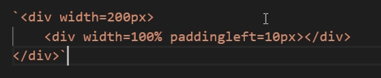
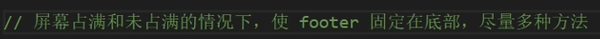

## 腾讯 游戏数据 一面

- 面试官自我介绍
- 自我介绍
- 简历内容
  - 论文
  - 用过ant x v6？渲染原理看过没.
  - canvas和svg的区别，canvas和svg在交互事件上的区别
  - 项目里权限控制怎么做的，后端是你做的吗？
  - express中间件实现原理看过吗？
- 前端SPA路由模式？哈希和history的区别？
- http和https的区别，https安全在什么方面呢？
- 为什么是三次握手不是其他？
- tcp拥塞控制是为了解决什么问题？
- tcp和udp的适用场景？
- 前端性能优化，页面加载速度优化手段？
- 浏览器渲染原理、浏览器缓存原理？
- 闭包是为了解决什么问题？
- 事件循环
- 响应式布局，媒体查询
- 用户输入恶意脚本，怎么防范？

开始聊天

- gpt爱用吗？
- 玩过云服务器吗？
- 爱玩游戏吗？
- 怎么学习的，喜欢上什么网站，看什么书？

反问环节

## 腾讯 游戏数据 二面

自我介绍

- 研究生的研究方向？图形学是什么东西？和音视频有关系吗？为什么不做图形学了？
- 实习多久，实习出勤天数
- 32位整形存储方式
- 算法：旋转数组后查找对应元素
- UDP和TCP是否有大小限制？MTU的大小是多少？MTU为什么要是1500，大了小了问题是什么？
- 登录鉴权流程
- 你刚刚说用户名密码要传过去，怎么保证传输安全呢？

反问

## 腾讯 游戏数据 三面

- 自我介绍

- 论文介绍

- 简历项目是为了解决什么问题

- 看过什么源码吗

- 美术怎么样，有没有接触美术工具

- shader看过吗

- 音视频有了解过吗

- promise async await实现原理

- 前端安全，https攻击原理

- 面过其他互联网公司吗，阿里什么的

- 未来想做什么样的工作

  - 想做看得见的，有反馈的，客户端不也可以吗

- 有考虑过做游戏吗

  - 图形学只能做游戏吗？有没有可能他们做游戏只是他们做游戏性价比最高，其他方向了解过吗

## bilibili 大会员 一面

没回答出来的

- 如何隔离不同的css，css module是什么
- 盒模型
- vite和webpack
- 创建微任务的方式

## bilibili 大会员 二面

- http1.1和http2

  - 服务器推送的实际场景，服务端推送的最佳实践是什么？

  - 具体来说，为什么封装成数据帧就能够一定程度上解决队头阻塞？
  - 怎么判断一个帧是请求的数据包还是返回的数据包？

- 排序都有哪些算法

  - 快排的流程，复杂度

- https的加密过程

  - 为什么最后生成的会话秘钥要用对称的秘钥，而不是一对公钥和私钥

- js的原型和原型链

  - 设计原型链的作用或者说目的？

  - 怎么实现原型继承？
  - 原型继承方法的缺陷

- js为什么会出现异步？异步的写法有哪些？

  - js被设计成单线程的目的是什么？
  - 被安慰了，问题都会延展的问，已经答得比较好了（QAQQQQQQQ）
  - 什么叫promise的链式调用

- http的content-type常见的有哪些，两种表单格式有什么区别？

- 什么叫盒模型？

  - 有哪些浏览器用content-box，哪些用border-box
  - 你觉得哪种比较合理？

- 移动端自适应布局

  - 用rem具体怎么适配？

- vue的compute和watch的区别

- ref和reactive的区别

- 什么叫hooks

  - 如果你要自定义一个hooks，你要针对哪些场景做一个hooks

- react的数据状态管理工具有哪些

  - redux的reducer和dispatch分别是做什么的
  - 数据状态管理，vue的ref、reactive，redux等等，这些设计理念上有什么区别？

## 腾讯 效能中心 一面

- 自我介绍：项目、觉得自己是怎么样的人、亲朋好友觉得你是怎么样的人？
- 为什么不继续做研究生的方向
- 项目：弹幕姬
  - 是官方接口吗？用的F12接口b站没有防御吗？session-data是httponly的数据是怎么set进去的？
  - 你做的弹幕组件和视频里自带的弹幕组件有什么更好的体验吗
  - 缓存队列是怎么实现的呢，数据结构描述一下？有没有考虑过队列的极限承载，比如32GB的电脑，UTF-8编码，你能存多少条弹幕呢？
  - 大概讲一下无限滚动的列表实现流程？有没有涉及到dom元素的复用？
  - 那扩展一下吧，假如要做一个虚拟列表，要可交互，你要怎么实现呢，介绍一下数据结构和算法流程（回答继续用缓冲队列，然后用计算属性算一下哪些地方是视窗，哪些项要显示呢）
  - 具体要怎么算呢，怎么计算出startIndex和endIndex
  - 比如这时候你算出了startIndex和endIndex，现在用户向下滚动了20px，一个item是10px，会涉及到哪些运算？（回答startIndex和endIndex是计算属性的话，把scollTop设为依赖项，会去更新相应的startIndex和endIndex）
  - 那假如你现在用的是canvas，你失去了vue能给你的所有功能，你要怎么手动的去实现元素剔除、元素复用？（回答要手动实现监听，用节流的滚动事件更新startIndex和endIndex，在这范围外的元素剔除掉。关于元素复用，将dom内容计算为hash值，利用单例模式，惰性地首次渲染的时候新建dom存进哈希表，再次被用户观测到的时候从哈希表里取出来）
  - 为什么要用哈希表呢？直接用元素下标不可以吗，两种方案有什么优劣呢（回答如果两个dom相同，用哈希映射的dom元素可以复用，不用新建一个）

看代码环节

- 盒模型

子元素会溢出吗？

- 页面布局问题，类似一个copyright，如何去做一个
  - 页面没满的时候，自动在最下方
  - 页面满的时候，在页面的最后

（回答只想出一种css方案，用minheight撑开root宽度然后用绝对定位）

- 经典八股flex
  - flex：1？
  - width和flex-basis的优先级？
  - 这个优先级，你觉得设计理念是什么呢？（回答个人觉得flex作为一种布局方案，希望所有属性都被flex控制，是一种关注点分离的理念，如果希望width影响flex也可以启用auto）
- 深拷贝，JSON方法的缺陷
- 在DOM上同时绑定两个点击事件，一个捕获一个冒泡，事件会执行几次？执行顺序是？
- 介绍一下回流和重绘，如何针对这两个特性进行优化？
- 有了解过dom.clientHeight和getBoundingClientRect.height有什么区别吗？
  - 通过这两个方法获得dom元素，会出现回流或者重绘吗
  - 现在我们业务中有一个场景，就是因为要对该dom做动画，height可能变动，我们频繁的调用获取高度的接口导致了性能瓶颈，你要怎么优化呢？（回答尽量少去使用这些函数，初始化的时候获取一次高度，此后就尽量用自己可控的动画方式，比如js动画，能够了解每次移动多少的，手动记录每一次更新的高度，这样就不用频繁调用接口了）
  - 面试官问还有什么补充吗，似乎对我的方案不太满意。
- 两个矩形怎么做碰撞检测（只想出了暴力的方法，循环判断每个点是否在两个矩形内，AABB包围盒想不起来了）

反问环节

- 感觉问的问题很特别：我们这边还是比较需要一个有经验的同学，所以问的问题偏实战了一些。
- 学习上的建议
  - 多去看源码
  - 把项目往深去做，反复打磨同一个项目：做出来、然后考虑边界情况、考虑性能问题、然后从前端、交互的角度去打磨，如果不知道怎么做，就去抄别人的源码，站在巨人的肩膀，对于工程的问题其实很多人帮你踩过坑了，这样学习提升会很快

代码环节（面试官关了摄像头后的笔试题，应该没有什么参考性）

- 分别以迭代和递归实现阶乘，并阐述哪个更快，为什么？给出三个理由
- 反转链表plus，给定一个链表中的目标值，反转目标值之后的链表

