## 2024.3.15

首先是发现了psnr在3000次循环时开始下降

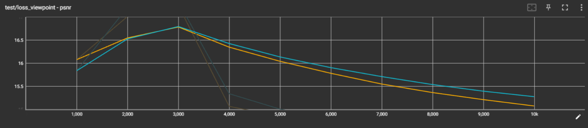

L1 Loss也在3000次时上升

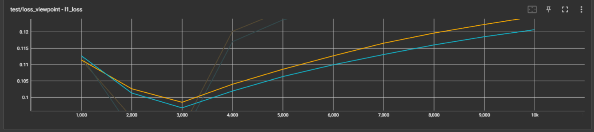

grad l1（深度梯度）

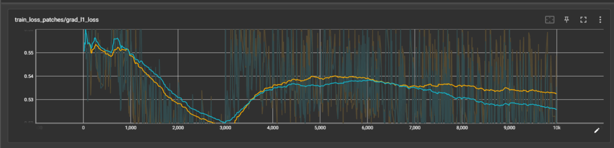

train l1 loss在3000，6000,9000次明显上升

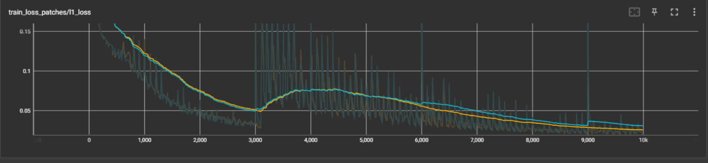

so，3000次开始的两个特殊设置：
1、重置透明度，每3000次进行一次

2、从3000次开始，透明度低于0.005的高斯核被剔除, view space中大于size_threshold被剔除，world space中大于cameras_extent被剔除

### 是否进行透明度重置的实验

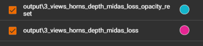

psnr：进行重置psnr时test的PSNR表现更好

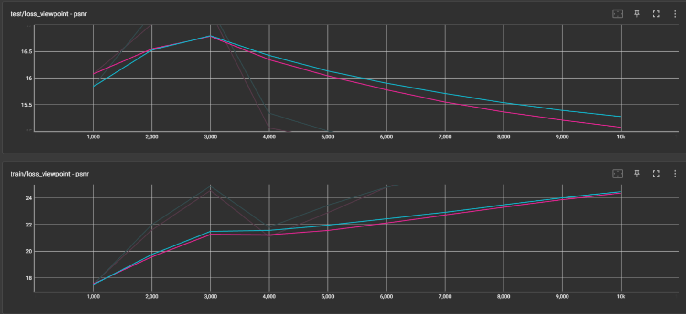

depth_loss(SSI): 不进行透明度reset会导致train SSI loss无法下降

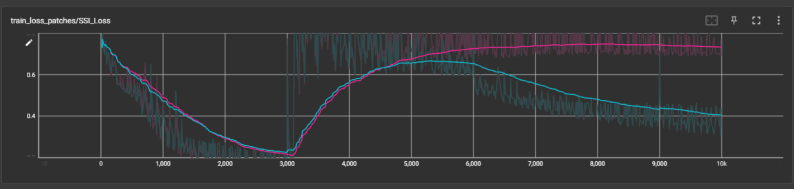

所以透明度重置不应该被删除

### 关于去除“删除超大高斯”这一功能的的实验

well，这下psnr好看了，深度图也合理了，唯独椭圆们……

黄色：不去除超大高斯

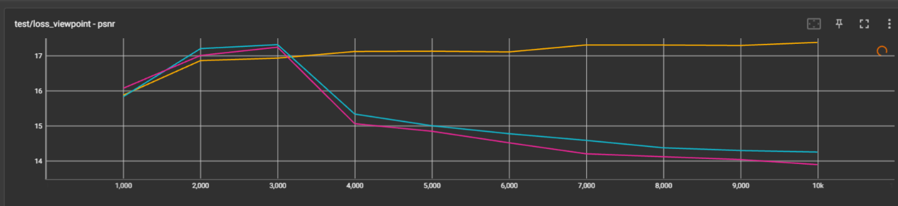

修改前的深度图：

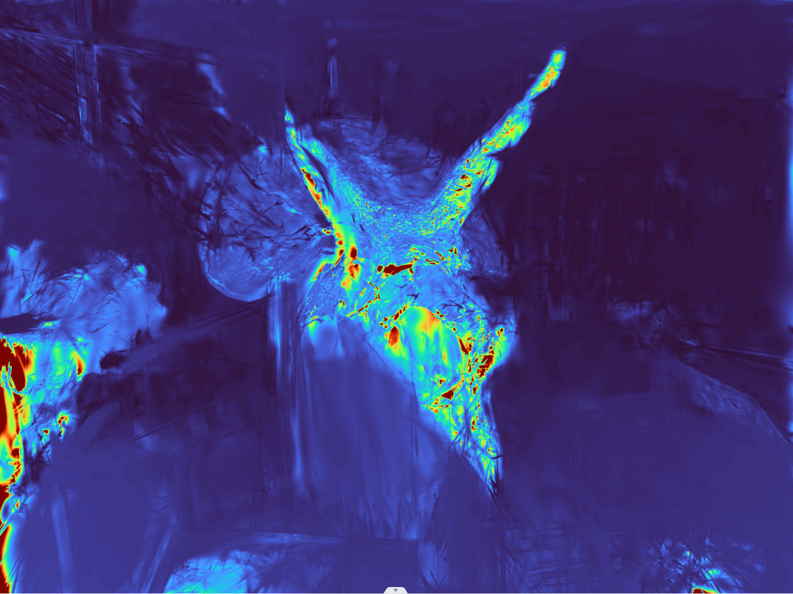

修改后的深度图：

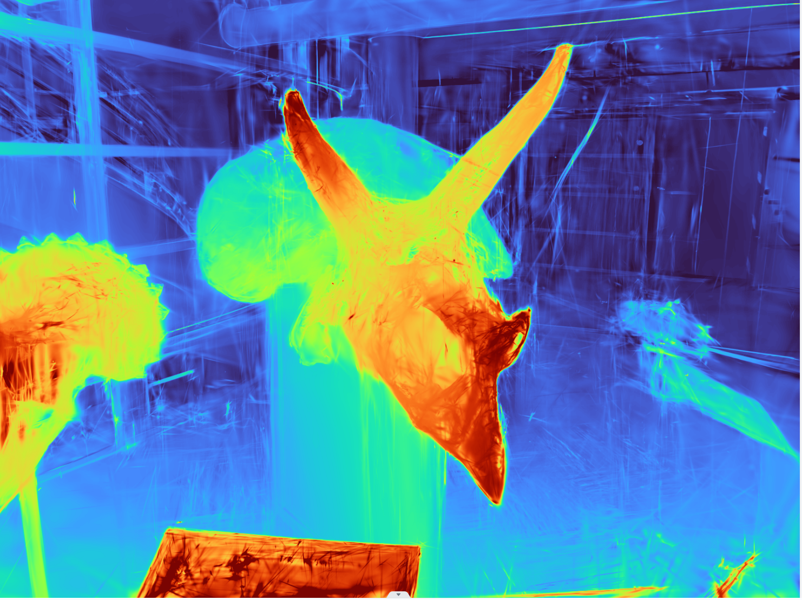

修改后的椭圆：

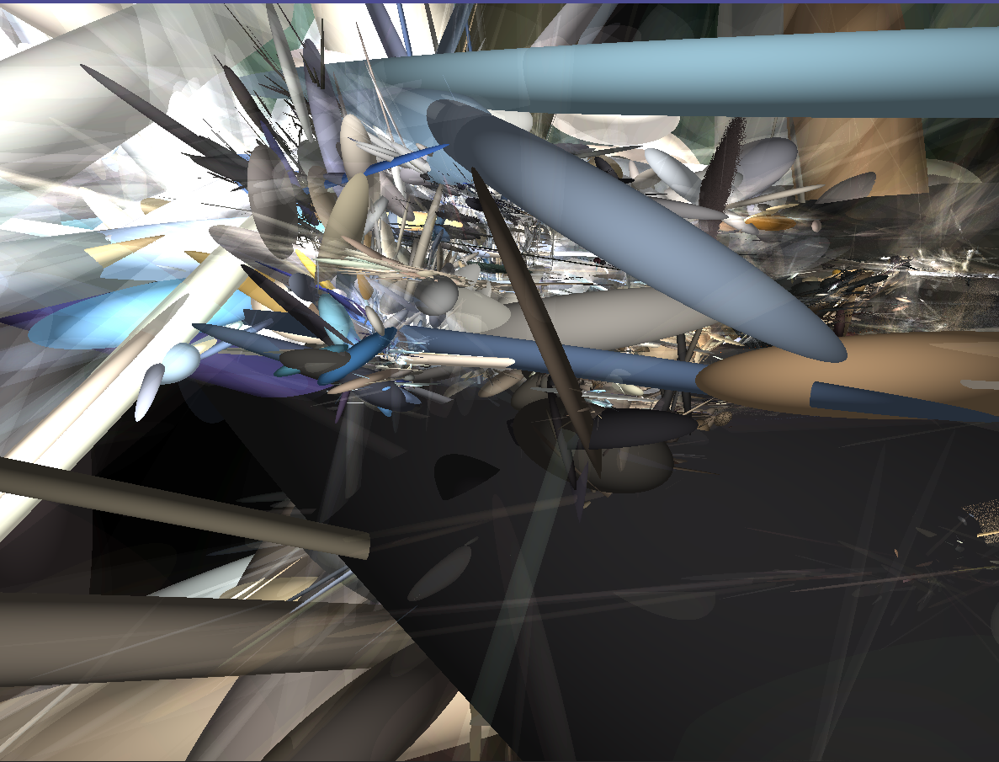

修改前的椭圆：

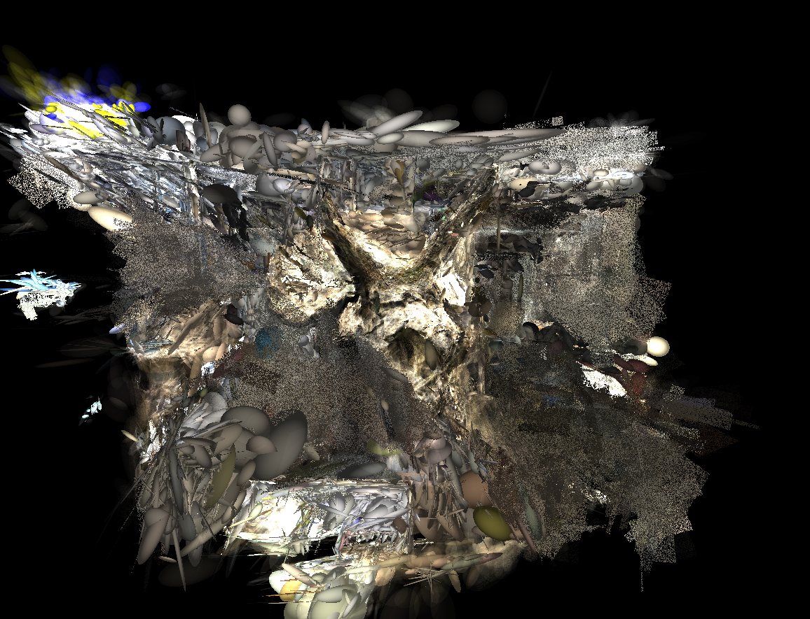

即使PSNR变好了，这些椭圆也不是该有的样子不是吗，来看看all views

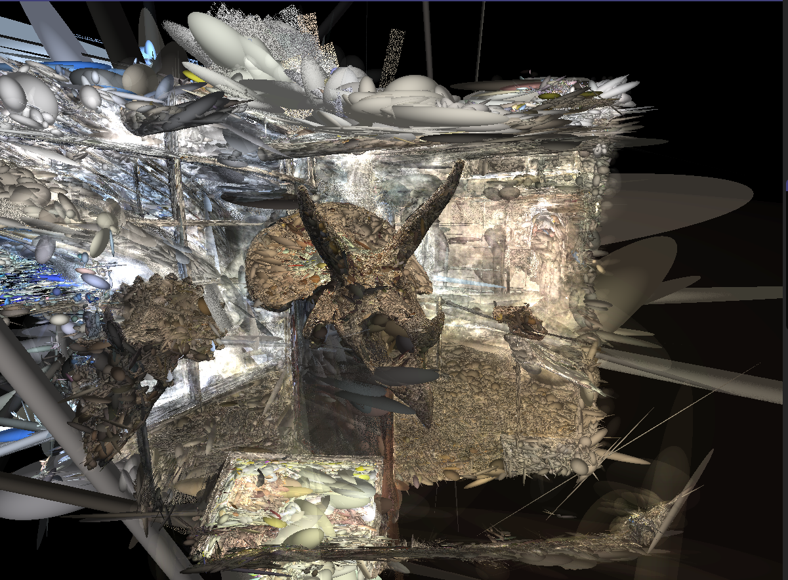

也就是说，这些“floater”一定程度上帮助了图像质量和深度质量的提高，直接对floater进行裁剪有点砍到大动脉了（尤其是第3000次，也就是首次去除大高斯核），让loss无法合理的优化到正确的地方

兴许一开始就不该让这些floater出现

另外观察到，如果使用原始的超参设置（3w次迭代，1.5w次后不再进行densification和透明度重置,超大高斯剔除,透明高斯剔除），psnr会越来越低，但深度会被逐渐优化

## 2024.3.16

### 今日的突发奇想：在前x轮只训练xyz，先让高斯球分布到合理的深度（当然最好是物体表面），再进行细节的修正

只解锁μ，感觉怪怪的

既然是物体表面，透明度先改为0.9吧（0.1试过了效果很差）
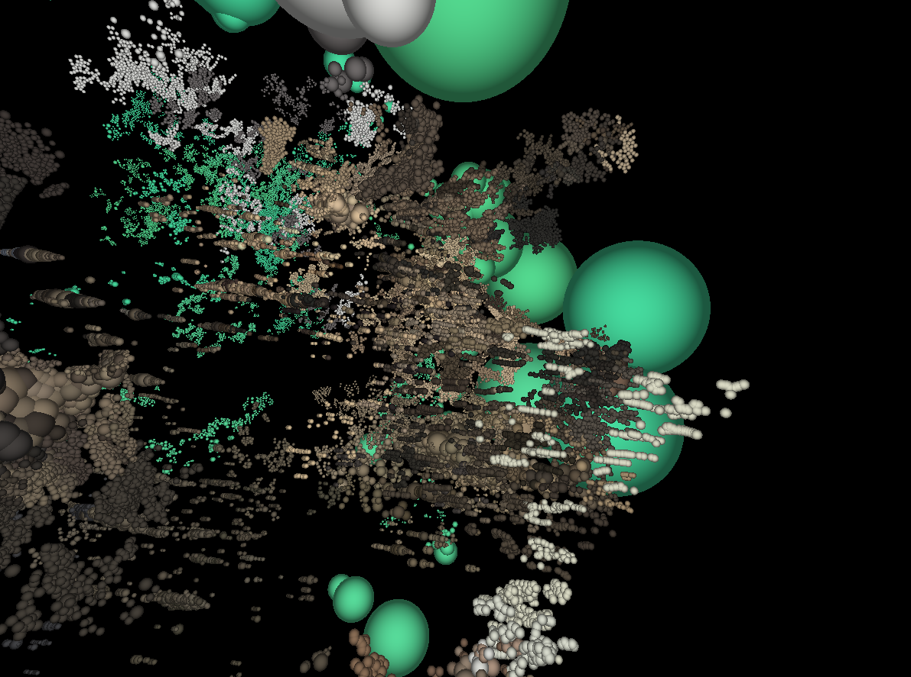

出现了奇怪的连续的椭圆，似乎是沿着相机向后推的

我觉得应该修正思路，不仅仅只改变xyz，实际上可以归结为我想要先训练图像的geometry，因此xyz、scaling和q的梯度都应该被解放

感觉有点希望，geometry好像还不错

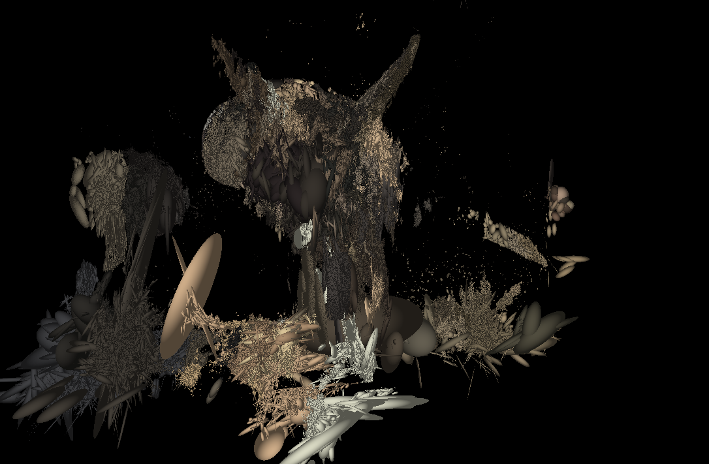

这些策略和深度损失有很大关系，好好研究下深度损失的定义吧

## 2024.3.18

开始意识到只有前景有高斯是不行的，这不能有效的指导后续的高斯合成，这会导致后续背景合成在摄像机前形成floater，我应该怎么样使用深度图让前景和背景都有高斯点的分布呢

> 但是这样的话某些合成数据集怎么办，那些背景高斯？

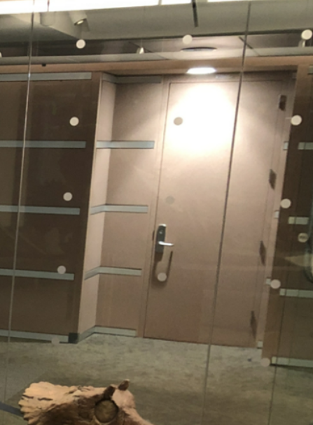

比如这一块，这是稀疏视角中第一张图独有的部分，在深度指导的合成时这里也没有高斯分布，导致后续这里形成位置不正确的伪影

## 2024.3.27

对线性插值深度做实验，一个是fgsg的反向传播，一个是直接+p_z的反向传播

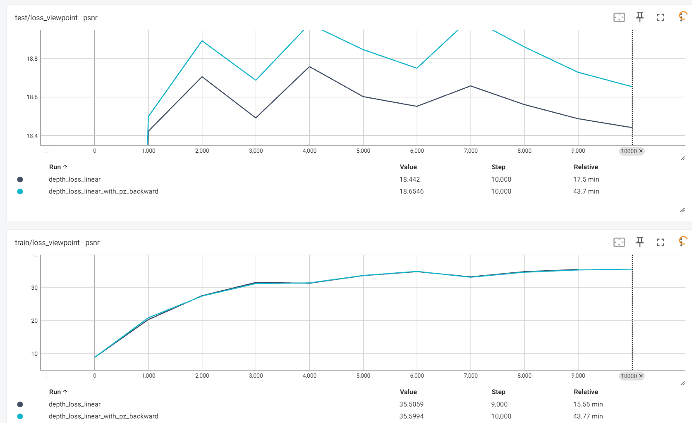

+p_z的psnr表现更好，但是训练时长增加了三倍，先用FGSG的实验，以后刷点再用pz吧

## 2024.3.28

尝试颜色也使用线性插值（linear_color），出现了神奇的超远背景

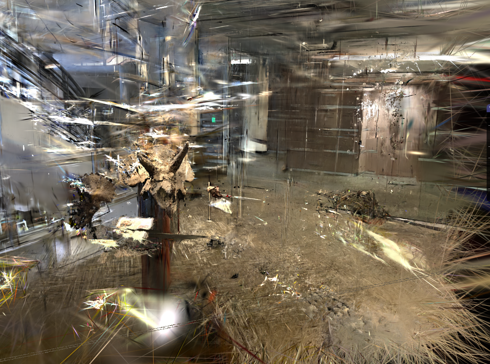

## 2024.3.29

