## nerfren（2022 CVPR）

- Category：光照反射
- Project: https://bennyguo.github.io/nerfren/
- Code: https://github.com/bennyguo/nerfren
- Paper: https://arxiv.org/pdf/2111.15234.pdf

### Motivation

原来的nerf：

- 缺乏对反射的建模，对于镜子反射的物体，在体渲染的模型下，相当于在镜子里存在一个虚拟的空间，从而导致错误的深度估计，**同时会将反射的物体建模为半透明的，从而导致雾状的几何**。

  > 其实我觉得这个很符合直觉，体渲染并不是真正的光线追踪，不能做到反射的光线也只能用虚拟的空间来欺骗视觉了

  - 先理解什么是雾状，将其和一般的半透明（如一个泡泡）区分开来，在一块区域中，每个采样点都有一些几何存在，但都是半透明的，看见的就是雾状，而一个泡泡看起来很清晰，是因为它内部是不存在发光的采样点的，而只在表面存在，这个是透明。

  - 在ref-nerf中提到，NeRF倾向于在物体内部使用各向同性发光点来“伪造”镜面反射，而不是由表面点发射的视相关辐射，导致物体具有半透明性或雾状壳。

  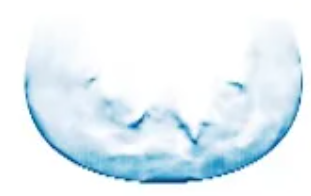
  
  - ↑可视化的density，在正确的物理世界中，镜子应该只在表面有密度，而nerf中是认为镜子有一个半透明的表面，然后在镜子内部的不同深度出现了发光点，从而是雾状的。
    - 这样还会导致一个问题，这样训练出来的nerf，在镜子的交界附近也能看到那个镜子中的虚拟世界，也就是所谓伪影。

  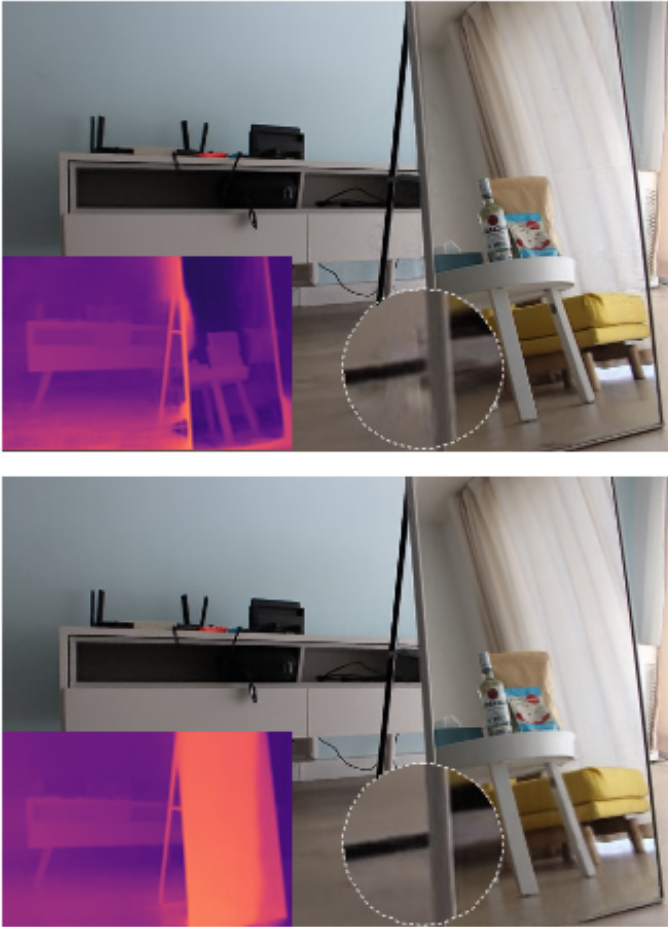
  
  - 所以问题就回到如何让nerf学习到基于表面的反射，如果用原来的nerf结构，最后的结果应该是：最后的镜子上有很高的density，即认为镜子是不透明物体，同时镜子平面上每个采样点的c来表示镜面反射，通过一些光学模型作为几何先验进行正则化，或者是修改模型等等，这篇文章就在解决这个问题。

### Method

- 将神经辐射场分解为独立的transmitted部分和reflected部分，同时学习一个reflection fraction map $\beta$，最后image由两者通过各自的辐射场渲染，最后相加得到，即

$$
I = I_t+\beta*I_r
$$

- 当然，it is highly under-constrained，如果不更改nerf就简单的将其分解为两个场，其实就是做一个无监督任务，那么会有无穷多种二分类的分解方法最后合成得到正确的视图。常见的有：分解为full场（渲染完整视图）和empty，分解为2个full场，以及两者之间。那么自然就要对训练做出约束了，基于以下三个假设：

  - $\beta$只应该和transmitted有关，因为$\beta$其实表示了物质的材料（我理解是反射率），而不应该和被它反射的物体有关系
  - transmitted的深度图应该是局部平滑的，因为现实中大部分反射体都是光滑平面（疑问：可是这个场也要用来重建其他物体，从case来看就是只盯着镜面重建了，但是case中镜面与其他物体的交界处好像重建的也还行）
  - reflected部分只需要简单的几何，因为大部分情况下我们只能从有限的观察方向看到反射图像。（意思是正常的三维重建我们追求360度全方位重建，但是重建出镜面中反射的物体我们只能看见一部分）

- 自然，三个假设做出三种约束

  - 设计特定的网络结构，分解成两个场，这里的α（reflection fraction map）只和transmitted有关

    - 整个镜面反射r场都和视线无关是一个比较反直觉的设计，有些不能理解。在原来的折射场中保持了方向是为了保留高光。在我看来是完全抛弃了物理假设，也就是图形学中的PBR公式，BRDF项等一系列物理假设，把镜子中的图像认为是藏在镜子中的另一个世界，不同视角带来的差异是因为摄像机在不同位置带来的，而并不是由于反射的光来源于不同位置造成的。比如看一个鼠标，从正面，上面，左边的三视图看到的是不同的鼠标图像，这是视线无关的场，场中某个点就是鼠标的组成部分，不会因为视角变化而导致鼠标本身的样子发生了变化，但鼠标上的高光真的是会因为你视角不一样而发生改变的。

    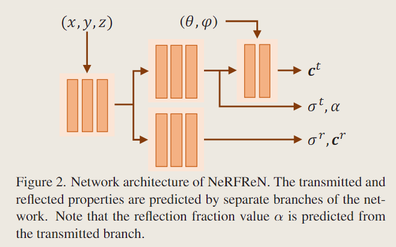

  - 应用深度平滑先验

    - p是某像素，q是周围的8个像素，t*是估计深度（通过体渲染时采样点的深度加权求和得到），pq的深度差距越大以及颜色差距越大，都会导致Loss的增大，保证transmitted场的深度局部平滑

  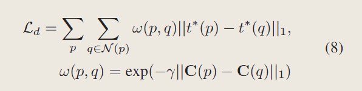

  - 双向深度一致性约束（bidirectional depth consistency constraint）

    镜面反射场最好描述了一个什么物体？作者的推导逻辑是，因为只有在很少的视角能观测->简单的几何，一种光线只能击中一个表面的几何->应该是一个不透明表面，一个贴了纹理的壳

    > 其实个人感觉故事讲得不好，这个约束在于将表面约束的足够薄，不应该由只能从正面看镜子来导出，其实将镜面反射简化为一张2D纹理是图形学渲染中的常见手段，但是确实不是很物理也不好讲故事，我猜作者是受此启发的，但是故事没太讲好，或者是我没get到，或者说从ref-nerf受启发也很合理，要将发光体约束在表面就要使得物体足够薄]

    - 定义了一个**反向**的深度，也就是从最**远**采样点的深度加权求和得到

    - 定义了一个**正向**的深度，也就是从最**近**采样点的深度加权求和得到

    - 这里比较容易让人产生疑惑，从近到远求和以及从远到近求和结果有什么区别？其实权重不一样，同一个采样点，从近到远求和的权重取决于它之前的点的不透明度，而另一个取决于它之后的点的不透明度，因此如果有两个表面，正向深度就会更偏向于前面的表面，因为后面的表面权重被前面的表面大幅降低了。

    - 来看一下不同的几何下正向深度和反向深度长什么样，横轴是采样点的距离，蓝线的纵轴表示密度，所以a表示遇到了两个表面，b是雾，c则是理想的镜面反射体——一张贴了纹理的固体。那么作者提出的约束就很简单，让两个深度足够近。
    
      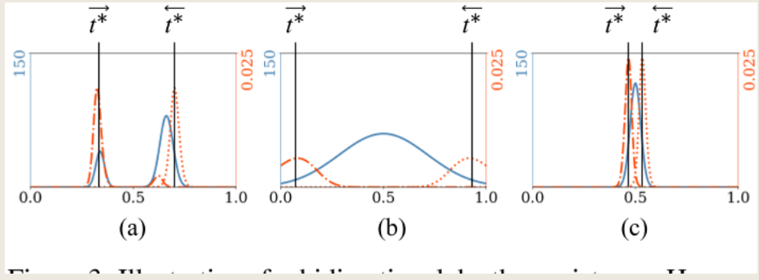

- 另外，对于有挑战性的场景，比如镜子，可以手动的提供mask，来使得场景被更正确的分解。（其实感觉这个是不是有点过分了，破坏了end to end，加入了手工的方法来大幅提升精度，不过某些先语义分割再nerf的方法好像也殊途同归，我训练个专门识别反射体的segment的cnn/transformer作为预输入语义是否有一定效果？就是novelty几乎没有，还会有个臃肿的模型，不过发散的讲，更多种分解场的方法，以及不同对应的预输入？）

  - 具体是，利用提供的mask图作为$\beta$的约束，要在mask区域$\beta$尽可能大，而其他区域尽可能小。


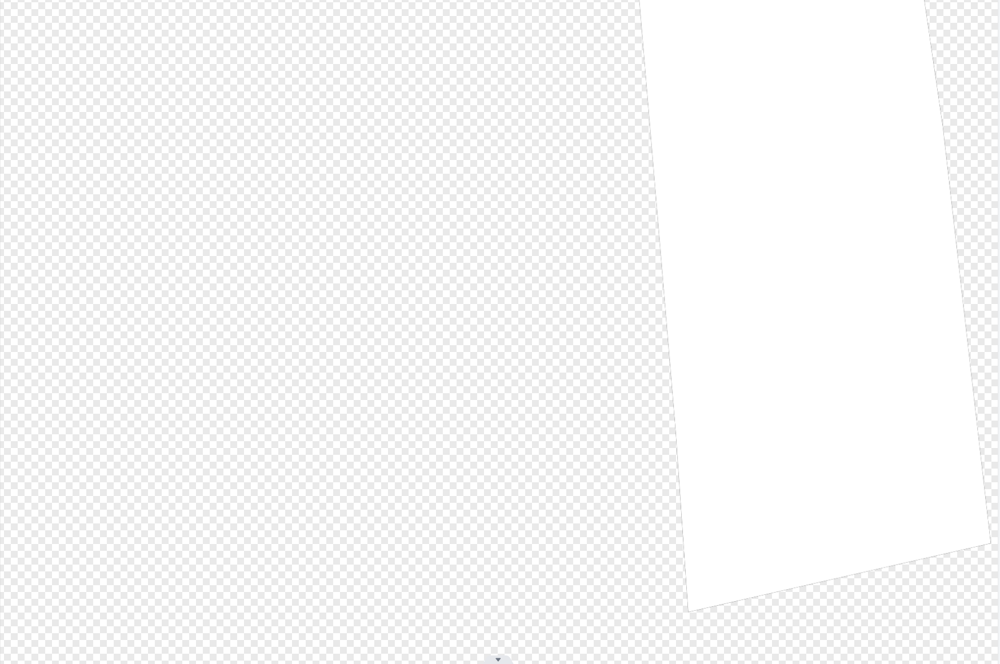


### Limitation

- 这篇文章太注重平面反射的建模了，自然会产生一个问题：对于非平面的镜面反射不能有很好的效果，比如下图的弯曲镜面

- 另一个是没有模拟出菲涅尔效应，这里作者只是提了一下，没有给出failure case，其实个人感觉反射系数$\beta$近似了一种菲涅尔系数，不过没有进行建模和约束，仅靠MLP学习，所以大概率学到的不是物理意义上的菲涅尔。

- 虽然文章没写，但是感觉过于精细的调参也是一个缺点，它要在早期屏蔽view direction以及它自己新增的几何约束，才能出比较好的效果，否则基本就是分解失败


## Ref-Nerf（2021 CVPR）

- Project: https://dorverbin.github.io/refnerf/
- Code: https://github.com/google-research/multinerf
- Paper: https://arxiv.org/pdf/2112.03907.pdf

### motivation

- 以view direction为MLP的输入，不方便进行插值，因为radiance function关于view direction变化太快
- nerf倾向于用在物体内部的各向同性的发光点来伪造镜面反射，导致物体呈现出半透明或者雾状。也因此导致法向量充满噪声，难以使用。

### contribution

- 重新参数化nerf，将view direction替换为出射方向

- 提出一种IPE，使得即使分开建模漫反射和镜面反射时，radiance function在不同的纹理和材质下仍可以平滑插值（还没看mip-Nerf，先TODO，有球谐函数和高斯的知识，也可能和3DGS有共通之处）
- 一种正则化方法，使得体积密度能够集中于表面，从而优化法向量的精确度

### method

- 重新参数化nerf，将view direction替换为出射方向
  - 用一个四个平行光的简单场景为例，黑色的是可见（但是没有光）部分，棋盘格是不可见部分。
  - $\omega_r$表示出射方向，永远指向平行光所以不随着x变动，因此第二行的图中这些光都是平行线，如果我们要预测$\omega_r$不取在这四个平行光所在方向的参数，Directional MLP只需要进行平滑的插值。
  - 下方的$\hat{n}, ρ, c_d$表示ref-Nerf对这三个量进行了建模，将它从镜面反射中分离开来，最明显的变化是使得右边第二列，相比于第一列，让Directional MLP不需要对漫反射进行插值。

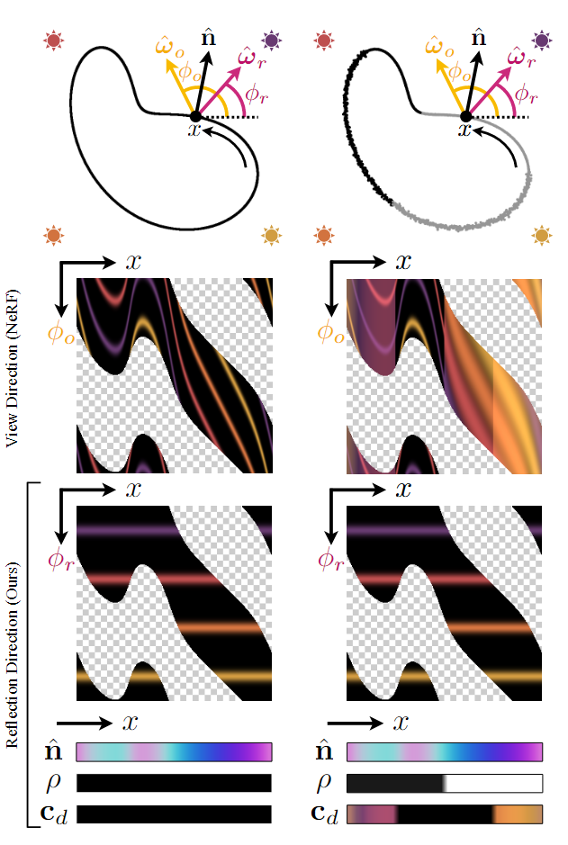

- 网络的框架，ρ表示粗糙度，和IDE有关，法向量和视线方向用来算出反射方向$\omega_r$，以及位置$x$通过空间MLP编码后得到的特征向量$b$,还有$n·d$(为了模拟菲涅尔项，以及其他可能的BRDF函数)来计算高光反射的颜色，最后和漫反射颜色一起通过色调映射输出srgb颜色。[色调映射：将颜色从线性空间转换到srgb并且将颜色范围限制到[0,1]]

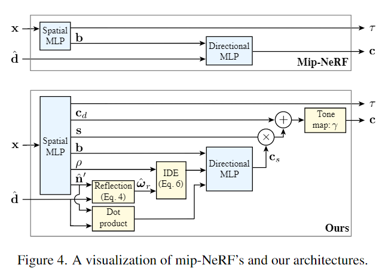

- 提出一种IPE，使得即使分开建模漫反射和镜面反射时，radiance function在不同的纹理和材质下仍可以平滑插值（还没看mip-Nerf，先TODO，有球谐函数和高斯的知识，也可能和3DGS有共通之处）

- 一种正则化方法，使得体积密度能够集中于表面，从而优化法向量的精确度

  - 针对体密度梯度计算出的法向量充满噪声，不够平滑的问题，提出第一个正则化，就是在MLP输出另外一个法向量，要求这两个法向量足够接近。作者提到：MLP预测的法线更加平滑，这和vanilla NeRF提到的位置编码来自于同一理论，论文Fourier Features Let Networks Learn High Frequency Functions in Low Dimensional Domains中提到MLP的这一特性，以及克服MLP趋向于学习低频特征而不擅长学习高频特征的方法，包括原始NeRF中的位置编码。当然，这里是反过来利用MLP学习低频特征的特性，来预测一个尽可能平滑的法线。

  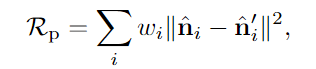

  - 第二个问题是针对NeRF总喜欢用一些物体表面后的发光点的问题，提出要让高可见度(也就是$w_i$高)和光线同向的法线受到惩罚，这样物体存在于物体背面又能够发光被我们看见的物体就会减少。通俗的讲，让NeRF倾向于让面对光线的那一部分表面来表达物体的颜色，而不要让物体表面变成半透明，而让里面的物体发光来解释所看到的颜色。

  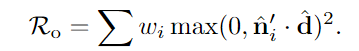

## Nerf2Mesh（2023 ICCV）

- Category：nerf2mesh, nerf-texture
- Project: https://me.kiui.moe/nerf2mesh/
- Code: https://github.com/ashawkey/nerf2mesh
- Paper: https://arxiv.org/pdf/2303.02091.pdf

好像不是很看得懂，尽力吧

这个翻译的不错：https://blog.csdn.net/m0_50910915/article/details/131823539

这个是论文思路解释：https://blog.csdn.net/qq_40514113/article/details/129759065

### motivation

关于深度学习重建mesh的方法中，

- mobile-nerf重建的mesh质量不佳，而且纹理是在特征空间中而不是RGB空间中，这使得纹理编辑成为难题
- SDF相关的工作中，提取了过度平滑的几何，难以model thin structures。
- 通过Marching Cubes产生的网格有过多的冗余顶点和表面
- NVdiffrec使用可微光栅化来优化可变形四边形网格，但只能用于对象级的重建，并且在复杂的多边形上失败

### contribution

- 提出了Nerf2Mesh，从多视角RGB图像中提取网格，细化从Nerf中提取的粗网格，实现几何和外观的联合优化。
- 提出了一种迭代式的网格refine算法，能够自适应的调整表面密度，根据重投影的二维图像误差对复杂表面进行细分，对简单表面进行抽取（decimated）（???）
- 与最近方法相比，更好的网格质量，更小的网格尺寸，更好的渲染质量。

### Realted Work

Surface mesh for Scene Reconstruction方面不是很看得懂，直接看从NeRF中提取网格的工作吧。

Nerf使用体积密度场表示几何，并不形成确定的表面，因此在提取表面网格上也受到限制。一种流行的方法是学习SDF，但是SDF的表面太过平滑，无法学习thin construction，还提到了SAMURAI，mobielNerf，以及提到两篇工作发现**指数密度激活函数**可以帮助集中密度，形成更好的表面。

### Method

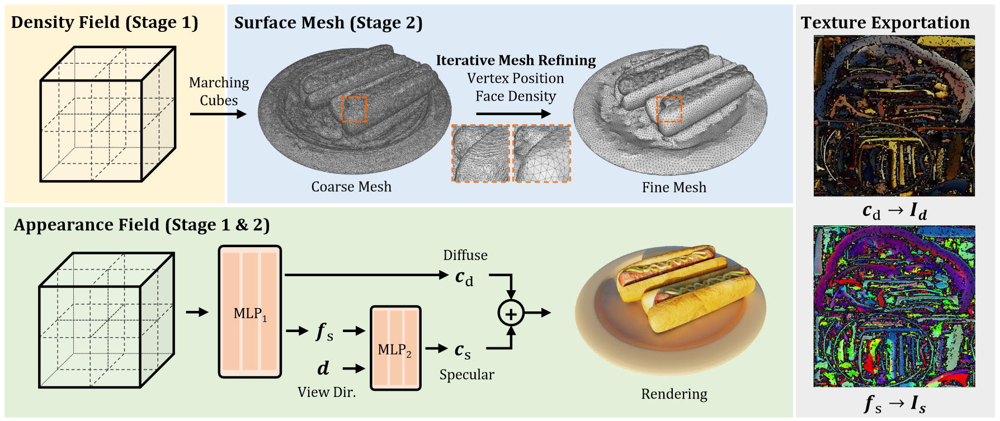

先训练一个grid-based的NeRF（InstantNGP），分为几何和外观联合优化

- 几何上，先用Marching Cubes提取粗网格，然后通过文中提出的算法细化网格
- 外观上，通过颜色网格学习的，并分解为漫反射和镝面反射项。收敛后，我们可以导出精细网格，展开其UV坐标并烘焙纹理。

#### stage1

大致的流程图里已经很清楚了，不过文中提到$f_s$可以被烘焙为纹理，$MLP_2$可以在fraa shader中实现，因此镜面反射可以被导出和渲染，很难理解这件事，特征是什么被提取为纹理的，着色器里怎么写MLP等等，感觉在这一领域欠缺了很多知识。

另外，本文的方法直接将光照烘焙为纹理，因为估计环境光具有挑战性，而且很可能会导致渲染质量降低。

当然，为了约束分解，还加入了L2正则化，原文提到这是为了促进漫反射和镜面反射的分解，于是对镜面反射应用L2正则化。这里复习下L1和L2，L1正则化趋向于让模型获得稀疏解，即在某些权重上为0，L2则让模型趋向于获得较为平滑的解。

> 也就是说这边是让不同位置上的高光反射不过于强烈，可以让高光的$c_s$平滑一些……为什么促进了分解？已经完全看不懂了
>
> 你用L1正则化我还能理解，但是文中也没有什么详细解释，只能你说是那就是了

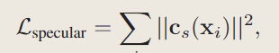

为了使得表面更加锐利，采用交叉熵正则化。

兴许这个还是比较好理解的，交叉熵正则化鼓励权重的稀疏分布，也就是说让体渲染上每个点的体密度尽可能大，而不是形成雾状，这样就使得体密度集中在表面上了。

> 求求作者解释一下吧，靠猜太累了，当然也可能是我读的论文太少了，这个作者认为不需要解释


#### stage2

- Appearance refinement：通过nvdiffrast进行可微渲染，仍然可以使用img逐像素的损失，来进行外观优化。（按文章脉络应该是在优化纹理，按图来说应该还是在优化$MLP_1，MLP_2$的参数）

- Iterative mesh refinement.

  - 顶点优化比较容易理解，对于每个顶点设置一个偏移量$\triangle v_i$，通过可微渲染反向传播image-space loss gradients（NVdiffrec提出）来优化这个偏移量。
  - 面（face）优化就比较复杂，因为网格面不可微。本文提出的训练策略是将2D图像渲染误差重投影到对应的网格面上，累积网格面的误差，然后给出一个阈值，高于这个误差的做网格细化，低于的做网格抽取并重新网格化来降低网格密度。

  > 复习一下obj格式吧，顶点用三维向量描述顶点位置，面则是由顶点索引组成，表示这个面由哪几个顶点链接得到，注意顶点索引顺序是有影响的，这会决定面的方向
  >
  > 网格抽取（decimate）似乎是一个图形学上几何的相关知识，读不懂还是图形基础不够

网格更新之后就重新初始化顶点便宜和面误差

- Unbounded scene.

无界场景优化，没有读过相关文章，略过了。

#### Mesh Exportation

将优化后的精细网格$M_{fine}$用XAtlas解析UV坐标，然后烘焙漫反射颜色$c_d$和镜面反射特征$f_s$，分为生成$I_d, I_s$

为了渲染镜面反射颜色，采用mobileNeRF中的方法，导出$MLP_2$的权重并合并到frag shader中

### Limitation

烘焙光照，无法relight，基于单通道光栅化，不能处理半透明

> 读完了，但是和没读一样，不过还是有收获
>
> - get一种约束体密度到表面的方法，可以对体渲染公式中的$\alpha_i$做交叉熵损失
> - 在网格重建方面还是缺少了很多的基础知识，比如MarchingCube，另外意识到NeRF可能不是网格重建的主要方法，SDF可能更加主流。
> - 初步看到了可微渲染是什么东西，了解到一种可微渲染框架nvdiffrast
>
> 以后如果做相关方向，可以再回来看看这篇文章。

## **pixelNeRF**

**pixelNeRF: Neural Radiance Fields from One or Few Images**

*Alex Yu, Vickie Ye, Matthew Tancik, Angjoo Kanazawa*
CVPR 2021, 3 Dec 2020

[[arXiv](https://arxiv.org/abs/2012.02190)] [[Project](https://alexyu.net/pixelnerf/)] [[Github](https://github.com/sxyu/pixel-nerf)]

这篇文章给出了PixelNeRF的简易实现：https://zhuanlan.zhihu.com/p/550890576

应该算是NeRF早期的Few-shot工作，引用量也比较高，就当做稀疏视角重建的启蒙作看吧

### Realted Work

没有提NeRF相关的工作，都是之前的稀疏重建，提到了同期工作GRF。

### Method

motivation比较简单就合在method里，简单来说就是之前的NeRF只使用原来的图像进行训练，没有很好的利用原来图像的所有信息，所以当只有稀疏视角的时候新视角合成就有比较多的artifacts

这篇文章提出要用CNN提取输入的图像，形成一个feature volume，在推理的时候也使用这张特征图（额所以你为什么不叫feature map要叫volume），就能更充分的利用原来图片的信息了。

CNN Encoder由预训练的res-net34组成。

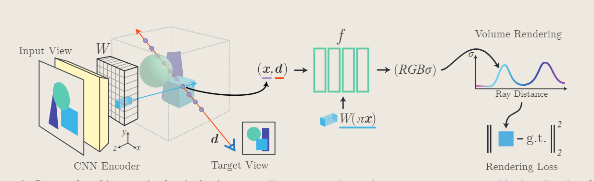

思想还是比较简单的，以单视角输入为例，将input view经过CNN Encoder得到一个Volume feature，即每个像素都有一个feature，即pixel-aligned，记作W，当需要进行新视角合成的时候，采样点从世界坐标映射到input view所在的view space，然后由最近的四个像素经双线性插值得到一个特征向量，将这个特征向量输入以下的网络

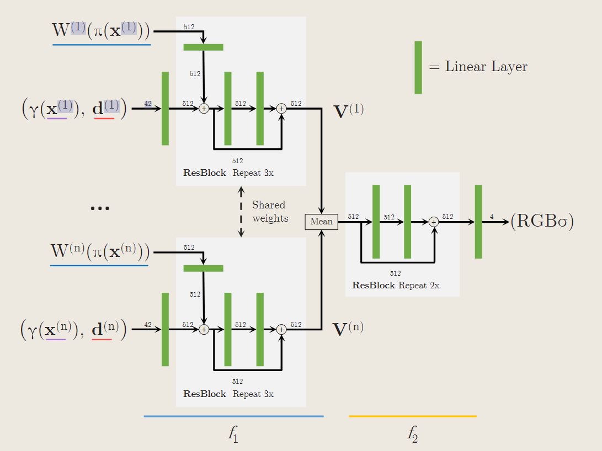

值得注意的是当多视角输入的时候，得到的V是经过一个平均的后输入解下去的MLP的，这点应该还有优化空间，不同视角下对于空间中同一个点训练出来的特征应该是具有不同意义以及重要性的，比如要新合成的视角和正面比较近，那么背面的视图应该拥有较低的权重。

另外输入的时候直接使用view direction，没有经过位置编码，也不是在中途加入的，原文表示

- view direction可以作为不同视图的相关性和定位的信息
- 当新视角和已有视角更接近的时候，可以更依赖已有视角，否则应该更依赖学习出的prior

> 我怎么感觉还是没解释为什么不中途加入呢

## **RegNeRF**

RegNeRF: Regularizing Neural Radiance Fields for View Synthesis from Sparse Inputs

*Michael Niemeyer, Jonathan T. Barron, Ben Mildenhall, Mehdi S. M. Sajjadi, Andreas Geiger, Noha Radwan*
CVPR 2022, 1 Dec 2021
[[arXiv](https://arxiv.org/abs/2112.00724)] [[Project](https://m-niemeyer.github.io/regnerf/index.html)] [[Code](https://github.com/google-research/google-research/tree/master/regnerf)] [[Notes](https://github.com/yangjiheng/nerf_and_beyond_docs/blob/main/paper_discussions/RegNeRF.md)]

总之先来两篇不错的阅读笔记：

顺便了解下李代数：https://zhuanlan.zhihu.com/p/532973564

fewshot工作总结：https://zhuanlan.zhihu.com/p/617570383

### motivation

- 一些工作（MVSNeRF，IBRNet，GRF，PixelNerf）需要昂贵的预训练，通过“amortized inference”（摊余推断）与fine-tune来完成稀疏视角重建。尽管这些模型取得了令人期待的结果，但通过捕捉或渲染许多不同场景来获取必要的预训练数据可能成本过高。此外，这些技术在测试时可能无法很好地推广到新领域，并且可能由于稀疏输入数据的固有模糊性而产生模糊的伪影。

> gpt:
> "摊余推断"（amortized inference）是指在模型的训练阶段进行的推断过程，其中模型被训练以在给定一些输入时，能够有效地生成输出，而不需要每次都进行全面的推断。这种方法的目标是通过训练模型来学习一种映射，使其在整个输入空间上都能产生良好的推断结果。
>
> 在文中提到的上下文中，摊余推断是指在测试时，通过使用已经训练好的模型，可以从仅有少量输入图像生成新颖的视图，而无需每次都重新进行完整的模型推断。这种方法有助于提高模型的效率，并使其更容易应用于实际场景，尤其是对于需要快速推断的应用。

> 还知道了一个常识：稀疏视角下有一个固有问题，就是会出现模糊和伪影，这里是在说这种做法还是没有解决模糊和伪影问题。

- 另一些工作是通过添加一些正则化，重新训练整个场景（例如引入深度监督的nerf，这里指Depth-supervised NeRF: Fewer Views and Faster Training for Free，以及引入clip的dietNeRF），但是现有方法要么过于依赖并非始终可用的外部信号（意思就是depth不是什么时候都能拿到的），要么只在低分辨率场景下（只提供high-level的信息，这里是针对clip）运行。

### contribution

- patch-based regularizer：用于新视角的深度图，可以减少伪影、增加几何质量
- normalzing flow model：用于新视角的颜色，通过最大化渲染patch的对数似然（？），来避免颜色在不同viewpoint下的差异（消融实验来看是个没用的创新点，还很难看懂，这里直接跳过了）
- **annealing strategy for sampling points：沿采样点的退火策略，首先在小范围内对场景内容进行采样，然后扩展到完整的场景边界，保证训练早期不出现分歧。**

### method

#### 深度平滑：

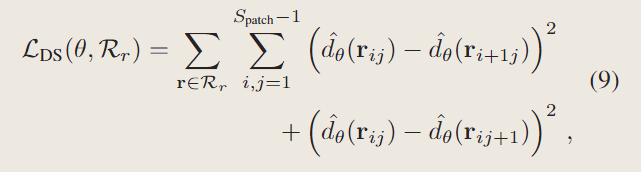

从规定的可能的相机位姿矩阵中采样光线$r_{ij}$，在patch范围内进行深度平滑，深度计算方法采用NeRF原代码中的方法。

> 很常见的方法了，但是一百种NeRF改进有一百个实现，也有各种各样的理由，可以考虑作为一个小trick。

#### 退火策略（Sampling Space Annealing）

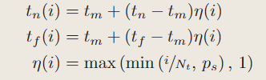

作者观察到，在稀疏输入的情况下，NeRF容易收敛到相机的近平面上，这虽然还原了输入视角，但是缺乏3D一致性，对新视角的合成就很不友好。

> $i:迭代次数，t_n:近平面，t_f:远平面，t_m:中点$

可以注意到$\eta$为0的时候$t_n=t_f=t_m$，而$\eta$为1的时候就是原始的近远平面，按照作者的思路应该$\eta$逐渐从0增加到1,因此看$\eta$的定义，作者还增加了超参数$N_t$：到第几轮的时候应该停止退火,和$p_s$：初始的$\eta$，可以看出max和min肯定是写反了，从代码来看也能知道。

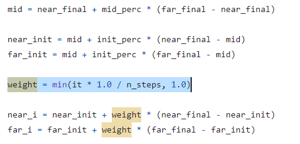

## FreeNeRF

**FreeNeRF: Improving Few-shot Neural Rendering with Free Frequency Regularization**
*Jiawei Yang, Marco Pavone, Yue Wang*
CVPR 2023, 13 Mar 2023
[[arXiv](https://arxiv.org/abs/2303.07418)] [[Project](https://jiawei-yang.github.io/FreeNeRF/)] [[Github](https://github.com/Jiawei-Yang/FreeNeRF)] [[Notes](https://github.com/yangjiheng/nerf_and_beyond_docs/blob/main/paper_discussions/FreeNeRF.md)]

### motivation

现存方法的不足：

需要大规模预训练：pixelNeRF，MVSNeRF

引入了深度监督，导致了复杂的管线：Depth-supervised NeRF

patch级别的正则化，导致了较高的计算量：DietNeRF，RegNeRF

总的来说，作者引入了两个几乎不增加计算量的正则化方法，避免了以上策略的缺点，即无依赖（不需要预训练和深度来引入额外信息）和无开销（不增加计算量），使得稀疏视角下的重建质量得到了很大的提升。

### contribution

- 揭示了稀疏视角重建的失败与位置编码频率之间的关系
- 提出两种正则化

### method

#### Frequency Regularization（频率正则化）

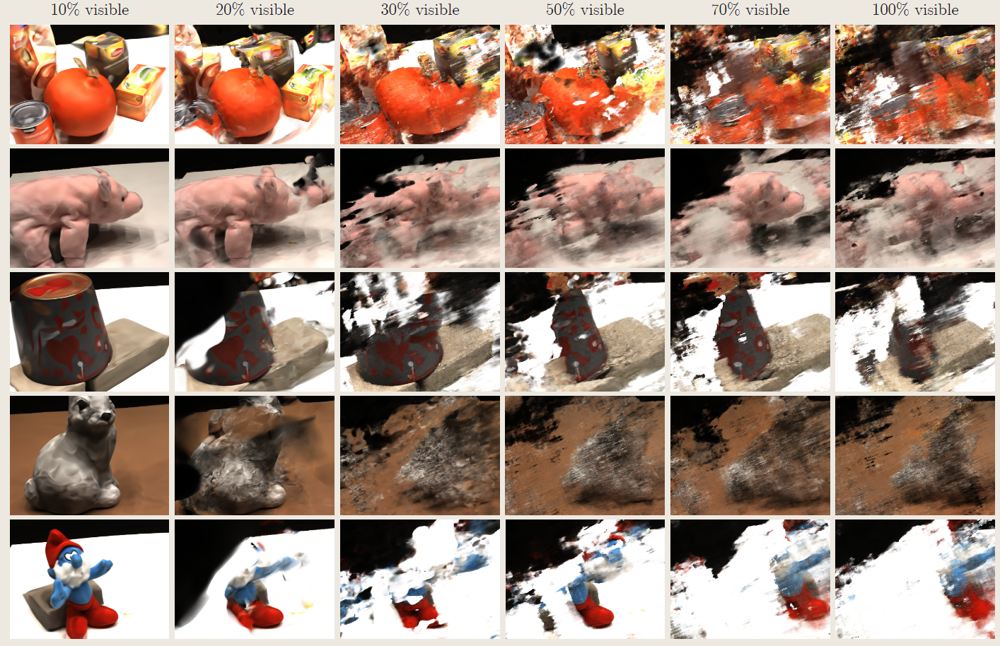

作者首先发现低频位置编码反而在稀疏视角重建学得不错（尽管过度平滑），10%是指解锁前10%的位置编码，以L=10为例，10*10%=1, pos_enc[int(1):] = 0,即只保留第一个位置编码。剩下是讲故事环节：

原文只说明：高频的位置编码使得高频部分更快收敛，从而阻止了对低频信息的探索，导致NeRF合成的新视角图像中出现了预期之外的高频伪影。

接下来是个人理解：

拥有高频位置编码意味着能够学习那些只移动一点位置就能变化较大的场景细节，在稀疏视角重建的时候，由于对原始图像的过拟合，把一些本该是低频信息的（比如平滑的表面）学习成了随视角变化很大的高频信息，合成新视角时，移动视角就会带来很大的变化，从而出现各种各样的高频伪影。

于是就提出一个退火策略，随着轮次i增加，逐渐开放高频位置编码。

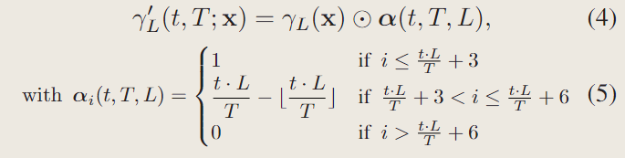

#### Occlusion Regularization（遮挡正则化）

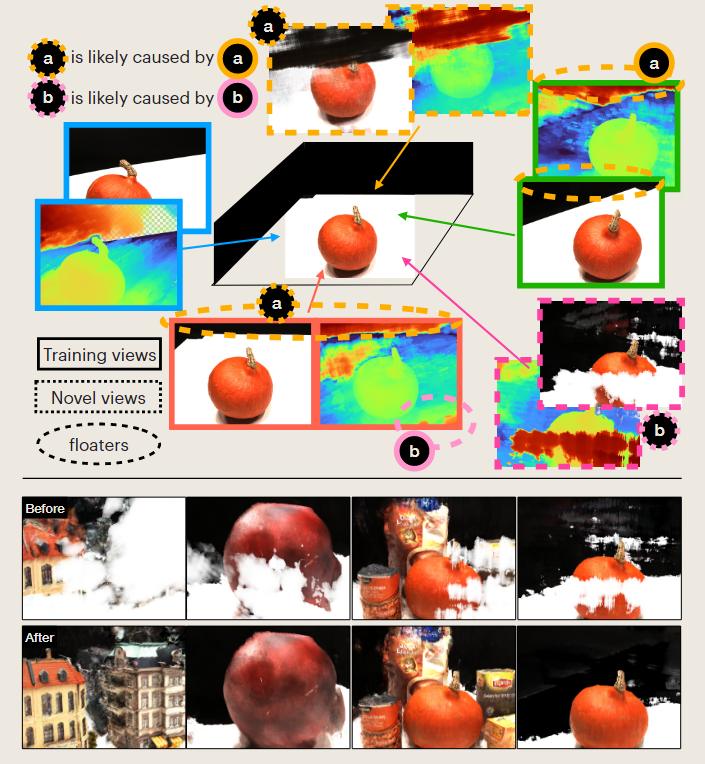

观察伪影，还可以发现有一些伪影并不是高频的，变化剧烈的，而是像墙一样直接堵住了物体的一部分，这部分是怎么回事呢？

通过上图可以知道，其实是输入的稀疏视角中极少重合的那一部分被NeRF解释成了更靠近相机近平面上的密集体密度块（漂浮物），在渲染新视角的时候采样到这些高体密度块就会出现一些墙挡住后面的物体。热力图是深度图，实线矩形里面是输入图像，虚线矩形里面是新视角图像，虚线圈起来的部分是导致了新视角图像“Wall”的“极少重叠部分”。

> 关于为什么会到相机近平面，个人认为是因为更容易收敛到这里，因为在近平面上改变一小部分的体密度就能改动很大的一块图像，近大远小嘛，这样的话这里就是梯度下降最快的方向，也是一个过拟合的问题。

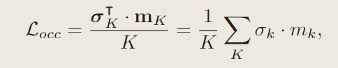

提出的正则化如上，假设采样64个点，K=1,2,3...64,（near to far），可以知道越靠近相机的点Loss越大（1/K），同时$\sigma_k$表示该采样点体密度，$m_k$是一个二进制掩码，表示该点是否需要被正则化，为0的点该项不生效。总的来说，离相机越近，体密度越高，惩罚越强。

## **FSGS: Real-Time Few-shot View Synthesis using Gaussian Splatting**

*Zehao Zhu, Zhiwen Fan, Yifan Jiang, Zhangyang Wang*
arXiv preprint, 1 Dec 2023
[[arXiv](https://arxiv.org/abs/2312.00451)] [[Project](https://zehaozhu.github.io/FSGS/)]

论文阅读笔记：https://zhuanlan.zhihu.com/p/674709488

### motivation

- NeRF的稀疏视角重建方法不能取得质量和速度的平衡
- 在稀疏视角下，SFM生成的点云质量不佳，由于初始化不充分，后续原始3DGS的split和clone方法也无法弥补缺陷，导致结果过度平滑（什么叫过度平滑？之后可以做实验看看，NeRF那边是说有高频伪影反而要减少高频）
- 因此，提出一种新的改动高斯球的方法，称为Proximity-guided Gaussian Unpooling，同时引入深度先验来保证这种方法生成的高斯核的合理性

### method

- 针对不够充分的高斯初始化，采用Proximity-guided Gaussian Unpooling策略增加高斯球，通过测量现有高斯分布之间的接近度并将新的高斯分布战略性地放置到最具代表性的位置来填补空白空间。
- 为了确保密集化的高斯分布几何形状合理，用了深度先验
- 用pseudo view generation防止过拟合于稀释视角（伪视图生成？）

> 文中提到Additionally, some Gaussians tend to grow towards extremely large volumes, leading to results that overfit the training views and generalize badly to novel viewpoints (See Fig. 3).
>
> 也就是说，类似FreeNeRF中提到的遮挡在近摄像头平面的黑团，3DGS在稀疏视角下也有将高斯核训练的过大来拟合单一视角的问题，或许可以通过正则化解决。

#### Proximity-guided Gaussian Unpooling

为每个高斯分配一个属性proximity score：接近度分数，定义为其到最近的K个高斯核的平均距离，默认K=3

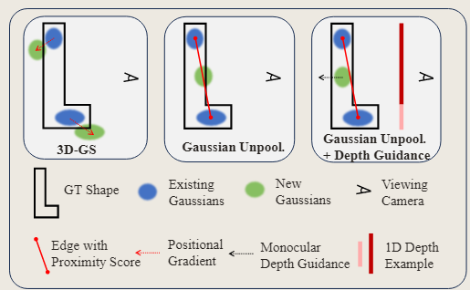

当proximity score超过一个阈值$t_{prox}$，就在其自身（ori）与它的K个邻居（dst）之间创建一个新的高斯核，其scale和opacity由dst决定，rotation和SH初始化为0，通过以上过程可以在representative location（代表性位置？大概就是本来应该要很密集的区域）增加高斯密度，在优化的过程中逐渐填补观测缺乏带来的空白。

> 怎么没讲如何具体的进行depth guidance修正新生成的高斯，虽然图示已经比较清楚了，猜测是拿着DPT生成的深度图，获得到新生成的高斯所对应的位置的深度，修正高斯核的深度
>
> 看完代码，误会解除，原来并没有调整高斯深度的挨骂，而是靠深度正则化约束。

#### Geometry Guidance for Gaussian Optimization

通过上述致密化方案补充高斯核后，直接用光度损失（估计就是3DGS原始损失）进行优化，会由于稀疏视角而不能优化出连贯的几何，以及容易过拟合于稀疏视角而在新视角合成没有泛化性。作者提出用深度先验来帮助改善高斯的几何。

##### Injecting Geometry Coherence from Monocular Depth（构建估计深度和渲染深度的几何相关性）

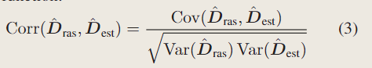

就是一个深度损失，估计深度图来自预训练模型DPT，渲染深度图来自3DGS

##### Differentiable Depth Rasterization（可微深度光栅化）

当然，为了深度可以被反向传播优化，需要写可微深度估计，深度由下式计算

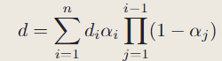

可以发现，和渲染颜色时差不多

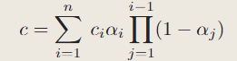

所以cuda代码应该还是比较容易实现的

#### Synthesize Pseudo Views

没太看懂，大概是在两个已知视角之间合成一个新视角，但是没仔细说是怎么用，应该是用来数据增强，实验中提到在2000次迭代后才开始合成视角。

看了下代码

```python
    if iteration % args.sample_pseudo_interval == 0 and iteration > args.start_sample_pseudo and iteration < args.end_sample_pseudo:
        if not pseudo_stack:
            pseudo_stack = scene.getPseudoCameras().copy()
        # 线性插值得到的伪视角
        pseudo_cam = pseudo_stack.pop(randint(0, len(pseudo_stack) - 1))
		# 用3DGS渲染伪视角，得到pred深度
        render_pkg_pseudo = render(pseudo_cam, gaussians, pipe, background)
        rendered_depth_pseudo = render_pkg_pseudo["depth"][0]
        # midas: 深度估计模型，当做gt深度，把3DGS渲染的图片传给深度估计模型得到的
        midas_depth_pseudo = estimate_depth(render_pkg_pseudo["render"], mode='train')
		# reshape
        rendered_depth_pseudo = rendered_depth_pseudo.reshape(-1, 1)
        midas_depth_pseudo = midas_depth_pseudo.reshape(-1, 1)
        # 两个深度做loss
        depth_loss_pseudo = (1 - pearson_corrcoef(rendered_depth_pseudo, -midas_depth_pseudo)).mean()

        if torch.isnan(depth_loss_pseudo).sum() == 0:
            loss_scale = min((iteration - args.start_sample_pseudo) / 500., 1)
            loss += loss_scale * args.depth_pseudo_weight * depth_loss_pseudo
```


### Experiments

迭代次数降低为10_000次

透明度重置在2000,5000,7000进行

9500次后降低深度损失的权重

不进行过大高斯核剔除（size_threshold = None）

数据集中，mip-nerf360被特别提到，因为他们第一个在无界数据集上进行稀疏视角重建。

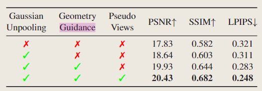

消融实验如上

## Splatter Image: Ultra-Fast Single-View 3D Reconstruction（未读完）

[Stanislaw Szymanowicz](https://szymanowiczs.github.io/), [Christian Rupprecht](https://chrirupp.github.io/), [Andrea Vedaldi](https://www.robots.ox.ac.uk/~vedaldi/),

Visual Geometry Group - University of Oxford

website：https://szymanowiczs.github.io/splatter-image

大致意思是3DGS将高斯核映射成图像，本文找到了一种方法将图像通过Unet映射成高斯核

## GaussianShader: 3D Gaussian Splatting with Shading Functions for Reflective Surfaces

[Yingwenqi Jiang](https://github.com/Asparagus15)1, [Jiadong Tu](https://github.com/donjiaking)1, [Yuan Liu](https://liuyuan-pal.github.io/)2, [Xifeng Gao](https://gaoxifeng.github.io/)3, [Xiaoxiao Long](https://www.xxlong.site/)2,*, [Wenping Wang](https://www.cs.hku.hk/people/academic-staff/wenping)4, [Yuexin Ma](https://yuexinma.me/aboutme.html)1,*

*Corresponding author

1ShanghaiTech University, 2The University of Hong Kong, 3Tencent America, 4Texas A&M University

website：https://asparagus15.github.io/GaussianShader.github.io/

### motivation

现存的3DGS没有明确的建模外观属性，因此对镜面反射，显著视图变化的渲染质量不佳，特别是渲染那些反射为主要特征的材料的时候。

提到Ref-NeRF和ENVIDR渲染速度太慢，后者由于SDF的限制ENVIDR甚至不能建模复杂场景。

既然要提到反射，法线估计是不可避免的，如果直接通过搜索附近的高斯来估计法线，会带来很高的计算开销。这篇文章基于高斯球的最短轴方向提出了一种法线估计方法，同时还从深度图中导出法线图与估计的法线构成一个法线一致性正则项。

### contribution

- 提出了shading function逼近渲染方程，增强了反射和镜面的真实感
- 提出了一种新的法线估计方法
- 因为3DGS很快，实现了实时渲染

### method

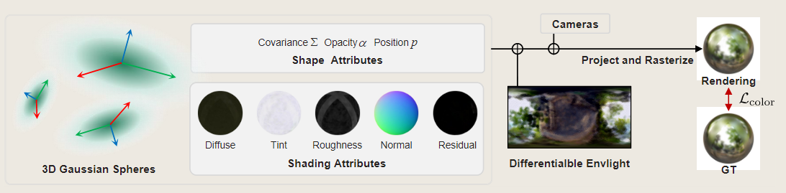

大致流程如上，放弃了SH描述颜色，引入了一些Shading Attributes，一张可微的环境光照模拟间接照明

#### 描述颜色

作为SH的代替，该文章用如下方程描述颜色，是对渲染方程的一种近似

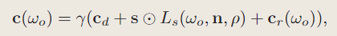

$\omega_0$：view dir

$c_d$:漫反射颜色

$s$:tint，材质本身的颜色

$n,ρ$：法线、粗糙度

$L_s$:镜面反射光

$c_r$:**残差颜色**，唯一一个陌生概念，作者说这是因为一些复杂的反射，例如间接光照的散射和反射不能用上述的直接光反射来解释，所以用这项来解释这些复杂的反射，当然因为也是反射同样和view dir有关

原文表示残差颜色由SH参数化

以上参数除了直接提供的$\omega_0$都可以训练

#### $L_s$的计算

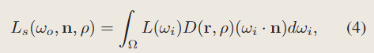

这是计算$L_s$的式子，回顾一下渲染方程

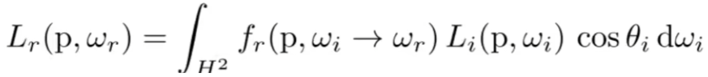

很相近，所以原理也大致相同，都是积分有哪些$w_i$贡献了$w_o$这个方向上的L，渲染方程中根据不同材质有不同的BRDF函数$L_i$,这里也根据不同的粗糙度$ρ$和反射角$r$有不同的D函数，其中$L(w_i)$用可训练的6x64x64的cube map表示。

#### 法线估计

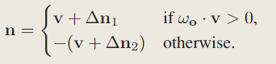

先用椭圆最短轴当法线，但是椭圆最短轴可能朝外也可能朝内，先用上述式子选择和视线方向$\omega_0$一致的方向，为了修正法线引入一个可训练的法线偏移$△n$,同时为了保证不偏移太远引入正则项

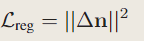

但是以上法线定义在每个高斯核上，没有和局部的其他高斯核联系，而法线又是反应局部梯度变化的量，这导致了估计法线和几何不一致，简单的方法是直接搜索局部高斯核共同估计法线，但是计算开销太高，所以作者提出用深度图得到法线图，然后法线图和之前的法线估计之间使用法线一致性损失

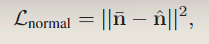

三种法线的图示，有偏移的$n$,最短轴$v$和深度图导出的法线$\hat{n}$

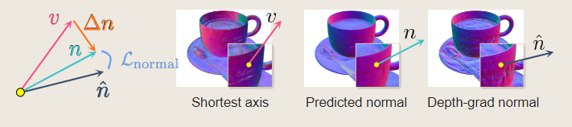

#### Sparse loss

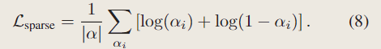

帮助不透明度趋于0或1，同时使得高斯球的几何形状趋近于thin plate从而提高渲染质量

### Experiments

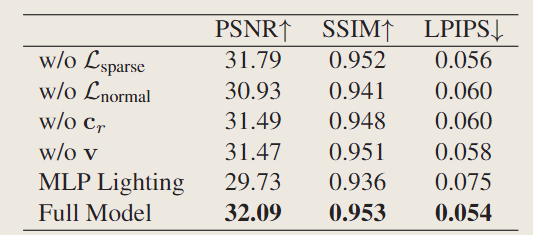

从消融实验来看，最重要的其实是可训练的环境贴图，其次就是法线一致性正则化。

从实验结果来看，各项指标相比原先的GS提升不大，甚至有的数据集中会下降，但是法线质量会大幅提高，在一些反射效果比较重要的区域会有比较好的视觉效果

## **GaussianPro: 3D Gaussian Splatting with Progressive Propagation**

单位：中科大, 港大, 南大, 阿大等

主页：[https://kcheng1021.github.io/gaussianpro.github.io/](https://link.zhihu.com/?target=https%3A//kcheng1021.github.io/gaussianpro.github.io/)

代码：[https://github.com/kcheng1021/GaussianPro](https://link.zhihu.com/?target=https%3A//github.com/kcheng1021/GaussianPro)

论文：[https://arxiv.org/abs/2402.1465](https://link.zhihu.com/?target=https%3A//arxiv.org/abs/2402.14650)

### motivation

根据介绍来看，该论文主要改进方向是大场景下的新视角生成。

- 在大场景下有很多无纹理区域，这些区域在SFM下不能生成点云，因此导致后续3GGS使用原有的致密化策略时，很难生成可靠的高斯点。
- 原有的高斯克隆策略忽略了已有的几何先验，要么克隆和之前完全一样的高斯，要么采用位置和方向随机的高斯初始化，这使得高斯在noisy geometries区域难以优化，以及在无纹理区域较少的高斯点。

### method

#### 生成2D法线图和深度图指导高斯生长

法线估计直接用的GaussianShader里的方法用椭圆短轴，似乎没有用到偏移法线，那生成出来的法线应该会有些不准确。

深度估计就是正常方法

最后都用α合成生成2D的法线图和深度图

#### 2D图中根据相邻像素更新每个像素的深度和法线，重投影回3D空间，生成新高斯（没看懂，用了很多上古方法）

通过一种比较复杂的方法，根据相邻像素推测出当前像素的深度和法线是否准确，大致思路如此，下面有这种方法的参考文献

BARNES C, SHECHTMAN E, FINKELSTEIN A, et al. PatchMatch[J/OL]. ACM Transactions on Graphics, 2009: 1-11.

上述方法会有不可避免的估计错误，还要通过多视图几何一致性（这里又引了一个2016年提出的方法）来过滤掉不正确的深度和法线，最后才得到最终要用来修正原来的法线图和深度图的新图（propaganda map），对于绝对差大于阈值的像素，生成高斯点。

> 太菜了，对于传统方法实在是提不起动力学习，除非是非常重要且通用的。
>
> 既然这种方法测出来的法线不是准确的，像GaussianShader那样用可训练法线偏移来计算无疑对我来说更简单。

#### 平面损失

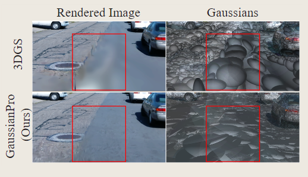

原先的3DGS没有几何约束，只有光度约束，从而导致不能准确描述几何形状，所以这里加入了两个关于几何的损失。

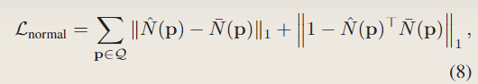

第一个是约束rendered normal map（椭圆短轴）和propaganda map的法线一致性

第二个是从NeuSG: Neural Implicit Surface Reconstruction with 3D Gaussian Splatting Guidance抄过来的损失，保证椭圆足够扁，使得椭圆中心足够接近其表面

> 流体仿真+高斯那篇文章约束高斯足够圆，这里约束高斯足够扁，太神奇啦，深度学习

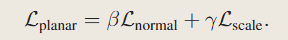

#### Experiments

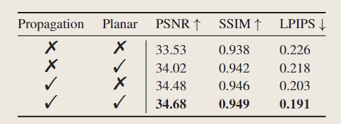

从消融实验来看还是Propagation策略起到的作用比较大

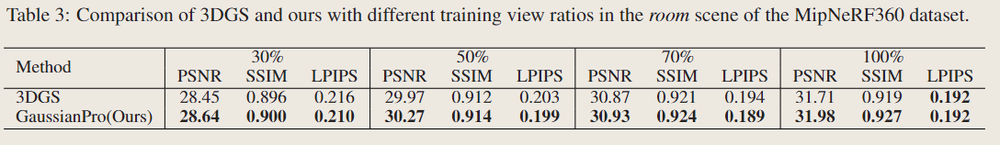

有趣的是还做了稀疏视角下的实验，30%表示只用了30%的训练图像，可以看到对于稀疏视角重建也有比较稳定的提升。

## Spec-Gaussian: Anisotropic View-Dependent Appearance for 3D Gaussian Splatting

论文：https://arxiv.org/abs/2402.15870

没代码，随便看看吧，不过用MLP代替球谐函数的方法很有趣，有其他文章也写到

### motivation

原始的3DGS中，反射和镜面反射难以建模，这是因为低阶球谐函数 (SH) 捕获这些场景中所需的高频信息的能力有限。

针对这个问题，作者提出了以下方法

- 采用anisotropic spherical Gaussian (ASG)来模拟外观，可以有效针对高频信息进行建模，有效模拟各向异性和镜面的部分。
- 采用sparse anchor points控制子高斯的位置和表示的混合方法（？
- coarse-to-fine的训练策略，消除floater，在初始化阶段优化低分辨率图像，可以避免在训练初期增加不必要的高斯

### method

#### ASG

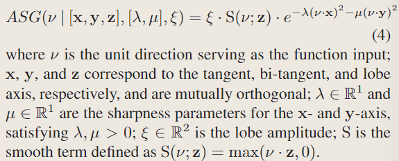

ASG函数定义如上，用24维feature f作为MLP输入训练其中三个参数，这个f是每个高斯核上携带的

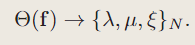

颜色分解为漫反射场和高光场

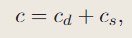

$c_d$:first three order of SH

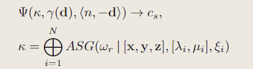

$c_s$：将N个ASG的输出拼接成一个latent feature，然后联合被位置编码的view direction和<n, -d>进入MLP计算

#### 法线估计

GaussianShader最短轴

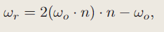

反射方向计算的便捷方法

都是常用知识，不展开了

#### Anchor-Based Gaussian Splatting

加速，省内存用的，略过

#### Corase-to-fine

作者提出：3DGS中漂浮物的出现源于对特定像素及其邻居的过度关注，而不是考虑更广泛的全局信息，因此作者要从低分辨率到高分辨率逐步训练3DGS，训练过程中的分辨率如公式所述：

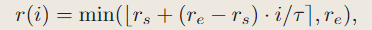

$r_s:起始分辨率，r_e:终止分辨率,τ:迭代阈值，默认20k$

该方法优化质量的同时，将训练时间降低了20%

> 原始的高斯也有预热策略，在开始时用1/4的resolution训练，在250次和500次迭代的时候进行上采样

#### 保证高斯核足够小的正则化

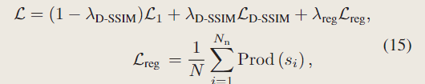

Prod表示高斯核三个轴scaling乘积

### Experiments

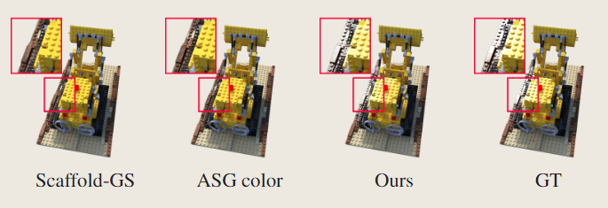

使用MLP+ASG可以有效建模高光

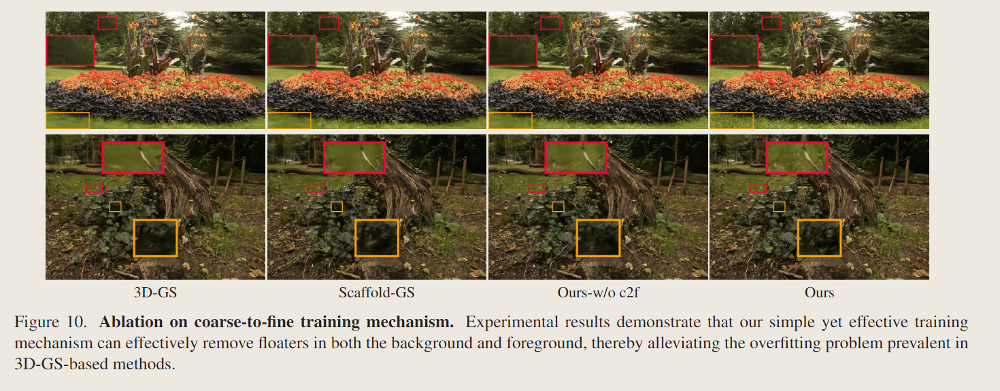

Corase-to-fine能去除一些漂浮物

消融实验就给几张图是吧，代码不给数据不给有点过分了，字节好感度↓↓

### Limitation

该方法虽然能有效建模高光和各向异性材质，但是对于反射仍然不能取得很好的质量，这是因为3DGS缺少明确的geometry和environment

此外，实验中还观察到，如何明确的给3DGS提供几何信息，在强约束下会让结果更符合期望，但是渲染质量会有所降低。将来打算探索在3DGS中建模反射的可能解决方案。

## GEA: Reconstructing Expressive 3D Gaussian Avatar from Monocular Video

Website:https://3d-aigc.github.io/GEA/.

### motivation

- 源于现成的姿势估计方法准确性和稳定性的不足，缺少对手部、脚部区域的控制能力


- 现有的模型存在Unbalanced Aggregation和Initialization Bias
  - Unbalanced Aggregation：纹理丰富区域会出现较多的高斯核，相应的缺少纹理的区域会缺少高斯核
  - Initialization Bias：与initial shape偏离较大的区域（披肩、发饰、配饰）接收到较少的高斯点分配

### contribution

- 提出一个two-satge pose refinement method，提高了身体和手部姿势估计的准确性
- 提出一个迭代re-initialization方案，包括meshing，resampling和re-Gaussians，保证高斯点在表面附近均匀分布
- 大量实验证明有效性

### method

#### Drivable body-hand avatar representation based on 3D Gaussian Splatting

对于每个高斯点，找到最近的四个joints，用如下公式计算它的pose transformation


$\theta$ : 给定pose

$\Gamma(\theta)$: 每个joint计算出的pose transformation matrix

$W_p(\mu)$ : 从高斯核μ最近的vertex of SMPL-X得到的blend weights

$P$​ : 指最近的四个joint

最终高斯核μ的新位置


此外，针对非刚性形变的情况，比如服装变形，增加了可训练高斯位置上的偏移，输入参数为给定的姿势


对比LBS，可以发现同样是从pose$\theta$中得到仿射矩阵$T$,LBS中每个vertex对应的blend weights已知，这篇文章就找离高斯核最近的vertex来当做这个高斯核的权重，同时不累计所有的joint变化对该高斯的影响而是只取最近的4个


#### Twostage pose estimation and optimization technique

目的：为了更好的位姿估计


stage1： 使用PyMAF-X进行姿态估计，得到姿态$\theta$和相机参数$\Pi$


直接用PyMAF-X在侧面时容易导致的现象

stage2：用SAM预测轮廓，用ICON或者PiFuHD预测法线，修正stage1预测出的pose渲染的法线和轮廓


最终Loss如下


其中$L_{regular}$定义如下，法线和轮廓为L1损失


$\omega_i$ ： 距离根节点的远近程度，该正则项让stage2的优化不偏离stage1太远，同时手和脚受到的约束更低，在stage中refinement的幅度更大

#### Iterative re-initialization mechanism

目的：解决Unbalanced Aggregation和Initialization Bias，因此希望高斯点均匀分布在主体的真实表面附近。

- Unbalanced Aggregation：纹理丰富区域会出现较多的高斯核，相应的缺少纹理的区域会缺少高斯核
- Initialization Bias：与initial shape偏离较大的区域（披肩、发饰、配饰）接收到较少的高斯点分配

分为三步：

mesh：使用alpha shape重建表面网格。

resample: 对网格执行拉普拉斯平滑，来注入表面平滑先验。随后，对网格执行基于曲率的均匀采样，生成新的高斯点。

Re-Gaussian ： 为重新采样的点找到它们的K个最近高斯点，并继承它们的不透明度 η 和球谐函数 f 属性。旋转 R 和缩放 s 属性被随机重新初始化。

在训练过程中，以上re-initialization被重复2~3次


#### Loss


第一个光度损失

第二个是将渲染图像C和输入的图像I通过VGG后，最后softmax输出n维向量作差，作用是VGG对高频信息敏感，可以帮助恢复高频纹理细节。

> 有点疑问，首先是这个i和M不明所以
>
> 第二是经过VGG卷积得到的Loss是如何反向传播到对应的高斯核上的，光度损失好理解因为每个像素是由哪些高斯核alpha合成的是清楚的，所以每个像素颜色的改变可以正常反向传播，但是VGG卷积后得到的是N*1维向量，这是怎么从一个像素反向传播回原图片所在的所有像素的
>
> 思考了一下，正常的VGG是锁定像素颜色，反向传播训练卷积核参数，这玩意反过来训练像素颜色，能反向传播好像也挺合理
>
> 数学不好导致的


第三个是约束非刚性形变的残差尽量小，避免显著干扰avatar


### Experiments


相比于用SMPL的GART，用SMPL-X的GEA有明显更好的手部表现


出色的捕捉高频细节的能力

> 明天就用3DGS做一个VGG损失，你骗我我就举报

#### 消融实验


首先Drivable body-hand avatar representation based on 3D Gaussian Splatting这个方法肯定不能少，不然都不能渲染，或者说就是原始方法了，剩下的分别是缺少Pose Refine，即two-stage refinement，缺少手部骨架，应该用来对比SMPL和SMPL-X的，以及method中的循环初始化

## FreGS: 3D Gaussian Splatting with Progressive Frequency Regularization

2024 CVPR 暂无主页

### motivation

3DGS在densification时往往存在过度重建，高频区域被几个大高斯核覆盖，导致模糊和伪影。

类似FreeNeRF，尝试引入频率退火正则化解决频率问题，最小化pred和gt之间的频域差异。

### method

#### Frequency Regularization

作者首先提出，原来的L1 Loss并不能很好的描述那些过度重建的区域，进而导致较大的高斯核无法分裂

我们先来复习一下高斯densification的代码

```python
# Densification
# 超过densify_until_iter不再进行densification和透明度重置
if iteration < opt.densify_until_iter:
    # Keep track of max radii in image-space for pruning
    # 会从多个视角、多次优化的过程中去看同一个高斯核，记录下看到的最大2D投影半径
    gaussians.max_radii2D[visibility_filter] = torch.max(gaussians.max_radii2D[visibility_filter], radii[visibility_filter])
    # 记录下xyz累积梯度，即位移倾向较高的高斯核，他们应该被split或clone
    gaussians.add_densification_stats(viewspace_point_tensor, visibility_filter)
    # warm-up后才开始densification，每100次迭代进行一次
    if iteration > opt.densify_from_iter and iteration % opt.densification_interval == 0:
        # 3000次迭代之后才开始剔除过大的高斯核
        size_threshold = 20 if iteration > opt.opacity_reset_interval else None
        gaussians.densify_and_prune(opt.densify_grad_threshold, 0.005, scene.cameras_extent, size_threshold)
    # 每3000次迭代，重置透明度，或背景为白色且第500次迭代时
    if iteration % opt.opacity_reset_interval == 0 or (dataset.white_background and iteration == opt.densify_from_iter):
        gaussians.reset_opacity()
```

首先，要保证梯度大于densify_grad_threshold，才会根据scaling进行split或者clone，显然如果过度重建部分的梯度不够大，那么那些较大的高斯核也不会分裂。我们干观察下图的圆点，发现紫色的圆点和绿色的圆点几乎重合，也就是说well-reconstruction区域和over-reconstruction区域的梯度是相似的，进而误导了高斯的densification


那么什么样的loss能够更好的区别over-reconstruction区域（注意区分under-reconstruction区域，这篇文章应该不太注重那些过小的高斯核所以不关注），作者就提出引入频域。我们先看结果，上图中心为三角的两条线明显的被分离开来，从而能够区分这两种区域。

首先将图片由空间域（x，y）转换到频域（u，v）


从频域中提取振幅和相位


Re表示实数，Im表示虚数

计算input和render的振幅、相位差


> 这玩意怎么反向传播啊

#### Frequency Annealing

按Free-NeRF的思路来，应该先进行低频滤波，尽量还原图片的低频区域，再逐渐解锁高频区域

一样的思想，创建一个低频滤波器和高频滤波器


分别得到低频滤波和高频滤波后的相位差和振幅差


退火式的定义高频滤波


$D_0$是低频滤波器的range max，$D_t$是高频滤波器允许通过的频带，t表示cur迭代次数，$T_0$表示开始使用高频滤波器的迭代次数，$T$表示迭代终止次数。可以发现，随着训练进行，高频滤波器允许通过的频率越来越高，也就是起到了解锁高频的效果。

最后是loss，先引入低频滤波，在$T_0$后引入高频滤波


$w_l, w_h$是training weights

### Experiments


先摆个消融实验

提升

## DNGaussian: Optimizing Sparse-View 3D Gaussian Radiance Fields with Global-Local Depth Normalization

2024 CVPR 暂未开源

大概会在3月20日公开

代码：https://github.com/Fictionarry/DNGaussian/blob/main/submodules/diff-gaussian-rasterization/cuda_rasterizer/backward.cu

### motivation

现有的深度正则迫使高斯的shape适应于平滑的深度，而不是复杂的几何外观。考虑到场景几何形状的基础在于高斯图元的位置而不是它们的形状，我们**冻结了形状参数**，并提出了硬性和软性深度正则化，通过**鼓励图元之间的移动**来实现空间重塑。

现有的**尺度不变深度损失**往往选择将深度图对齐到固定尺度，这导致**忽视了小的损失**。为解决这个问题，我们将全局-局部深度归一化引入深度损失函数中，从而以尺度不变的方式鼓励学习小的局部深度变化。通过局部和全局尺度归一化，我们的方法引导损失函数重新关注小的局部误差，同时保持对绝对尺度的了解，以增强深度正则化的详细几何重塑过程。

> Darf,MonoSDF用的尺度不变损失
>
> SparseNeRF和NeuralLift-360用的深度排序损失

### contribution

- A Hard and Soft Depth Regularization：通过鼓励高斯函数的移动来约束3D辐射场的几何形状，从而实现了粗略的深度空间重塑，同时保持细致的色彩性能
- A Global-Local Depth Normalization：在局部尺度上归一化depth patch，关注小的局部深度变化，提高重建细节

### method

Instead, considering the instability of point clouds in sparse-view situations, we initialize our method with a random set of Gaussians

**考虑到稀疏点云的不确定性，采用随机初始化**

#### Depth Regularization for Gaussians

we freeze the scaling s and rotation q in the depth regularization.

在深度正则化中冻结了scaling和旋转四元数q，而保留了透明度α和位置μ，总的来说用两个约束，一个去优化位置（贴近于物体表面），另一个去优化透明度（保持丰富的色彩）

> 我去，降低工作量新思路，少写两反向传播呢

##### Hard Depth Regularization

第一个高斯，往往是物体的表面 or floter和noises，


通过将高斯核上的α在计算深度时替换成一个较大的$\Gamma$，来近似的算出第一个高斯的深度

从而得到第一个深度相似损失


由于只有μ能够被优化，透明度、shape都被freezing，所以这样可以让那些物体表面的高斯贴紧物体表面，而那些floater或许会因此被优化？

##### Soft Depth Regularization


剩下的就是正常的深度渲染，这时候冻结μ

##### Global-local Depth Normalization

现有的Loss（即使是L1）都容易忽略局部的深度细节，对small depth errors不敏感，进而导致noisy primitives和新视角合成的失败（左图）。而作者加入的局部损失可以让模型优化局部细节（右图），重建更精确的表面


为了让损失更关注局部，首先将深度图切分成局部的patch，然后在每个patch做归一化，让patch内深度变为均值为0，方差为1的数据


进一步，在关注局部的基础上保证对全局的关注，对全图做归一化，最小单位为patch


这项损失定义为


#### 颜色


在稀疏视角下SH容易过拟合，采用MLP，和grid有关，先放着

>Neural Color Renderer. 3D Gaussian Splatting represents the color via spherical harmonic, however, it is easy to overfit with only sparse input views. To relieve this problem, we take a grid encoder and an MLP as the Neural Color Renderer to predict color for each primitive (Figure 3). During inference, we store the median result and only calculate the last MLP layers to merge view direction for acceleration.

### Experiments


终于有用LLFF的，我哭死，但是指标怎么这么高

只迭代6000次，在1000次后用软深度正则化。


损失函数的超参数

shape freezing的作用，消除floater


shape freezing和center freezing的消融


所有创新点的消融


AP指直接对深度使用L2正则化，估计深度还是要归一化的不然尺度不一致

关于使用MLP合成颜色


> 不得不吐槽，一句话带过的创新点实际上带来了超高的质量提升，而这个创新点直接来自NGP

### Details

patchsize 

在LLFF数据集上，[5, 17]随机采样

在DTU数据集上，[17, 51]随机采样（物体占据了更大的空间）

相机位姿：合成数据集直接给定，真实数据集用colmap采集所有图像（包括训练集）来计算位姿

训练集和测试集：

LLFF，每8张作为测试集，剩余视图中均匀采样训练集

DTU：DTU 数据集 [17] 由一组固定相机捕获的 124 个以对象为中心的场景组成。我们遵循[27,42,52]直接在15个场景上评估模型，扫描id为8,21,30,31,34,38,40,41,45,55,63,82,103,110和114。在每次扫描中，在我们的3视图设置中，以下id为25、22和28的图像被用作输入视图。测试集由 ID 为 1, 2, 9, 10, 11, 12, 14, 15, 23, 24, 26, 27, 29, 30, 31 32, 33, 34, 35, 41, 42, 43, 45, 46 和 47 的图像组成进行评估。图像被下采样4×

Blender：我们遵循[16,52]中用于Blender数据集[11]的数据拆分。从训练图像中选择8个输入视图，ID为26、86、2、55、75、93、16、73和8。从测试图像中均匀采样25个测试视图进行评估。在实验过程中，所有图像都被下采样 2 倍到 400 × 400。

>The splatting technique of our Gaussian Splatting [18] backbone directly merges existing primitives to render the pixel-level color without interpolation. However, since not every pixel can be overlapped by the projected primitives, the empty space between two Gaussian primitives would cause hollows and cracks when the camera pose changes. For example, some hollows can be seen at Scan 40 in Figure 14. In this work, we try to solve this problem by paying more attention to high-frequency details and therefore encouraging the densifying of primitives to fill these empty areas. In the future, we believe this problem can be fundamentally solved by the improvement of the representation itself.
>
>两个高斯椭球之间的空白会在相机位姿改变的时候导致空洞和裂缝，这篇文章通过更加关注高频细节来解决这个问题，鼓励椭球密集化，这是一个值得思考的思路，在我合成的深度图里明显出现了各种各样的裂缝，这是由于高斯椭球半身的数量不够导致的，怎么在稀疏视角下做更好的densification是值得思考的。

## SparseGS: Real-Time 360° Sparse View Synthesis using Gaussian Splatting

website:https://formycat.github.io/SparseGS-Real-Time-360-Sparse-View-Synthesis-using-Gaussian-Splatting/

涉及了difussion，这里只读深度相关部分


很眼熟的两种深度估计，总之是为了选择到真正的位于物体表面的深度，这里提出的方法是选择权重（是T不是阿尔法，即理论上后续的高斯会有劣势，除非透明度够大）最大的高斯


损失上，仍然采用Pearson损失，不过加入了patch，每个iteration随机的采样N个不重叠的patch，patch的大小是超参数


接下来，根据模式深度和alpha合成深度来选择裁剪掉一些floater，理由是观察到存在floater的深度通常是双峰的，dip_test是一个测试数据是否呈现单峰分布的统计方法。

> 感觉有点难懂，直接从伪代码解释吧


先计算机mode深度和alpha深度，然后计算$\frac{d^{mode}-d^{alpha}}{d^{alpha}}$,执行dip_test，确定在这个相机Pose下双峰严不严重，如果严重就在之后动态的根据D提高remove的阈值，来保证更多的去处floater，如果不严重就降低，来恢复场景的细节


## Depth-Regularized Optimization for 3D Gaussian Splatting in Few-Shot Images

随便扫了一眼，总之就是加了个深度约束+平滑约束，没细看，直接看实验的trick

### Experiments

实验中设置SH degree= 1，直接去除了透明度重置


baseline给你压完了

## Is Vanilla MLP in Neural Radiance Field Enough for Few-shot View Synthesis?

### motivation

fewshot的两个问题

- 训练数据优先，模型容易过拟合输入视图，导致几何分布在2D平面上而不是3Dvolume

> 3DGS自然也是如此

- artifacts比如ghost和floater的存在限制了新视图的保真度和3D一致性

解决以上问题主要分为两种思路

- 基于先验：multiview stereo  or image-based rendering（？）
- 基于正则化：频率、深度等

但是都没有关注MLP

同时研究了过拟合问题

- FreeNeRF：原始的MLP容易快速收敛到高频细节，通过这种方式快速记录输入视图，而不是推断底层几何图形，因此直接的解决方案是减少模型参数来降低模型容量
- 但是如DietNeRF所示，虽然减少模型参数能解决过拟合问题，但是结果中缺少细节，这表明网络应该保留模型容量。

基于以上观察提出了multi-input MLP，将原始MLP的输入（position and view direction）合并到每一层


> 好简单

基于三个key insights：

- 将输入合并到每一层可以实现输入和输出之间的较短路径，允许以端到端的方式使用更少的参数合成；
-  我们保持模型容量不变，因为它有利于合成高频细节
- 我们保持输入和输出不变，使其成为当前基于 NeRF 的管道即插即用的解决方案。

为了进一步减少伪影，受到几何通常比外观更平滑的假设的启发[23]，我们提出了一个新方法：不像 NeRF 那样使用共享模型来建模颜色和体密度，而是提议分别对它们进行建模，以启用具有不同频率的位置编码[21]。我们还提出了一种新的正则化项，以减少物体为中心的场景中的背景伪影，并提出了一种采样退火策略，以解决前向场景中的近场伪影。

### contribution

- mi-mlp
- 两个正则化提高质量

#### Related Work

正则化方法里总结的挺好，这些文章可以回头看看

>相反，基于正则化的方法遵循类似于 vanilla NeRF [21] 的逐场景优化方式，并引入额外的正则化项或训练源以获得更好的新视图合成。具体来说，首先引入语义一致性损失[12]、深度平滑损失[23]和射线熵损失[14]来约束不可见视图，以获得更好的几何恢复。为了增加可用的训练视图数量，一些工作 [1, 5, 15, 48] 提出使用深度扭曲来生成新的视图图像作为伪标签。最近，FreeNeRF [50] 通过位置编码的新频率退火策略遵循从粗到细的方式。MixNeRF [33] 将光线建模为拉普拉斯算子的混合，然后是 FlipNeRF [32]，它使用翻转的反射射线作为额外的训练源。SimpleNeRF [35] (siggraph asia)提出使用增强模型来避免过度拟合，这在前向场景中表现良好。尽管取得了显着的结果，但所有这些方法都仍然使用 vanilla NeRF 提出的网络结构。相比之下，本文从设计更好的网络结构的角度实现了少镜头视图合成。

### method

#### Per-layer Inputs Incorporation

总之就是位置编码输入到每一层的好处和数学证明，用更少的参数进行端到端合成，允许浅层梯度小于深层深度

#### Modeling Colors and Volume Density Separately

人们普遍认为，几何不需要外观那么详细，因为几何通常是局部平滑的，因此作者提出要减少体积密度输入的嵌入维数，这也意味着要将预测几何和外观的MLP分离，用两个单独的MLP来估计


关于密度分支，简单的使用每层输入位置编码的MLP


而作者经验性的发现颜色合成需要密度的辅助，因此合成颜色时借用了密度的输出


#### Background Regularization

以对象为中心的重建时，常常有背景伪影，即在输入视图不可见区域，产生了一些伪影


作者的解决方法是向可见区域外采样，并在这些区域添加正则化


希望这些不可见区域（训练集中的不可见，测试集中的可见）更加接近背景颜色

#### Sampling Annealing

为了避免近场伪影，进行退火式的采样，在训练开始时采样更少的点，而随着训练进行逐渐增加采样点


### Experiments


分别是muti-input mlp，分离几何和外观mlp，背景正则化，退火采样

分离直接加在nerf上不是很好，但是配合其他就能取得更好的效果，有点奇怪，不过总之最重要的是muti-input mlp

## GS-IR: 3D Gaussian Splatting for Inverse Rendering

2024 ECCV

逆渲染的文章，涉及了法线和深度估计，看两眼

### motivation

During the GS optimization, the adaptive control of the Gaussian density may lead to loose geometry, making it difficult to estimate accurate scene's normal. Consequently, it is necessary to introduce a well-designed strategy to regularize GS's normal estimation.

在高斯优化过程中，高斯的自适应密度控制导致了松散的几何，导致难以估计场景法线。因此，需要一个良好设计的策略来正则高斯的法线估计。

还有一个是关于间接照明的

### contribution

- 一种具有正则化的高效优化方案，将深度梯度集中中GS周围，为GS-IR生成可靠法线
- 开发了一种嵌入在GS-IR中的bake方法来处理建模间接照明中的遮挡

### method

为了避免权重和不为1的时候，深度的值出现在一条光线的第一个高斯之前或最后一个高斯之后，修改深度公式，在最后除以总权重，也就是在一条光线的高斯核上线性插值的深度


深度梯度法线和预测法线的一致性正则化（有点眼熟


当然无约束的训练法线是非常粗糙的，加上pixel-level的平滑度正则化


最后的loss


### experiments


从左到右，普通的体渲染累积深度，选择峰值深度（不透明度最高的高斯所在位置），线性插值深度


标有超天酱的表示用了法线一致性正则化

## CoherentGS

https://people.engr.tamu.edu/nimak/Papers/CoherentGS

few-shot的文章

coherency(相干性、一致性、连贯性)

### motivation

However, it struggles to generate a good representation given a sparse set of training images. In such cases, the representation severely overfits to the training views and appears as a collection of semi-random anisotropic blobs from novel views, as shown in Fig. 1.

然而，它在给定稀疏的训练图像集时很难生成良好的表示。在这种情况下，该表示严重过度拟合于训练视图，并在新视角中呈现为半随机各向异性斑点的集合，如图1所示。

最先进的基于 NeRF 的方法会产生次优结果，因为它们的正则化不能为合理的 3D 重建提供足够的约束。此外，这些方法中的大多数依赖于神经网络学习的隐式表示的一致性，并不直接适用于具有显式非结构化表示的 3DGS。

关键思想：通过约束高斯在优化过程中的移动，增强明确的非结构化表示的连贯性。

由于高斯的非结构化特性，难以在3D空间中做出限制，因此提出为每个输入图像的每个像素分配一个单独的空间，在2D空间中强制执行单视图和多视图约束。

具体而言：

- 使用implicit decoder强制使每个图像的高斯具有相似的深度移动以保持一致性
- 对于不同视角，通过总变化损失确保使用所有高斯渲染的深度平滑
- 提出了基于流的损失，以确保两个图像中相应像素的高斯位置相似。
- 为了帮助优化，我们提出使用现有的单目深度预测模型初始化高斯的位置
- 我们基于深度的初始化将高斯适当地定位在世界空间中，而我们的正则化优化鼓励更新，特别是位置，保持连贯和平滑。

### contribution

- 我们提出了一种使用极其稀疏的输入集合进行3D重建的方法，利用3DGS技术。

- 我们提出了一种结构化高斯表示方法，并通过各种正则化手段引入了连贯性。

- 我们引入了基于深度的初始化方法来初始化3D高斯，这与正则化优化相辅相成。

### Related work

与我们的技术并行的是，Zhu等人（FSGS）[62]和Xiong等人（SparseGS）[54]提出利用3DGS进行稀疏视图合成。然而，与我们的方法不同，它们没有提出一种方法来强制在相邻高斯之间保持连贯性，从而产生偶发的floater。此外，这些方法会用延长的高斯填补所有输入图像中被遮挡的区域，导致模糊的结果。相反，我们的方法允许我们识别和修补被遮挡的区域，并产生高质量的虚构细节（见图1 - 右侧）。


> 被遮挡，也就是所有输入图像都没有的区域，这篇文章可以不进行合成，在后续进行inpainting

### method

我们的目标是重建静态场景的 3D 高斯表示。我们的关键思想是在优化过程中向 3D 高斯引入相干性。换句话说，当更新高斯的位置时，在优化过程中也应该类似地影响相邻高斯。通过这种一致性，我们可以使用稀疏正则化来进一步约束优化并避免对输入图像的过度拟合。

#### Coherent 3D Gaussian Optimization

首先，为每个像素分配一个高斯，同时限制每个高斯的运动只允许在这个像素所对应的光线上。


在初始化的深度上，用残差深度控制高斯位置(x)移动


g表示将像素p根据深度d投影到3d空间的位置x

假设单目深度准确，那么残差深度应该只会平滑的变化来调整不一致性，基于这一观察提出了以下的单视图和多视图约束：

##### Single-view Constraint

残差深度并不是直接优化的，而是通过implicit decoder在单张图像上解码的


其中f代表decoder，n是输入图像的index，每张图像独立的被输入decoder中，通过优化decoder的参数来更新残差深度而不是直接优化像素上残差深度，这使得像素间的残差深度得以建立联系（也就是保证coherent），确保了残差深度的平滑。

然而，平滑的深度变化使得decoder难以处理图像中不同object的sharp depth discontinuities，所以引入了C-channel的二进制分割掩码（实现中取C=5），即每张输入图像根据深度的不同切分成5个区域，因此decoder也输出C-chanel的残差深度，最后的残差深度由5个通道合并（直接求和）

在透明度上也是用这个约束

##### Multiview Constraint

单视图约束确保了每个图像高斯的平滑变形，但是没有保证来自所有高斯形成的3D表面是平滑的，于是在inverse depth上采用TV正则化


> 1+应该是防止除0的偏移，R表示alpha合成深度，左式全图平滑，右式是每个分割区域连通平滑

在实验中，$L_{TV}$首先较大来获得全局平滑，再逐渐增加$L_{MTV}$来改善细节


实验中$\lambda_s$​逐渐从0增加到1

#### Additional Regularization

受启发于一些深度估计算法，提出一种基于流的正则化，也就是约束不同图像对应同一位置的像素所对应的高斯位置一致，p、q由现有的flow method计算，M是一个前向后向一致性掩码（也是某个深度估计方法里的）


#### 最终Loss


可训练参数由上述loss训练，还有透明度和位置直接由Single-view Constraint优化

#### multisampling

类似MSAA的方式

虽然 3DGS 仅通过采样每个像素的中心来优化目标，但我们发现这种策略对于稀疏输入设置是有问题的。在这种情况下，高斯将被变形以匹配每个像素的中心的颜色，留下未覆盖的剩余区域。因此，从新视图来看，表面会出现半透明。为了解决这个问题，我们在每个像素内的多个样本上执行优化。多重采样确保高斯正确地覆盖每个像素，从而产生显著改善的图像，如补充视频和表3所示。

### 3D Gaussian Initialization


单目深度估计模型的深度是错位的（左），也就是不具有多视角一致性，因此在初始化前先训练深度图的scaling和offset（作者提出曾经尝试过直接训练深度，但是仅在光流准确的地方生效，于是改为训练scaling和offset）


$D^m$​表示单目深度估计深度，其他参数和4.2一致

scaling初始化比较特别，如图所示，其他都和原始高斯类似或是较为简单


### Experiments


LLFF上的消融实验

## GoMAvatar: Efficient Animatable Human Modeling from Monocular Video Using Gaussians-on-Mesh

cvpr 2024

https://github.com/wenj/GoMAvatar

## SCARF : Capturing and Animation of Body and Clothing from Monocular Video

2023 SIGGRAPH

### motivation

先前的工作

- 通过估计统计3D网格模型的参数来从图像创建数字人：SCAPE（2005）、SMPL/SMPL-X(2015/2019)、Adam（2018）、GHUM（2020）、STAR（2020）
- 隐式表面模型：imGHUM（2021）、LEAP（2021）

以上模型从穿着较少的身体扫描得到的数据训练，因此无法捕捉服装shape和appearance的变化，需要更灵活的表示

---

能够recover clothed bodies的方法

- 在clothed human的数据集上训练：ICON（2020）、PI-FU（2022）
- 从多目视频中直接训练：Netural Body等

为了处理不同服装类型的复杂拓扑，这些方法用隐式表示对身体和服装一起建模。这导致了一些问题

- 手和脸的重建很差，没有关节
- 身体和服装的整体模型不允许虚拟试穿，这需要身体和衣服分开表示
- NeRF可以很好模拟头部，尚不清楚如何有效将这种part-based model和clothed body representation结合

---

一些方法将身体和衣服layered representation，这时候衣服在身体的外层

- SMPLicit、BCNet、[Xiang]等

> [Xiang] : Modeling clothing as a separate layer for an animatable human avatar

这些方法需要3D衣服扫描的巨大数据集来训练，而且仍然缺乏不同衣服种类的泛化性，且

- 仍然只恢复了clothed body的几何，而没有appearance information（SMPLicit、BCNet）

> 在虚拟人的定义中，什么是几何什么是外观？

- [Xiang]需要多目视频和精确的3D cloth mesh来构筑特定的avatar

以上方法均不适用于loose clothing，例如短裙和长裙

---

我们的目标：

- 精确的人体表示，包括脸和手
- 当然，还有衣服，同时保证衣服能够在不同的数字人上切换

基于以下观察，人体和衣服其实有不同的建模需求

- 人体有相似的形状，可以被统计网格模型建模的很好
- 衣服的形状和外观往往更多变，需要灵活的表示来处理透明材料、复杂拓扑

提出了**SCARF**，一个mesh和nerf的混合表示模型，来从单目视频中捕捉clothed human

具体来说，用SMPL-X来表示人体，并用NeRF来表示衣服的复杂拓扑，对于构建这种混合表示模型，有四个挑战：

- 精确捕捉单目视频的人体motion，并将motion和cloth联系起来。NeRF在canonical space中建模，并用SMPL-X中的蒙皮变换将观察空间中的店变形到规范空间，这就要求对视频每一帧身体形状和姿势的精确估计。我们使用PIXIE（2021）估计身体姿势和形状参数，但这不够精确，因此我们在优化过程中refine pose和shape。
- SMPL-X的蒙皮变换并不能很好的解释布料变形，特别是对于松散的衣服，因此我们学习了一个非刚性变形场来纠正身体和服装的偏差
- 这种混合表示模型，需要对volume rendering进行定制。要考虑服装和身体之间的遮挡关系。为了将mesh集成到体渲染中，要从相机的光学中心采样光线，直到和身体网格相交。
- 为了解耦身体和衣服，必须防止NeRF捕获衣服以外耳朵信息，因此需要一个分割掩码。

总的来说，SCARF结合了混合表示的优势，拥有以下特点

- 基于SMPL-X,提供了shape和pose的控制，以及更加丰富和手脸细节
- NeRF带来了丰富的布料细节，同时可以让布料能在不同虚拟人之间转移，来完成虚拟试衣的功能。

> Related Work暂略

### method

#### 3.1 Hybrid Representation

##### Body representation


原始的SMPL-X，增加了一个顶点偏移$O∈R^{n_v×3}$​来增加模型的灵活性

为了捕捉更多的几何细节，使用上采样的SMPL-X版本，拥有38,703个顶点和77336个面片。

上采样的方法：

- 细分模型的四边形版本得到顶点和面片（四边形版本是怎么获得的？）
- 使用四边形版本的重心坐标对blend shape bases和skinning weights进行上采样

对模型进行上采样不会改变模型表示的多样性，还需要对它进行训练，因此使用两个隐式模型

- $F_d:t\rightarrow o$：模版顶点t的偏移量o
- $F_t:t\rightarrow c$：模版顶点t的颜色c

##### Clothing representation

训练一个标准空间下的NeRF：$F_c:x^c\rightarrow (c,\sigma)$来表示衣服

TODO ： 有点看不懂，大概是在学习一个偏移$d^c$，来表示一些衣服的非刚性变形，从而将$x^c+d^c$输入NeRF

#### 3.2Canonicalization

这节是关于如何将某个标准空间中的点$x$转换到观察空间$x^c$​


在给定的body mesh M下，

- 先将pose空间的点$x$左乘${M_i(\beta, \theta, φ, O)}^{-1}$进行pose空间到标准空间的逆变化，
- 再左乘${M_i(0, \theta^c, 0, O)}$将姿势变换到T-pose

$N(x)$表示离点$x$最近的人体点$v_i$的集合，$\omega$表示人体点$v_i$的权重。权重由$x$离$v_i$的距离和$v_i$的混合权重决定。

#### 3.4 Objectives

Cloth segmentation loss


$s_c$是真实的衣服mask，是一张01二值图，$s_v$由下式定义，表示该像素代表的光线上的权重和，也可以理解为c取1的渲染图


保证$s_c$和$s_v$足够接近，可以让nerf只学习衣服存在的地方（即让衣服存在的对应像素对应光线上有足够的体密度，而其他地方的体密度较低）

## Animatable Gaussians: Learning Pose-dependent Gaussian Maps for High-fidelity Human Avatar Modeling

### motivation

前人的工作：

---

显示表达：

- Driving-Signal Aware Full-Body Avatars
- The Power of Points for Modeling Humans in Clothing
- Dressing Avatars

往往需要dense reconstructed meshes来重建人类的几何，因此往往难以应用在sparse-view上

---

隐式表达（以基于NeRF的工作为主）：

受到MLP的low-frequency spectral bias的限制

一些工作试图通过

- texture feature：Neural Actor

- structured local NeRFs ：Structured Local Radiance Fields for Human Avatar Modeling

来克服MLP的缺点，但仍然不能产生令人满意的结果

---

显示的基于点的表达有潜力在2D图上参数化（The Power of Points for Modeling Humans in Clothing），从而能够使用2D网络来建模高保真的数字人

受到先前基于点的数字人工作的启发，首先从输入视频重建一个参数化template，并通过扩散蒙皮权重来继承SMPL参数，这个特定于角色的模版模拟了穿着衣服的基本形状，甚至包括长裙，这使得我们能够根据模版动作来animate 3D GS模型，同时避免了标准高斯模型中的密度控制，从而确保在接下来的2D参数化中保持3D GS的时间一致性结构。（慢慢看method吧，有点复杂）

---

为了与2D网络兼容，要将3D template展开为2D map

front和back两个view几乎覆盖了整个canonical human，因此本文通过将canonical template正交投影到这两个view来实现参数化

在每个view中，将模版掩码内的每个像素定义为一个3DGS，由其位置、协方差、不透明度和颜色表示，从而得到两个GS maps。类似的，给定pose，得到两个pose map。这样的template-guided参数化通过强大的基于StyleGAN的[32-34]条件生成器StyleUNet [83]，能够根据姿势条件预测依赖姿势的高斯map。

本文的贡献：

- 一种新的数字人表示法，它在数字人建模中引入了显示的 3DGS 技术，利用功能强大的 2D CNN 创建具有高保真姿态动态特性的逼真数字人。
- 模板指导参数化，可为一般服装（如连衣裙）学习特定特诊模板，并将 3D 高斯参数化为正反高斯映射，以便与二维网络兼容。
- 一种简单而有效的姿态投影策略，在驱动信号上使用 PCA，对新姿态具有更好的泛化能力。

### method

#### 流程

- 学习一个parametric template：

  - 从video中选择像A-pose的一帧

  - 从该帧（pose空间下）优化一个标准SDF场和颜色场（用MLP表示）

    具体来说：

    对于一个pose空间下的点，通过root finding来search到其标准空间下的对应点

    

    $\Theta$ : pose条件

    > LBS是从标准空间变换到pose空间的，如果是正变换直接计算就好，这里是逆变换所以需要优化算法来解方程

    通过上述方法得到标准空间下的点后，通过MLP查询SDF和颜色场，并使用SDF-based体渲染来得到图片，和gt对比来优化SDF场和颜色场

  - 使用Marching Cubes从标准SDF场中提取mesh

  - 将SMPL的蒙皮权重扩散到template上（沿SMPL表面法线扩散到整个3D空间，即与计算一个蒙皮权重volume $W$​）

- Template-guided Parameterization.

  

  - 给定一个训练姿势，将template通过LBS变换到姿势空间，用标准空间中的顶点和其对应的pose空间中顶点的颜色，用正交投影渲染出两个posed position maps $P_f(\Theta)和P_b(\Theta)$

- Pose-dependent Gaussian Maps

  - 位置图作为姿势条件，通过StyleUNet转换为front & back高斯图$G_f(\Theta)和G_b(\Theta)$​

    

    其中每个像素表示一个高斯，由位置、协方差、透明度和颜色构成。

    $V$表示一个view direction map，来引入视角依赖

  - 使用template mask，从pose-dependt Gaussian maps中提取3DGS，尽管只使用front&back两个views，生成的点云也能覆盖侧面视图和手，因为这两个视图是正交的
  
    
  
  - 将标准空间下的3DGS通过LBS变换到姿势空间
  
    
  
    $R\ and\ t$通过每个高斯上的蒙皮权重计算得到
  
  - 渲染姿势空间下的3DGS

#### Loss


其中

$\Delta O(\Theta)$表示参数化模版上的offset map，为了保证预测出的高斯图上的位置属性近似于标准空间下的人体。

#### Pose Projection Strategy : PCA（略）

为了增强unseen视角的泛化性，对pose数据集（即T帧视频，每帧在posed position maps上的m个点组成的矩阵）用PCA进行数据增强

PCA的blog：https://zhuanlan.zhihu.com/p/77151308


## Feature Splatting: Language-Driven Physics-Based Scene Synthesis and Editing

website : https://feature-splatting.github.io

### motivation

这篇工作提出了Feature Splatting，半自动的将静态3D场景动态化，用自然语言来操纵外观和注册材质属性来控制动态交互。通过使用**additional view-invariant features**和视觉模型CLIP、DINOv2、SAM来增强3DGS实现。进一步地扩展到基于物理的动态场景，其中物体的类别和物理参数通过语言模型queries赋予。

**让3DGS携带特征**和**基于物理的动态**都遇到了意想不到的技术挑战：

- feature map的提取：

  高斯在geometry和radiance上有效地共享相同的interpolation kernal（？什么意思），但是从reference camera获得的2D特征图是低分辨率且有噪声的。直接采用来自Decomposing NeRF for Editing via Feature Field Distillation（NeRF的特征蒸馏）方法会导致低质量的结果，以及大量的高频噪声。我们解决这个问题通过提出一个新方法来提取feature map和一个蒸馏它们的步骤。

- 基于物理的动态：

  为了适应volume-dependent physical effects, 提出in-fill现存的静态高斯的方法，以及在显著变形下如何将3DGS进行转换的方法，这些方法比以往表现的更好。

这个场景建模和合成pipeline，feature splatting，包含了丰富的语义以致于可以使用自然语言来编辑，包括分解静态场景（成每个组件），并联系每个组件通过material properties和基于物理的动态。

贡献如下：

- 提出feature splatting，增强静态场景，使其富有语义和余元驱动的物理真实movement
- 一种基于MPM的物理引擎，适用于基于高斯的表示，一种新颖的方法来融合来自多个基础视觉2D模型的特征以进行准确的分解
- 一个演示，来正面feature splatting是一个杰出的editing tool

### Related work

- Scene Editing with Distilled Feature Fields：许多工作提出NeRF的编辑方式，现存的工作都主要关注与如何操纵外观。例如

  - Distiled Feature Fields（DFF）通过zero-shot open-text分割进行外观编辑，其中使用知识蒸馏将特征从2D基础视觉模型中嵌入。渲染过程中，DFF通过将语言查询与蒸馏特征关联起来分割受影响的体积，从而分解场景。然后，可以对分割出的对象执行外观编辑，例如颜色更改或移除。
  - NeRFShop:提出了一个允许用户输入以对NeRF进行几何修改的交互式流程
  - Instruct-NeRF2NeRF : 提出不在渲染过程中进行修改，而是使用现成的2D编辑方法来修改用于训练NeRF的图像
  - ClimateNeRF : 与本文关系最密切，提出在渲染过程中注入物理模拟以模拟不同的天气效果。然而，由于隐式场景表示的固有局限性，ClimateNeRF只能支持在神经渲染中修改光线行进过程，从而限制其仅能模拟天气效果中的光线反射、折射和衍射。相比之下，我们的方法使用显式表示来支持以对象为中心的物理模拟，具有更广泛的潜在应用。

- Concurrent Work: 列举一些3D场景理解的文章。然后提到

  在物理仿真最相关的工作：PhysGaussian，表示同样使用了MPM，但不包括语义，并且PhysGaussian手动选择和分配高斯的物理属性。同时在处理高斯旋转时方式也有所不同。

  在分割最相关的工作：Feature3DGS，fuse (2D reference features ) using (priors from multiple foundation models).我们将特征蒸馏视为整个pipeline中的一个组件，用系统优化的技术将训练技术提高30%

### method

三个关键组件：

- 一个将丰富的semantic feature从vision-language models蒸馏到3DGS的方法
- 一个将场景通过open-text queries分解成key constituents的方法
- 作为物理真实动态场景合成的一部分，一种通过语言确定材料属性的方法

#### 3.1 Differentiable Feature Splatting

##### Feature Splatting

对每个GS添加一个额外的vector$f_i∈R^d$，与视角方向无关。

然后用volume rendering渲染特征图


##### Syatems Considerations

直接光栅化高维度特征会导致昂贵的训练时间，深入分析后发现主要瓶颈在内存访问模式，通过设计了cuda kernal解决

##### Improving Reference Feature Quality Using Part-Priors

Feature Splatting生成的特征取决于参考特征，但直接使用CLIP作为参考特征会导致质量降低，因为CLIP的特征比较粗糙，如下图


与基于NeRF的方法相比，在NeRF上这一问题并不显著，NeRF的隐式连续表示起到了正则化的效果。但3DGS没有这样的正则化，容易过拟合于粗糙reference feature map的噪声。

本文提出了一个改进GS Feature map质量的方法，通过使用DINOv2和SAM的object priors。

考虑一个输入图像，首先用SAM生成一个part-level masks集合${M}$, 对于一个给定的二值掩码M和粗糙的CLIP feature map $F_c$,本文使用一个Masked Average Pooling（MAP）来聚合一个single feature vector


其中i是$F_c$​中的一个像素坐标，然后将w分配给分割部分内的所有像素，如果一个像素属于多个部分，则该像素特征通过平均所有相关部分的特征来获得，这样就得到了上图的(d) SAM-enhanced feat

> 公式是将特征图$F_c$过一个分割掩码mask，比如说椅子就只剩下椅子那部分的feature map，然后将椅子对应像素的所有特征向量作平均池化，再重分配给椅子上对应的所有像素

为了进一步降低过拟合的可能性，本文提出了一个shallow MLP，有两个output，并以3DGS的rendered features$\hat{F}$ 作为中间特征（不是输入么？），两个output分别为预测的$\hat{F}_{CLIP}, \hat{F}_{DINOv2}$，用真实的CLIP以及DINOv2的输出做监督，pipeline如下

首先是Feature splatting渲染出一个feature map，每个像素上有一个d维的Latent Feature，通过一层MLP输出预测的$\hat{F}_{CLIP}, \hat{F}_{DINOv2}$，用真实的CLIP以及DINOv2的输出做监督，其中$F_c$的监督权重更高，反向传播让3DGS能够通过render合成一个修正过的CLIP features map。

> 换种方式解释，目的是为了让每个gs上有一个语义属性，因此需要render出一个feature map和gt feature map做监督，直接用CLIP生成的feature map监督效果不好，两个优化，第一个是用mask修正clip gt，第二个是用DINOv2作为正则在监督时加入。

#### 3.2 Language-guided Scene Decomposition

那么要怎么使用每个高斯上的feature，让它完成场景理解任务呢。

我们识别3DGS，通过查询其CLIP feature更接近正查询而非负查询（？）

具体来说，给定一个词汇作为正样本（比如bulldozer），用一个通用的词汇作为负样本（比如object，thing），使用frozen CLIP text encoder来获得以上词汇的text embeddings，遵循CLIP的标准实现，计算rasterized CLIP feature of every Gaussian（应该是每个高斯的CLIP feature，那rasterized这个前缀是不是有些误导性）和text embeddings的余弦相似度，选择那些相似度大于0.6作为前景object。在附录中包含了使用负文本查询的分割结果。

通过上述方式就选中了需要编辑或者进行仿真的高斯。

一些简单的编辑操作就容易实现了：


#### 3.3 Language-Driven Physics Synthesis

feature splatting可以自动选择用于模拟的物理属性、估计碰撞表面、预测重力方向。核心方法在于使用Taichi扩展的MPM

##### Decoupling Objects for Simulation

对于常见的刚体创建了一组词汇（e.g. wood, ceramic, steel）,可以随用户的可选输入扩展。

给定一个selected multi-part object（比如一个插有花的花瓶），再执行一次CLIP相似度查询选择对象内与这些材料更接近的粒子。

在模拟过程中，这些被选定的粒子被认为是刚性的。

##### Language-grounded Collision Surface Estimation

预定义一组规范查询（包括常见的平面物体，比如floor和tabletop），将这组查询输入到上述的场景分解pipeline中，获取这些物体的高斯表示，并用RANSAC来估计这些平面的几何形状，在物理模拟时作为碰撞表面。

重力方向是被估计为“floor”的平面几何的法向量。

##### Taichi MPM for gaussians

可以直接将高斯中心μ视为点云使用MPM，但质量不佳，有两个问题：

- 缺乏内部支撑，物体在与碰撞表面接触的时候回塌陷
- 当物体发生变形时，出现不期望的伪影

本文的方法超越了简单的基于点的物理模拟，利用了特定于高斯的信息，如各向同性的不透明度和高斯协方差，在变形过程中进行体积保持和协方差修改，以解决上述两个挑战。

解决方案：

- Implicit Volume Preservation ： 在从少量真实世界图像中模拟物理现象时，体积保持是一个未解决的挑战。

  例如，没有体积保持，模拟一个排球撞击地面时会在碰撞时塌陷。因此，我们提出了一种使用高斯的不透明度和协方差的隐式体积保持技术。具体来说，我们首先使用协方差和不透明度信息按照PhysGaussian的方法在表面高斯的圆盘上采样点以增加表面点的密度。通过增加表面点的密度，我们随后填充从对象中心到表面的透明支撑粒子。填充粒子的透明性旨在确保在T = 0时的渲染质量一致，从而实现从静态场景到动态场景的平滑连续过渡。

- Estimating Rotation : 当物体发生变形的时候，需要校正协方差矩阵的旋转分量，否则可能会产生伪影。PhysGaussian也注意到了这个问题，尝试使用MPM的变形梯度F来更新高斯的协方差。然而变形梯度主要捕捉局部变化，当弹性物体发生大变形的时候，这种方法就会失效。因此我们提出用法线来估算弹性物体的旋转矩阵。

  3DGS难以在稀疏重建时估计法线，因此本文采用了一种基于神经网络的方法。

  具体来说，对于每个要模拟的高斯，我们找到其两个最近的邻居。这三个高斯的中心形成一个平面，我们使用该平面法线的旋转作为整个物体动态的代理。与从变形估算的旋转相比，我们的方法在物体发生大变形时产生的伪影更少。

#### Experiments

dataset : deep blending, Mip-NeRF360, custom dataset

## Segment Any 3D Gaussians

https://jumpat.github.io/SAGA

### motivation

过去的方法：

- 使用2D模型中提取2D特征，提升到3D空间中，用3D特征的相似性判断两个带你是否属于同一对象：速度较快，但分割粒度粗，因为缺乏解析嵌入特征的机制（e.g. 分割解码层）

> related word中提到：仅仅依靠欧几里得距离或余弦距离时无法充分利用嵌入在高维视觉特征中的信息，因此此类方法的分割质量是有限的。

- (segment anything nerf)直接将细粒度的2D分割结果投影到3Dmask grid上：产生精确的结果，但是由于多次执行基础模型和体渲染，导致过大时间开销

3DGS绕过对广泛且空的空间的处理，提供丰富的显式信息，成为分割任务的理想选择

SAGA避免了推理期间多次前向传递 2D 分割模型的时间消耗。蒸馏是通过基于 SAM [23] 自动提取的掩码来训练高斯的 3D 特征实现的。在推理过程中，根据输入提示生成一组查询，然后通过高效的特征匹配检索预期的高斯。支持点、涂鸦和掩码在内的各种提示类型。

### method

#### SAM

提供一个输入图片$I$和提示（可以是point，涂鸦或者mask）$P$，得到一个掩码$M$
$$
M = SAM(I,P)
$$

#### Overall pipeline

##### 训练阶段：

给定一个预训练完成的3DGS model $G$，输入图片$I$

对于一组图片，使用SAM得到一组2D特征图$F^{SAM}_I∈R^{C^{SAM}×H×W}$，和一组不同粒度的掩码$M^{SAM}_I$

在每个高斯上训练一个低维特征$f_g∈R^C$，通过SAM-guidance loss做监督。

> 没太看懂的correspondence loss的定义
>
> To further enhance the feature compactness, we derive point-wise correspondences from extracted masks and distills them into the features (i.e., the correspondence loss).

##### 推理阶段：

从给定的提示$P$中生成一组查询$Q$，用$Q$​通过特征匹配来检索3DGS，此后用3DGS提供的类似点云的丰富显式先验来做后处理

#### Training Features for Gaussians

##### SAM-guidance Loss

先将SAM的特征通过MLP $φ$降维到和高斯相同
$$
F'_I=φ(F^{SAM}_I)
$$
对于每一个mask，做一个maked平均池化，比如一个pikachu的mask，将皮卡丘上所有像素点的特征平均池化成一个特征向量(论文中称为Query)$T^M∈R^C$，现在$T^M$就代表pikachu


代码对应如下：


然后将render出的特征图和$T^M$做点积，相当于使用$T_M$在feature map上做查询，询问哪些像素点是pikachu？如果是，该像素上的feature点乘$T^M$就会得到较高的值（余弦相似度高），从而得到分割图$P_M$，再通过Sigmoid归一化成概率图


将查询到的分割图和真实的分割图做二值交叉熵进行训练


##### Correspondence Loss

TODO : 总之后面在看，先看推理

### Inference

##### SAM-based Prompt

可以直接使用SAM低维特征做查询。

先将prompts给SAM生成一个精确的2D分割掩码$M_v^{ref}$

在这个掩码上做平均池化得到一个查询$Q^{mask}$[注: 查询应该是一个C维特征向量]

用$Q^{mask}$分割2D渲染特征图$F^r_v$得到2D分割掩码$M_v^{temp}$

如果$M_v^{ref}$和$M_v^{temp}$的交集占据了$M_v^{ref}$超过90%的空间，$Q^{mask}$就作为正式的查询。

否则，使用K-means算法来从低维特征中提取另一组查询$Q^{kmans}_v$

使用这个策略是因为分割目标可能包含许多components，不能简单的使用masked平均池化来捕获

---

获得查询$Q^{SAM}_v=Q^{mask}_v\quad or\quad   Q^{kmeans}_v$后，用点乘计算每个高斯点的特征$f_g$和查询$Q$的相似度，如果查询分数大于自适应阈值（所有分数的均值和标准差之和）就认为是所要的点

## NeRFing it: Offline Object Segmentation Through Implicit Modeling

ICRA2023 课程论文，按详细翻译的顺序读吧

### Abstract

- 最近的机器人感知方法基于深度学习，需要非常大的数据集才表现良好，且模型准确性取决于数据分布，因此训练数据至关重要
- 收集和标注数据是一个重要瓶颈，需要高效的数据收集和标记pipeline
- 本文提出了一种使用**最少的人工标记**计算**RGB-D视频序列**的高质量对象**分割图**的方法。利用NeRF学习的**密度**来推断场景的几何形状，用它来使用**用户提供的单个3D边界框**计算密集分割图。
- 研究了计算分割图的准确性，并提出用NeRF生成新视角来合成新训练样本的方法（这不是NeRF自带的么...）
- 结果：能够计算出准确的分割图，还展示了使用合成的新样本提高下游目标检测任务的性能。

## introduction

- 现有的感知方法大多基于监督学习[1-4]，需要大量的标注样本来拟合参数，其他方法效果不如监督学习好，而且往往也可以从标注数据中受益[6]。
- 对于语义分割，图像通常从单个image上绘制多边形来进行标注，这可能非常耗时，使得标注数据的成本超过了机器人application所能承受的水平。
- LabelFusion通过构建环境的密集重建来快速标注RGB-D数据，可以计算具有已知mesh的物体的6D姿态标注，有已知mesh时效果很好，但大多数情况下这些mesh是不可用的。（可以提一嘴获取mesh的难度），如果有一个工具能在未知mesh的情况下快速提供真实标签，就可以在之前无法实现的地方部署更强大的监督学习算法。
- 为了克服上述难点，引入了一个**生成语义分割图、6D姿态和3D边界框**的管道，适用于RGB-D序列。利用NeRF来恢复场景的3D结构，并使用学习到的NeRF模型来计算每个RGB-D帧中物体分割图和边界框，NeRF应用RGB图形和已知的相机姿态来学习场景的隐式表示，本文呢还加入了深度来作为NeRF的额外监督信号

贡献总结如下：

- 提出了一个pipeline，通过深度监督的NeRF计算场景重建和高质量的语义分割图，适用于RGB-D图像序列
- 提出了一种方法，通过合成新视角并计算label来生成额外的训练样本

在不同物体上评估了我们提出的pipeline，将生成的标签与逐帧标注的语义分割图（gt？）和另外两种pipeline比较，第一种是使用gt mesh model模型的，第二种是集成了TSDF但不需要mesh的。此外，还与SOTA pipeline Rapid Pose Labels进行了比较。最后评估了提出的数据增强方案在下游object detection 任务的有效性。

### related work

- 2D标注和主动学习：[10]直接在图像上绘制，加速人工标注，[11]通过将创建semantic mask的问题简化为关键点标注任务来加速标注，[12,13,14]引入主动学习使用小部分训练数据加速创建真实数据集，这些方法可以和本文方法结合使用，利用本文在预处理步骤中恢复的不同视角进一步减少标注负担。
- 3D数据标注：主要提到当前的SOTA pipeline Rapid Pose Labels，为RGB-D视频标注物体姿态、分割掩码和边界框。提到Rapid Pose Labels需要对同一物体多次扫描，不能应用于关节或可变形物体，假定所有标注的2D关键点都有深度测量值，因此难以应用于反射或透明物体。（这里可以argue一下看看后面有没有反射或透明物体的描述）此外，该方法对于生成的物体点云进行后处理，需要额外的工作。我们的方法能够解决这些限制，在实验中与Rapid Pose Labels进行了比较。
- 神经辐射场：NeRF可以逼真的合成新视角，近年的工作[27,28]引入深度信息改善NeRF合成质量，[29, 30]扩展NeRF来推断几何信息。本文方法类似于[30]，用深度图来监督NeRF，以较少的人力生成高质量语义分割图，但我们的系统在离线方法中完成学习和处理，使用时不需要大量时间进行推理，支持机器人的线上运行。

### method

我们的目标是获得手持RGB-D图像序列汇总每一帧的高质量语义分割图、3D边界框和物体的6D姿势。RGB-D图像包含两种信息：RGB图像（红、绿、蓝三个颜色通道的标准彩色图像）和深度图像（每个像素点到摄像头的距离信息）。

Overview如下：

- 计算每帧的相机位姿
- 计算场景的3D点云
- 学习一个深度监督的NeRF模型来表示场景
- 使用3D图形用户界面对物体进行边界框标注
- 使用学习到的NeRF模型和3D边界框计算密集的语义分割图

#### Compute camera poses for each frame

目的：为了训练NeRF模型，在帧之间传bounding box labels

方法：在视频序列的所有帧上运行hloc（开源视觉工具包），github：https://github.com/cvg/Hierarchical-Localization，就拥有了一个初步的相机轨迹，现在还要将轨迹和真实的物理尺度对齐，就需要得到一个缩放因子，本文通过使测量的深度和通过hloc三角测量的点之间的差异最小化，在RANSAC循环中过滤掉离群值，找到一个比例因子，从而对结果轨迹进行缩放。此后，给定相机姿势和 RGB-D 帧，我们可以重建场景的点云。

#### Learning a NeRF Model of the Scene

在光度损失上和原始NeRF保持一致，这里额外引入了一个深度项，这是为了保证NeRF在各种类型的场景下都有比较好的结果，文中提到平面表面可能会被重建为不平整的，或密度会被分配到物体不存在的空闲空间，因此加入了深度损失来消除歧义

#### Computing Object Labels

1、用户使用GUI在重建的场景点云中为感兴趣的物体放置3D bounding box

2、用NeRF为每一帧渲染完整的密集深度帧，使用相机内参将每个深度帧转换为点云

3、利用相机位姿和bouding box，根据物体类别对点云中的每个点进行分类，丢弃不属于任何物体的点。

4、将物体点投影回image frame，获得了每个物体的密集分割掩码

5、通过计算包含分割物体的最紧密bounding box来计算2D bounding box for detection

6、物体的姿态可以通过将3D bounding box 转换为相机坐标系来计算

#### Generating Synthetic Training Examples

文中还提到可以合成新视角来扩展原始数据集，这是NeRF原有的功能，本文在这节做的工作时寻找一个合适的相机位姿来合成新视角，这个位姿下看见的目标物体表面应该在其他已有的相机位姿下被看到过，本节提出了相机位姿采样策略，计算在该新视角下的颜色、深度、分割掩码：
1、计算object坐标系下相机姿势的边界框，在这个边界框内均匀采样相机位置

2、过滤掉太接近点云的点

3、计算一个viewpoint，指向场景中的一个物体

4、在x和y轴上从[-π/4, π/4]弧度和在z轴上从[-π, π]弧度（其中z轴向前，x轴向右，y轴向下）均匀采样的随机旋转来调整方向。

图示：


### Experiments

数据收集设备：配备了飞行时间深度传感器的Apple iPhone 12 Pro

训练图像分辨率：960x720

深度帧分辨率：256x192，通过上采样匹配RGB图像

#### A. Label Accuracy

baseline：

1、用户给定bounding box，利用相机内参将深度图转换为点云，将点云分类为在bounding box和不在bounding box内的点，将它们投影到图像帧获得mask（实验表格中简称Depth）

2、使用TSDF表示场景，用marching cube算法提取网格，使用bounding box从网格中剪切出物体，并将物体渲染为分割图

（这里和introduction里不一样，可能是写作上的失误，可以注明一下）

同时与手动标注的分割图进行对比。

实验结果如下：


第二列和第三列分别是Depth和TSDF的baseline，第四列是本文的实验结果，最后一列是新视角合成下的实验结果，数值是预测出的mask和手动标注的mask之间的mIOU

先看基于Depth的方法，实验结果普遍比基于TSDF的方法和基于NeRF的方法要差，这是因为RGB-D传感器捕获的深度图噪声大，且有许多像素没有测量值（前文有提到深度图是低分辨率的，依靠上采样来与彩色图像的分辨率对齐）

再看基于TSDF的方法，在某些情况下基于TSDF的方法与NeRF表现相似，特别是对于深度图质量好的简单形状物体，比如消防栓和公园长椅，在透明物体（酒杯 wine glass，茶壶teapot）和反光物体（car 汽车，wine bottles酒瓶）时也表现不佳。

最后是本文提出的方法，对于NeRF的方法仅在透明物体下表现不佳。

下面是一些定性结果，NeRF的分割示例，可以关注左下角的结果，分别是teapot和wine glass，teapot是因为茶柄中间也被认为是分割结果而iou低，酒瓶则是因为底部区域没有被判定为分割区域而导致iou低


还有一些失败样例


最后还与目前的SOTA方法Rapid Pose Labels进行比较，使用了oolong ice-tea bottle dataset，Rapid Pose Labels只取得了0.801的mIoU，而本文的方法达到了0.902的mIoU

#### B. Depth Supervision

在本节中，展示了为NeRF加入深度监督后带来的改进，以及不同的$\lambda_d$的影响。具体结果如下图，观察第二列，可以看到没有深度监督的情况下会在接种产生伪影，最终导致影响分割掩码


下面是cup场景下不同$\lambda_d$的mIOU


#### C. Novel View Synthesis

本节展示了使用新视角合成生成额外数据集的质量，可以看到大多数图像还是表现良好的，但一些图像存在视觉伪影，主要出现在原始数据集中不可见的部分以及从样本外的视角观察物体表面的时候，有伪影的图像可以参考第一行第三列的天空和地面以及第二行第五列的栅栏。


本节还定量比较了是否使用扩展数据集对语义分割和目标检测任务的影响，下图中x轴是使用合成数据集的比例，纵轴是准确度，可以发现分割任务更早达到峰值，这可能是因为对于分割来说，数据集的sharpness和texture质量更加重要，这是NeRF合成的新视角下做的不够好的部分。


### DISCUSSION AND CONCLUSIONS

本文提出了一个用NeRF创建语义分割label的pipeline，展示了NeRF恢复的几何信息可以生成高质量的分割掩码，并且优于现有的baseline。还展示了NeRF可以生成新视角来训练模型，减少收集数据的负担。

limitation

- 依赖于精确的相机位姿
- 推断透明和完全透明物体的几何形状仍然是一个挑战
- 更复杂的场景中，bounding box里可能包含别的物体，从而产生噪声标签
- 场景几何可能未被完美推断（teapot示例），导致标签边缘和物体边界不匹配，可以加入让用户细化标签的功能。

## PhysDreamer: Physics-Based Interaction with 3D Objects via Video Generation

### motivation

物理材料很复杂，但是人却能很轻易的想象：例如一朵玫瑰花的摇曳，这来源于人类于物理世界交互所获得的先验知识，这启发了我们从视频生成模型中提炼动态先验，这些模型已在包含丰富多样物理世界视频的庞大数据集上进行了训练。

（其实就是认为视频生成模型的数据集都是物理世界的数据集，因此具备一定的物理先验）

### problem formulation


使用mpm方法进行物理模拟需要的三个参数

粒子质量$m_p$：预先计算为常数密度和粒子体积$V_p$的乘积，$V_p$通过背景网格单元除以该单元所包含的粒子数估算。

泊松比$v_p$：实验表明对物体运动的影响忽略不计，假设泊松比为均匀的常数值

杨氏模量$E_p$：通过查询杨氏模量场$E_p=E(x_p)$获得

初速度：通过查询初速度场$v_0=v_0(x)$

把对每个高斯的物理参数估计转换成了对一个杨氏模量场进行估计的问题

### method


主要的pipeline就是这个

- 先用diffusion视频生成模型生成物理真实的动态视频
- 用可微物理进行mpm模拟，优化初速度和杨氏模量场

一些优化

- 初速度场和杨氏模量场的参数转为2个三平面，用一个全局平滑正则
- 分阶段优化，第一阶段冻结杨氏模量优化初速度，只优化前三帧，第二阶段冻结初速度优化杨氏模量，梯度只流向前一帧
- 加速仿真，每8个粒子下采样为一个cluster，减少需要仿真的粒子数量


### experiments

数据集：alocasia、carnations、hat、telephone


## Physics3D: Learning Physical Properties of 3D Gaussians via Video Diffusion


## DreamPhysics: Learning Physics-Based 3D Dynamics with Video Diffusion Priors

### motivation


a：physGaussian，无法估计物理参数，需要手动去设定

b：即使是最先进的视频生成模型，也不能很好的生成准确的物理结果

c：我们认为b方法提取物理先验的方法不当，并不是食品模型本身的局限性，因此本文的问题是如何挖掘和应用视频生成模型中的物理知识，以实现逼真的动态3D合成？

（与b的区别在于，b是要先生成一个物理真实的视频，然后进行可微渲染，本文是打算直接从视频生成模型中蒸馏出物理先验）

### method

TODO

## Sim Anything: Automated 3D Physical Simulation of Open-world Scene with Gaussian Splatting


pipeline

- 分割
- 将分割目标渲染，输入BLIP（一个VQA，视觉问答模型，可以描述这幅图像），然后将描述和图像输入给MLLM（多模态大语言模型），让它输出k个候选材料、是否刚性，然后通过计算图像与k个候选材料的CLIP相似度，得到最match的材料，最后将材料、图像、文本描述输入MLLM，得到物理属性：密度、杨氏模量和泊松比。

- 随后
- 需要将得到的物理属性通过一个分布分配到每个高斯核中，这个分布训练一个网络$D_\theta$表示，通过Physics3D的预测结果作为监督，将粒子位置和平均值作为输入，即理属性在粒子之间的几何感知概率分布$P$定义为：

$$
P=D_\theta(X)
$$

其中$X$为粒子位置，然后把上一节得到的物理属性平均值按分布分配给粒子

除了分配分布，还和PhysDreamer一样进行了粒子的降采样和cluster

## PUGS: Zero-shot Physical Understanding with Gaussian Splatting

### motivation

在使用3DGS估计物理参数的问题上，依次遇到了如下困难

- 原始3DGS的几何表示仅考虑颜色，不符合物体的真实分布（这些在之前的文章也有体现，例如需要内部填充粒子）：对此提出了geometryaware regularization loss（几何感知正则化）

- 对于材料的理解缺乏局部区域关联性：提出region-aware feature contrastive loss（区域感知特征）：这里有点问题，原始GS又没有材料理解功能，是在说NeRF2Phyics吗

  

- 物理参数估计的问题：对重建结果使用VLM模型，利用上述的region-aware feature将物理属性分布到3D上（2D->3D）
- 对于物体级的属性（例如质量，就是一整个物体的属性而不是一个杨氏模量场等等），提出基于高斯的体积分模块（虽然没看后面盲猜一个类渲染魔改cuda）

### method

#### geometryaware regularization loss: 

一个是来自TVCG 2025 PGSR: Planar-based Gaussian Splatting for Efficient and High-Fidelity Surface Reconstruction的loss


就是一个通过深度预测的法线和真实法线的一致性，本篇文章引入这个loss的目的是给训练引入法线和深度信息，来约束几何信息的正确性。

N是体渲染法线，$N_d$是深度图中，选择点p，然后选取上下左右四个像素点，投影到三维空间，计算其局部法线得到的深度推导的法线图


一个是来自point-nerf：这个loss比较常见，就是希望透明度趋向于0 / 1


#### Region-Aware Feature Contrastive Loss

来自SAGA的loss，试图通过无监督训练给高斯训练一个场景特化特征，用SAM获得一系列2d掩码，然后如果任意两个像素p1,p2属于一个掩码，则coor=1，此时loss为负，余弦相似度越大，loss越小，即保证同一掩码的两个pix具有相似的特征


#### VLM Based Physical Property Prediction

随机选择多视角输入中的一张，从VLM中获得一个字典，材料名称 : 物理属性值

这里也有个奇怪的点，难道VLM不能获得某块区域对应的材料是什么吗？为什么最后还要用CLIP获得对齐，这样不是丢失了材料位置的2D信息吗

#### Feature Based Property Propagation

总之这一阶段的核心作用肯定是将材料（2D）和高斯点（3D）对齐，有很多方式，但是反投影肯定是最直接的。

对所有高斯进行体素下采样，获得一组源点（代表点），然后在每个输入视图下，先判断源点是否是表面点（利用深度测试），然后在该相机视角下进行反投影，得到源点-2D输入图像像素点的对应关系，得到源点对应的投影点后，以投影点为中心提取一个p*p patch，得到图像的CLIP特征，通过比较每个材料(text)和patch(p * p pixel)之间的CLIP相似度，将材料分配到源点上，再由源点分配到高斯核上（这里用了之前的Region-Aware Feature进行分配，s是一组源点），每个高斯核有材料之后，从之前的字典中获得物理属性。

#### Gaussian Volume Integration

根据代码，用VLM预测了一个密度，乘上高斯计算的体积来得到质量，但实际上众所周知高斯只有表面点，特别是经过前面的几何正则化之后，由深度和法线约束的高斯更只有表面点了，这时候算出来的体积肯定有问题，这时候作者又提出希望VLM预测该物体的“纯体积”，也就是能够预测内部结构，比如同样体积，气球的纯体积小，实心水球的纯体积就大，以此来计算真正的质量。


#### Experiments

定性结果：材质分配


定量结果：在一个质量数据集上，比较质量估计结果的准确性


应用：

部署了一个机器人应用，这个方法估计的杨氏模量场比较准确，所以机器人推测出抓这个棉帽子需要更小的机器人手臂开口大小，成功抓取。
