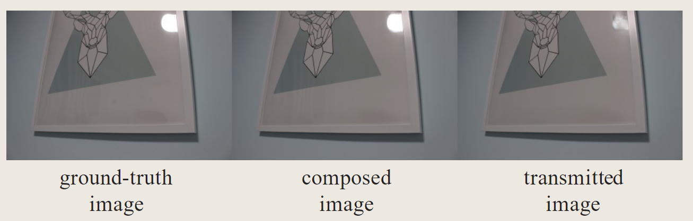
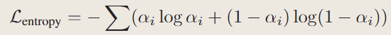

## nerfren（2022 CVPR）

- Category：光照反射
- Project: https://bennyguo.github.io/nerfren/
- Code: https://github.com/bennyguo/nerfren
- Paper: https://arxiv.org/pdf/2111.15234.pdf

### Motivation

原来的nerf：

- 缺乏对反射的建模，对于镜子反射的物体，在体渲染的模型下，相当于在镜子里存在一个虚拟的空间，从而导致错误的深度估计，**同时会将反射的物体建模为半透明的，从而导致雾状的几何**。

  > 其实我觉得这个很符合直觉，体渲染并不是真正的光线追踪，不能做到反射的光线也只能用虚拟的空间来欺骗视觉了

  - 先理解什么是雾状，将其和一般的半透明（如一个泡泡）区分开来，在一块区域中，每个采样点都有一些几何存在，但都是半透明的，看见的就是雾状，而一个泡泡看起来很清晰，是因为它内部是不存在发光的采样点的，而只在表面存在，这个是透明。

  - 在ref-nerf中提到，NeRF倾向于在物体内部使用各向同性发光点来“伪造”镜面反射，而不是由表面点发射的视相关辐射，导致物体具有半透明性或雾状壳。

  
  
  - ↑可视化的density，在正确的物理世界中，镜子应该只在表面有密度，而nerf中是认为镜子有一个半透明的表面，然后在镜子内部的不同深度出现了发光点，从而是雾状的。
    - 这样还会导致一个问题，这样训练出来的nerf，在镜子的交界附近也能看到那个镜子中的虚拟世界，也就是所谓伪影。

  
  
  - 所以问题就回到如何让nerf学习到基于表面的反射，如果用原来的nerf结构，最后的结果应该是：最后的镜子上有很高的density，即认为镜子是不透明物体，同时镜子平面上每个采样点的c来表示镜面反射，通过一些光学模型作为几何先验进行正则化，或者是修改模型等等，这篇文章就在解决这个问题。

### Method

- 将神经辐射场分解为独立的transmitted部分和reflected部分，同时学习一个reflection fraction map $\beta$，最后image由两者通过各自的辐射场渲染，最后相加得到，即

$$
I = I_t+\beta*I_r
$$

- 当然，it is highly under-constrained，如果不更改nerf就简单的将其分解为两个场，其实就是做一个无监督任务，那么会有无穷多种二分类的分解方法最后合成得到正确的视图。常见的有：分解为full场（渲染完整视图）和empty，分解为2个full场，以及两者之间。那么自然就要对训练做出约束了，基于以下三个假设：

  - $\beta$只应该和transmitted有关，因为$\beta$其实表示了物质的材料（我理解是反射率），而不应该和被它反射的物体有关系
  - transmitted的深度图应该是局部平滑的，因为现实中大部分反射体都是光滑平面（疑问：可是这个场也要用来重建其他物体，从case来看就是只盯着镜面重建了，但是case中镜面与其他物体的交界处好像重建的也还行）
  - reflected部分只需要简单的几何，因为大部分情况下我们只能从有限的观察方向看到反射图像。（意思是正常的三维重建我们追求360度全方位重建，但是重建出镜面中反射的物体我们只能看见一部分）

- 自然，三个假设做出三种约束

  - 设计特定的网络结构，分解成两个场，这里的α（reflection fraction map）只和transmitted有关

    - 整个镜面反射r场都和视线无关是一个比较反直觉的设计，有些不能理解。在原来的折射场中保持了方向是为了保留高光。在我看来是完全抛弃了物理假设，也就是图形学中的PBR公式，BRDF项等一系列物理假设，把镜子中的图像认为是藏在镜子中的另一个世界，不同视角带来的差异是因为摄像机在不同位置带来的，而并不是由于反射的光来源于不同位置造成的。比如看一个鼠标，从正面，上面，左边的三视图看到的是不同的鼠标图像，这是视线无关的场，场中某个点就是鼠标的组成部分，不会因为视角变化而导致鼠标本身的样子发生了变化，但鼠标上的高光真的是会因为你视角不一样而发生改变的。

    

  - 应用深度平滑先验

    - p是某像素，q是周围的8个像素，t*是估计深度（通过体渲染时采样点的深度加权求和得到），pq的深度差距越大以及颜色差距越大，都会导致Loss的增大，保证transmitted场的深度局部平滑

  

  - 双向深度一致性约束（bidirectional depth consistency constraint）

    镜面反射场最好描述了一个什么物体？作者的推导逻辑是，因为只有在很少的视角能观测->简单的几何，一种光线只能击中一个表面的几何->应该是一个不透明表面，一个贴了纹理的壳

    > 其实个人感觉故事讲得不好，这个约束在于将表面约束的足够薄，不应该由只能从正面看镜子来导出，其实将镜面反射简化为一张2D纹理是图形学渲染中的常见手段，但是确实不是很物理也不好讲故事，我猜作者是受此启发的，但是故事没太讲好，或者是我没get到，或者说从ref-nerf受启发也很合理，要将发光体约束在表面就要使得物体足够薄]

    - 定义了一个**反向**的深度，也就是从最**远**采样点的深度加权求和得到

    - 定义了一个**正向**的深度，也就是从最**近**采样点的深度加权求和得到

    - 这里比较容易让人产生疑惑，从近到远求和以及从远到近求和结果有什么区别？其实权重不一样，同一个采样点，从近到远求和的权重取决于它之前的点的不透明度，而另一个取决于它之后的点的不透明度，因此如果有两个表面，正向深度就会更偏向于前面的表面，因为后面的表面权重被前面的表面大幅降低了。

    - 来看一下不同的几何下正向深度和反向深度长什么样，横轴是采样点的距离，蓝线的纵轴表示密度，所以a表示遇到了两个表面，b是雾，c则是理想的镜面反射体——一张贴了纹理的固体。那么作者提出的约束就很简单，让两个深度足够近。
    
      

- 另外，对于有挑战性的场景，比如镜子，可以手动的提供mask，来使得场景被更正确的分解。（其实感觉这个是不是有点过分了，破坏了end to end，加入了手工的方法来大幅提升精度，不过某些先语义分割再nerf的方法好像也殊途同归，我训练个专门识别反射体的segment的cnn/transformer作为预输入语义是否有一定效果？就是novelty几乎没有，还会有个臃肿的模型，不过发散的讲，更多种分解场的方法，以及不同对应的预输入？）

  - 具体是，利用提供的mask图作为$\beta$的约束，要在mask区域$\beta$尽可能大，而其他区域尽可能小。

### Limitation

- 这篇文章太注重平面反射的建模了，自然会产生一个问题：对于非平面的镜面反射不能有很好的效果，比如下图的弯曲镜面

- 另一个是没有模拟出菲涅尔效应，这里作者只是提了一下，没有给出failure case，其实个人感觉反射系数$\beta$近似了一种菲涅尔系数，不过没有进行建模和约束，仅靠MLP学习，所以大概率学到的不是物理意义上的菲涅尔。

- 虽然文章没写，但是感觉过于精细的调参也是一个缺点，它要在早期屏蔽view direction以及它自己新增的几何约束，才能出比较好的效果，否则基本就是分解失败

## Ref-Nerf（2021 CVPR）

- Project: https://dorverbin.github.io/refnerf/
- Code: https://github.com/google-research/multinerf
- Paper: https://arxiv.org/pdf/2112.03907.pdf

### motivation

- 以view direction为MLP的输入，不方便进行插值，因为radiance function关于view direction变化太快
- nerf倾向于用在物体内部的各向同性的发光点来伪造镜面反射，导致物体呈现出半透明或者雾状。也因此导致法向量充满噪声，难以使用。

### contribution

- 重新参数化nerf，将view direction替换为出射方向

- 提出一种IPE，使得即使分开建模漫反射和镜面反射时，radiance function在不同的纹理和材质下仍可以平滑插值（还没看mip-Nerf，先TODO，有球谐函数和高斯的知识，也可能和3DGS有共通之处）
- 一种正则化方法，使得体积密度能够集中于表面，从而优化法向量的精确度

### method

- 重新参数化nerf，将view direction替换为出射方向
  - 用一个四个平行光的简单场景为例，黑色的是可见（但是没有光）部分，棋盘格是不可见部分。
  - $\omega_r$表示出射方向，永远指向平行光所以不随着x变动，因此第二行的图中这些光都是平行线，如果我们要预测$\omega_r$不取在这四个平行光所在方向的参数，Directional MLP只需要进行平滑的插值。
  - 下方的$\hat{n}, ρ, c_d$表示ref-Nerf对这三个量进行了建模，将它从镜面反射中分离开来，最明显的变化是使得右边第二列，相比于第一列，让Directional MLP不需要对漫反射进行插值。

- 网络的框架，ρ表示粗糙度，和IDE有关，法向量和视线方向用来算出反射方向$\omega_r$，以及位置$x$通过空间MLP编码后得到的特征向量$b$,还有$n·d$(为了模拟菲涅尔项，以及其他可能的BRDF函数)来计算高光反射的颜色，最后和漫反射颜色一起通过色调映射输出srgb颜色。[色调映射：将颜色从线性空间转换到srgb并且将颜色范围限制到[0,1]]

- 提出一种IPE，使得即使分开建模漫反射和镜面反射时，radiance function在不同的纹理和材质下仍可以平滑插值（还没看mip-Nerf，先TODO，有球谐函数和高斯的知识，也可能和3DGS有共通之处）

- 一种正则化方法，使得体积密度能够集中于表面，从而优化法向量的精确度

  - 针对体密度梯度计算出的法向量充满噪声，不够平滑的问题，提出第一个正则化，就是在MLP输出另外一个法向量，要求这两个法向量足够接近。作者提到：MLP预测的法线更加平滑，这和vanilla NeRF提到的位置编码来自于同一理论，论文Fourier Features Let Networks Learn High Frequency Functions in Low Dimensional Domains中提到MLP的这一特性，以及克服MLP趋向于学习低频特征而不擅长学习高频特征的方法，包括原始NeRF中的位置编码。当然，这里是反过来利用MLP学习低频特征的特性，来预测一个尽可能平滑的法线。

  

  - 第二个问题是针对NeRF总喜欢用一些物体表面后的发光点的问题，提出要让高可见度(也就是$w_i$高)和光线同向的法线受到惩罚，这样物体存在于物体背面又能够发光被我们看见的物体就会减少。通俗的讲，让NeRF倾向于让面对光线的那一部分表面来表达物体的颜色，而不要让物体表面变成半透明，而让里面的物体发光来解释所看到的颜色。

  

## Nerf2Mesh（2023 ICCV）

- Category：nerf2mesh, nerf-texture
- Project: https://me.kiui.moe/nerf2mesh/
- Code: https://github.com/ashawkey/nerf2mesh
- Paper: https://arxiv.org/pdf/2303.02091.pdf

好像不是很看得懂，尽力吧

这个翻译的不错：https://blog.csdn.net/m0_50910915/article/details/131823539

这个是论文思路解释：https://blog.csdn.net/qq_40514113/article/details/129759065

### motivation

关于深度学习重建mesh的方法中，

- mobile-nerf重建的mesh质量不佳，而且纹理是在特征空间中而不是RGB空间中，这使得纹理编辑成为难题
- SDF相关的工作中，提取了过度平滑的几何，难以model thin structures。
- 通过Marching Cubes产生的网格有过多的冗余顶点和表面
- NVdiffrec使用可微光栅化来优化可变形四边形网格，但只能用于对象级的重建，并且在复杂的多边形上失败

### contribution

- 提出了Nerf2Mesh，从多视角RGB图像中提取网格，细化从Nerf中提取的粗网格，实现几何和外观的联合优化。
- 提出了一种迭代式的网格refine算法，能够自适应的调整表面密度，根据重投影的二维图像误差对复杂表面进行细分，对简单表面进行抽取（decimated）（???）
- 与最近方法相比，更好的网格质量，更小的网格尺寸，更好的渲染质量。

### Realted Work

Surface mesh for Scene Reconstruction方面不是很看得懂，直接看从NeRF中提取网格的工作吧。

Nerf使用体积密度场表示几何，并不形成确定的表面，因此在提取表面网格上也受到限制。一种流行的方法是学习SDF，但是SDF的表面太过平滑，无法学习thin construction，还提到了SAMURAI，mobielNerf，以及提到两篇工作发现**指数密度激活函数**可以帮助集中密度，形成更好的表面。

### Method

先训练一个grid-based的NeRF（InstantNGP），分为几何和外观联合优化

- 几何上，先用Marching Cubes提取粗网格，然后通过文中提出的算法细化网格
- 外观上，通过颜色网格学习的，并分解为漫反射和镝面反射项。收敛后，我们可以导出精细网格，展开其UV坐标并烘焙纹理。

#### stage1

大致的流程图里已经很清楚了，不过文中提到$f_s$可以被烘焙为纹理，$MLP_2$可以在fraa shader中实现，因此镜面反射可以被导出和渲染，很难理解这件事，特征是什么被提取为纹理的，着色器里怎么写MLP等等，感觉在这一领域欠缺了很多知识。

另外，本文的方法直接将光照烘焙为纹理，因为估计环境光具有挑战性，而且很可能会导致渲染质量降低。

当然，为了约束分解，还加入了L2正则化，原文提到这是为了促进漫反射和镜面反射的分解，于是对镜面反射应用L2正则化。这里复习下L1和L2，L1正则化趋向于让模型获得稀疏解，即在某些权重上为0，L2则让模型趋向于获得较为平滑的解。

> 也就是说这边是让不同位置上的高光反射不过于强烈，可以让高光的$c_s$平滑一些……为什么促进了分解？已经完全看不懂了
>
> 你用L1正则化我还能理解，但是文中也没有什么详细解释，只能你说是那就是了

为了使得表面更加锐利，采用交叉熵正则化。

兴许这个还是比较好理解的，交叉熵正则化鼓励权重的稀疏分布，也就是说让体渲染上每个点的体密度尽可能大，而不是形成雾状，这样就使得体密度集中在表面上了。

> 求求作者解释一下吧，靠猜太累了，当然也可能是我读的论文太少了，这个作者认为不需要解释

#### stage2

- Appearance refinement：通过nvdiffrast进行可微渲染，仍然可以使用img逐像素的损失，来进行外观优化。（按文章脉络应该是在优化纹理，按图来说应该还是在优化$MLP_1，MLP_2$的参数）

- Iterative mesh refinement.

  - 顶点优化比较容易理解，对于每个顶点设置一个偏移量$\triangle v_i$，通过可微渲染反向传播image-space loss gradients（NVdiffrec提出）来优化这个偏移量。
  - 面（face）优化就比较复杂，因为网格面不可微。本文提出的训练策略是将2D图像渲染误差重投影到对应的网格面上，累积网格面的误差，然后给出一个阈值，高于这个误差的做网格细化，低于的做网格抽取并重新网格化来降低网格密度。

  > 复习一下obj格式吧，顶点用三维向量描述顶点位置，面则是由顶点索引组成，表示这个面由哪几个顶点链接得到，注意顶点索引顺序是有影响的，这会决定面的方向
  >
  > 网格抽取（decimate）似乎是一个图形学上几何的相关知识，读不懂还是图形基础不够

网格更新之后就重新初始化顶点便宜和面误差

- Unbounded scene.

无界场景优化，没有读过相关文章，略过了。

#### Mesh Exportation

将优化后的精细网格$M_{fine}$用XAtlas解析UV坐标，然后烘焙漫反射颜色$c_d$和镜面反射特征$f_s$，分为生成$I_d, I_s$

为了渲染镜面反射颜色，采用mobileNeRF中的方法，导出$MLP_2$的权重并合并到frag shader中

### Limitation

烘焙光照，无法relight，基于单通道光栅化，不能处理半透明

> 读完了，但是和没读一样，不过还是有收获
>
> - get一种约束体密度到表面的方法，可以对体渲染公式中的$\alpha_i$做交叉熵损失
> - 在网格重建方面还是缺少了很多的基础知识，比如MarchingCube，另外意识到NeRF可能不是网格重建的主要方法，SDF可能更加主流。
> - 初步看到了可微渲染是什么东西，了解到一种可微渲染框架nvdiffrast
>
> 以后如果做相关方向，可以再回来看看这篇文章。

## **pixelNeRF**

**pixelNeRF: Neural Radiance Fields from One or Few Images**

*Alex Yu, Vickie Ye, Matthew Tancik, Angjoo Kanazawa*
CVPR 2021, 3 Dec 2020

[[arXiv](https://arxiv.org/abs/2012.02190)] [[Project](https://alexyu.net/pixelnerf/)] [[Github](https://github.com/sxyu/pixel-nerf)]

这篇文章给出了PixelNeRF的简易实现：https://zhuanlan.zhihu.com/p/550890576

应该算是NeRF早期的Few-shot工作，引用量也比较高，就当做稀疏视角重建的启蒙作看吧

### Realted Work

没有提NeRF相关的工作，都是之前的稀疏重建，提到了同期工作GRF。

### Method

motivation比较简单就合在method里，简单来说就是之前的NeRF只使用原来的图像进行训练，没有很好的利用原来图像的所有信息，所以当只有稀疏视角的时候新视角合成就有比较多的artifacts

这篇文章提出要用CNN提取输入的图像，形成一个feature volume，在推理的时候也使用这张特征图（额所以你为什么不叫feature map要叫volume），就能更充分的利用原来图片的信息了。

CNN Encoder由预训练的res-net34组成。

思想还是比较简单的，以单视角输入为例，将input view经过CNN Encoder得到一个Volume feature，即每个像素都有一个feature，即pixel-aligned，记作W，当需要进行新视角合成的时候，采样点从世界坐标映射到input view所在的view space，然后由最近的四个像素经双线性插值得到一个特征向量，将这个特征向量输入以下的网络

值得注意的是当多视角输入的时候，得到的V是经过一个平均的后输入解下去的MLP的，这点应该还有优化空间，不同视角下对于空间中同一个点训练出来的特征应该是具有不同意义以及重要性的，比如要新合成的视角和正面比较近，那么背面的视图应该拥有较低的权重。

另外输入的时候直接使用view direction，没有经过位置编码，也不是在中途加入的，原文表示

- view direction可以作为不同视图的相关性和定位的信息
- 当新视角和已有视角更接近的时候，可以更依赖已有视角，否则应该更依赖学习出的prior

> 我怎么感觉还是没解释为什么不中途加入呢

## **RegNeRF**

RegNeRF: Regularizing Neural Radiance Fields for View Synthesis from Sparse Inputs

*Michael Niemeyer, Jonathan T. Barron, Ben Mildenhall, Mehdi S. M. Sajjadi, Andreas Geiger, Noha Radwan*
CVPR 2022, 1 Dec 2021
[[arXiv](https://arxiv.org/abs/2112.00724)] [[Project](https://m-niemeyer.github.io/regnerf/index.html)] [[Code](https://github.com/google-research/google-research/tree/master/regnerf)] [[Notes](https://github.com/yangjiheng/nerf_and_beyond_docs/blob/main/paper_discussions/RegNeRF.md)]

总之先来两篇不错的阅读笔记：

顺便了解下李代数：https://zhuanlan.zhihu.com/p/532973564

fewshot工作总结：https://zhuanlan.zhihu.com/p/617570383

### motivation

- 一些工作（MVSNeRF，IBRNet，GRF，PixelNerf）需要昂贵的预训练，通过“amortized inference”（摊余推断）与fine-tune来完成稀疏视角重建。尽管这些模型取得了令人期待的结果，但通过捕捉或渲染许多不同场景来获取必要的预训练数据可能成本过高。此外，这些技术在测试时可能无法很好地推广到新领域，并且可能由于稀疏输入数据的固有模糊性而产生模糊的伪影。

> gpt:
> "摊余推断"（amortized inference）是指在模型的训练阶段进行的推断过程，其中模型被训练以在给定一些输入时，能够有效地生成输出，而不需要每次都进行全面的推断。这种方法的目标是通过训练模型来学习一种映射，使其在整个输入空间上都能产生良好的推断结果。
>
> 在文中提到的上下文中，摊余推断是指在测试时，通过使用已经训练好的模型，可以从仅有少量输入图像生成新颖的视图，而无需每次都重新进行完整的模型推断。这种方法有助于提高模型的效率，并使其更容易应用于实际场景，尤其是对于需要快速推断的应用。

> 还知道了一个常识：稀疏视角下有一个固有问题，就是会出现模糊和伪影，这里是在说这种做法还是没有解决模糊和伪影问题。

- 另一些工作是通过添加一些正则化，重新训练整个场景（例如引入深度监督的nerf，这里指Depth-supervised NeRF: Fewer Views and Faster Training for Free，以及引入clip的dietNeRF），但是现有方法要么过于依赖并非始终可用的外部信号（意思就是depth不是什么时候都能拿到的），要么只在低分辨率场景下（只提供high-level的信息，这里是针对clip）运行。

### contribution

- patch-based regularizer：用于新视角的深度图，可以减少伪影、增加几何质量
- normalzing flow model：用于新视角的颜色，通过最大化渲染patch的对数似然（？），来避免颜色在不同viewpoint下的差异（消融实验来看是个没用的创新点，还很难看懂，这里直接跳过了）
- **annealing strategy for sampling points：沿采样点的退火策略，首先在小范围内对场景内容进行采样，然后扩展到完整的场景边界，保证训练早期不出现分歧。**

### method

#### 深度平滑：

从规定的可能的相机位姿矩阵中采样光线$r_{ij}$，在patch范围内进行深度平滑，深度计算方法采用NeRF原代码中的方法。

> 很常见的方法了，但是一百种NeRF改进有一百个实现，也有各种各样的理由，可以考虑作为一个小trick。

#### 退火策略（Sampling Space Annealing）

作者观察到，在稀疏输入的情况下，NeRF容易收敛到相机的近平面上，这虽然还原了输入视角，但是缺乏3D一致性，对新视角的合成就很不友好。

> $i:迭代次数，t_n:近平面，t_f:远平面，t_m:中点$

可以注意到$\eta$为0的时候$t_n=t_f=t_m$，而$\eta$为1的时候就是原始的近远平面，按照作者的思路应该$\eta$逐渐从0增加到1,因此看$\eta$的定义，作者还增加了超参数$N_t$：到第几轮的时候应该停止退火,和$p_s$：初始的$\eta$，可以看出max和min肯定是写反了，从代码来看也能知道。

## FreeNeRF

**FreeNeRF: Improving Few-shot Neural Rendering with Free Frequency Regularization**
*Jiawei Yang, Marco Pavone, Yue Wang*
CVPR 2023, 13 Mar 2023
[[arXiv](https://arxiv.org/abs/2303.07418)] [[Project](https://jiawei-yang.github.io/FreeNeRF/)] [[Github](https://github.com/Jiawei-Yang/FreeNeRF)] [[Notes](https://github.com/yangjiheng/nerf_and_beyond_docs/blob/main/paper_discussions/FreeNeRF.md)]

### motivation

现存方法的不足：

需要大规模预训练：pixelNeRF，MVSNeRF

引入了深度监督，导致了复杂的管线：Depth-supervised NeRF

patch级别的正则化，导致了较高的计算量：DietNeRF，RegNeRF

总的来说，作者引入了两个几乎不增加计算量的正则化方法，避免了以上策略的缺点，即无依赖（不需要预训练和深度来引入额外信息）和无开销（不增加计算量），使得稀疏视角下的重建质量得到了很大的提升。

### contribution

- 揭示了稀疏视角重建的失败与位置编码频率之间的关系
- 提出两种正则化

### method

#### Frequency Regularization（频率正则化）

作者首先发现低频位置编码反而在稀疏视角重建学得不错（尽管过度平滑），10%是指解锁前10%的位置编码，以L=10为例，10*10%=1, pos_enc[int(1):] = 0,即只保留第一个位置编码。剩下是讲故事环节：

原文只说明：高频的位置编码使得高频部分更快收敛，从而阻止了对低频信息的探索，导致NeRF合成的新视角图像中出现了预期之外的高频伪影。

接下来是个人理解：

拥有高频位置编码意味着能够学习那些只移动一点位置就能变化较大的场景细节，在稀疏视角重建的时候，由于对原始图像的过拟合，把一些本该是低频信息的（比如平滑的表面）学习成了随视角变化很大的高频信息，合成新视角时，移动视角就会带来很大的变化，从而出现各种各样的高频伪影。

于是就提出一个退火策略，随着轮次i增加，逐渐开放高频位置编码。

#### Occlusion Regularization（遮挡正则化）

观察伪影，还可以发现有一些伪影并不是高频的，变化剧烈的，而是像墙一样直接堵住了物体的一部分，这部分是怎么回事呢？

通过上图可以知道，其实是输入的稀疏视角中极少重合的那一部分被NeRF解释成了更靠近相机近平面上的密集体密度块（漂浮物），在渲染新视角的时候采样到这些高体密度块就会出现一些墙挡住后面的物体。热力图是深度图，实线矩形里面是输入图像，虚线矩形里面是新视角图像，虚线圈起来的部分是导致了新视角图像“Wall”的“极少重叠部分”。

> 关于为什么会到相机近平面，个人认为是因为更容易收敛到这里，因为在近平面上改变一小部分的体密度就能改动很大的一块图像，近大远小嘛，这样的话这里就是梯度下降最快的方向，也是一个过拟合的问题。

提出的正则化如上，假设采样64个点，K=1,2,3...64,（near to far），可以知道越靠近相机的点Loss越大（1/K），同时$\sigma_k$表示该采样点体密度，$m_k$是一个二进制掩码，表示该点是否需要被正则化，为0的点该项不生效。总的来说，离相机越近，体密度越高，惩罚越强。

## **FSGS: Real-Time Few-shot View Synthesis using Gaussian Splatting**

*Zehao Zhu, Zhiwen Fan, Yifan Jiang, Zhangyang Wang*
arXiv preprint, 1 Dec 2023
[[arXiv](https://arxiv.org/abs/2312.00451)] [[Project](https://zehaozhu.github.io/FSGS/)]

论文阅读笔记：https://zhuanlan.zhihu.com/p/674709488

### motivation

- NeRF的稀疏视角重建方法不能取得质量和速度的平衡
- 在稀疏视角下，SFM生成的点云质量不佳，由于初始化不充分，后续原始3DGS的split和clone方法也无法弥补缺陷，导致结果过度平滑（什么叫过度平滑？之后可以做实验看看，NeRF那边是说有高频伪影反而要减少高频）
- 因此，提出一种新的改动高斯球的方法，称为Proximity-guided Gaussian Unpooling，同时引入深度先验来保证这种方法生成的高斯核的合理性

### method

- 针对不够充分的高斯初始化，采用Proximity-guided Gaussian Unpooling策略增加高斯球，通过测量现有高斯分布之间的接近度并将新的高斯分布战略性地放置到最具代表性的位置来填补空白空间。
- 为了确保密集化的高斯分布几何形状合理，用了深度先验
- 用pseudo view generation防止过拟合于稀释视角（伪视图生成？）

> 文中提到Additionally, some Gaussians tend to grow towards extremely large volumes, leading to results that overfit the training views and generalize badly to novel viewpoints (See Fig. 3).
>
> 也就是说，类似FreeNeRF中提到的遮挡在近摄像头平面的黑团，3DGS在稀疏视角下也有将高斯核训练的过大来拟合单一视角的问题，或许可以通过正则化解决。

#### Proximity-guided Gaussian Unpooling

为每个高斯分配一个属性proximity score：接近度分数，定义为其到最近的K个高斯核的平均距离，默认K=3

当proximity score超过一个阈值$t_{prox}$，就在其自身（ori）与它的K个邻居（dst）之间创建一个新的高斯核，其scale和opacity由dst决定，rotation和SH初始化为0，通过以上过程可以在representative location（代表性位置？大概就是本来应该要很密集的区域）增加高斯密度，在优化的过程中逐渐填补观测缺乏带来的空白。

> 怎么没讲如何具体的进行depth guidance修正新生成的高斯，虽然图示已经比较清楚了，猜测是拿着DPT生成的深度图，获得到新生成的高斯所对应的位置的深度，修正高斯核的深度

#### Geometry Guidance for Gaussian Optimization

通过上述致密化方案补充高斯核后，直接用光度损失（估计就是3DGS原始损失）进行优化，会由于稀疏视角而不能优化出连贯的几何，以及容易过拟合于稀疏视角而在新视角合成没有泛化性。作者提出用深度先验来帮助改善高斯的几何。

##### Injecting Geometry Coherence from Monocular Depth（构建估计深度和渲染深度的几何相关性）

就是一个深度损失，估计深度图来自预训练模型DPT，渲染深度图来自3DGS

##### Differentiable Depth Rasterization（可微深度光栅化）

当然，为了深度可以被反向传播优化，需要写可微深度估计，深度由下式计算

可以发现，和渲染颜色时差不多

所以cuda代码应该还是比较容易实现的

#### Synthesize Pseudo Views

没太看懂，大概是在两个已知视角之间合成一个新视角，但是没仔细说是怎么用，应该是用来数据增强，实验中提到在2000次迭代后才开始合成视角。

### Experiments

数据集中，mip-nerf360被特别提到，因为他们第一个在无界数据集上进行稀疏视角重建。

消融实验如上

## Splatter Image: Ultra-Fast Single-View 3D Reconstruction（未读完）

[Stanislaw Szymanowicz](https://szymanowiczs.github.io/), [Christian Rupprecht](https://chrirupp.github.io/), [Andrea Vedaldi](https://www.robots.ox.ac.uk/~vedaldi/),

Visual Geometry Group - University of Oxford

website：https://szymanowiczs.github.io/splatter-image

大致意思是3DGS将高斯核映射成图像，本文找到了一种方法将图像通过Unet映射成高斯核

## GaussianShader: 3D Gaussian Splatting with Shading Functions for Reflective Surfaces

[Yingwenqi Jiang](https://github.com/Asparagus15)1, [Jiadong Tu](https://github.com/donjiaking)1, [Yuan Liu](https://liuyuan-pal.github.io/)2, [Xifeng Gao](https://gaoxifeng.github.io/)3, [Xiaoxiao Long](https://www.xxlong.site/)2,*, [Wenping Wang](https://www.cs.hku.hk/people/academic-staff/wenping)4, [Yuexin Ma](https://yuexinma.me/aboutme.html)1,*

*Corresponding author

1ShanghaiTech University, 2The University of Hong Kong, 3Tencent America, 4Texas A&M University

website：https://asparagus15.github.io/GaussianShader.github.io/

### motivation

现存的3DGS没有明确的建模外观属性，因此对镜面反射，显著视图变化的渲染质量不佳，特别是渲染那些反射为主要特征的材料的时候。

提到Ref-NeRF和ENVIDR渲染速度太慢，后者由于SDF的限制ENVIDR甚至不能建模复杂场景。

既然要提到反射，法线估计是不可避免的，如果直接通过搜索附近的高斯来估计法线，会带来很高的计算开销。这篇文章基于高斯球的最短轴方向提出了一种法线估计方法，同时还从深度图中导出法线图与估计的法线构成一个法线一致性正则项。

### contribution

- 提出了shading function逼近渲染方程，增强了反射和镜面的真实感
- 提出了一种新的法线估计方法
- 因为3DGS很快，实现了实时渲染

### method

大致流程如上，放弃了SH描述颜色，引入了一些Shading Attributes，一张可微的环境光照模拟间接照明

#### 描述颜色

作为SH的代替，该文章用如下方程描述颜色，是对渲染方程的一种近似

$\omega_0$：view dir

$c_d$:漫反射颜色

$s$:tint，材质本身的颜色

$n,ρ$：法线、粗糙度

$L_s$:镜面反射光

$c_r$:**残差颜色**，唯一一个陌生概念，作者说这是因为一些复杂的反射，例如间接光照的散射和反射不能用上述的直接光反射来解释，所以用这项来解释这些复杂的反射，当然因为也是反射同样和view dir有关

原文表示残差颜色由SH参数化

以上参数除了直接提供的$\omega_0$都可以训练

#### $L_s$的计算

这是计算$L_s$的式子，回顾一下渲染方程

很相近，所以原理也大致相同，都是积分有哪些$w_i$贡献了$w_o$这个方向上的L，渲染方程中根据不同材质有不同的BRDF函数$L_i$,这里也根据不同的粗糙度$ρ$和反射角$r$有不同的D函数，其中$L(w_i)$用可训练的6x64x64的cube map表示。

#### 法线估计

先用椭圆最短轴当法线，但是椭圆最短轴可能朝外也可能朝内，先用上述式子选择和视线方向$\omega_0$一致的方向，为了修正法线引入一个可训练的法线偏移$△n$,同时为了保证不偏移太远引入正则项

但是以上法线定义在每个高斯核上，没有和局部的其他高斯核联系，而法线又是反应局部梯度变化的量，这导致了估计法线和几何不一致，简单的方法是直接搜索局部高斯核共同估计法线，但是计算开销太高，所以作者提出用深度图得到法线图，然后法线图和之前的法线估计之间使用法线一致性损失

三种法线的图示，有偏移的$n$,最短轴$v$和深度图导出的法线$\hat{n}$

#### Sparse loss

帮助不透明度趋于0或1，同时使得高斯球的几何形状趋近于thin plate从而提高渲染质量

### Experiments

从消融实验来看，最重要的其实是可训练的环境贴图，其次就是法线一致性正则化。

从实验结果来看，各项指标相比原先的GS提升不大，甚至有的数据集中会下降，但是法线质量会大幅提高，在一些反射效果比较重要的区域会有比较好的视觉效果
