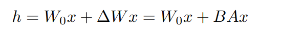

---

title: LLM相关

date: 2025.07.20

categories: LLM

tags:

 - LLM

---

## 一. LLM训练流程


训练出LLM一般需要经过Pretrain、SFT、RLHF三个阶段。

pretrain

sft

rlhf

### pretrain

- 模型架构：各类基于transformer的decoder-only架构
- 任务制定：CLM为主
- 计算需求：分布式训练方法
- 数据需求：互联网上的海量文本

#### 任务制定

pretrain的数据集自然是互联网上的海量文本，但是既然要训练，自然需要一个任务，并且根据这项任务对数据进行处理，现在最常用的方法是CLM（Causal  Language Model，因果语言模型）。

CLM：根据前面所有的token来预测下一个token。（现在的主流，Lamma，gpt，qwen等）

```tex
input: 今天天气
output: 今天天气很

input: 今天天气很
output：今天天气很好
```

在实践上，在计算transformer的时候通过掩码注意力机制，将后续的注意力权重调整为0，使得每个token只能关注前面的token。（即在训练时对模型加mask，并不是对输入加mask使得文本不可见）

```mark
 【MASK】【MASK】【MASK】【MASK】
    I   【MASK】 【MASK】【MASK】
    I     like  【MASK】【MASK】
    I     like    you  【MASK】
    I     like    you   .
```

其他并不主流的方式，但仍然存在

MLM：随机屏蔽部分token，让模型完成类似完形填空的任务。

```markdown
输入：I <MASK> you because you are <MASK>
输出：<MASK> - love; <MASK> - wonderful
```

NSP：输入两个句子，判断是否构成上下文。

#### 计算需求

大模型的显存开销显然是单张GPU无法接受的，在实践中，需要将模型参数、模型梯度、Adam状态参数等等进行分片，例如可以将两个batch放到两张gpu上，然后通过通信共享梯度，完成类似batch_size的并行训练，被称为**Data Parallelism（数据并行）**：


例如将模型参数本身放到不同的GPU上：


显而易见的，越是高的分片，带来越高的通信开销，因此哪些内容适合分片，哪些内容适合所有GPU上对齐。

除了分片以外，还有很多手段降低显存开销

- CPU-offline：将部分计算、缓存转移至CPU
- 算子优化：针对Transformer优化矩阵乘法等算子，减少中间矩阵，降低显存开销
- 量化、压缩：例如对梯度进行压缩后再通信，以梯度精度损失为代价降低通信
- ....

#### 数据需求

如何从互联网中获取高质量语料用于训练？（tips：目前各公司并不完全开源其高质量语料库）

- 文档准备：通过爬虫、简单的URL过滤、语种过滤等，收集大量文本数据。
- 语料过滤：去除低质量、无意义、有害内容，如乱码广告等，方法包括：
  - 通过高质量语料库训练一个文本分类器
  - 人工标定
- 语料去重：hash计算相似性、模式匹配等

### SFT（监督微调）

#### 指令微调

大模型SFT与传统中对模型续训、微调的方法并不相同。

传统上，我们想让一个模型能完成特定的下游任务的任务，例如要完成机器翻译，我们就提供机器翻译的数据集，修改模型的输出，然后进行续训。

但是LLM微调时，为了增强其泛化性，采用的是指令微调的方式，输入是各种指令，输出则是相应的回复，数据集类似于：

```json
input : {
	system prompt: "你是一个helpful assistant",
    user prompt: "告诉我今天的天气预报",
    assistant prompt: "根据天气预报，今天天气是晴转多云，最高温度26摄氏度，最低温度9摄氏度，昼夜温差大，请注意保暖哦"
}
```

输入的是一条用户指令，大部分时候会在user prompt前拼接一条system prompt，而assistant prompt就是输出，也就是大模型计算损失时的gt。

以上是单次会话的训练实例，为了让LLM能够执行多轮对话，SFT中也进行多轮对话的训练，其输入输出为：

```markdown
 input=<prompt_1><completion_1><prompt_2><completion_2><prompt_3><completion_3>
 output=[MASK]<completion_1>[MASK]<completion_2>[MASK]<completion_3>
 
 [MASK]是指不参与loss计算的部分
```

#### 高效微调

其实可以发现，前面的pretrain和指令微调，都可以理解为正在训练大模型的通用能力，指令微调也需要极高的训练成本，到端侧部署应用时，通常使用的是高效微调方案。

##### Adapter Tuning


在transformer层之间插入一个小型adapter，冻结原有参数，仅训练这些参数。Feedforwarddown-project会将输入维度大幅降低，并在输出时还原。

##### Lora

原文：https://arxiv.org/pdf/2106.09685




如果仅有左侧的模型，就是全量微调。

现在将左侧模型冻结，梯度传导到右侧的A和B矩阵。这里解释一下A和B是什么。

理论上原始参数的梯度是一个较大的矩阵∆W，现在将该矩阵分解为r更低的两个矩阵B和A表示，由于B和A的r更小，更新的参数也大量减小了。

图上AB的值为初始化的值，即A用高斯初始化，B用0初始化。

可以看出lora也是一种adapter，但是是并行的加入新参数，通过矩阵分解降低参数更新量。

### RLHF

（Reinforcement Learning from Human Feedback， 人类反馈强化学习）

这一步是为了保证回答能够对齐人类的价值观，使得输出更符合人类偏好，分为两个步骤，训练RM和PPO训练

RM（Reward Model）

这一步在训练一个奖励模型，定量评判模型输出的回答在人类看来是否质量不错，即

输入：【prompt，模型的回答】

输出：评分（符合人类偏好的程度）

训练RW的数据则来自于：对于同一个prompt，由LLM不断生成不同的回答，然后人工对这些回答的偏好进行**排序**。

---

将RW训练好之后，以RW的评分为标准，不断对LLM进行人类偏好的训练，常用的方式是PPO训练（Proximal Policy Optimization），一种强化学习方法。

## 二、大模型应用