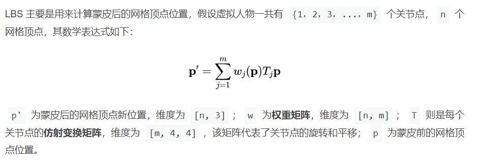
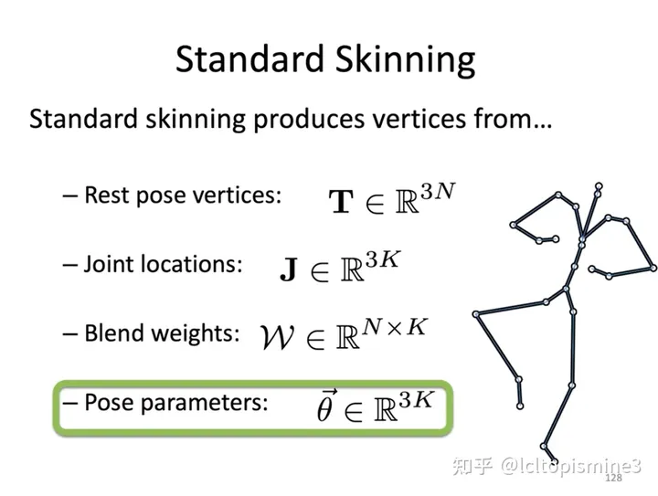
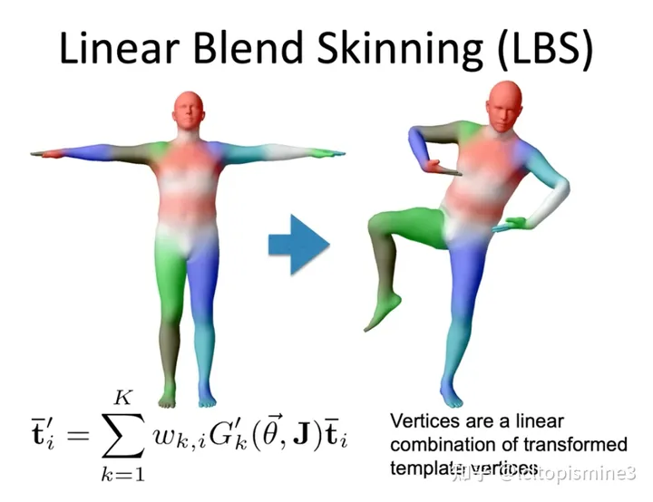

---

title: 虚拟人前置知识

date: 2024.03.01

categories: 图形学

tags:

 - 图形学
 - NeRF
 - 3DGS

---

参考文献：http://rocyan.top/posts/paper/SMPL.html#_3-4-%E7%BA%BF%E6%80%A7%E6%B7%B7%E5%90%88%E8%92%99%E7%9A%AElbs-linear-blend-skinning

## LBS（线性混合蒙皮）

简单解释：先移动关节点，根据骨骼的仿射变换$T_j$,将$p$根据蒙皮权重（即每个vertex关于每个joint的权重）进行线性相加得到vertex的新位置$p^{'}$

更标准的表示如上（Rest pose vertices：静态顶点）

## SMPL

