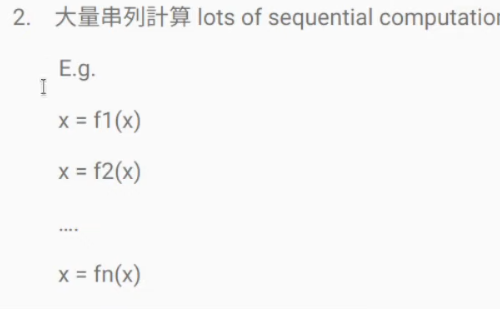
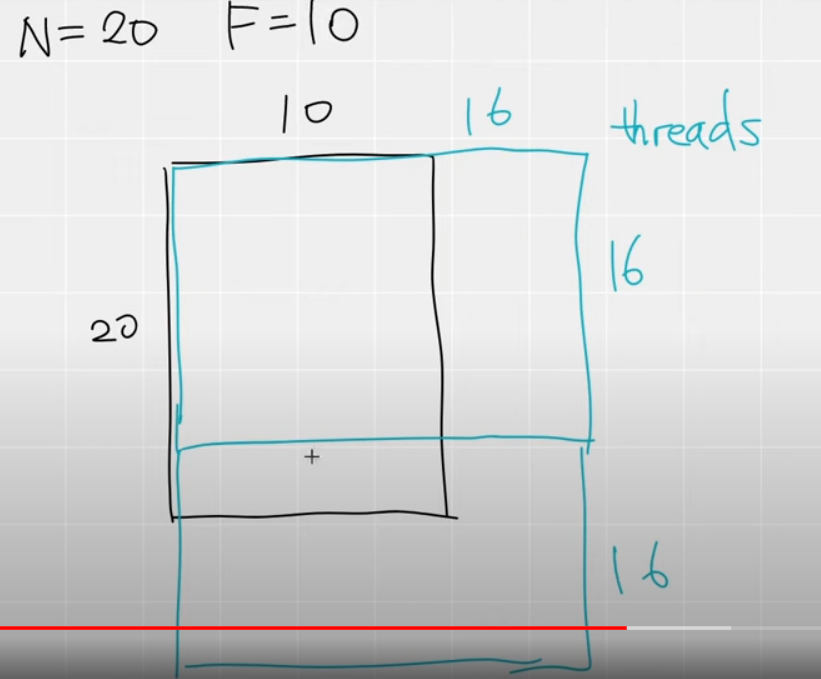
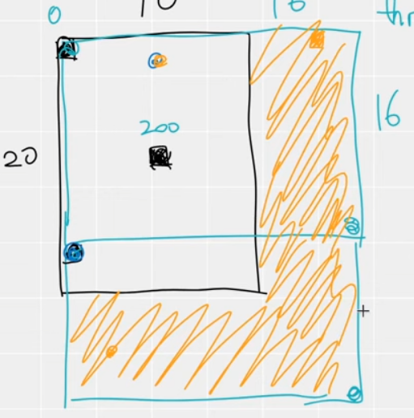

## Tutorial 1 setup

- 使用方法：在python中调用cpp，在cpp中调用cuda

- 哪些时候要用到CUDA，pytorch无法自动实现？

  - 非平行运算，例如体渲染，采样点不一样

  - 大量的串行运算

    

windos下cpp中添加torch头文件

>"C:/Users/Patchouli/anaconda3/envs/cppcuda/include",
>
> "C:/Users/Patchouli/anaconda3/envs/cppcuda/Lib/site-packages/torch/include",
>
> "C:/Users/Patchouli/anaconda3/envs/cppcuda/Lib/site-packages/torch/include/torch/csrc/api/include"

pybind：从python中调用cpp

```
PYBIND11_MODULE(TORCH_EXTENSION_NAME, m){
    m.def("_trilinear_interpolation", &_trilinear_interpolation) 
    #前者定义python中的函数名称，后者是cpp中调用的函数
}
```

CPP文件需要编译才能运行，这里由python进行注册，在setup.py文件中

```
import glob
import os.path as osp
from setuptools import setup
from torch.utils.cpp_extension import CUDAExtension, BuildExtension


ROOT_DIR = osp.dirname(osp.abspath(__file__))
include_dirs = [osp.join(ROOT_DIR, "include")]

sources = glob.glob('*.cpp')+glob.glob('*.cu')


setup(
    name='cppcuda_tutorial', #import时的名称
    version='1.0',
    author='kwea123',
    author_email='kwea123@gmail.com',
    description='cppcuda_tutorial',
    long_description='cppcuda_tutorial',
    ext_modules=[
        CUDAExtension(
            name='cppcuda_tutorial',
            sources=sources,        # 有哪些cpp/cu文件需要build
            include_dirs=include_dirs,
            extra_compile_args={'cxx': ['-O2'],
                                'nvcc': ['-O2']}
        )
    ],
    cmdclass={
        'build_ext': BuildExtension
    }
)
```

写好setup.python后，执行以下代码编译cpp

> python setup.py install

在python中就可以使用cpp代码了

>import torch
>
>import cppcuda_tutorial
>
>feats = torch.ones(2)
>
>points = torch.zeros(2)
>
>out = cppcuda_tutorial._trilinear_interpolation(feats, points)
>
>print(out)

## Tutorial 2 input check

grid->block->thread

三线性插值中有哪些能平行运算？

```
#include <torch/extension.h>
torch::Tensor _trilinear_interpolation(
    torch::Tensor feats, //(N, 8, F) N: 正方体数量， 8个顶点， F个feature
    torch::Tensor point  //(N, 3) 三维坐标
){
    return feats;
}

PYBIND11_MODULE(TORCH_EXTENSION_NAME, m){
    m.def("_trilinear_interpolation", &_trilinear_interpolation);
}
```

N个正方体之间可以平行

F个feature之间可以平行

> 8个顶点不也能平行运算吗

在调用cuda，将tensor传入前，必须做的检测

```cpp
    CHECK_INPUT(feats);
    CHECK_INPUT(points);

#define CHECK_CUDA(x) TORCH_CHECK(x.is_cuda(), #x " must be a CUDA tensor")
#define CHECK_CONTIGUOUS(x) TORCH_CHECK(x.is_contiguous(), #x " must be contiguous")
#define CHECK_INPUT(x) CHECK_CUDA(x); CHECK_CONTIGUOUS(x)
```

大概就是检测tensor是不是在cuda上，和内存上是否连续，注意floater之类的参数就不要检测了，主要是tensor

## Tutorial 3 定义thread



一个block中有多少thread由我们自行定义，有几个block一般由一个公式固定计算

例如有20个立方体，每个立方体要计算10个feature，我们定义的线程中行表示不同立方体，列表示不同feature，用1个含有16*16个thread的block，则需要两个block才能将20\*10包含住，2行1列block。

```c++
    // torch.zeros(N, F, dtype=torch.float32, device='cuda:0')
    torch::Tensor feat_interp = torch::zeros({N, F}, feats.options());
    // torch::zeros({N, F}, torch::dtype(torch::kInt32).device(feats.device));
    const dim3 threads(16, 16); // N and F平行运算，各16个，共有256个线程
    const dim3 blocks((N+threads.x-1)/threads.x, (F+threads.y-1)/threads.y);
```

接下来要启动一个kernal,让数据在GPU上运算，举例代码如下

```c++
    AT_DISPATCH_FLOATING_TYPES(feats.type(), "trilinear_fw_cu", 
    ([&] {
      
        trilinear_fw_kernel<scalar_t><<<blocks, threads>>>(
            feats.packed_accessor<scalar_t, 3, torch::RestrictPtrTraits, size_t>(),
            points.packed_accessor<scalar_t, 2, torch::RestrictPtrTraits, size_t>(),
            feat_interp.packed_accessor<scalar_t, 2, torch::RestrictPtrTraits, size_t>()
        );
    }));
```

## Tutorial 4 调用kernal

核函数的写法：

step1：计算出thread的编号，之后写每个thread要做什么

```c++
// 二维thread，计算编号    
const int n = blockIdx.x * blockDim.x + threadIdx.x;
const int f = blockIdx.y * blockDim.y + threadIdx.y;
```

step2：去除不必要的thread，图中橙色部分就是不必要的thread



```c++
if (n>=feats.size(0) || f>=feats.size(2)) return;
```

最后cuda代码如下：

```c++
#include <torch/extension.h>
template <typename scalar_t>
// __global__ ：在CPU上调用，在GPU上执行
// __host__ : 在CPU上执行
// __device__ : 在GPU上调用，在GPU上执行
__global__ void trilinear_fw_kernel(
    const torch::PackedTensorAccessor<scalar_t, 3, torch::RestrictPtrTraits, size_t> feats,
    const torch::PackedTensorAccessor<scalar_t, 2, torch::RestrictPtrTraits, size_t> points,
    torch::PackedTensorAccessor<scalar_t, 2, torch::RestrictPtrTraits, size_t> feat_interp
){
    // 计算出thread的编号，接下来写每个thread要做的事
    const int n = blockIdx.x * blockDim.x + threadIdx.x;
    const int f = blockIdx.y * blockDim.y + threadIdx.y;
    // 去除不必要的thread
    if (n>=feats.size(0) || f>=feats.size(2)) return;

    // point -1~1，normalization
    const scalar_t u = (points[n][0]+1)/2;
    const scalar_t v = (points[n][1]+1)/2;
    const scalar_t w = (points[n][2]+1)/2;
    
    const scalar_t a = (1-v)*(1-w);
    const scalar_t b = (1-v)*w;
    const scalar_t c = v*(1-w);
    const scalar_t d = 1-a-b-c;
    feat_interp[n][f] = (1-u)*(a*feats[n][0][f] +
                               b*feats[n][1][f] +
                               c*feats[n][2][f] +
                               d*feats[n][3][f]) + 
                            u*(a*feats[n][4][f] +
                               b*feats[n][5][f] +
                               c*feats[n][6][f] +
                               d*feats[n][7][f]);
}

torch::Tensor trilinear_fw_cu(
    torch::Tensor feats, //(N, 8, F) N: 正方体数量， 8个顶点， F个feature
    torch::Tensor points  //(N, 3) 三维坐标
){
    const int N = feats.size(0), F = feats.size(2);

    // torch.zeros(N, F, dtype=torch.float32, device='cuda:0')
    torch::Tensor feat_interp = torch::zeros({N, F}, feats.options());
    // torch::zeros({N, F}, torch::dtype(torch::kInt32).device(feats.device));
    const dim3 threads(16, 16); // N and F平行运算，各16个，共有256个线程
    const dim3 blocks((N+threads.x-1)/threads.x, (F+threads.y-1)/threads.y);
    // CPU上调用核函数，进行GPU计算
    AT_DISPATCH_FLOATING_TYPES(feats.type(), "trilinear_fw_cu", 
    ([&] {
        // trilinear_fw_kernel : 自定义的kernal函数的名字
        // scalar_t : 数据类型
        trilinear_fw_kernel<scalar_t><<<blocks, threads>>>(
            // 要丢进kernal的三个数据，input和output都要丢进去，kernal函数没有回传
            // .packed_accessor 将tensor转化为cuda认识的形态
            // first parametre  : 数据类型
            // second parametre : tensor的维度，比如说feats是（N, 8, F），所以有3维
            // thrid parameter  : 指定各个参数内存上没有交集（大概是 用到再查）
            feats.packed_accessor<scalar_t, 3, torch::RestrictPtrTraits, size_t>(),
            points.packed_accessor<scalar_t, 2, torch::RestrictPtrTraits, size_t>(),
            feat_interp.packed_accessor<scalar_t, 2, torch::RestrictPtrTraits, size_t>()
        );
    }));

    return feat_interp;
}

```

## Tutorial 5 python验证

可以用python写一遍，然后用来对比cuda程序的正确性，以及加速效率

```
import torch
import cppcuda_tutorial
import time

def trilinear_interpolation_py(feats, points):
    """
    Inputs:
        feats: (N, 8, F)
        points: (N, 3) local coordinates in [-1, 1]
    
    Outputs:
        feats_interp: (N, F)
    """
    u = (points[:, 0:1]+1)/2
    v = (points[:, 1:2]+1)/2
    w = (points[:, 2:3]+1)/2
    a = (1-v)*(1-w)
    b = (1-v)*w
    c = v*(1-w)
    d = 1-a-b-c

    feats_interp = (1-u)*(a*feats[:, 0] +
                          b*feats[:, 1] +
                          c*feats[:, 2] +
                          d*feats[:, 3]) + \
                       u*(a*feats[:, 4] +
                          b*feats[:, 5] +
                          c*feats[:, 6] +
                          d*feats[:, 7])
    
    return feats_interp

if __name__ == '__main__':
    N = 65536 
    F = 256
    feats = torch.rand(N, 8, F, device='cuda')
    points = torch.rand(N, 3, device='cuda') * 2 - 1

    t = time.time()
    out_cuda = cppcuda_tutorial._trilinear_interpolation(feats, points)
    torch.cuda.synchronize()
    print('   cuda fw time', time.time()-t, 's')

    t = time.time()
    out_py = trilinear_interpolation_py(feats, points)
    torch.cuda.synchronize()
    print('pytorch fw time', time.time()-t, 's')


    out_cuda = cppcuda_tutorial._trilinear_interpolation(feats, points)
    out_py = trilinear_interpolation_py(feats, points)
    # 判断是否相等
    print(torch.allclose(out_py, out_cuda))
```

## Tutorial 6 反向传播

检查能否自动计算梯度

```python
torch.requires_grad(out_cuda)
>> false
```

因此我们需要手写反向传播

step1：计算所有**output**对所有**trainable input**的偏微分

step2： 用torch.autograd.Function包装fw及bw处理

```c++
class Trilinear_interpolation_cuda(torch.autograd.Function):
    @staticmethod
    def forward(ctx, feats, points):
        feat_interp = cppcuda_tutorial.trilinear_interpolation_fw(feats, points)

        ctx.save_for_backward(feats, points)

        return feat_interp
    # 前向传播后，dL_dfeat_interp已知，其他需要手写反向传播
    @staticmethod
    def backward(ctx, dL_dfeat_interp):
        feats, points = ctx.saved_tensors

        dL_dfeats = cppcuda_tutorial.trilinear_interpolation_bw(dL_dfeat_interp.contiguous(), feats, points)

        return dL_dfeats, None
```

写好的时候，就用apply方法，就可以保存梯度了

```
out_cuda = Trilinear_interpolation_cuda.apply(feats2, points)
```

